# 137：安装Oracle Linux 🐧

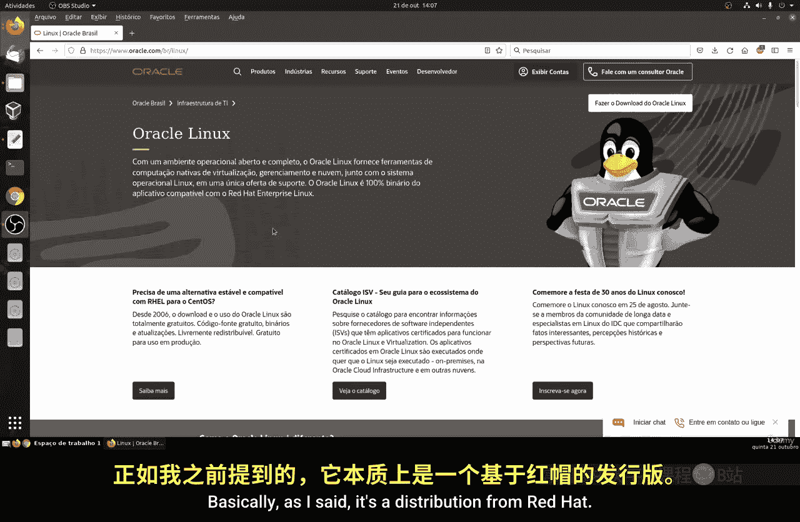

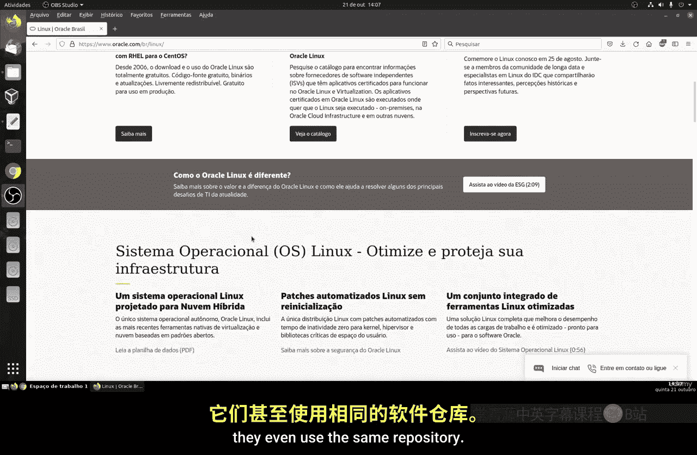

在本节课中，我们将学习如何在虚拟机上安装Oracle Linux操作系统。这是一个从零开始的过程，涵盖了从创建虚拟机到完成系统初始设置的完整步骤。

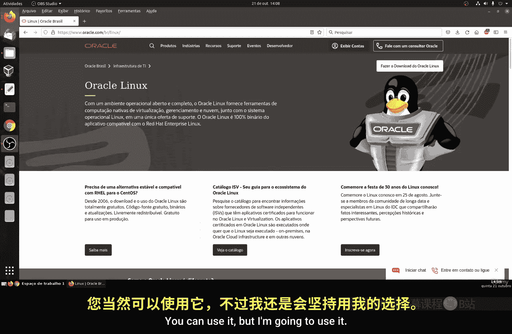

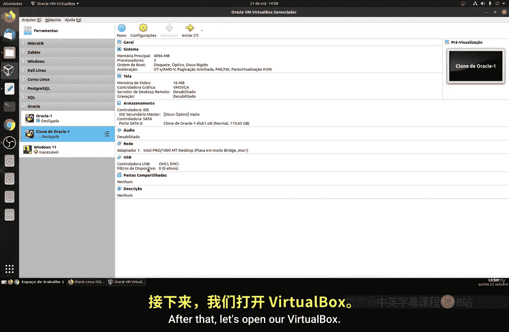

## 概述

安装操作系统是使用Linux的第一步。本节将引导你完成Oracle Linux的安装流程，包括虚拟机配置、系统安装和基本设置。

## 创建虚拟机

首先，我们需要创建一个新的虚拟机来安装Oracle Linux。

以下是创建虚拟机的主要步骤：

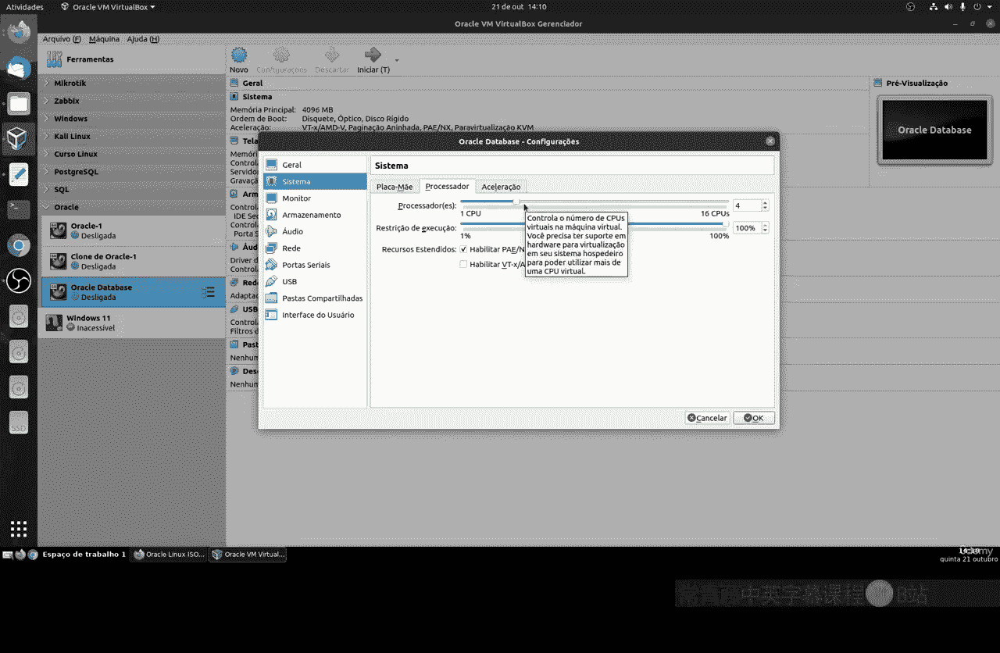

1.  打开虚拟机软件（如VirtualBox或VMware）。
2.  点击“新建”按钮。
3.  为虚拟机命名，例如“Oracle Linux”。
4.  选择操作系统类型为“Linux”，版本为“Oracle”。
5.  为虚拟机分配内存，建议至少2048 MB。
6.  选择“现在创建虚拟硬盘”。
7.  选择硬盘文件类型，通常使用默认的VDI。
8.  选择动态分配存储空间。
9.  设置虚拟硬盘大小，建议至少20 GB。

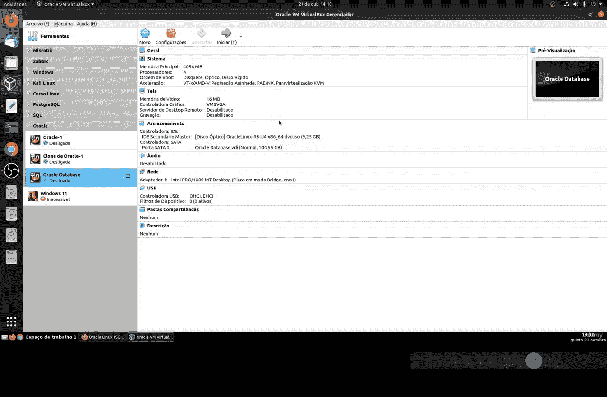

## 配置虚拟机设置

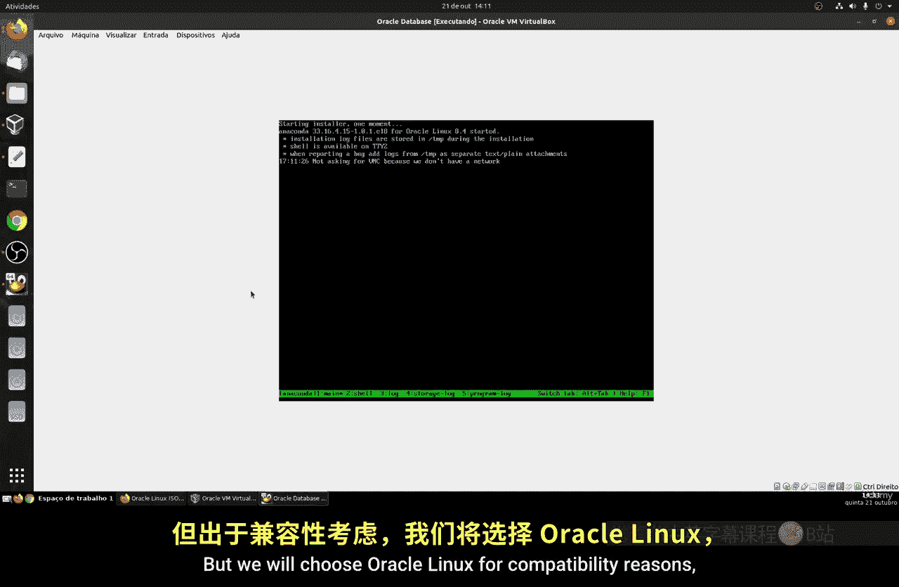

上一节我们创建了虚拟机的基本框架，本节中我们来看看如何为安装系统配置必要的设置。

以下是关键的配置项：

*   加载Oracle Linux的ISO安装镜像文件。
*   调整系统显示设置，如启用3D加速。
*   配置网络适配器为“桥接模式”，以便虚拟机可以访问外部网络。

## 安装Oracle Linux系统

虚拟机配置完成后，就可以启动并开始安装操作系统了。

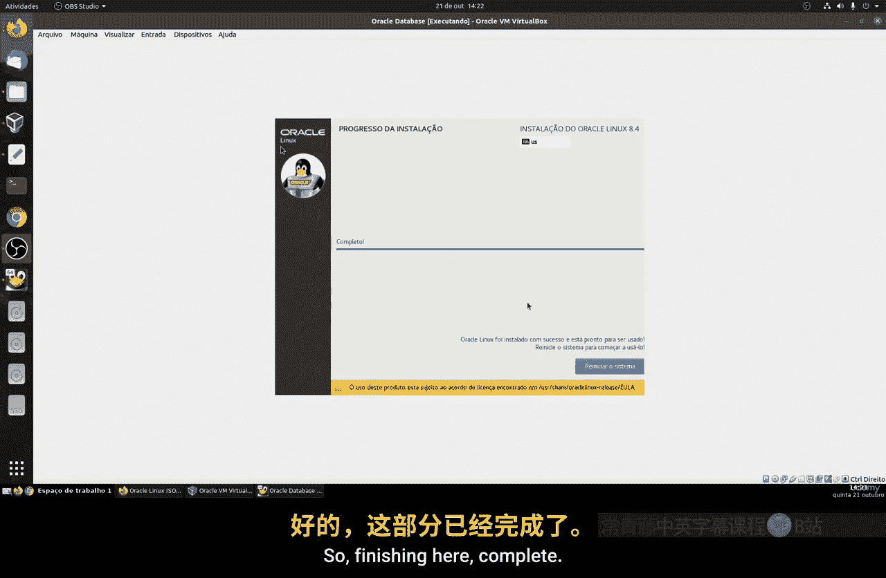

启动虚拟机后，将进入安装界面。选择“Install Oracle Linux”开始安装。

在安装过程中，你需要进行以下设置：

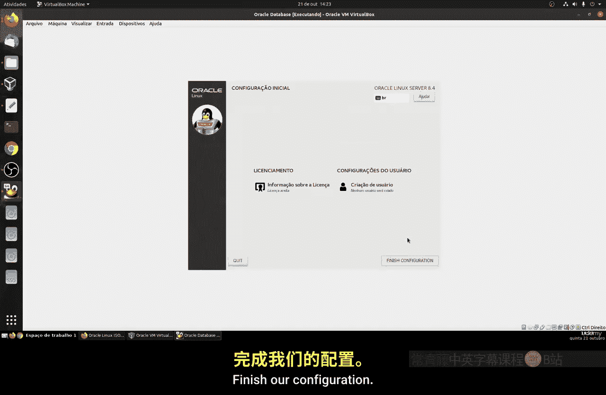

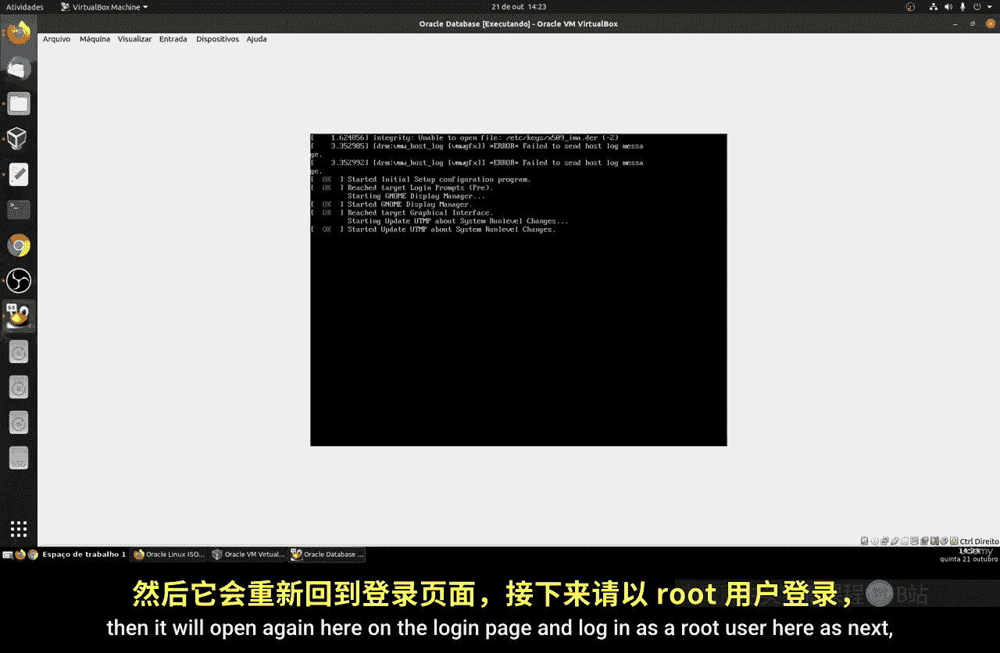

1.  选择安装过程中的语言，例如“English”。
2.  配置安装目的地，即分区设置。初学者可以选择“自动配置分区”。
3.  设置root用户（管理员）的密码。
4.  创建一个普通用户账户。
5.  等待安装程序自动完成文件复制和系统配置。

## 完成安装与首次启动

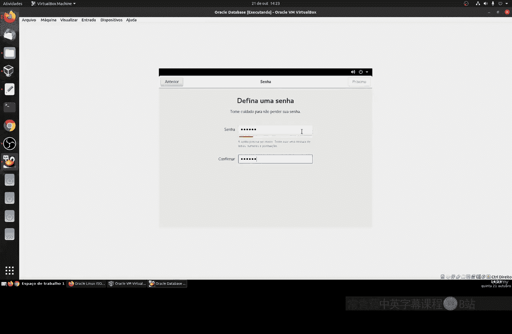

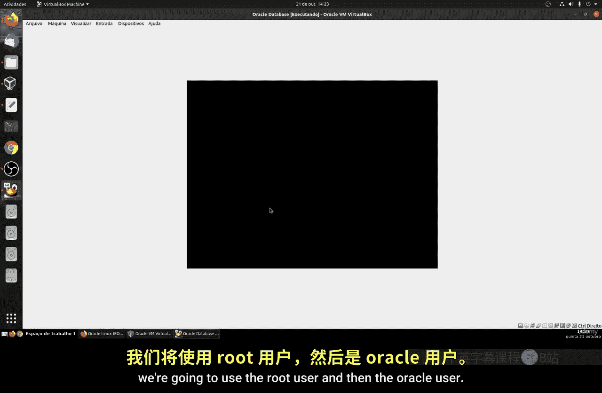

系统文件安装完成后，需要重启虚拟机。

重启后，你将看到系统的启动菜单和登录界面。使用你创建的用户名和密码即可登录系统。

成功登录后，你将进入Oracle Linux的桌面环境或命令行界面，这标志着你已经成功安装并启动了系统。

## 总结

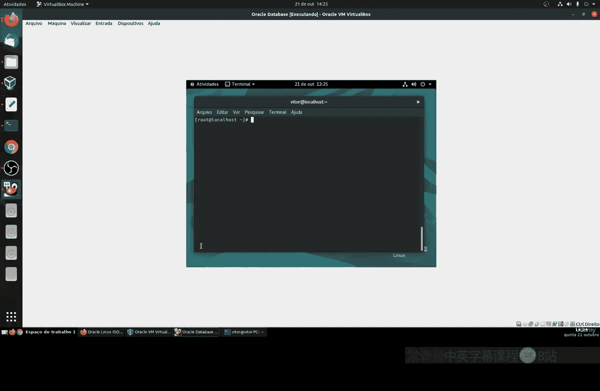

本节课中我们一起学习了安装Oracle Linux的完整流程。我们从创建和配置虚拟机开始，逐步完成了操作系统的安装、初始设置，并最终成功启动了系统。现在，你已经拥有了一个可以开始探索和学习的Linux环境。