# 138：安装Oracle数据库 🗄️


在本节课中，我们将学习如何在Linux系统上安装Oracle数据库。这是一个相对复杂的过程，需要仔细遵循步骤。我们将从系统准备开始，逐步完成下载、配置和安装。

## 系统要求与准备

上一节我们介绍了课程概述，本节中我们来看看安装前的准备工作。Oracle数据库对系统资源要求较高，请确保满足以下最低配置：

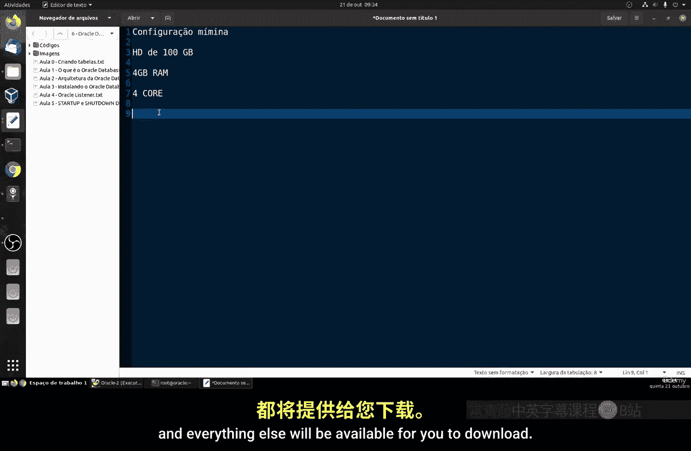

*   **硬盘空间**：至少100 GB。
*   **内存**：至少4 GB RAM。
*   **处理器**：至少4个CPU核心。

这些配置适用于Oracle Enterprise版本。安装过程耗时较长，请耐心等待。

首先，我们需要配置系统主机名。编辑 `/etc/hosts` 文件，将主机名与IP地址关联。

```bash
vi /etc/hosts
```

在文件中添加一行，格式为 `{你的IP地址} {你的主机名}`。例如：

```
192.168.15.82 oracle
```

保存并退出编辑器。

## 安装预安装包

接下来，我们需要安装Oracle数据库的预安装包。这个包包含了必要的依赖项，如C语言库和Java环境。

运行以下命令进行安装：

```bash
yum install -y oracle-database-preinstall-19c
```

安装完成后，建议暂时禁用防火墙以避免潜在的连接问题：

```bash
systemctl stop firewalld
systemctl disable firewalld
```

预安装包会自动创建一个名为 `oracle` 的用户。我们需要为该用户设置密码：

```bash
passwd oracle
```

密码需要至少8个字符，并包含大小写字母和数字。

## 创建目录与设置权限

现在，我们将创建用于安装数据库和存储数据的目录，并为其设置正确的权限。

以下是需要执行的命令：


```bash
mkdir -p /u01/app/oracle/product/19c/dbhome_1
mkdir -p /u02/oradata
chown -R oracle:oinstall /u01 /u02
chmod -R 775 /u01 /u02
```

这些命令创建了两个目录，并将它们的所有权和权限授予 `oracle` 用户及其所属的 `oinstall` 组。

## 配置用户环境


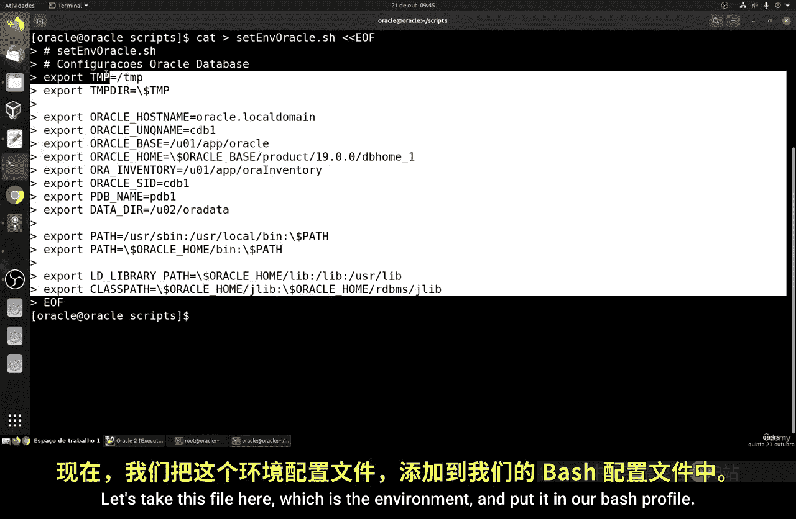

切换到 `oracle` 用户，我们需要配置其环境变量。这通过编辑 `~/.bash_profile` 文件来实现。

首先，创建一个设置环境变量的脚本文件：

```bash
vi ~/set_environment.sh
```

将以下内容写入文件并保存：

```bash
export TMP=/tmp
export TMPDIR=$TMP
export ORACLE_HOSTNAME=oracle
export ORACLE_BASE=/u01/app/oracle
export ORACLE_HOME=$ORACLE_BASE/product/19c/dbhome_1
export ORACLE_SID=cdb1
export PDB_NAME=pdb1
export PATH=/usr/sbin:/usr/local/bin:$PATH
export PATH=$ORACLE_HOME/bin:$PATH
export LD_LIBRARY_PATH=$ORACLE_HOME/lib:/lib:/usr/lib
export NLS_LANG=AMERICAN_AMERICA.AL32UTF8
```

然后，将这个脚本的内容添加到 `.bash_profile` 中，并使其生效：


```bash
cat ~/set_environment.sh >> ~/.bash_profile
source ~/.bash_profile
```

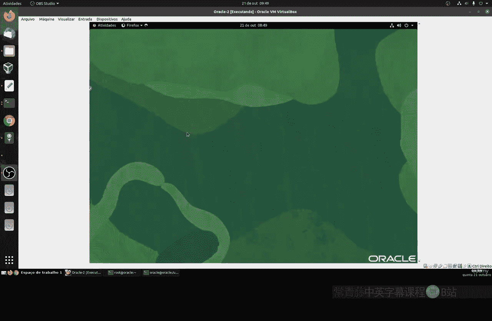

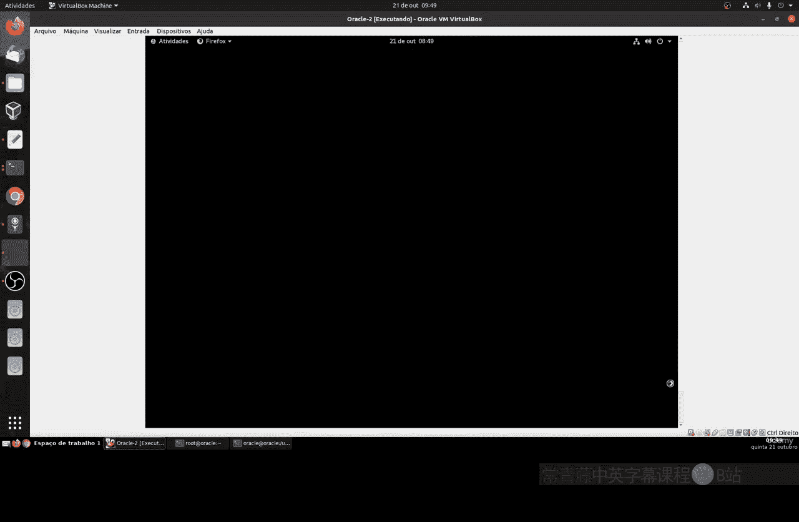

此外，为了方便管理，可以创建启动和停止数据库的脚本。

## 下载与解压安装文件

我们需要从Oracle官方网站下载数据库安装文件。请先注册一个Oracle账户。

下载完成后，文件通常位于 `~/Downloads` 目录。将其解压到 `oracle` 用户的家目录：

```bash
cd ~
unzip ~/Downloads/LINUX.X64_193000_db_home.zip -d .
```

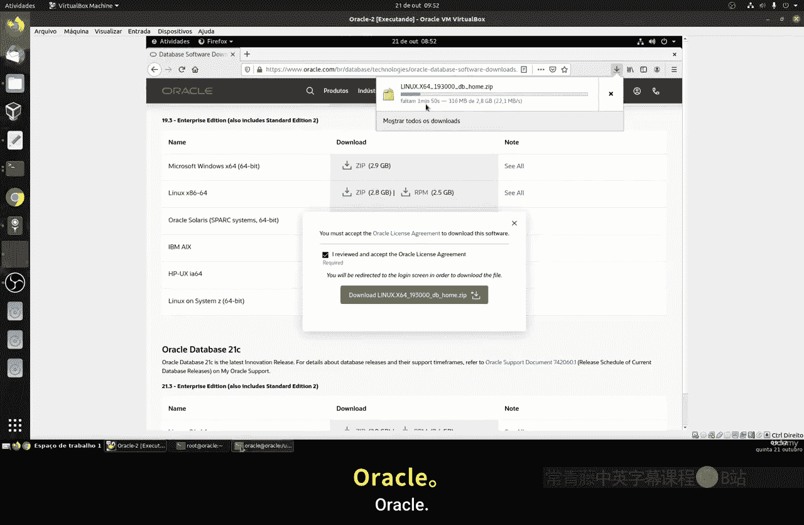

解压过程需要一些时间，因为文件较大。

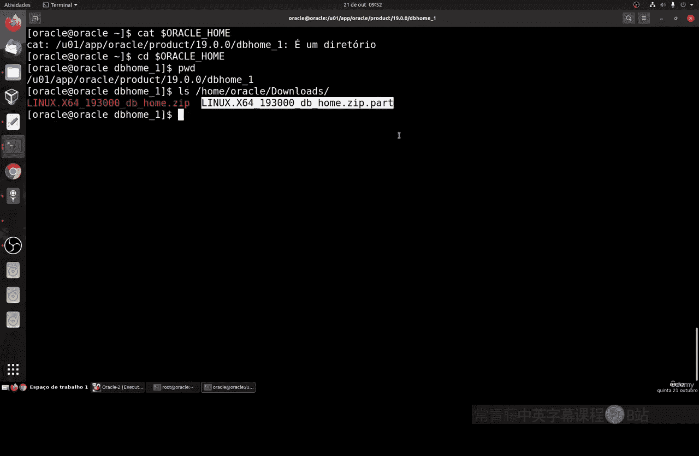

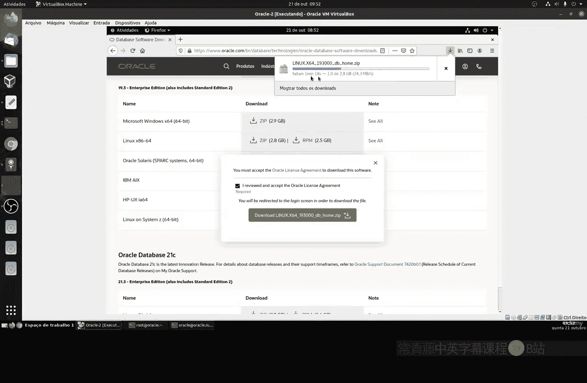

## 运行安装程序

解压完成后，进入解压目录并运行安装程序。我们使用静默模式安装以减少交互。

首先，设置一个环境变量以避免潜在错误：

```bash
export CV_ASSUME_DISTRIB=RHEL7.9
```

然后，运行安装命令。这是一个很长的命令，它指定了安装类型、组、目录等各种参数：

```bash
./runInstaller -silent \
-responseFile /home/oracle/db_install.rsp \
oracle.install.option=INSTALL_DB_SWONLY \
UNIX_GROUP_NAME=oinstall \
INVENTORY_LOCATION=/u01/app/oraInventory \
ORACLE_HOME=$ORACLE_HOME \
ORACLE_BASE=$ORACLE_BASE \
oracle.install.db.InstallEdition=EE \
oracle.install.db.OSDBA_GROUP=dba \
oracle.install.db.OSOPER_GROUP=oper \
oracle.install.db.OSBACKUPDBA_GROUP=backupdba \
oracle.install.db.OSDGDBA_GROUP=dgdba \
oracle.install.db.OSKMDBA_GROUP=kmdba \
oracle.install.db.OSRACDBA_GROUP=racdba \
SECURITY_UPDATES_VIA_MYORACLESUPPORT=false \
DECLINE_SECURITY_UPDATES=true
```

安装过程中，安装程序会提示你以 `root` 用户身份运行两个脚本。请打开另一个终端，切换到 `root` 用户，执行提示的脚本路径，例如：

```bash
/u01/app/oraInventory/orainstRoot.sh
/u01/app/oracle/product/19c/dbhome_1/root.sh
```

执行完成后，返回安装窗口继续。

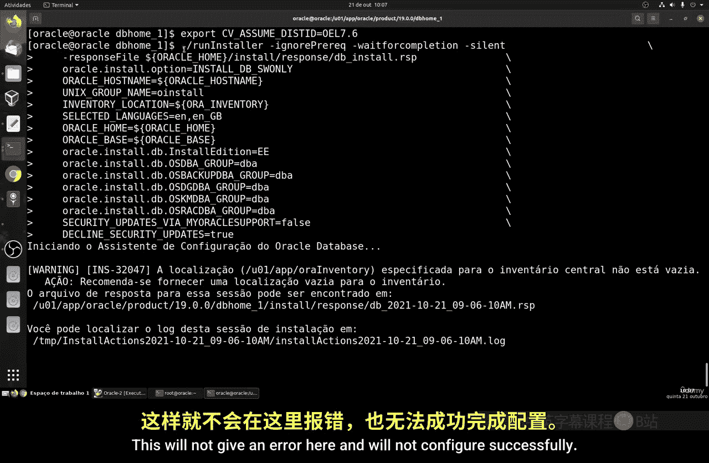

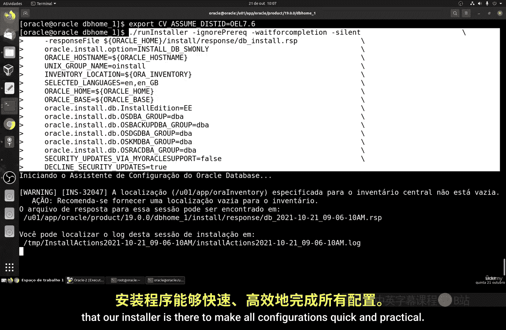

## 创建数据库实例

数据库软件安装完成后，我们需要创建一个数据库实例。同样使用静默模式创建。

运行以下命令：

```bash
dbca -silent -createDatabase \
-templateName General_Purpose.dbc \
-gdbname cdb1 -sid cdb1 \
-responseFile NO_VALUE \
-characterSet AL32UTF8 \
-sysPassword Oracle123 \
-systemPassword Oracle123 \
-createAsContainerDatabase true \
-numberOfPDBs 1 \
-pdbName pdb1 \
-pdbAdminPassword Oracle123 \
-databaseType MULTIPURPOSE \
-automaticMemoryManagement false \
-totalMemory 2048 \
-storageType FS \
-datafileDestination /u02/oradata \
-enableArchive true \
-redoLogFileSize 50 \
-emConfiguration NONE \
ignorePreReqs
```

此命令将创建一个名为 `cdb1` 的容器数据库，其中包含一个名为 `pdb1` 的可插拔数据库。系统用户密码设置为 `Oracle123`。这个过程也会持续较长时间。

## 配置开机自启与验证

数据库创建完成后，我们需要配置其在系统启动时自动运行。

编辑 `/etc/oratab` 文件，找到你的数据库SID（如 `cdb1`）所在行，将最后的 `N` 改为 `Y`。

```bash
vi /etc/oratab
# 找到类似这样的一行
cdb1:/u01/app/oracle/product/19c/dbhome_1:Y
```

现在，可以使用 `sqlplus` 工具连接到数据库进行验证：

```bash
sqlplus / as sysdba
```

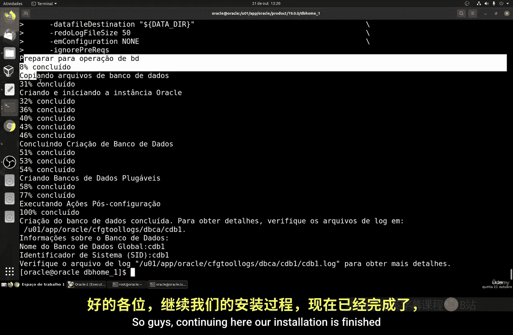

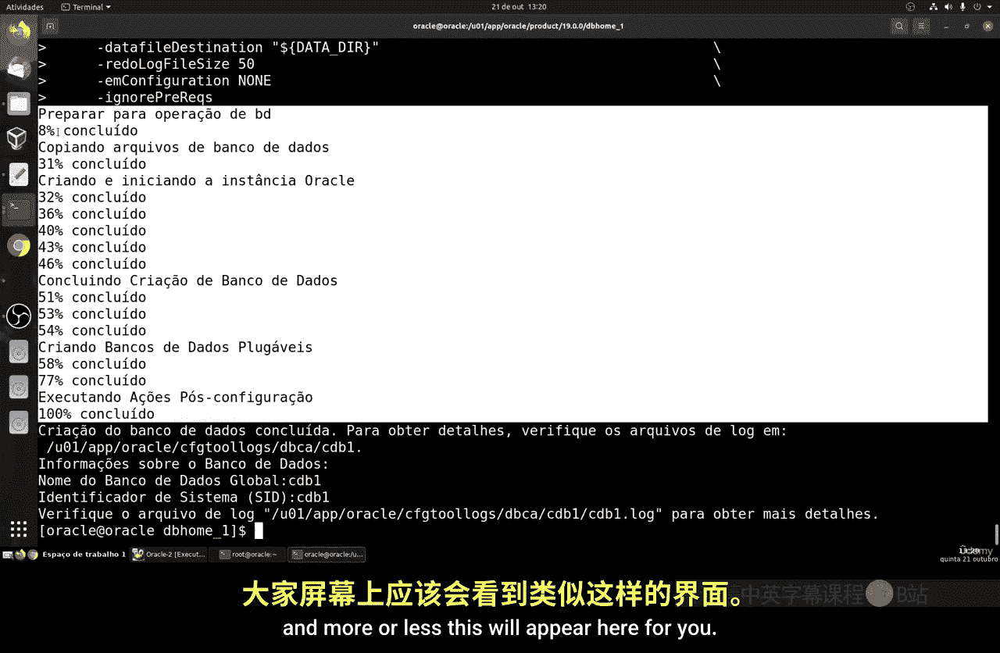

在SQL提示符下，运行以下查询来检查数据库状态：

```sql
SELECT instance_name, status FROM v$instance;
```

如果返回的状态为 `OPEN`，则表示数据库已成功安装并正在运行。

---

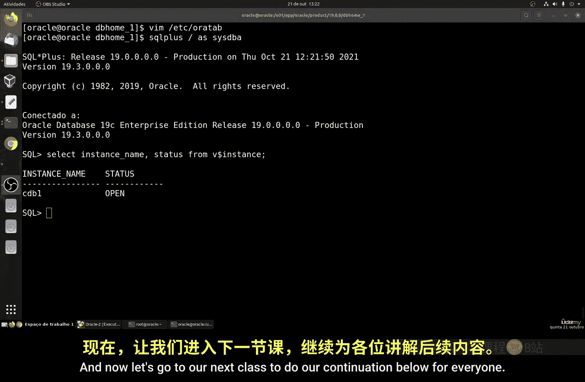

本节课中我们一起学习了在Linux系统上安装Oracle数据库的完整流程。我们从系统准备、安装依赖包、配置环境、下载安装文件，到运行静默安装程序、创建数据库实例，最后进行了验证。这个过程步骤较多且耗时，但严格遵循步骤即可成功搭建Oracle数据库环境。