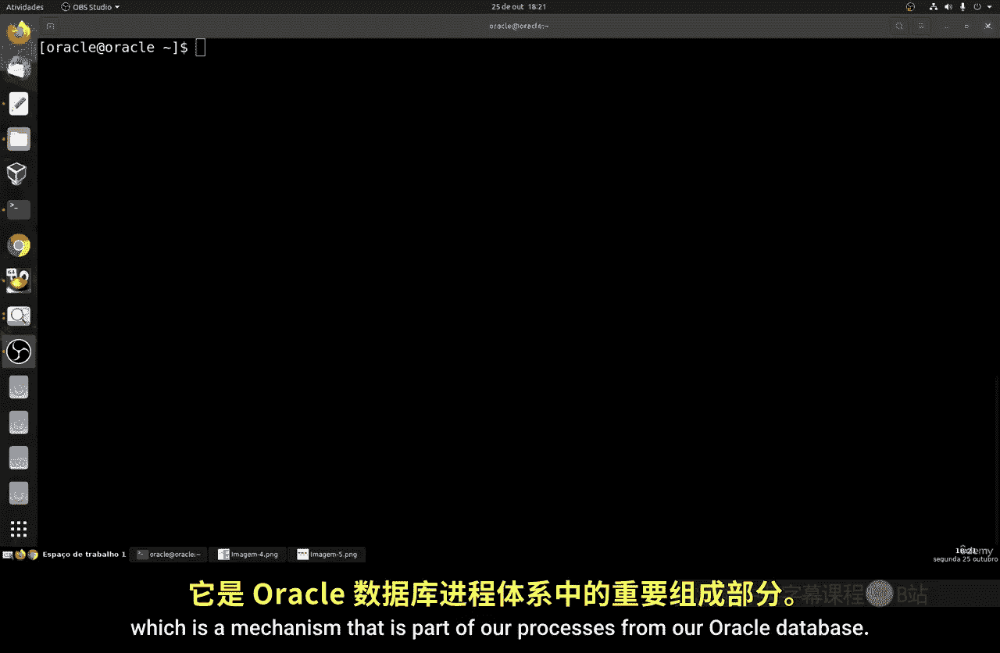
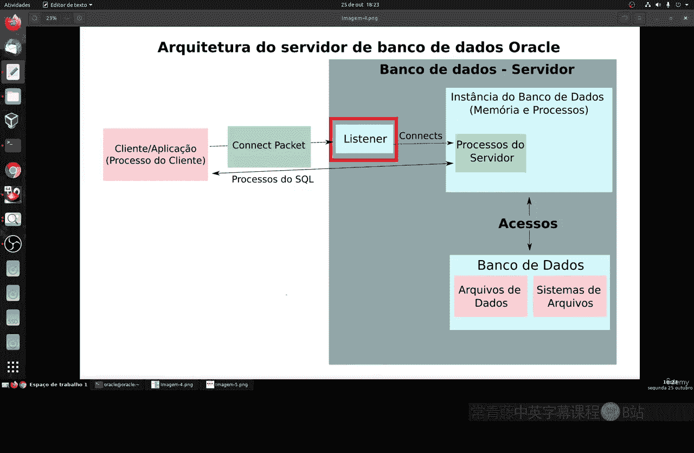
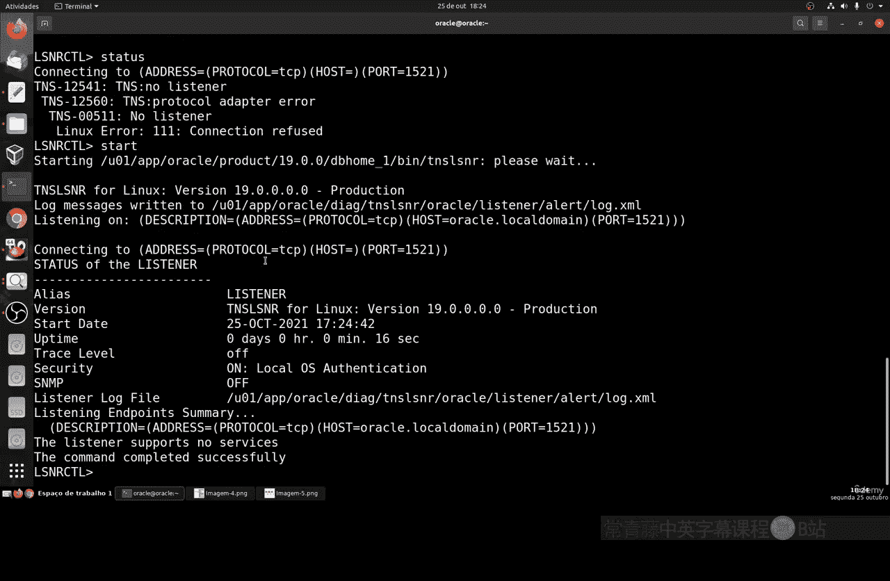
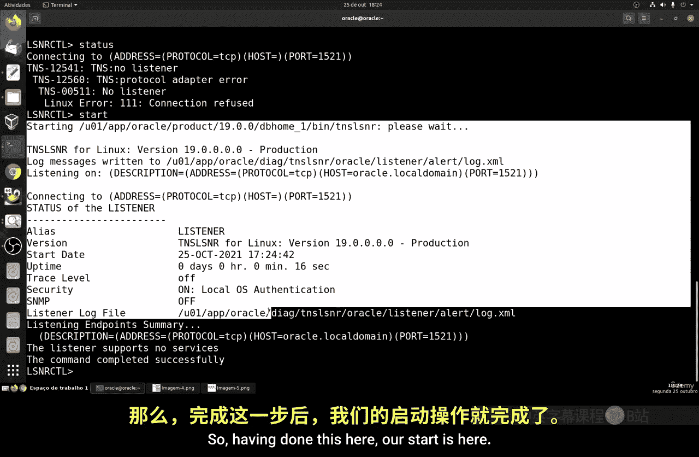
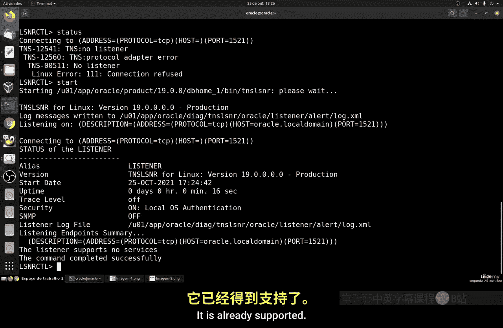
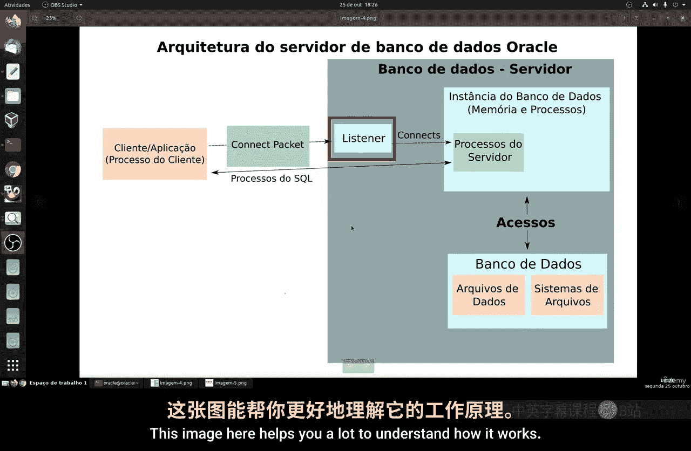
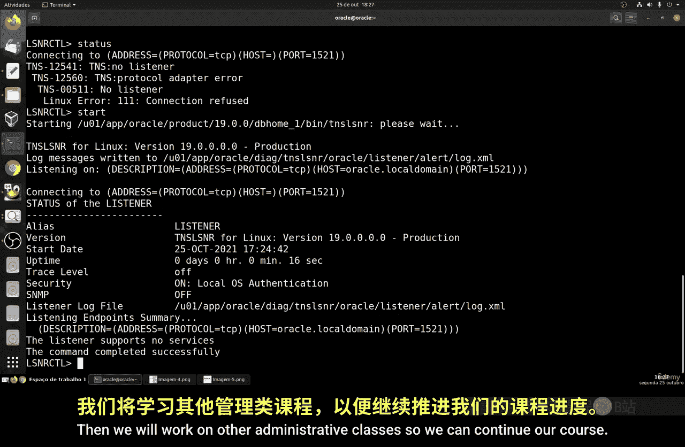

# 139：Oracle监听器入门指南 🗄️

在本节课中，我们将学习Oracle监听器的基础知识。Oracle监听器是Oracle数据库架构中的一个关键组件，负责处理客户端与数据库服务器之间的初始连接请求。

## 概述

Oracle监听器是一个运行在数据库服务器上的网络服务。它的核心作用是接收来自客户端应用程序的连接请求，并将其转发到正确的Oracle数据库实例。可以将其理解为数据库的“前台接待员”。

## 监听器的工作原理

上一节我们介绍了监听器的基本概念，本节中我们来看看它的具体工作流程。

监听器的工作机制如下图所示。当客户端（例如一个应用程序或SQL工具）尝试连接Oracle数据库时，监听器是第一个接收该请求的组件。

它负责在客户端和服务器端的数据库实例之间建立连接。一旦客户端成功连接到服务器，监听器会将连接的控制权移交给服务器进程。此后，监听器的任务即告完成，直到下一个新的连接请求到来。

**核心要点**：如果监听器服务停止运行，新的客户端将无法连接到Oracle数据库。但所有已建立的现有连接不会受到影响，可以继续正常工作。

## 监听器的基本管理命令

了解了监听器的作用后，我们来看看如何通过命令行来管理它。Oracle提供了一个专门的工具：`lsnrctl`。

在终端中，你可以直接输入 `lsnrctl` 命令来启动一个监听器控制工具。在这个交互式shell中，你可以执行各种管理操作。

以下是 `lsnrctl` 工具中一些常用的命令：
*   **`help`**：查看所有可用的命令。
*   **`start`**：启动监听器服务。
*   **`stop`**：停止监听器服务。
*   **`status`**：查看监听器的当前状态。
*   **`version`**：查看监听器的版本信息。
*   **`set`**：用于进行一些配置。
*   **`show`**：查看当前的配置参数。

## 实战：检查与启动监听器

理论需要结合实践，现在让我们动手操作。管理监听器的第一步通常是检查其状态。

我们可以使用 `status` 命令来查看监听器是否正在运行。如果状态显示为错误或未运行，如下图所示，则表示监听器服务当前不可用。

此时，我们需要启动它。使用 `start` 命令可以启动监听器。该命令会调用位于Oracle主目录（例如 `$ORACLE_HOME/bin`）下的二进制文件来启动服务。

启动过程可能需要几秒钟。启动完成后，我们再次运行 `status` 命令，就能看到监听器已处于运行状态，并显示详细的连接信息。

## 理解状态信息

成功启动监听器后，`status` 命令会输出丰富的信息，这对于故障排查和系统监控至关重要。

这些信息包括：
*   **监听日志文件位置**：记录所有连接活动的文件，对于诊断问题非常重要。
*   **监听端点摘要**：显示了监听器正在监听的网络地址和端口（默认通常是1521）。
*   **服务摘要**：列出了监听器所服务的数据库实例及其状态。
*   **版本与运行时间**：显示监听器软件的版本以及它已经运行了多长时间。
*   **安全设置**：显示当前的安全配置。在本地连接时，可能会启用操作系统自身的认证方式。
*   **SNMP状态**：简单网络管理协议的开关状态，用于远程监控。

## 监听器在连接流程中的角色

为了更清晰地理解监听器在整个数据库连接过程中的位置，请参考以下架构图：

这张图清晰地展示了客户端请求如何通过监听器，最终与数据库服务器进程建立会话的过程。当监听器正常运行后，客户端应用程序（如SQL*Plus或其他工具）就能通过SQL*Net协议成功连接到数据库实例。

## 总结

本节课中我们一起学习了Oracle监听器的基础知识。我们了解到监听器是Oracle数据库网络连接的关键入口，负责接收和路由客户端的连接请求。我们掌握了使用 `lsnrctl` 工具来检查状态、启动和停止监听器服务的基本操作，并学会了如何解读 `status` 命令输出的重要信息。

确保监听器处于运行状态，是任何客户端能够成功连接到Oracle数据库的首要条件。这是一个相对简单但至关重要的管理任务。在后续的课程中，我们将继续学习更多数据库管理的相关知识。

