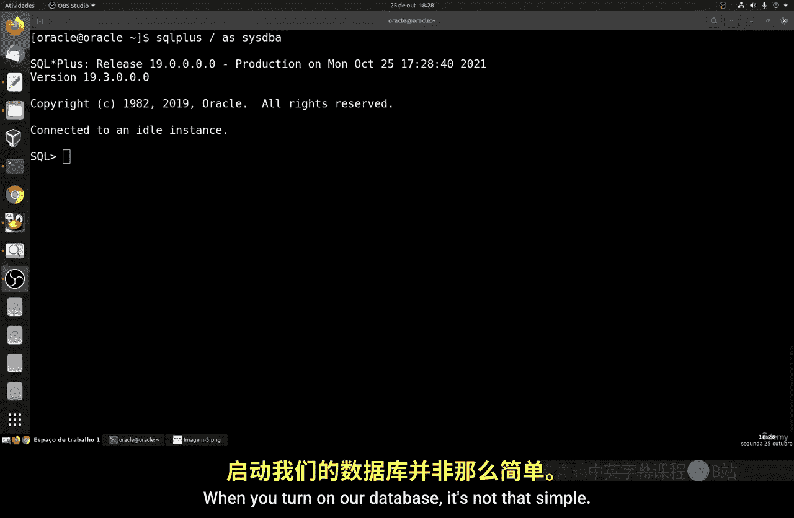
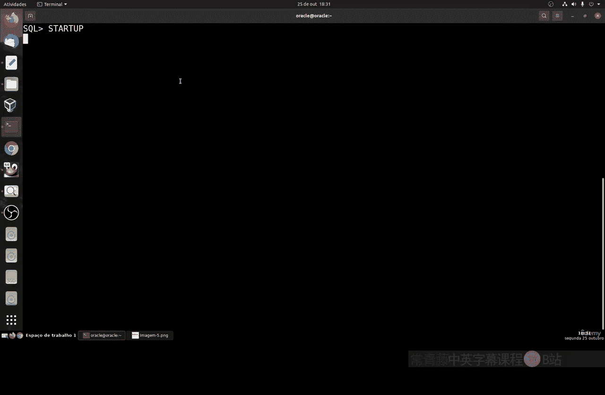
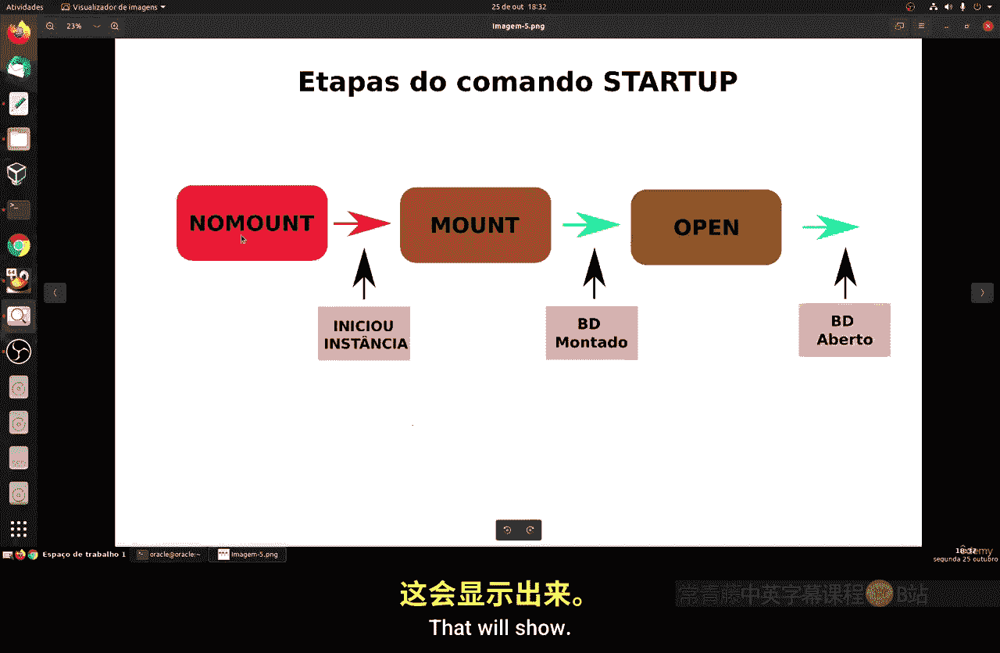
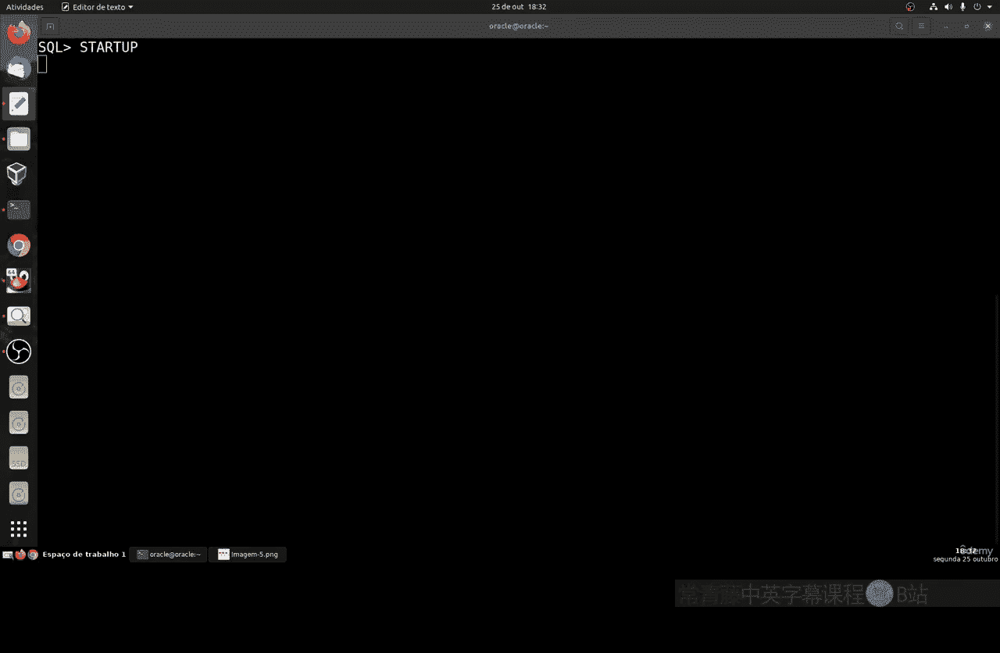
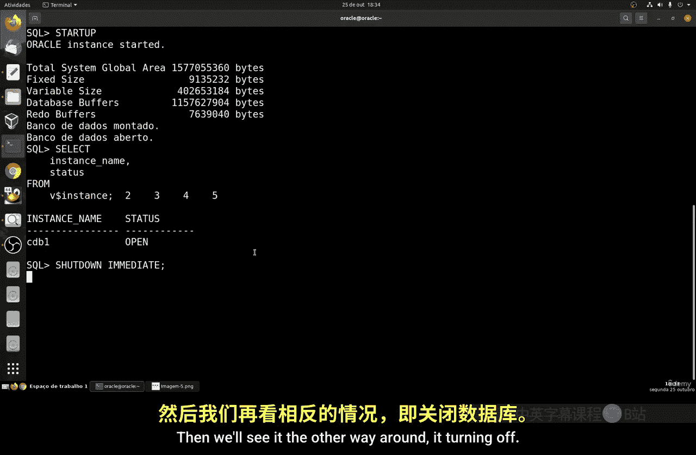
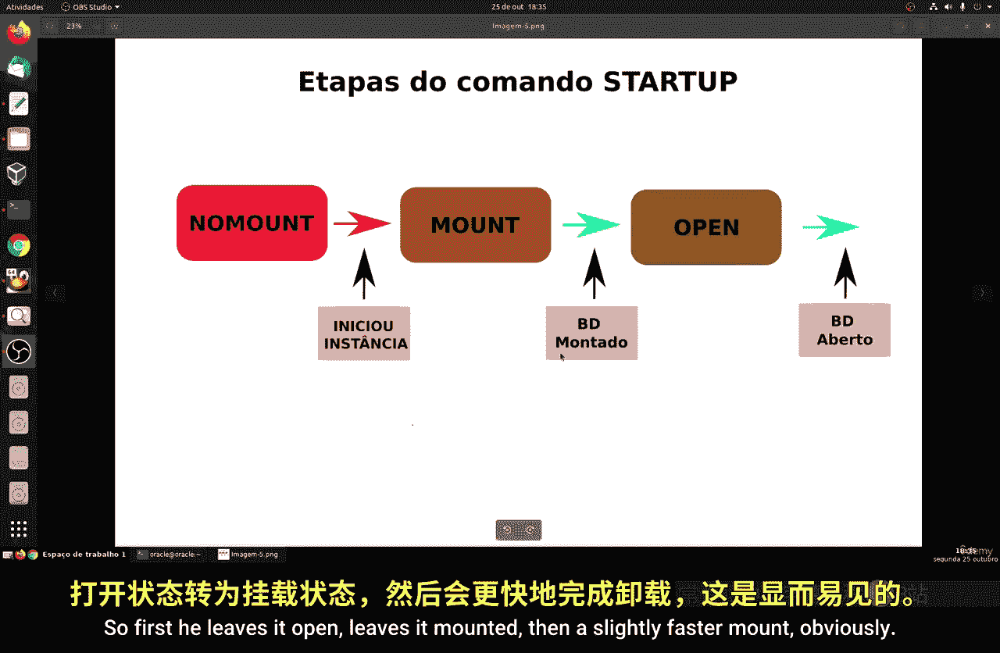
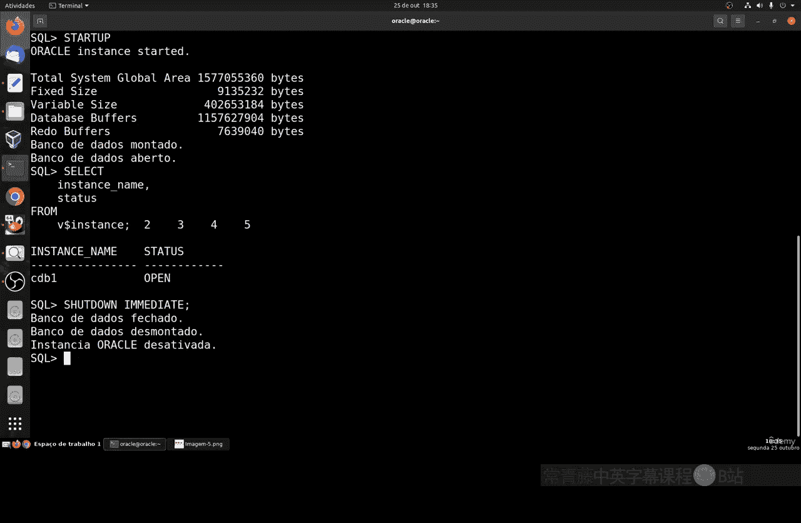
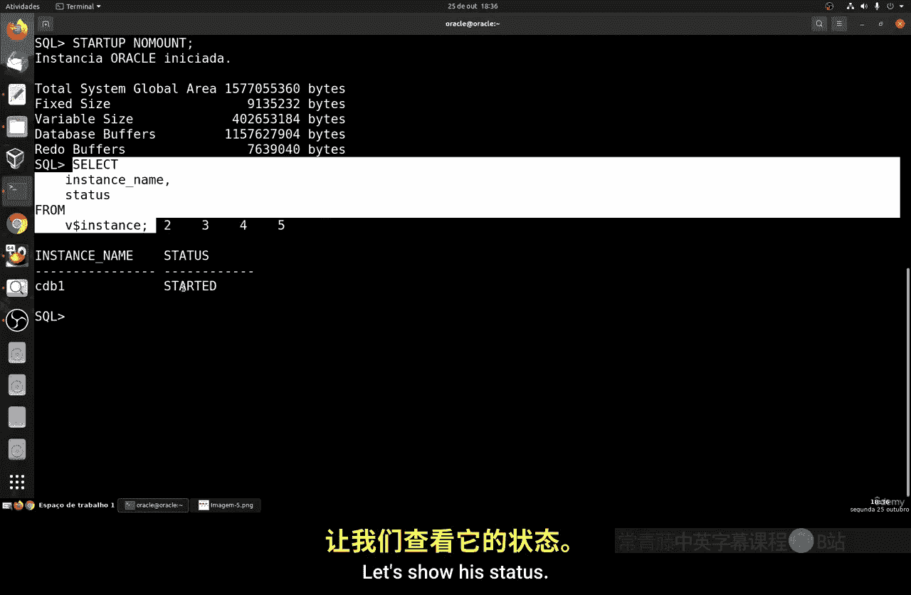
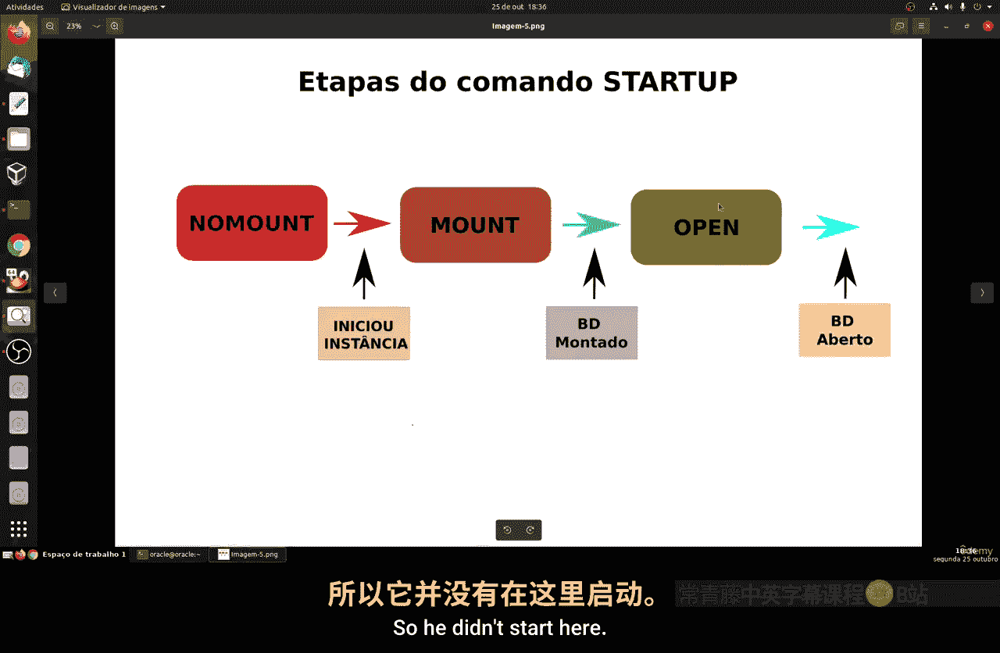

# 140：启动与关闭Oracle数据库 🚀

在本节课中，我们将要学习如何启动和关闭Oracle数据库实例。安装完成后，数据库默认是关闭的，需要手动启动。我们将了解启动和关闭过程中的不同阶段，并学习相应的命令。



## 概述

启动和关闭Oracle数据库并非简单的开关操作，它涉及多个有序的阶段。理解这些阶段对于管理数据库至关重要。

## 启动数据库的流程


上一节我们介绍了数据库安装后的状态，本节中我们来看看如何启动它。启动过程包含几个关键阶段。

启动命令是 `STARTUP`。执行后，数据库实例会按顺序经历以下状态：
1.  **NOMOUNT**：初始化实例，读取参数文件，分配系统全局区（SGA）。
2.  **MOUNT**：装载数据库，将数据库与已启动的实例关联。
3.  **OPEN**：打开数据库，此时可以正常执行SQL操作。

以下是启动过程的具体步骤描述：



*   首先，系统定位并读取服务器上的参数文件（`PFILE` 或 `SPFILE`）。
*   然后，根据参数配置分配系统全局区（SGA），包括固定区域、可变区域和数据库缓冲区等。
*   接着，实例装载数据库，关联控制文件。
*   最后，打开数据库，读取数据文件和在线重做日志文件，使数据库可供用户访问。





## 实践：启动数据库

让我们在终端中实际操作。首先，使用 `SQL*Plus` 以管理员身份登录。

我们可以运行以下命令检查当前实例状态：
```sql
SELECT instance_name, status FROM v$instance;
```
如果数据库未启动，此命令会报错，提示“Oracle不可用”。


现在，我们执行启动命令：
```sql
STARTUP;
```
命令执行后，终端会显示启动日志，包括初始化实例、分配内存区域，最终状态变为 `OPEN`。这个过程可能需要一些时间。

启动完成后，再次运行状态查询命令，可以看到实例状态已变为 **OPEN**。

## 关闭数据库的流程

关闭数据库是启动过程的逆序。





关闭命令是 `SHUTDOWN`。执行后，数据库实例会按顺序经历以下状态：
1.  **CLOSE**：关闭数据库，断开所有用户连接，将数据写回数据文件。
2.  **DISMOUNT**：卸载数据库，实例与数据库分离。
3.  **SHUTDOWN**：实例关闭，释放占用的内存。



## 其他启动模式


除了直接启动到 `OPEN` 状态，我们还可以指定启动到某个中间阶段。

例如，启动到 `MOUNT` 状态：
```sql
STARTUP MOUNT;
```
执行此命令后，数据库实例会初始化并装载数据库，但不会打开它。这种模式通常用于执行特定的维护操作，如重命名数据文件或启用/禁用归档模式。此时查询状态，会显示为 **MOUNTED**。





## 总结

本节课中我们一起学习了Oracle数据库的启动与关闭。
*   启动使用 `STARTUP` 命令，经历 **NOMOUNT -> MOUNT -> OPEN** 三个阶段。
*   关闭使用 `SHUTDOWN` 命令，是启动的逆过程。
*   可以通过 `STARTUP MOUNT` 等命令启动到特定阶段进行维护。
*   重要：执行创建表空间、数据表等操作时，数据库必须处于 **OPEN** 状态。


理解这些流程和命令是进行数据库日常管理的基础。