# 141：安装SQL Developer图形界面 🖥️

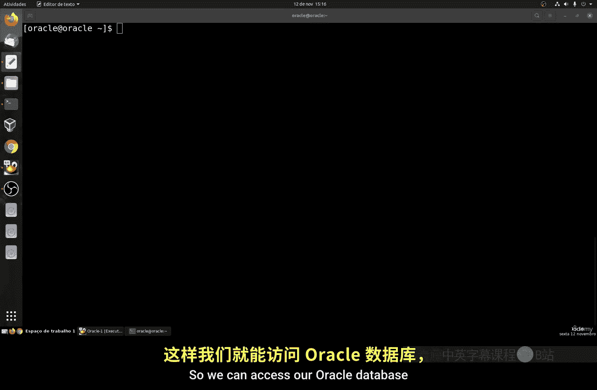

在本节课中，我们将学习如何为已安装的Oracle数据库安装图形界面工具——SQL Developer。这是一个功能完整的工具，允许我们使用SQL语言并执行各种数据库操作。安装过程主要涉及两个步骤：安装JDK（Java开发工具包）和安装SQL Developer本身。

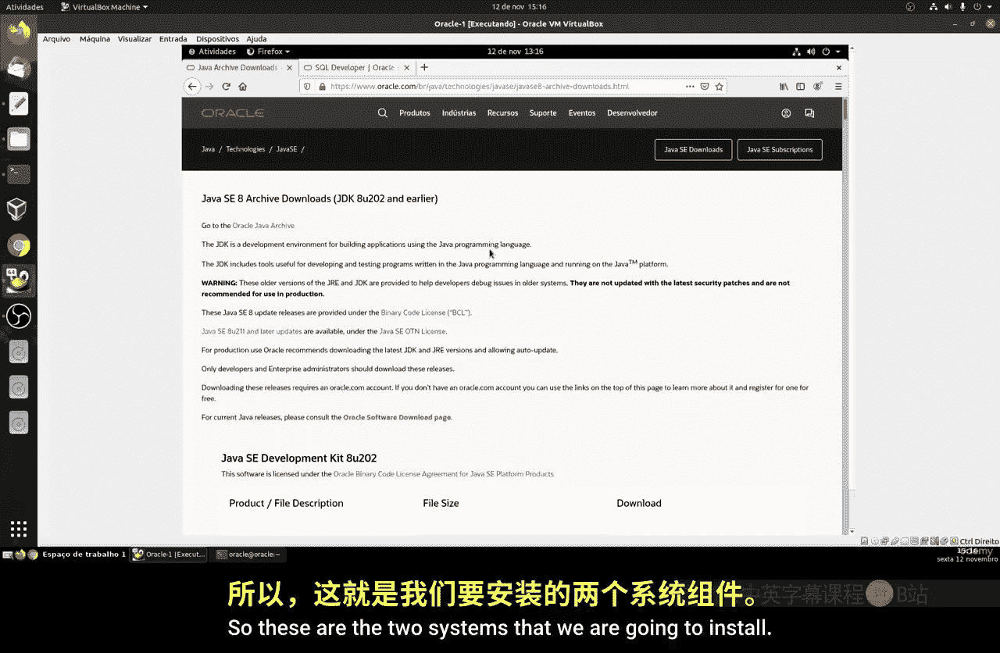

---

## 准备工作 🔧

上一节我们完成了Oracle数据库的安装与基本配置。本节中，我们来看看如何安装图形界面工具以便更直观地操作数据库。

首先，我们需要确保系统具备必要的权限，并启动数据库监听服务。

以下是需要执行的准备工作步骤：

1.  编辑sudoers文件，为Oracle用户添加使用`sudo`命令的权限。
    ```bash
    sudo visudo
    ```
    在文件末尾添加一行：
    ```
    oracle ALL=(ALL) ALL
    ```

2.  保存文件后，注销当前用户并重新登录，以使权限生效。

3.  启动数据库实例和监听服务。首先进入SQL*Plus，启动数据库：
    ```sql
    STARTUP;
    ```
    然后启动监听器：
    ```bash
    lsnrctl start
    ```
    可以使用以下命令检查状态：
    ```bash
    lsnrctl status
    ```

4.  为我们的PDB（可插拔数据库）创建一个新用户，用于SQL Developer连接。
    切换到PDB容器并创建用户：
    ```sql
    ALTER SESSION SET CONTAINER=PDB1;
    ALTER DATABASE OPEN;
    CREATE USER vitor IDENTIFIED BY password;
    ```

---

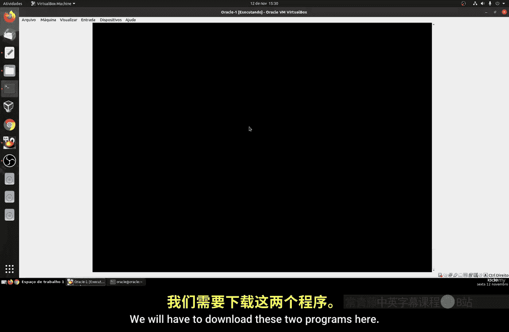

## 下载安装文件 📥

准备工作完成后，我们需要下载两个必要的安装程序：JDK和SQL Developer。

请访问Oracle官方网站，登录您的账户后下载以下两个文件：
*   **JDK 8** (或版本11，根据SQL Developer要求)：选择Linux x64 RPM安装包。
*   **SQL Developer**：同样选择Linux RPM安装包。

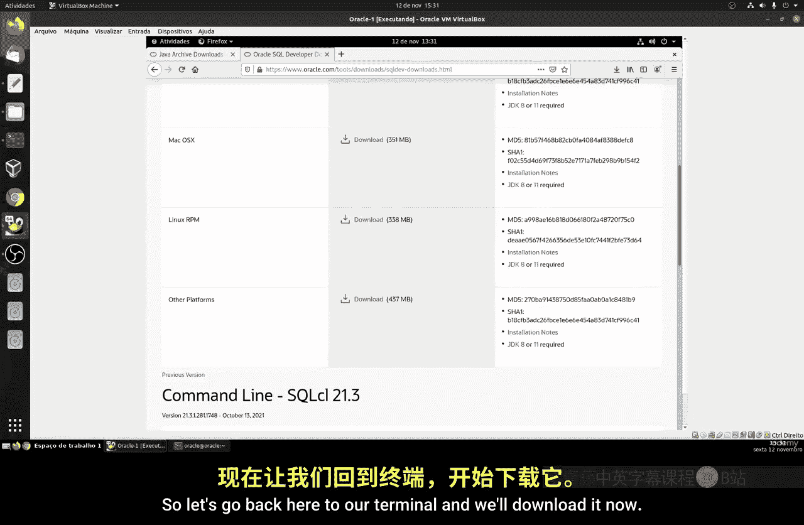

下载完成后，文件通常位于用户的`~/Downloads`目录中。

---

## 配置TNS文件 🔌

在安装软件之前，我们先配置一个TNS (Transparent Network Substrate) 文件。这个文件用于存储数据库连接信息，能让SQL Developer的连接过程更加简便，尤其是在管理多个数据库连接时。

以下是配置TNS文件的步骤：

1.  进入Oracle网络管理目录：
    ```bash
    cd $ORACLE_HOME/network/admin
    ```

2.  创建并编辑`tnsnames.ora`文件：
    ```bash
    vi tnsnames.ora
    ```

3.  在文件中添加以下配置内容（请根据你的实际数据库信息修改`HOST`、`PORT`和`SERVICE_NAME`）：
    ```
    PDB1 =
      (DESCRIPTION =
        (ADDRESS = (PROTOCOL = TCP)(HOST = localhost)(PORT = 1521))
        (CONNECT_DATA =
          (SERVER = DEDICATED)
          (SERVICE_NAME = PDB1)
        )
      )
    ```
4.  保存并退出编辑器。

---

## 安装JDK与SQL Developer ⚙️

现在，我们可以开始安装下载好的程序了。首先安装JDK，它是SQL Developer运行所依赖的Java环境。

以下是安装步骤：

1.  进入下载目录并安装JDK的RPM包：
    ```bash
    cd ~/Downloads
    sudo rpm -ivh jdk-8uXXX-linux-x64.rpm
    ```
    （请将`jdk-8uXXX-linux-x64.rpm`替换为你实际下载的文件名）

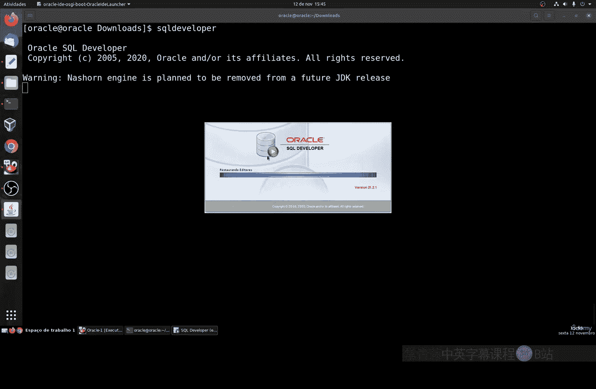

2.  接着安装SQL Developer：
    ```bash
    sudo rpm -ivh sqldeveloper-XXX-1.noarch.rpm
    ```
    （请将`sqldeveloper-XXX-1.noarch.rpm`替换为你实际下载的文件名）
    安装程序会自动检测已安装的Java环境。

---

## 使用SQL Developer连接数据库 🔗

安装完成后，我们就可以启动SQL Developer并连接到数据库了。

以下是连接数据库的步骤：

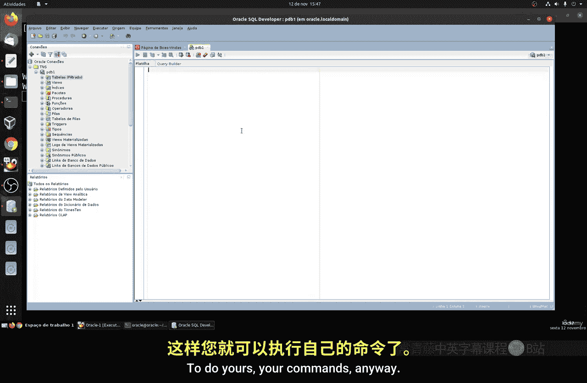

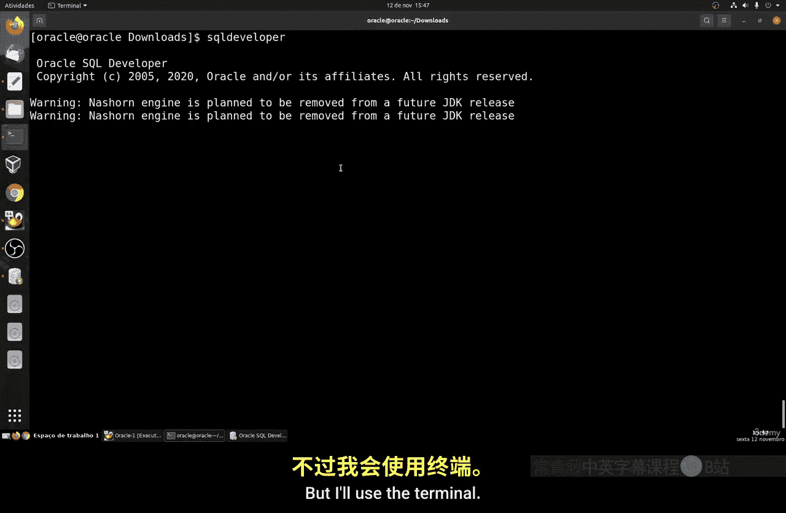

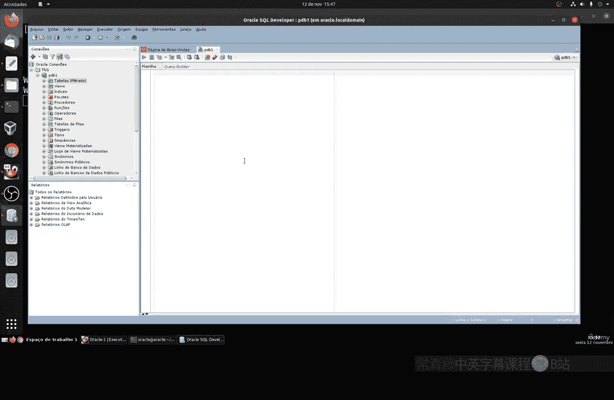

1.  在终端中启动SQL Developer：
    ```bash
    sqldeveloper
    ```

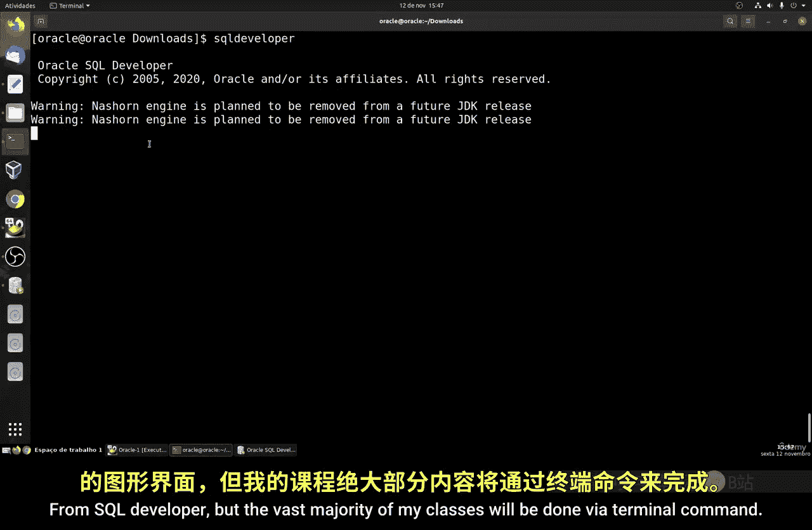

2.  程序首次启动可能会询问是否导入旧设置，选择“否”即可。

3.  在SQL Developer界面中，由于我们预先配置了TNS文件，左侧的“连接”面板可能会自动检测到`PDB1`。只需右键点击它，选择“连接”。

4.  在弹出的连接窗口中，输入之前创建的用户名（如`vitor`）和密码，然后点击“连接”。

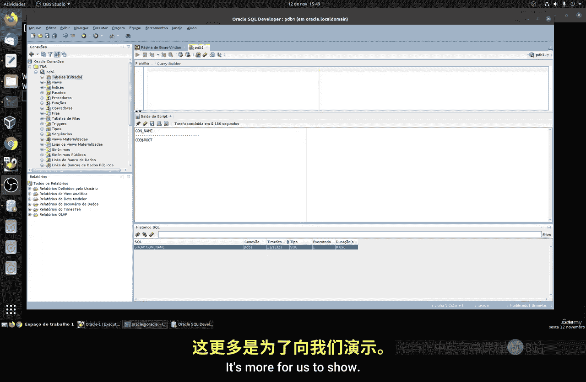

5.  连接成功后，左侧导航栏会显示该用户下的所有数据库对象，如表、视图、索引等。你可以在右侧的工作表中执行SQL命令，例如：
    ```sql
    SELECT * FROM dual;
    ```

---

## 总结 📝

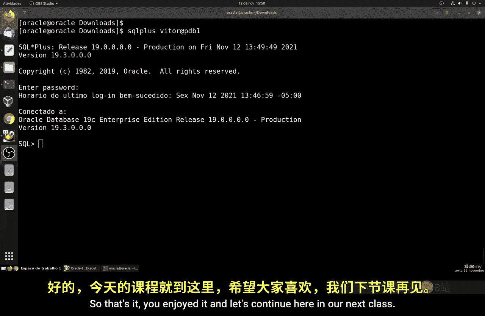

本节课中我们一起学习了如何为Linux系统上的Oracle数据库安装图形化管理工具SQL Developer。我们完成了从权限配置、服务启动、用户创建，到下载安装JDK和SQL Developer，以及配置TNS连接文件的全过程。最后，我们成功使用SQL Developer图形界面连接到了数据库。掌握这种方法后，你可以选择使用图形界面或继续使用命令行来管理和操作数据库，根据个人习惯和需求灵活选择。