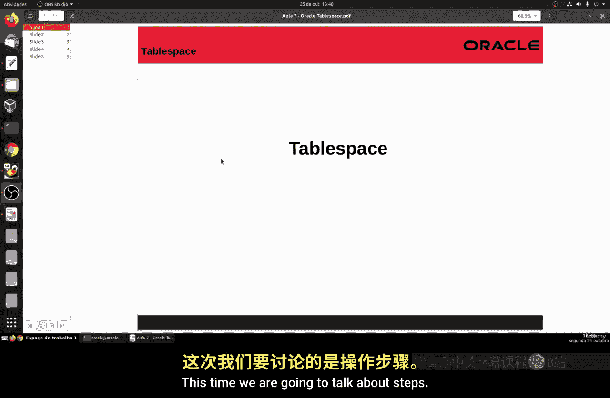
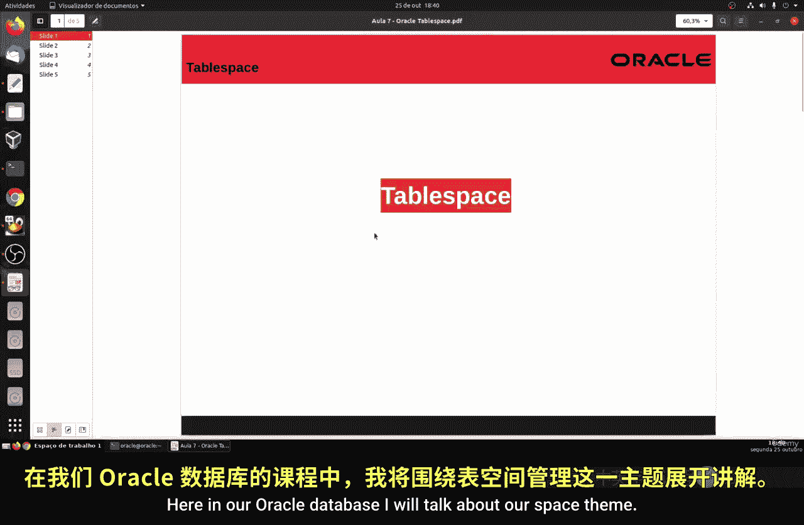
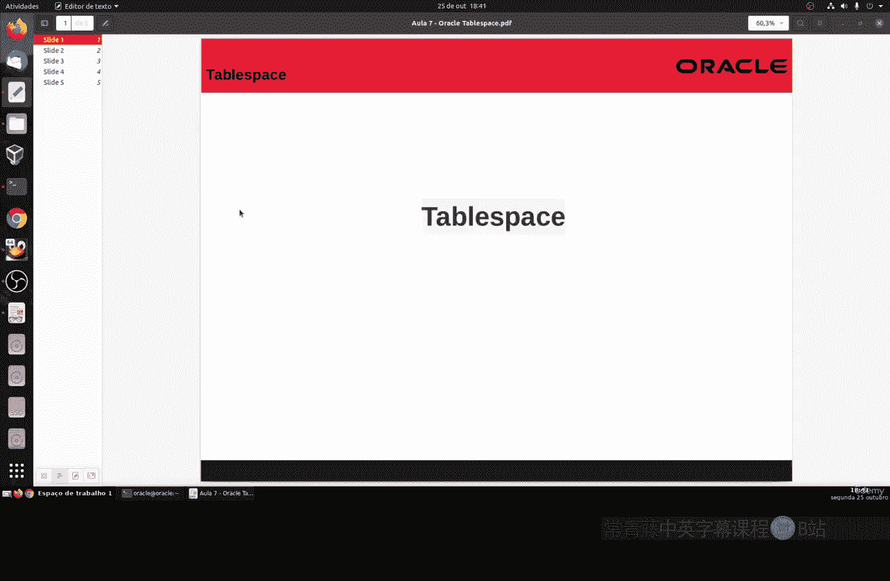
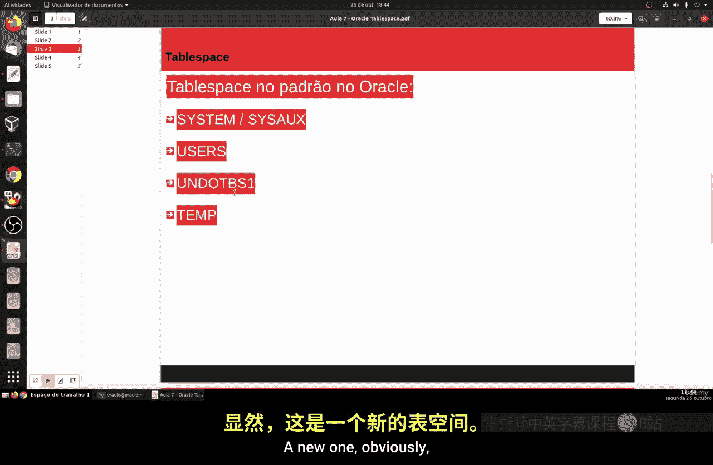
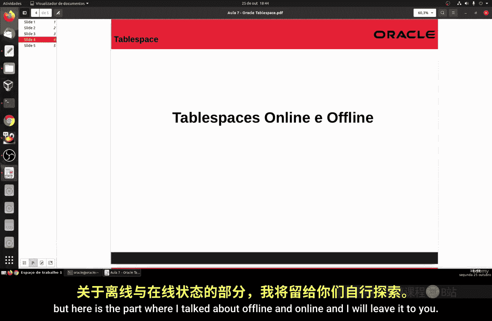
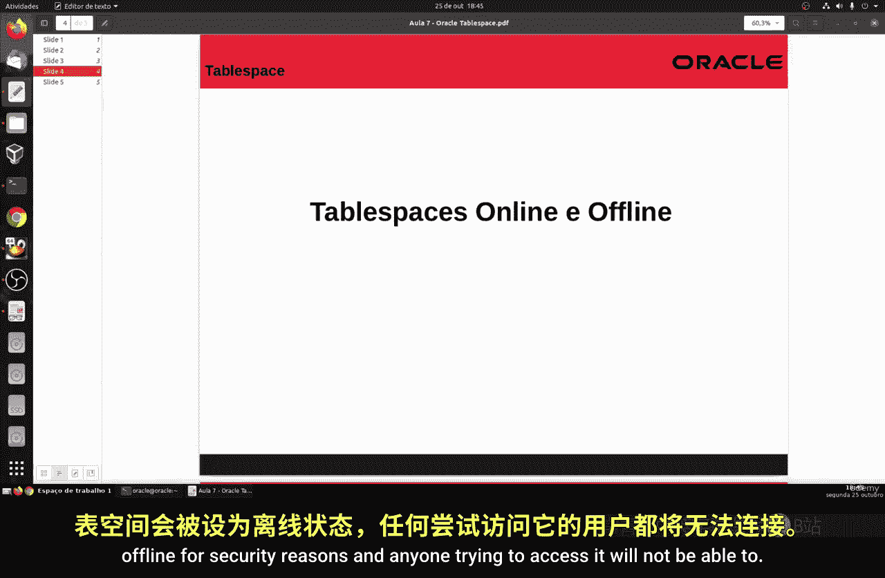
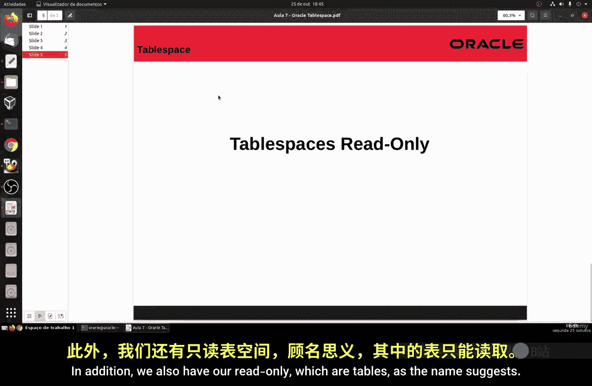
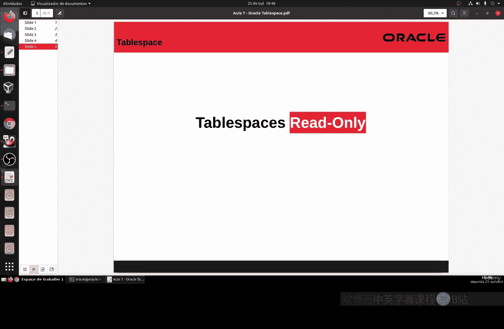
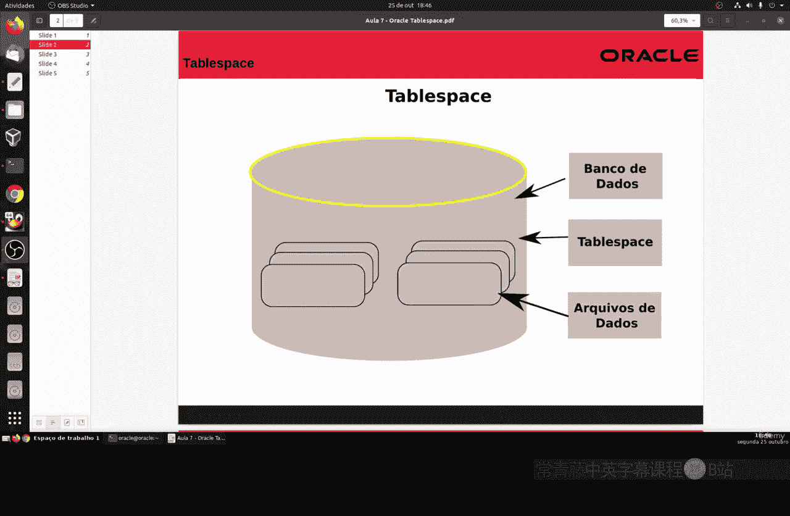

# 142：表空间基础概念与操作 🗂️

在本节课中，我们将要学习Oracle数据库中的一个核心概念——表空间。我们将了解什么是表空间、它的作用、默认存在的表空间类型以及其不同的状态（如在线/离线、只读）。理解这些是进行有效数据库存储管理的基础。

## 什么是表空间？🤔

上一节我们介绍了数据库的基本结构，本节中我们来看看表空间。在Oracle数据库中，表空间是一个逻辑存储单元。数据库被划分为一个或多个这样的逻辑单元，用于管理存储。

简单来说，表空间是组织数据库物理存储（数据文件）的逻辑容器。数据文件是物理存储在磁盘上的文件，而表、索引等数据对象则逻辑上存放在表空间中。

## 表空间的作用与优势 ⚙️

使用表空间进行管理，主要能带来以下优势：

以下是表空间管理的几个核心好处：
*   **存储控制**：可以更好地控制存储空间的大小，并为数据库中的每个用户设置配额。
*   **可用性控制**：可以控制表空间的可用性，例如将其设置为离线或在线状态。
*   **性能优化**：通过在不同的存储设备间分配表空间，可以提升数据库性能。
*   **备份与恢复**：支持进行部分（表空间级别）的备份和恢复，操作更灵活。

## 默认表空间 🏗️

Oracle数据库在安装时会自动创建一些默认的表空间。

以下是几个关键的默认表空间：
*   **SYSTEM**：用于存放数据库的系统表和数据字典等管理性对象。默认情况下，用户不应在其中存储数据。
*   **USERS**：用于存放用户数据。通常建议为用户创建的对象使用此表空间或自定义表空间。
*   **UNDOTBS1**：用于存放回滚段数据，支持事务的回滚操作。
*   **TEMP**：用于存放临时表数据或排序、哈希等临时处理过程中产生的、后续会被丢弃的数据。其逻辑类似于Linux系统中的`/tmp`目录。

## 表空间的状态 🔄

表空间可以处于不同的状态，这影响了其可访问性和可操作性。

### 在线与离线

表空间主要有“在线”和“离线”两种状态。
*   **离线**：当表空间处于离线状态时，用户无法访问其中的数据。
*   **在线**：当表空间在线时，用户可以正常进行连接、读取、写入等所有操作。默认情况下，表空间都是在线的，以确保对用户可用。

将表空间设置为离线通常是为了执行备份操作，或者在发生硬件故障时，Oracle系统可能会自动将其设为离线以保护数据安全，此时任何访问尝试都会收到错误信息。

### 只读状态

除了在线和离线，表空间还可以设置为“只读”状态。
*   **只读**：顾名思义，处于只读状态的表空间禁止任何更新或结构修改操作。这非常适用于保护历史数据免受更改，或者在执行备份时防止数据变动。

可以使用 `ALTER TABLESPACE` 命令来修改表空间的状态，我们将在后续课程中详细学习这个命令。

## 总结 📝

本节课中我们一起学习了Oracle表空间的基础知识。我们了解到表空间是数据库的逻辑存储单元，它将物理的数据文件组织起来，用于存放表、索引等对象。管理表空间能帮助我们控制存储、优化性能并简化备份恢复流程。数据库安装后存在一些默认表空间（如SYSTEM、USERS），并且表空间可以具有在线、离线或只读等不同状态。理解这些概念是进行后续数据库管理操作的重要一步。