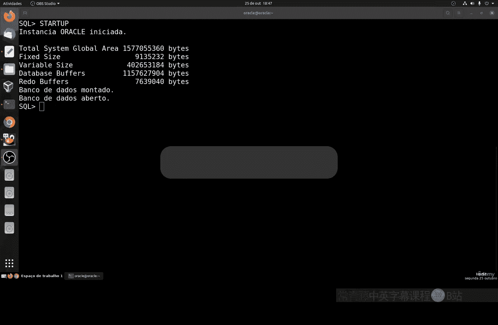
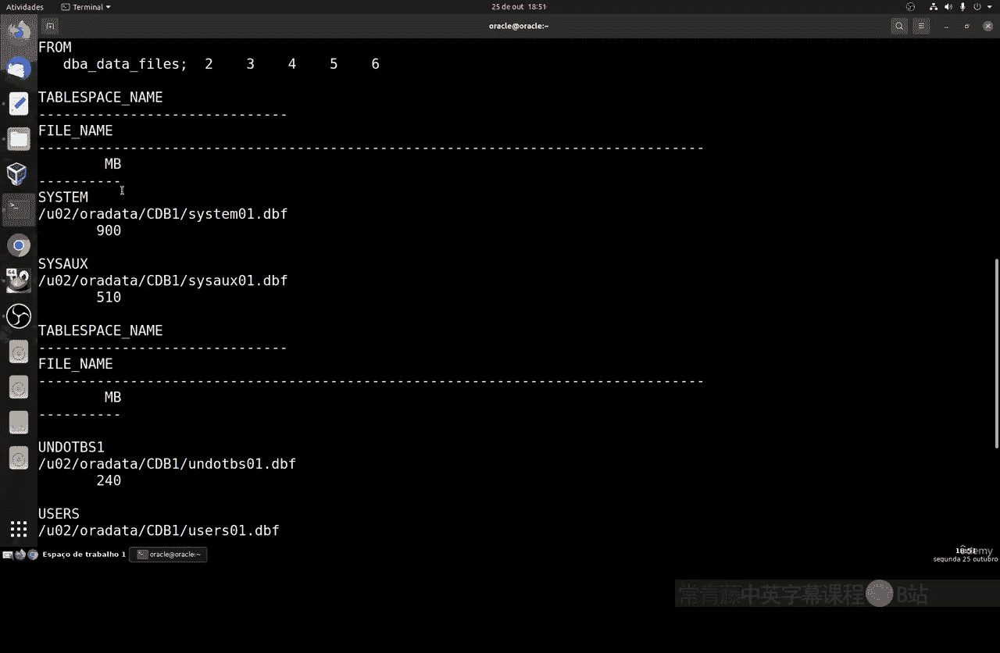
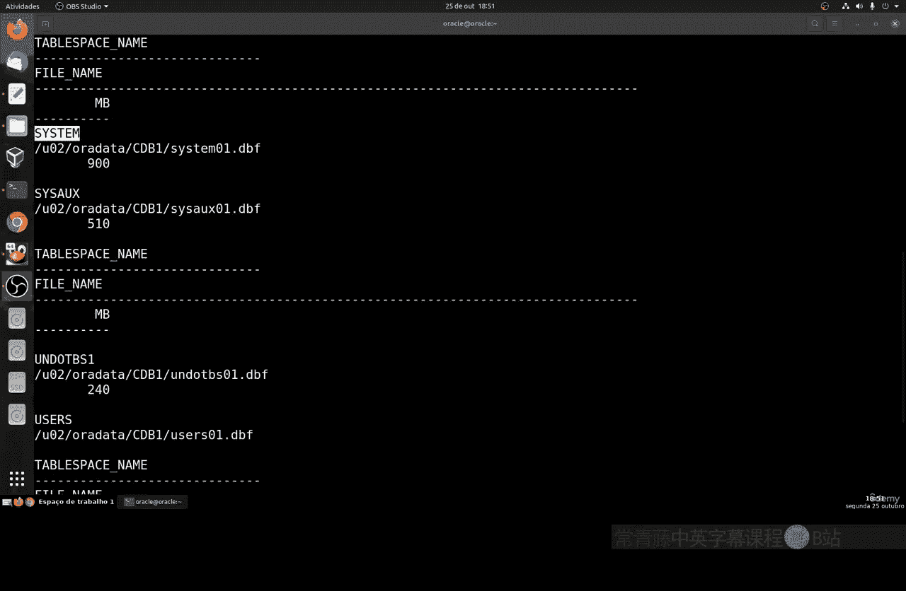
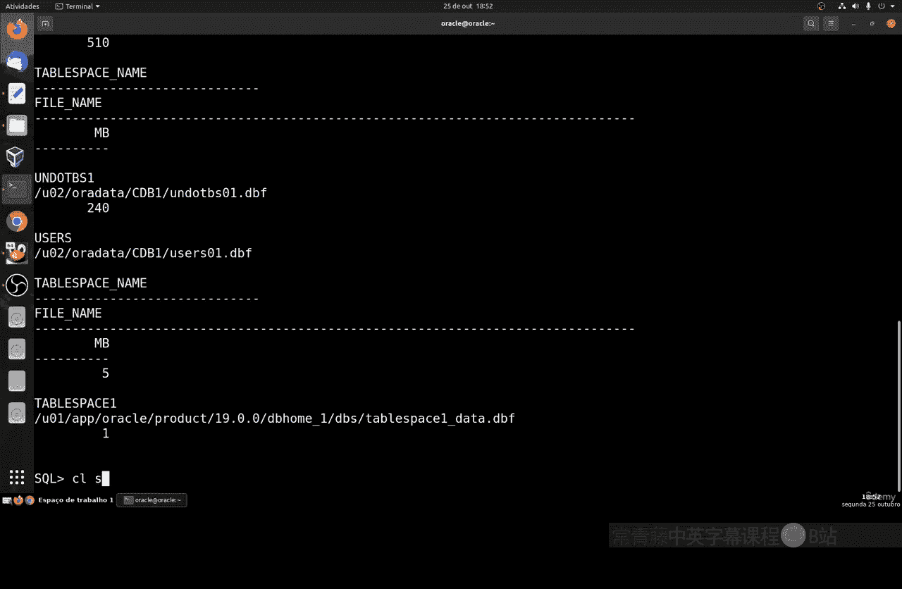
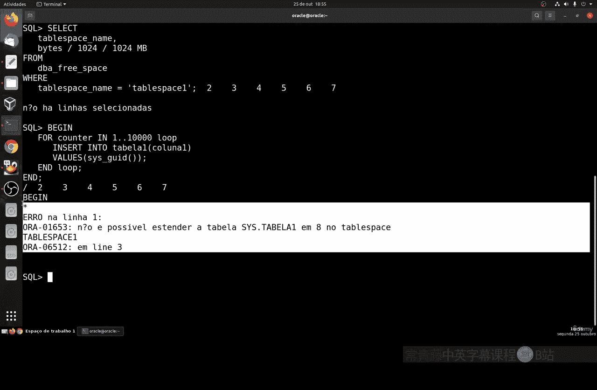

# 143：Oracle表空间管理 📊



在本节课中，我们将学习如何在Oracle数据库中创建和管理表空间。表空间是数据库存储的逻辑结构，用于存放数据文件。我们将学习如何创建表空间、查看其信息、创建关联的表，以及如何管理表空间的大小。

---

## 概述

上一节我们介绍了数据库的基本启动和连接。本节中，我们来看看如何创建和管理Oracle数据库中的表空间。表空间是存储数据库对象的逻辑容器，理解其创建和管理对于数据库维护至关重要。

首先，确保你的Oracle数据库实例处于启动状态。这是我们课程开始时已介绍过的内容。

---

## 创建新表空间

我们不能使用已存在的表空间进行练习。让我们学习如何创建一个新的表空间，并为其指定大小。为表空间设定大小限制很重要，这可以确保它不会占用整个硬盘驱动器，从而影响系统中的其他数据库。

以下是创建表空间的步骤：

1.  使用 `CREATE TABLESPACE` 命令。
2.  为表空间指定一个名称。
3.  指定数据文件的存储路径和名称。
4.  定义表空间的初始大小。

创建表空间的基本命令格式如下：

```sql
CREATE TABLESPACE tablespace_name
DATAFILE '/path/to/datafile.dbf'
SIZE size_in_megabytes;
```

例如，创建一个名为 `space1`、大小为1MB的表空间：

```sql
CREATE TABLESPACE space1
DATAFILE '/u01/app/oracle/oradata/ORCL/space01.dbf'
SIZE 1M;
```

命令执行成功后，会显示“表空间已创建”的确认信息。

---





## 查看表空间信息


创建表空间后，我们可以通过查询来验证它是否成功创建，并查看其详细信息。


以下是查看表空间信息的命令：

```sql
SELECT tablespace_name, file_name, bytes
FROM dba_data_files
WHERE tablespace_name = 'SPACE1';
```

这条SQL语句会显示指定表空间的名称、数据文件路径和大小（以字节为单位）。执行后，你可能会看到类似以下的结果，其中包含系统自动生成的其他表空间信息：

*   `SYSTEM`
*   `SYSAUX`
*   `UNDOTBS1`
*   `USERS`
*   以及你刚创建的 `SPACE1`

你可以通过Linux系统访问数据文件所在的完整路径。

---



## 在表空间中创建表

创建好表空间后，下一步就是在这个表空间中创建数据库表。这样可以将表的数据存储与我们指定的表空间关联起来。

创建表并与表空间关联的命令如下：

```sql
CREATE TABLE table1 (
    id NUMBER,
    column1 VARCHAR2(50),
    column2 DATE
)
TABLESPACE space1;
```

此命令会成功创建名为 `table1` 的表，并将其存储在 `space1` 表空间中。


---

## 测试表空间容量限制

为了测试表空间的容量限制，我们可以向刚创建的表中插入大量数据。

例如，使用PL/SQL循环向 `table1` 插入10000行测试数据：

```sql
BEGIN
  FOR i IN 1..10000 LOOP
    INSERT INTO table1 (id, column1, column2) VALUES (i, 'Test' || i, SYSDATE);
  END LOOP;
  COMMIT;
END;
/
```


执行成功后，可以查询表空间的剩余空间：

```sql
SELECT * FROM dba_free_space WHERE tablespace_name = 'SPACE1';
```


如果表空间已满，此查询可能不会返回任何行，表示可用空间已耗尽。此时若尝试再次插入数据，系统会报错，提示无法扩展表空间。



---

## 管理表空间大小


当表空间容量不足时，我们有两种主要方法来处理。

### 方法一：手动扩展表空间

我们可以使用 `ALTER DATABASE` 命令来手动增加现有数据文件的大小。

例如，将 `space1` 表空间的数据文件大小从1MB扩展到10MB：

```sql
ALTER DATABASE
DATAFILE '/u01/app/oracle/oradata/ORCL/space01.dbf'
RESIZE 10M;
```

扩展成功后，之前失败的插入操作就可以继续执行了。

### 方法二：创建可自动扩展的表空间

另一种更便捷的方法是在创建表空间时，就为其设置自动扩展属性。这样当空间不足时，数据库会自动按设定规则扩容。

以下是创建可自动扩展表空间的命令示例：

```sql
CREATE TABLESPACE space2
DATAFILE '/u01/app/oracle/oradata/ORCL/space02.dbf'
SIZE 1M
AUTOEXTEND ON
NEXT 10M
MAXSIZE 100M;
```

这个命令创建了一个初始大小为1MB的表空间 `space2`。当空间用完时，它会自动每次扩展10MB，最大容量不超过100MB。

---

## 总结


本节课中我们一起学习了Oracle表空间的核心管理操作。我们首先介绍了如何**创建**一个新的表空间并指定其大小。然后，学习了如何**查看**表空间的详细信息。接着，我们实践了在特定表空间中**创建表**，并通过插入数据来**测试**表空间的容量限制。最后，我们探讨了两种管理空间不足的方法：**手动扩展**现有表空间和**创建时可自动扩展**的表空间。掌握这些技能，有助于你更有效地规划和管理数据库的存储结构。