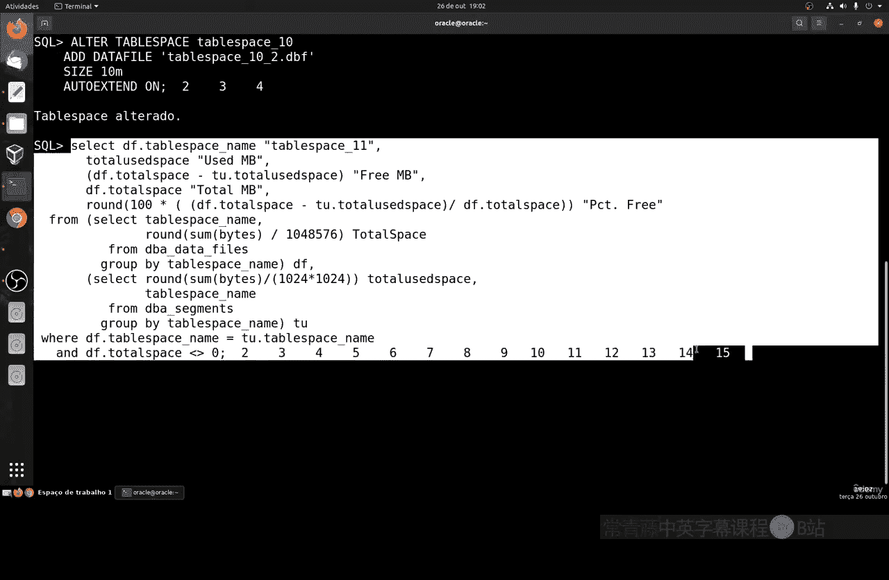
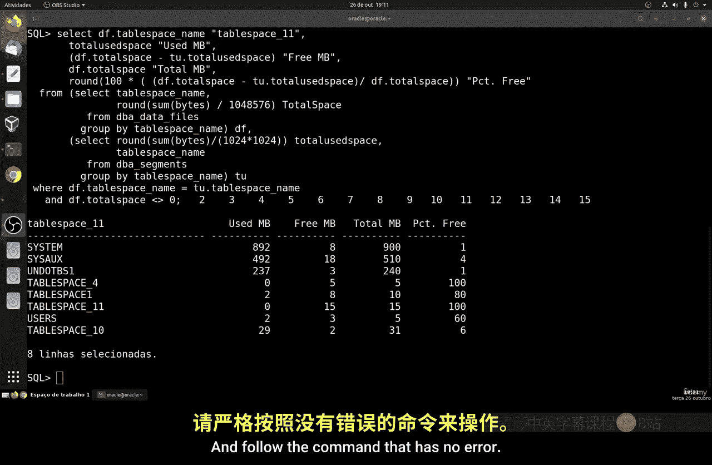

# 145：调整表空间大小

## 概述
在本节课中，我们将要学习如何在Linux环境下调整数据库表空间的大小。表空间是数据库存储数据的逻辑结构，管理其大小对于维护数据库性能和存储空间至关重要。我们将通过具体的命令和步骤，了解如何查看、扩展和修改表空间。

## 查看当前表空间状态
上一节我们介绍了表空间的基本概念，本节中我们来看看如何查看当前表空间的状态。了解现有表空间的大小和使用情况是进行调整的第一步。


以下是查看表空间信息的命令：
```sql
SELECT tablespace_name, file_name, bytes/1024/1024 AS size_mb FROM dba_data_files;
```



## 扩展表空间大小
如果发现表空间即将耗尽，我们需要对其进行扩展。扩展表空间通常通过增加数据文件或调整现有文件的大小来实现。

以下是扩展表空间的两种方法：
1.  **增加新的数据文件**：使用 `ALTER TABLESPACE` 命令为表空间添加一个新的数据文件。
    ```sql
    ALTER TABLESPACE your_tablespace_name ADD DATAFILE '/path/to/new_datafile.dbf' SIZE 500M;
    ```
2.  **调整现有数据文件大小**：使用 `ALTER DATABASE` 命令来扩大一个已存在的数据文件。
    ```sql
    ALTER DATABASE DATAFILE '/path/to/existing_datafile.dbf' RESIZE 1G;
    ```

## 修改表空间属性
除了调整大小，我们有时还需要修改表空间的其它属性，例如将其设置为自动扩展，这样当空间不足时，数据库可以自动增长数据文件。

以下是启用数据文件自动扩展的命令：
```sql
ALTER DATABASE DATAFILE '/path/to/datafile.dbf' AUTOEXTEND ON NEXT 100M MAXSIZE 2G;
```
> **注意**：`MAXSIZE` 参数用于设置文件自动扩展的上限，防止磁盘空间被意外占满。

## 操作确认与验证
在执行任何修改操作后，进行确认是非常重要的。我们需要验证更改是否已成功应用，并确保数据库运行正常。

以下是操作后验证的步骤：
1.  再次运行查看表空间的查询，确认新的大小或新文件已生效。
2.  检查数据库的告警日志，确保没有出现错误信息。
3.  可以进行简单的数据插入测试，确保表空间功能正常。



## 总结
本节课中我们一起学习了调整数据库表空间大小的完整流程。我们首先了解了如何查看表空间的当前状态，然后学习了通过添加数据文件或调整现有文件大小来扩展表空间的方法。最后，我们还探讨了如何设置数据文件的自动扩展属性以及操作后的必要验证步骤。掌握这些技能，将帮助你有效地管理数据库的存储资源。