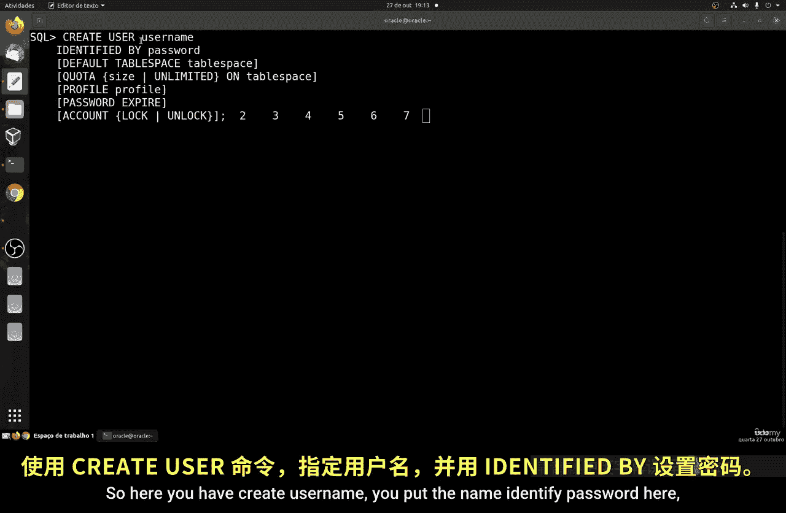
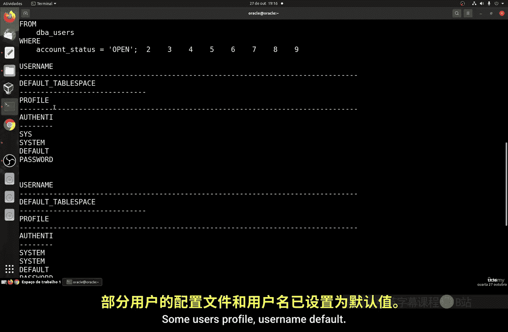
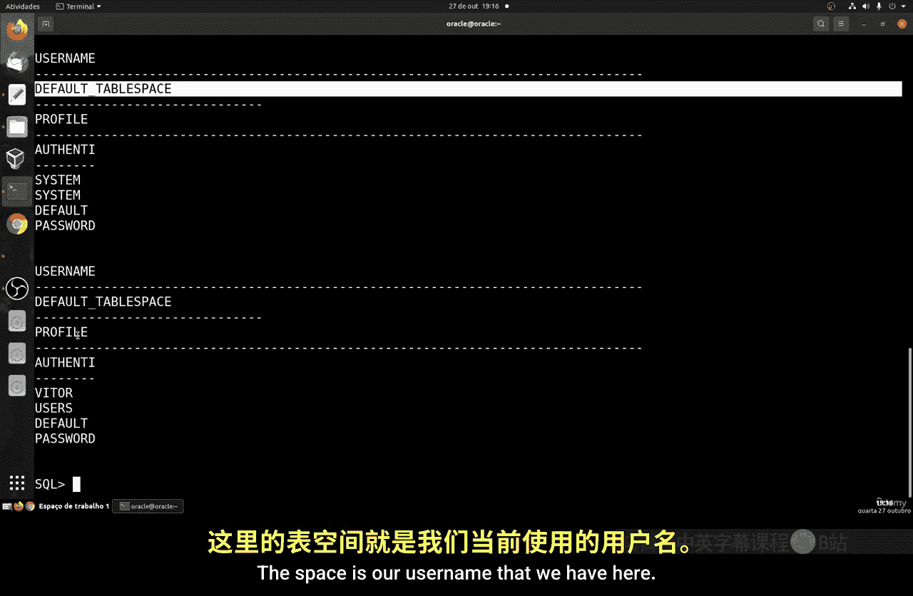
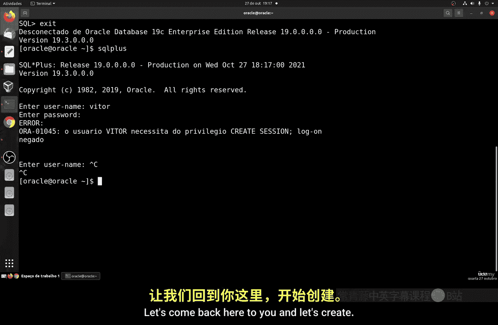
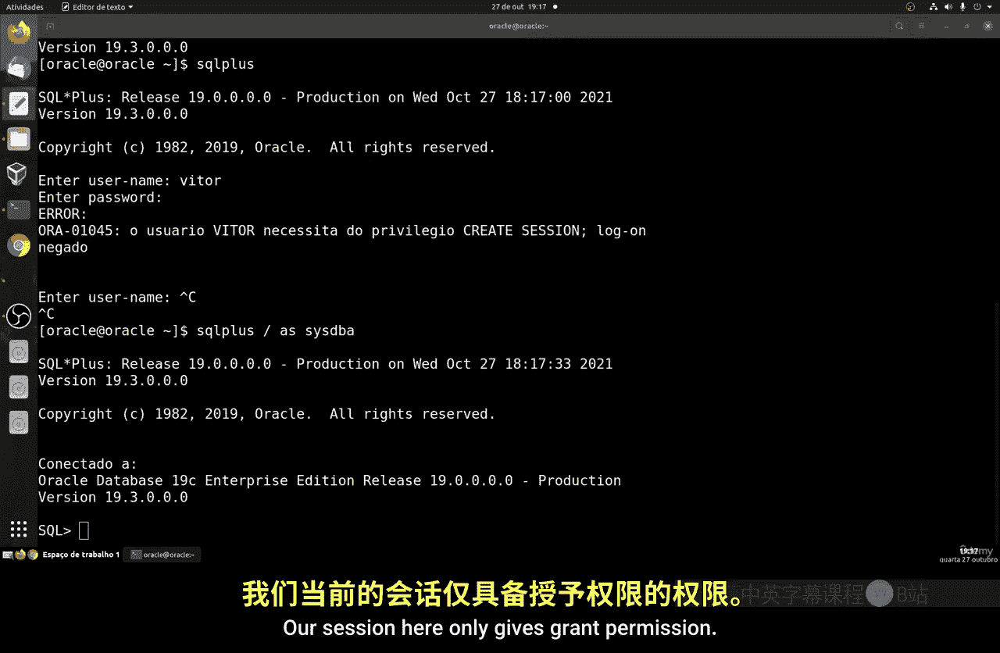
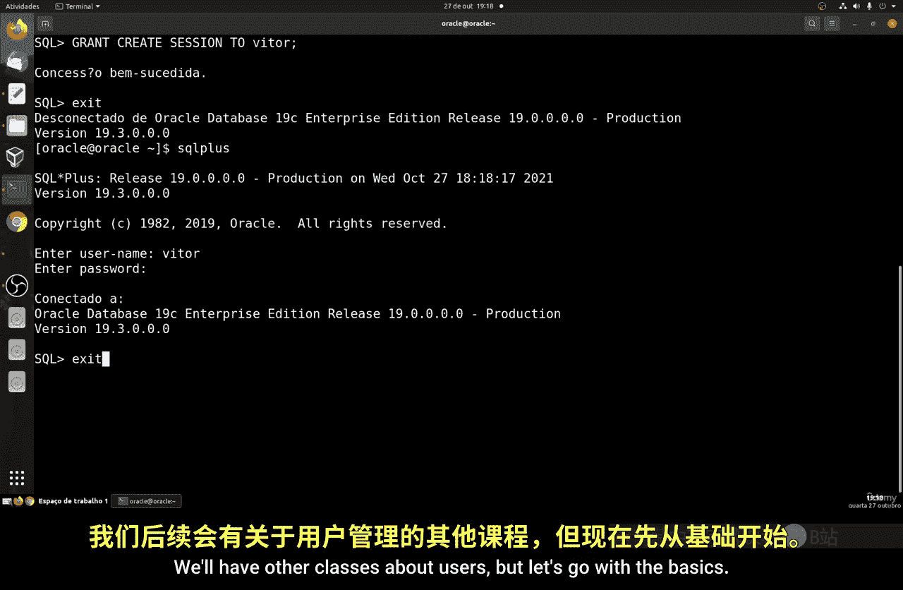
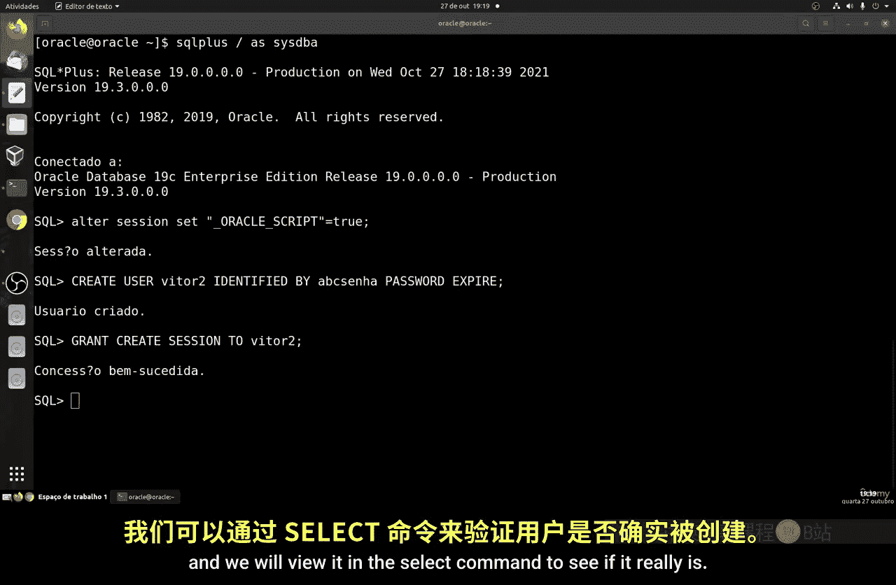
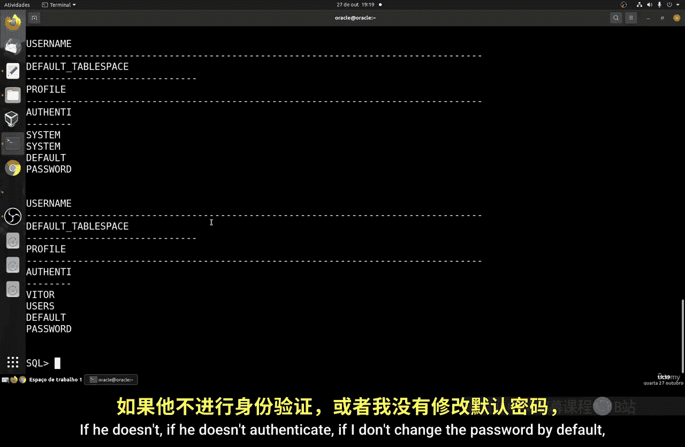
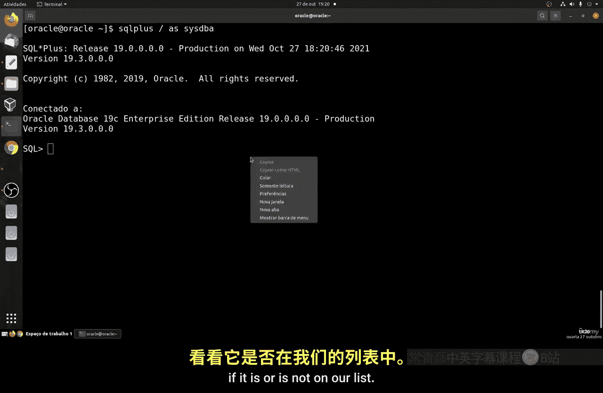
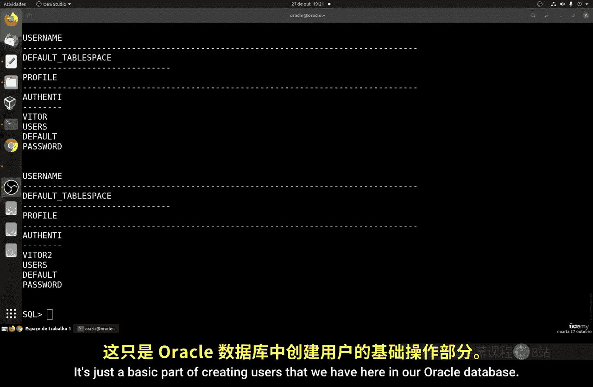

# 147：创建用户 👤

在本节课中，我们将要学习如何在Oracle数据库中创建一个新用户。用户管理是数据库管理的基础部分，通过创建不同的用户和密码，我们可以登录数据库并管理不同的数据库和表，从而实现对数据库实例访问权限的划分。



## 创建用户的基本语法

上一节我们介绍了用户管理的重要性，本节中我们来看看创建用户的具体命令。创建用户的基本语法非常直接，与其他数据库系统类似。

以下是创建用户的核心命令格式：
```sql
CREATE USER username IDENTIFIED BY password;
```
在此基础语法之上，还可以添加一些可选参数来进一步配置用户：
*   **DEFAULT TABLESPACE**：用于指定用户默认使用的表空间。
*   **QUOTA**：用于限制用户在该表空间中可以使用的存储空间大小。
*   **PROFILE**：用于分配一个配置文件，以限制数据库资源（如CPU时间、会话数）或密码策略（如过期时间）。
*   **PASSWORD EXPIRE**：设置用户密码在首次登录时过期，强制用户创建新密码。这对于为新员工创建账户非常有用。
*   **ACCOUNT LOCK/UNLOCK**：用于锁定或解锁用户账户，以控制其访问权限。

## 实践：创建第一个用户

现在，让我们开始实际操作。首先，我们需要以管理员身份（如SYS）登录。在创建用户之前，有时需要修改当前会话的一个隐藏参数。



以下是允许从用户ID创建用户的命令：
```sql
ALTER SESSION SET "_ORACLE_SCRIPT"=TRUE;
```
执行此命令后，我们就可以创建新用户了。例如，创建一个名为“Victor”的用户：
```sql
CREATE USER victor IDENTIFIED BY abc;
```
用户创建成功后，我们可以运行一个查询命令来列出所有用户，以确认新用户已存在。
```sql
SELECT username, profile, default_tablespace FROM dba_users;
```
在查询结果中，你应该能看到新创建的“VICTOR”用户（用户名会自动转为大写）。




## 授予登录权限

新创建的用户默认没有连接数据库的权限。如果我们尝试用新用户登录，系统会报错。





因此，我们需要返回管理员会话，为新用户授予创建会话的权限。`GRANT`命令用于赋予权限，而`REVOKE`命令用于撤销权限。

以下是授予“Victor”用户登录权限的命令：
```sql
GRANT CREATE SESSION TO victor;
```
执行授权后，再次尝试使用`sqlplus victor/abc`命令登录，此时应该能够成功连接到数据库。



## 使用密码过期策略

接下来，我们创建一个使用`PASSWORD EXPIRE`选项的用户，体验密码过期功能。



首先，确保会话设置正确，然后创建用户“Victor2”：
```sql
CREATE USER victor2 IDENTIFIED BY abc PASSWORD EXPIRE;
```
同样，我们需要授予该用户登录权限：
```sql
GRANT CREATE SESSION TO victor2;
```
现在，当我们使用`sqlplus victor2/abc`尝试登录时，系统会提示密码已过期，并要求立即更改密码。按照提示输入旧密码“abc”，然后设置一个新密码（例如“abc”），即可成功登录并进入数据库。



最后，我们可以再次运行用户列表查询，确认“VICTOR2”用户已经成功创建并出现在列表中。



## 总结




本节课中我们一起学习了Oracle数据库用户创建的基础知识。我们掌握了使用`CREATE USER`命令创建用户的基本语法和可选参数，了解了新用户默认没有连接权限，需要通过`GRANT CREATE SESSION`命令进行授权。此外，我们还实践了`PASSWORD EXPIRE`选项的用法，该功能可以强制用户在首次登录时更改密码，增强了账户的安全性。这是管理数据库访问权限的第一步。