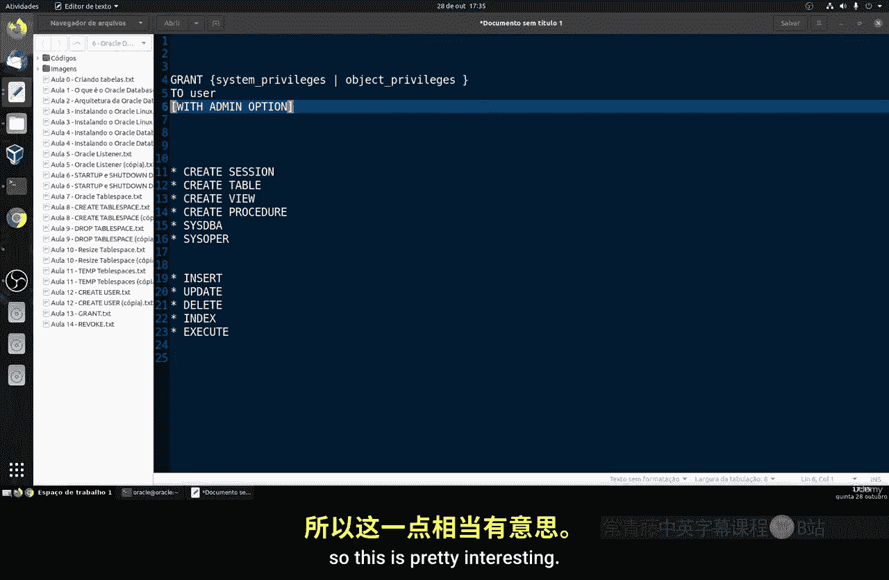
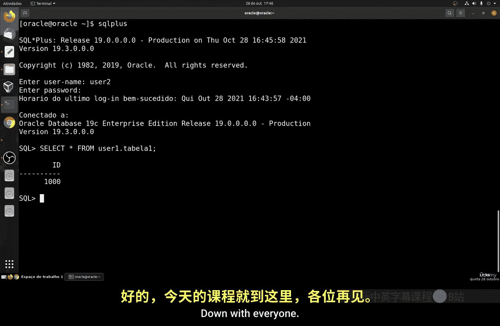

Linux命令行基础：Part3：GRANT命令详解 🛠️

在本节课中，我们将学习如何使用 `GRANT` 命令。`GRANT` 命令用于授予用户或用户组对数据库对象（如表、视图）或系统功能（如创建会话）的访问权限和操作许可。我们将通过创建用户、分配权限和测试权限效果来掌握其基本用法。


上一节我们介绍了用户管理的基础操作，本节中我们来看看如何具体地为用户分配权限。

### GRANT命令概述

`GRANT` 命令的核心功能是授予权限。这些权限主要分为两类：系统权限和对象权限。

*   **系统权限**：允许用户执行特定的数据库操作，例如创建会话、创建表或创建视图。
*   **对象权限**：允许用户对特定数据库对象（如表、视图）执行操作，例如插入 (`INSERT`)、更新 (`UPDATE`)、删除 (`DELETE`)、查询 (`SELECT`) 或执行 (`EXECUTE`)。

其基本语法结构如下：
```sql
GRANT <系统权限或对象权限> TO <用户名> [WITH ADMIN OPTION];
```
其中，`WITH ADMIN OPTION` 是一个可选的管理选项。授予此选项后，被授权的用户可以将获得的权限再授予其他用户。

### 实践操作：创建用户并授予权限

以下是创建新用户并逐步授予其不同权限的步骤。



首先，我们需要以管理员身份（如 `DBA`）登录系统，创建一个新用户 `user1`。

```sql
CREATE USER user1 IDENTIFIED BY abc;
```

#### 1. 授予登录系统权限

新创建的用户默认没有任何权限，甚至无法登录。我们需要授予其创建会话的权限。

```sql
GRANT CREATE SESSION TO user1;
```

现在，我们可以尝试以 `user1` 身份登录。
```bash
sqlplus user1/abc
```

登录后，可以查看当前用户拥有的权限：
```sql
SELECT * FROM USER_SYS_PRIVS;
```
此时，查询结果应仅显示 `CREATE SESSION` 权限。

#### 2. 授予创建表权限

如果此时尝试创建表，系统会报错，提示权限不足。
```sql
CREATE TABLE test_table (id NUMBER);
-- 错误：insufficient privileges
```

我们需要返回管理员会话，为 `user1` 授予创建表的权限。
```sql
GRANT CREATE TABLE TO user1;
```

再次以 `user1` 登录，执行创建表命令，此时应该成功。
```sql
CREATE TABLE table1 (id NUMBER, name VARCHAR2(50));
```

#### 3. 授予表空间配额和插入数据权限

创建表成功后，尝试向表中插入数据可能仍会失败，因为用户可能没有足够的表空间配额或 `INSERT` 权限。

首先，在管理员会话中为用户分配无限制的表空间配额（或在生产环境中分配特定配额）：
```sql
ALTER USER user1 QUOTA UNLIMITED ON USERS;
```

然后，授予对 `table1` 表的 `INSERT` 对象权限：
```sql
GRANT INSERT ON user1.table1 TO user1;
-- 注意：对象权限通常用于跨用户授权。对自己拥有的表，通常已具备所有权限。
-- 更常见的场景是：GRANT INSERT ON schema_a.table1 TO user_b;
```

现在，`user1` 可以向自己的 `table1` 表中插入数据了。
```sql
INSERT INTO table1 VALUES (1, 'Test');
COMMIT;
```

### 使用WITH ADMIN OPTION选项

`WITH ADMIN OPTION` 允许被授权者将其获得的权限再授予其他用户。

首先，创建第二个用户 `user2` 并授予其登录权限。
```sql
CREATE USER user2 IDENTIFIED BY abc QUOTA UNLIMITED ON USERS;
GRANT CREATE SESSION TO user2;
```

然后，我们以管理员身份，将 `CREATE TABLE` 权限授予 `user1`，并附带 `ADMIN OPTION`。
```sql
GRANT CREATE TABLE TO user1 WITH ADMIN OPTION;
```

现在，切换到 `user1` 的会话。`user1` 可以将 `CREATE TABLE` 权限授予 `user2`。
```sql
GRANT CREATE TABLE TO user2;
```

切换到 `user2` 的会话进行验证，`user2` 现在可以成功创建表。
```bash
sqlplus user2/abc
```
```sql
CREATE TABLE table2 (id NUMBER);
```

### 授予查询任何表的权限

有时需要允许用户查询数据库中所有用户的表。这可以通过 `SELECT ANY TABLE` 这个强大的系统权限来实现。

例如，以 `user2` 身份尝试查询 `user1` 的 `table1` 表，会因权限不足而失败。
```sql
SELECT * FROM user1.table1;
-- 错误：table or view does not exist (或 insufficient privileges)
```

在管理员会话中，为 `user2` 授予 `SELECT ANY TABLE` 权限。
```sql
GRANT SELECT ANY TABLE TO user2;
```

授予权限后，`user2` 再次执行查询命令，即可成功查看 `user1.table1` 表中的数据。
```sql
SELECT * FROM user1.table1;
```

### 总结

本节课中我们一起学习了 `GRANT` 命令的核心用法。我们了解了系统权限与对象权限的区别，并通过实践掌握了如何创建用户、逐步授予其 `CREATE SESSION`、`CREATE TABLE` 等权限，以及如何使用 `WITH ADMIN OPTION` 实现权限传递。最后，我们还学习了 `SELECT ANY TABLE` 这种特殊系统权限的用法。



`GRANT` 是进行数据库权限控制的基础命令。与之对应的 `REVOKE` 命令用于撤销已授予的权限，我们将在下一节课中进行学习。