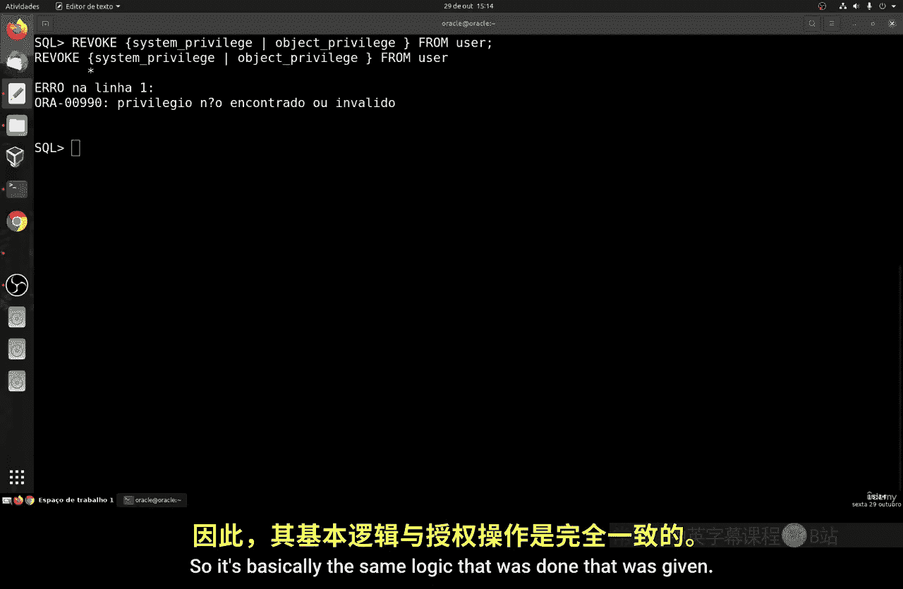
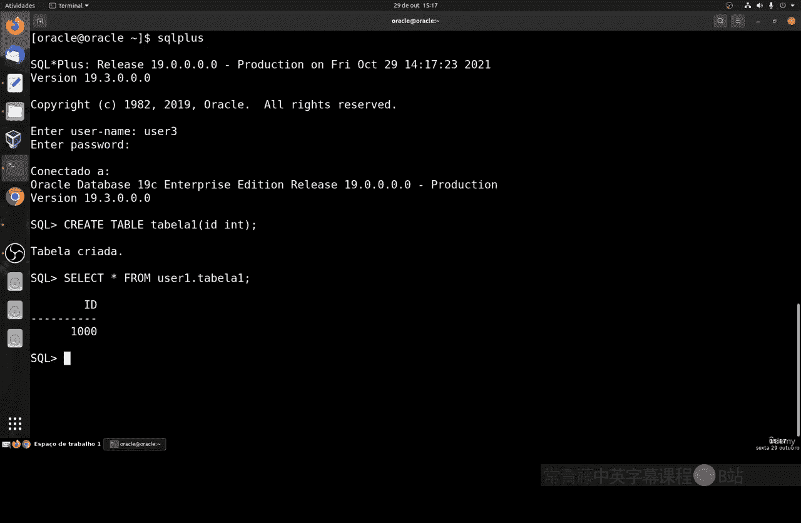
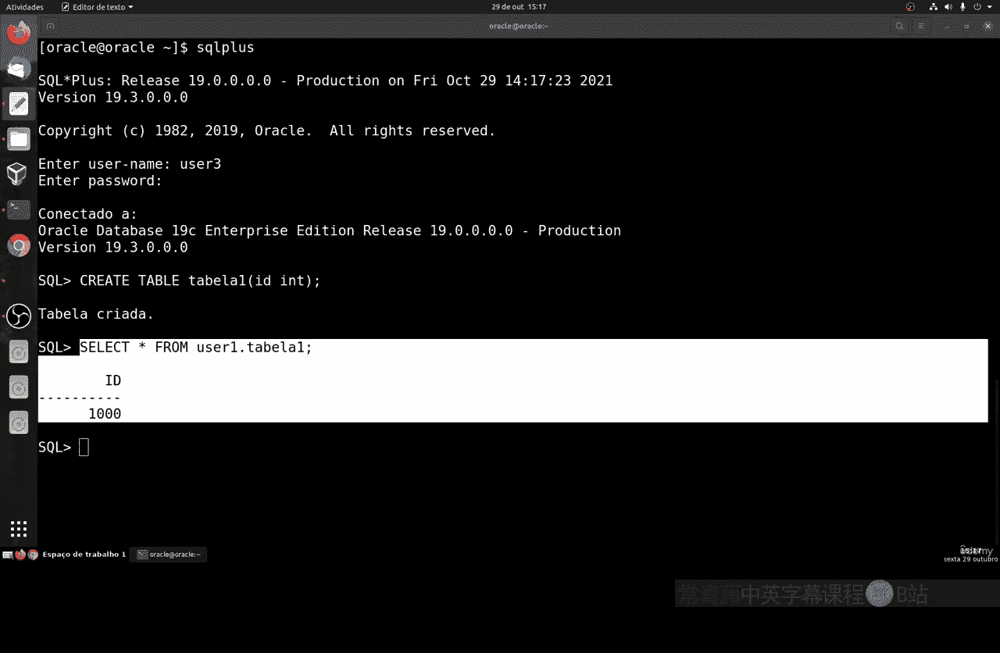
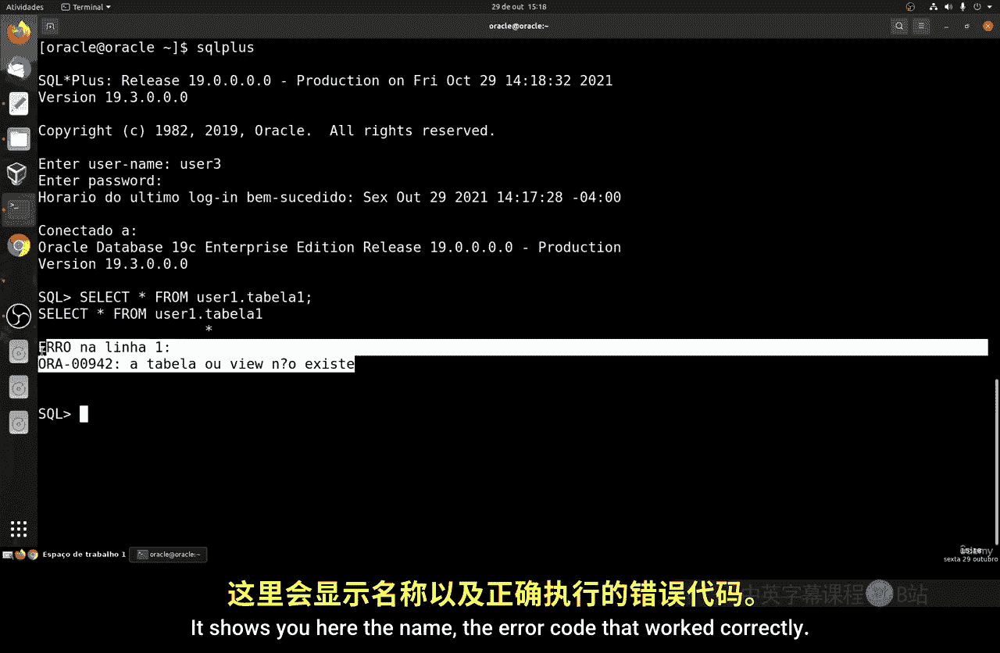
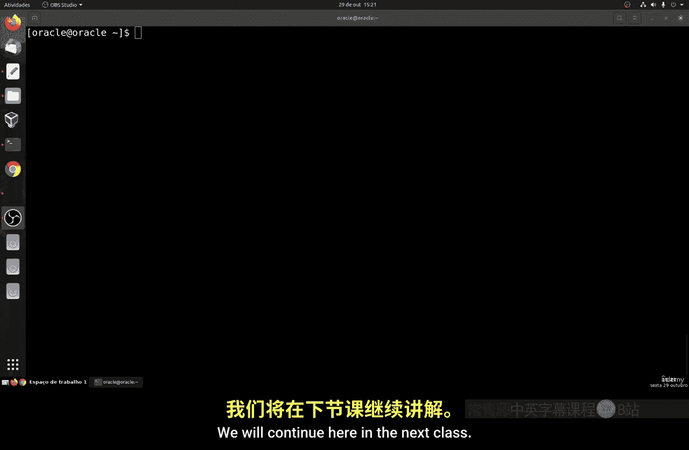

# 149：撤销权限 🔧

在本节课中，我们将学习如何撤销之前授予用户的权限。撤销权限是权限管理的重要环节，它允许你收回不再需要的访问许可，确保系统安全。

上一节我们介绍了如何使用 `GRANT` 命令授予权限。本节中我们来看看它的“对手”——`REVOKE` 命令。

## 命令概述



`REVOKE` 命令用于撤销之前授予用户的权限。其语法结构与 `GRANT` 命令非常相似，基本逻辑也相同。

**基本语法：**
```sql
REVOKE [权限列表] ON [对象] FROM [用户名];
```

如果你想撤销一个用户的所有权限，可以使用 `REVOKE ALL PRIVILEGES` 命令。执行后，用户将回到初始状态，之后如果需要，你必须再次使用 `GRANT` 命令重新授权，包括允许其登录系统的 `CREATE SESSION` 权限。

## 实践操作：创建用户并授权

首先，让我们创建一个新用户来进行撤销权限的测试。

以下是操作步骤：
1.  以管理员身份（如DBA）登录。
2.  创建一个新用户 `user3`，并设置密码。
3.  授予 `user3` 一些权限，包括创建会话、创建表以及对其他用户表的操作权限。

具体命令如下：
```sql
-- 创建用户
CREATE USER user3 IDENTIFIED BY abc;

-- 授予创建会话权限（允许登录）
GRANT CREATE SESSION TO user3;

-- 授予创建表的权限
GRANT CREATE TABLE TO user3;

-- 授予对 user1.table1 表的增删改查权限
GRANT SELECT, INSERT, UPDATE, DELETE ON user1.table1 TO user3;
```

现在，`user3` 拥有登录系统、创建自己的表以及操作 `user1.table1` 表的权限。

## 测试权限效果



让我们登录 `user3` 来验证权限是否生效。



以下是验证步骤：
1.  使用 `user3` 身份登录 SQL*Plus。
2.  尝试创建一个新表。
3.  尝试查询 `user1.table1` 表。

```sql
-- 以 user3 登录后，执行
CREATE TABLE test_table (id NUMBER);
SELECT * FROM user1.table1;
```

如果权限设置正确，以上操作都应该成功执行。

## 撤销特定权限

现在，我们将开始撤销权限。首先，撤销 `user3` 对 `user1.table1` 表的操作权限。

回到管理员账户，执行以下命令：
```sql
REVOKE SELECT, INSERT, UPDATE, DELETE ON user1.table1 FROM user3;
```



撤销后，再次切换到 `user3` 账户尝试查询该表，系统会返回权限错误。

## 撤销创建表权限

接下来，我们撤销 `user3` 创建表的权限。

在管理员账户下执行：
```sql
REVOKE CREATE TABLE FROM user3;
```

执行后，`user3` 将无法再创建新表。

## 撤销登录权限与全部权限

最后，我们来撤销最关键的权限——登录权限。同时，我们也会介绍撤销全部权限的命令。

以下是操作命令：
```sql
-- 撤销创建会话权限（即登录权限）
REVOKE CREATE SESSION FROM user3;

-- 或者，使用一条命令撤销所有权限
REVOKE ALL PRIVILEGES FROM user3;
```

请注意，`REVOKE ALL PRIVILEGES` 是一个全局性的撤销命令。执行后，`user3` 将失去所有权限，包括登录权限。此时再尝试用 `user3` 登录，系统会拒绝访问。

## 总结



本节课中我们一起学习了 `REVOKE` 命令的使用。它与 `GRANT` 命令相对应，语法相似，用于移除用户的特定权限或全部权限。掌握权限的授予与撤销，是进行有效且安全的系统用户管理的基础。记住，权限管理应遵循最小权限原则，只授予必要的权限，并及时撤销不再需要的权限。