# 150：修改用户 🔧

在本节课中，我们将学习如何使用 `ALTER USER` 命令来修改数据库中的用户。我们将涵盖如何更改用户密码、锁定/解锁账户、设置密码过期以及如何为用户分配不同的配置文件和角色。这些操作是日常数据库管理的基础。

## 创建示例用户

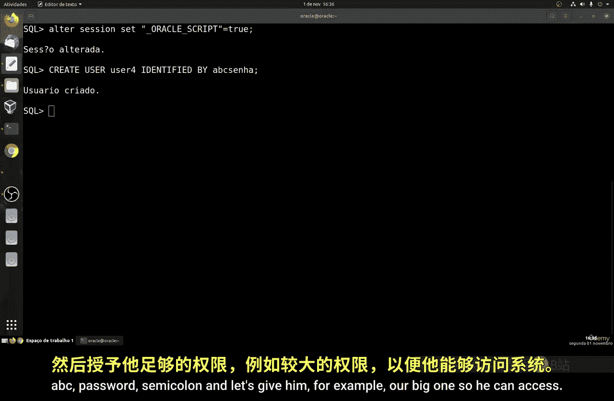

在开始修改用户之前，我们需要一个用于演示的用户。上一节我们介绍了创建用户的基本命令，本节中我们来看看如何创建一个新用户。

以下是创建用户 `USER4` 的SQL命令：

```sql
CREATE USER user4 IDENTIFIED BY abc;
GRANT CONNECT TO user4;
```

## 修改用户密码

创建用户后，我们可能需要更改其密码。使用 `ALTER USER` 命令可以轻松完成此操作。

命令格式如下：
```sql
ALTER USER <username> IDENTIFIED BY <new_password>;
```

例如，将用户 `user4` 的密码改为 `newpass`：
```sql
ALTER USER user4 IDENTIFIED BY newpass;
```

修改后，用户可以使用新密码登录。

## 锁定与解锁用户账户

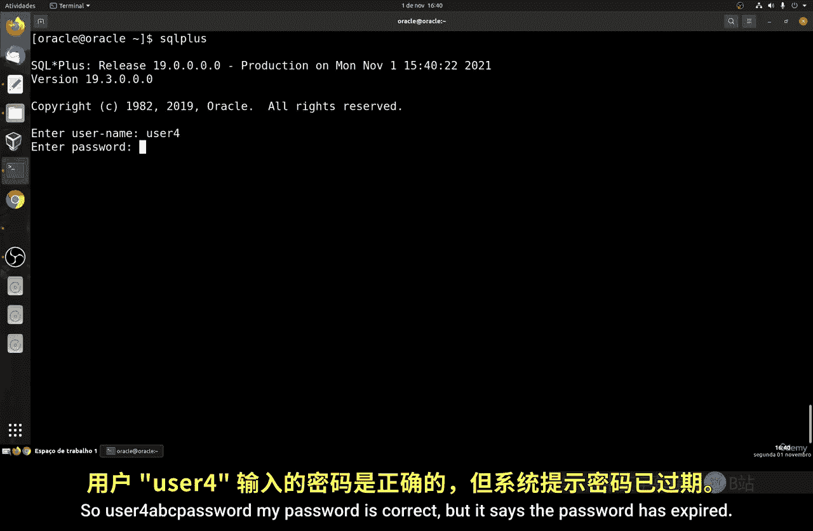

有时，我们需要临时或永久阻止用户访问数据库。这可以通过锁定其账户来实现。

以下是锁定用户账户的命令：
```sql
ALTER USER <username> ACCOUNT LOCK;
```

例如，锁定用户 `user4`：
```sql
ALTER USER user4 ACCOUNT LOCK;
```
锁定后，用户尝试登录时会收到“账户被锁定”的错误信息。

要重新允许用户访问，需要解锁账户。命令如下：
```sql
ALTER USER <username> ACCOUNT UNLOCK;
```

## 设置用户密码过期

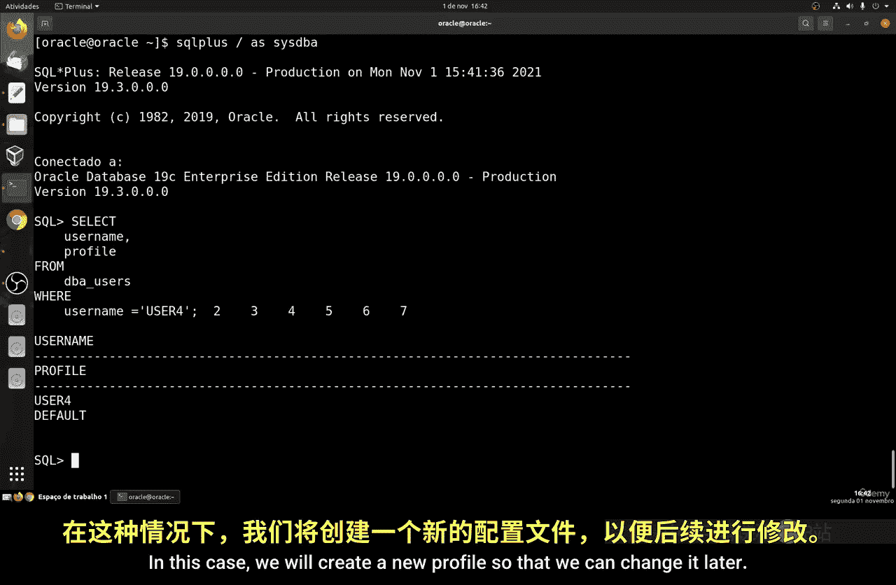

为了安全起见，可以强制用户在下次登录时更改密码。这通过设置密码过期来实现。

命令如下：
```sql
ALTER USER <username> PASSWORD EXPIRE;
```

设置后，用户登录时系统会提示其必须更改密码才能继续。

## 管理用户配置文件

在Oracle中，每个用户都关联一个配置文件（Profile），用于管理资源限制和密码策略。默认情况下，用户使用名为 `DEFAULT` 的配置文件。

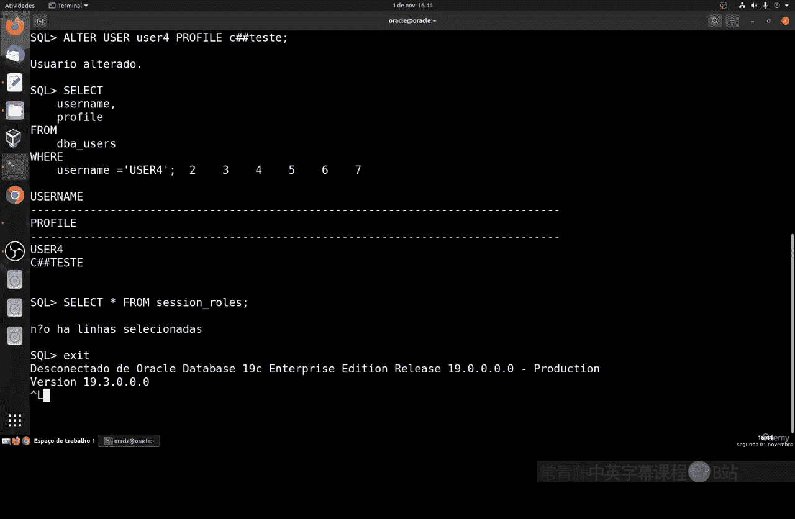

首先，我们可以查看用户的当前配置文件：
```sql
SELECT username, profile FROM dba_users WHERE username = 'USER4';
```

要更改用户的配置文件，需要先创建一个新的配置文件。

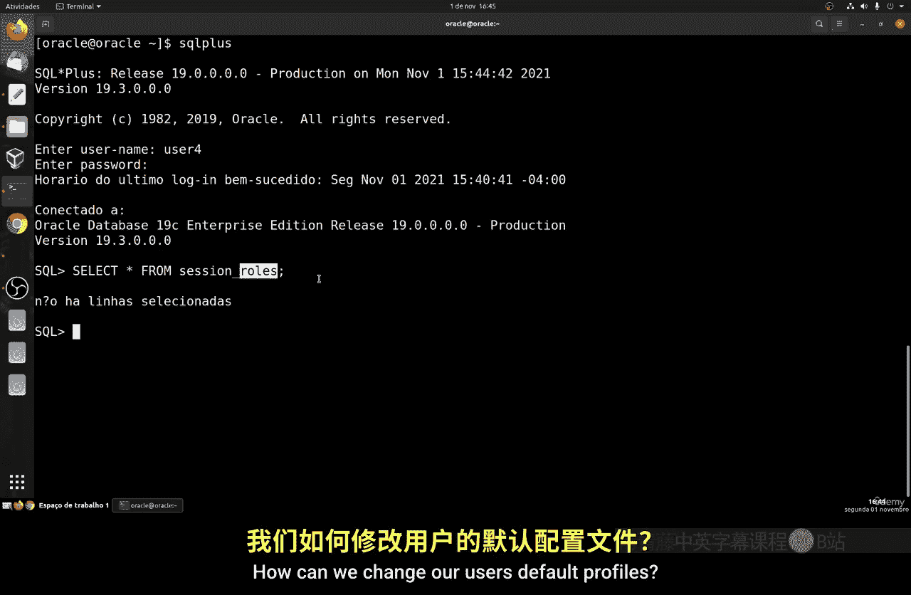

以下是创建一个名为 `test_profile` 的新配置文件的命令：
```sql
CREATE PROFILE test_profile LIMIT
  SESSIONS_PER_USER UNLIMITED
  CPU_PER_SESSION UNLIMITED;
```

创建配置文件后，可以将其分配给用户：
```sql
ALTER USER user4 PROFILE test_profile;
```

## 为用户授予和撤销角色

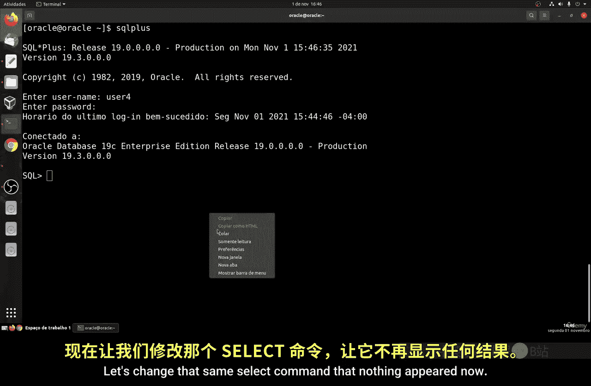

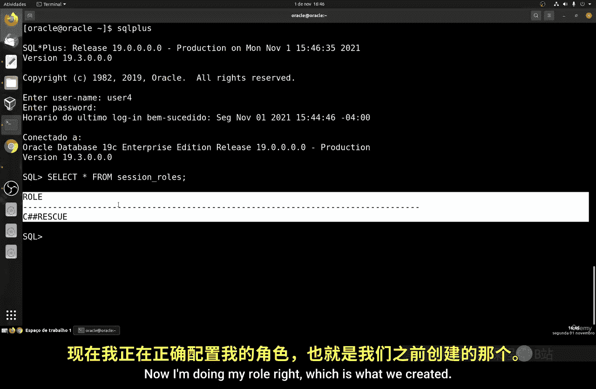

角色（Role）是权限的集合，可以简化权限管理。我们可以创建角色，并将角色授予用户。

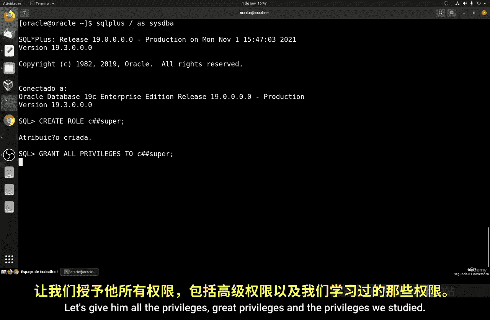

首先，创建一个新角色并授予一些权限：
```sql
CREATE ROLE developer;
GRANT CREATE TABLE, CREATE VIEW TO developer;
```

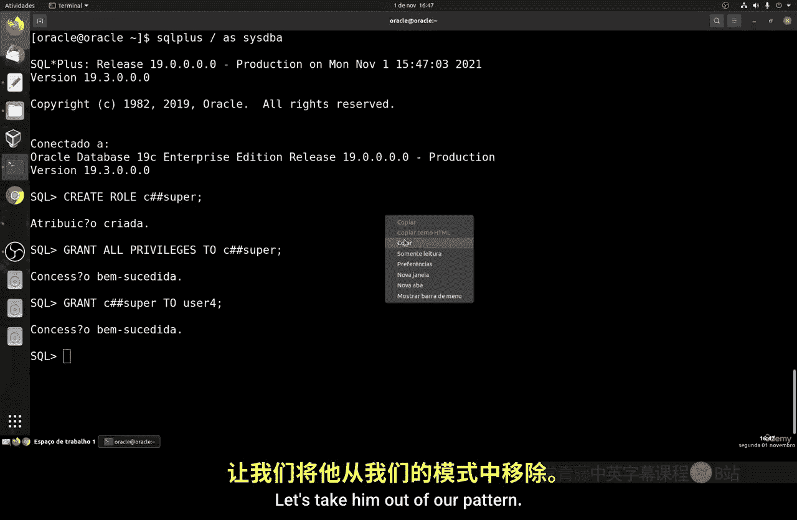

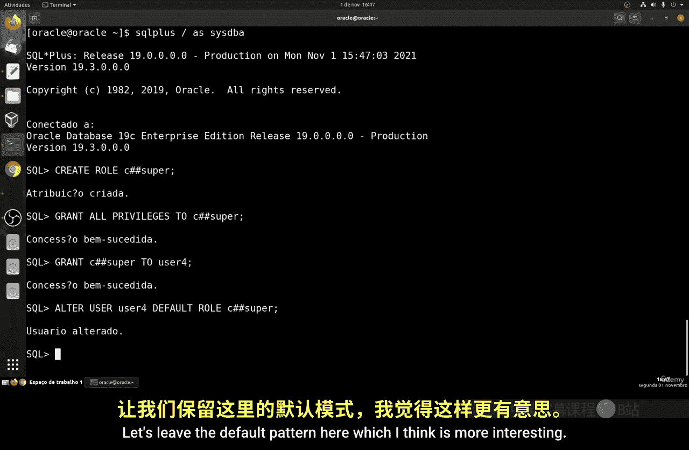

然后，将这个角色授予用户 `user4`：
```sql
GRANT developer TO user4;
```

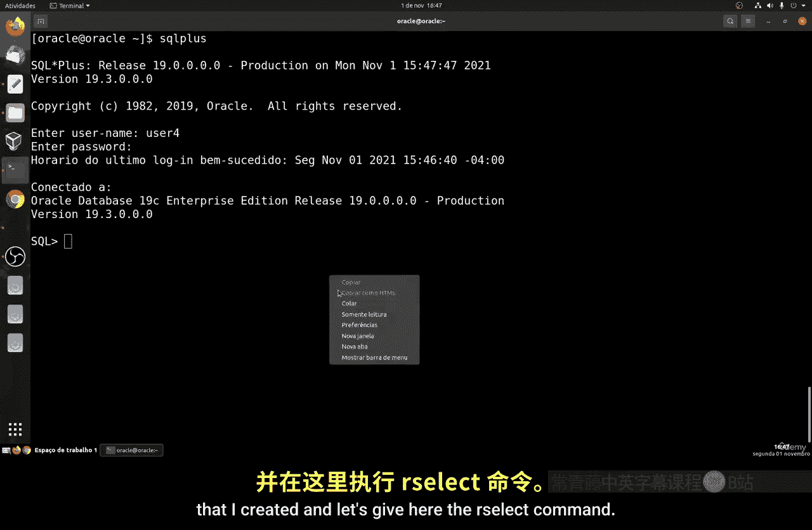

要查看用户被授予了哪些角色，可以执行：
```sql
SELECT * FROM dba_role_privs WHERE grantee = 'USER4';
```

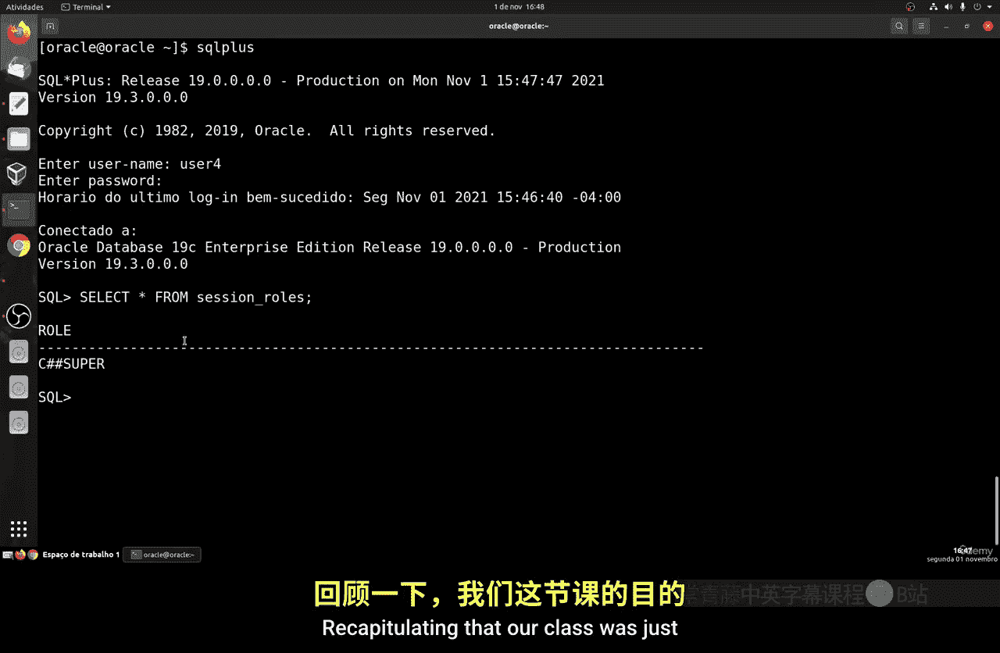

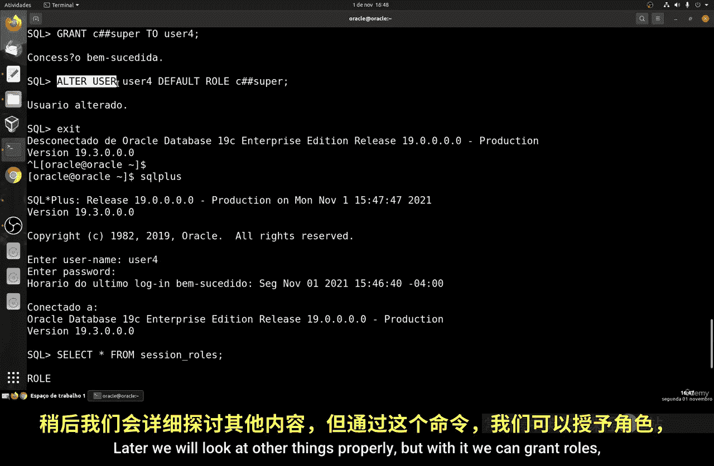

如果需要撤销角色，使用 `REVOKE` 命令：
```sql
REVOKE developer FROM user4;
```

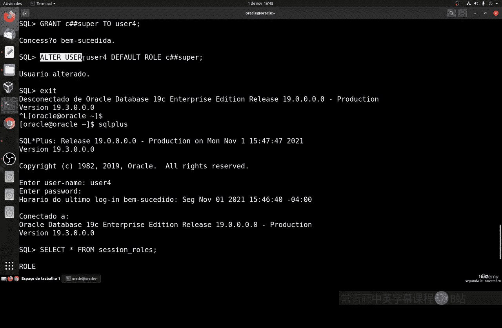

此外，Oracle有一个预定义的强大角色 `DBA`。将其授予用户会赋予其广泛的数据库管理权限。
```sql
GRANT DBA TO user4;
```

## 总结

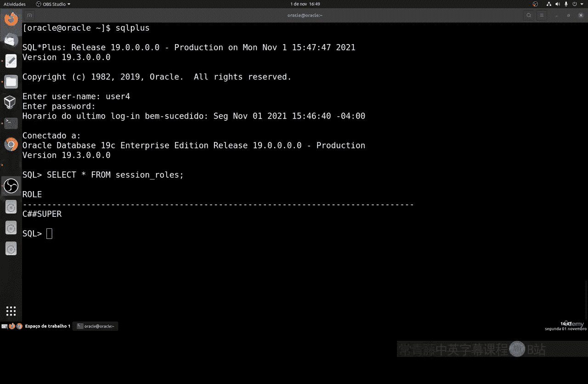

本节课中我们一起学习了如何使用 `ALTER USER` 命令进行多项用户管理操作。我们掌握了如何修改用户密码、锁定与解锁账户、设置密码过期策略。此外，我们还了解了如何通过配置文件和角色来更高效地管理用户权限。将这些命令结合使用，可以极大地简化在多用户环境下的日常数据库管理工作。请务必在您自己的系统中练习这些命令以加深理解。