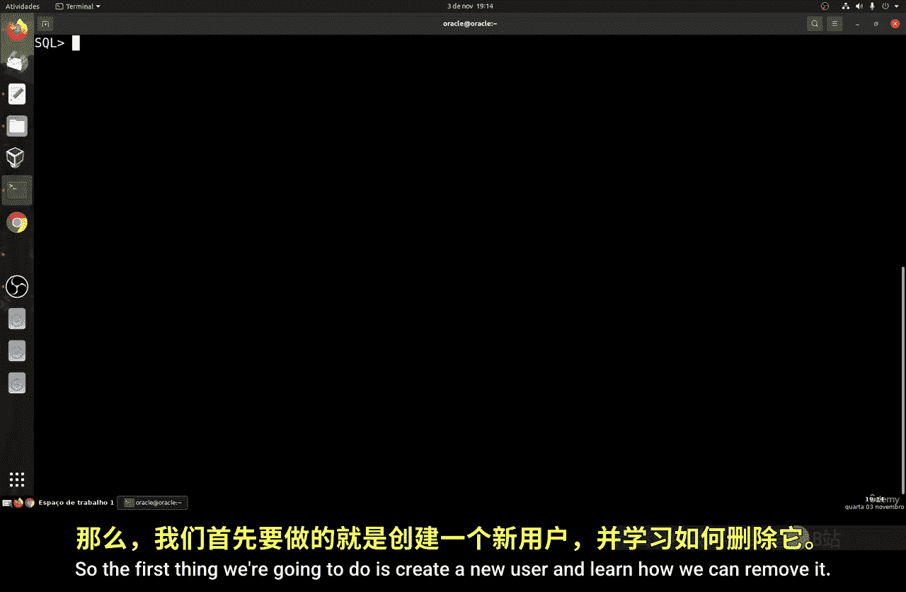
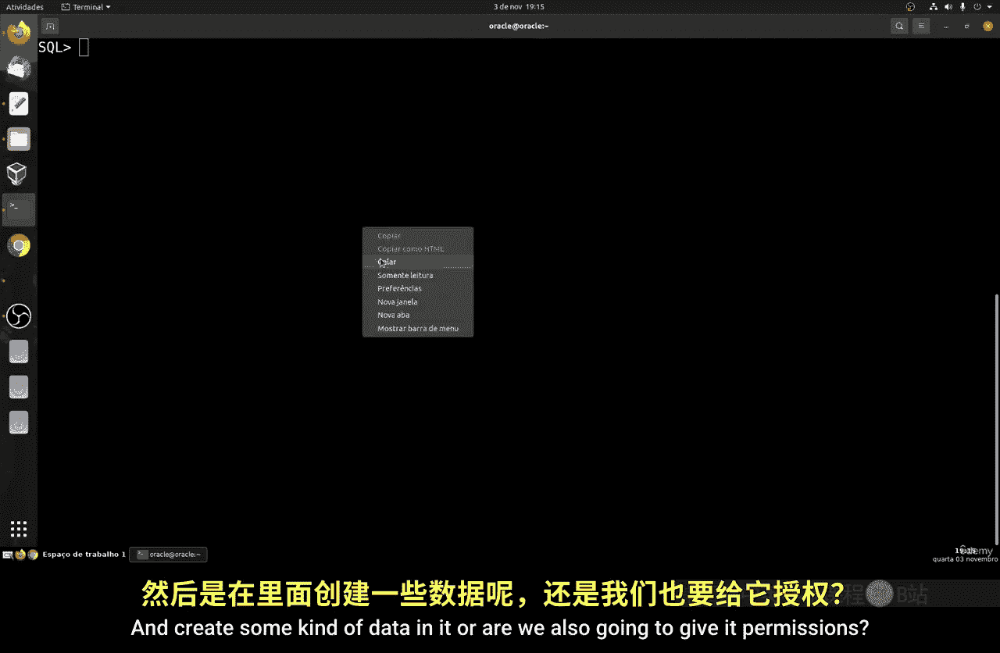
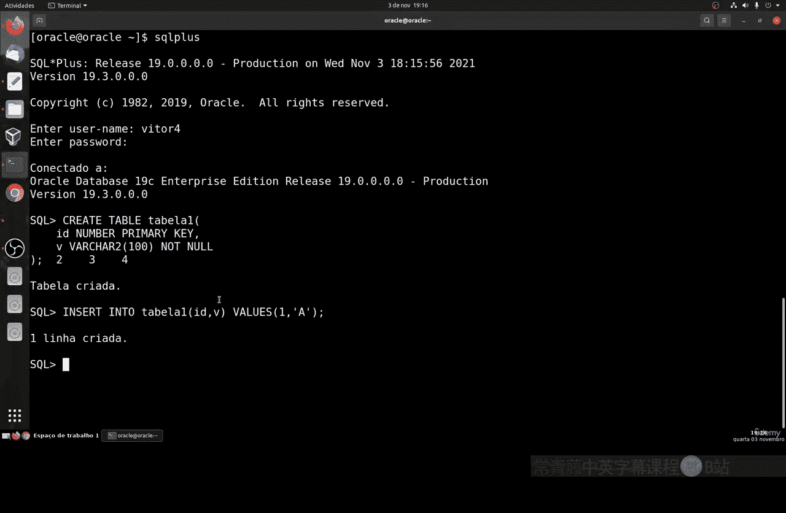
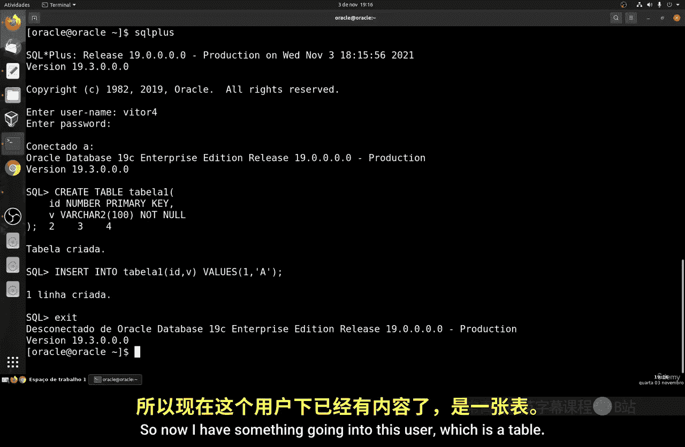
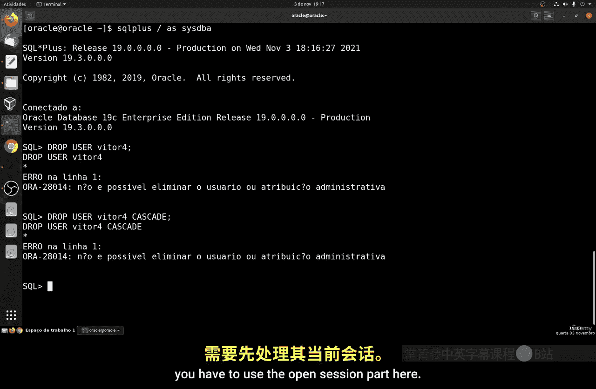
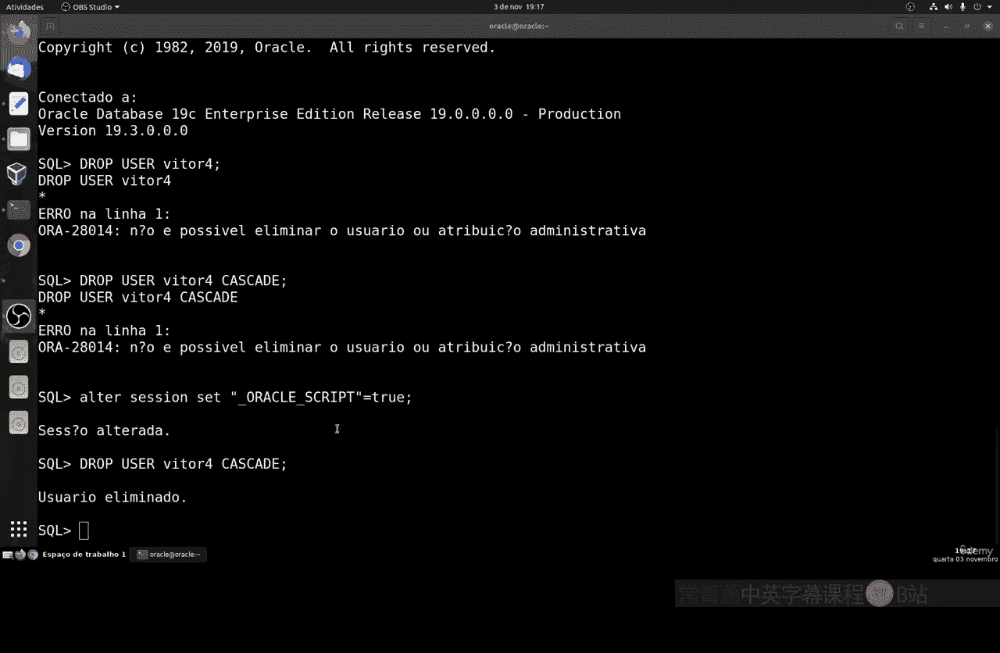
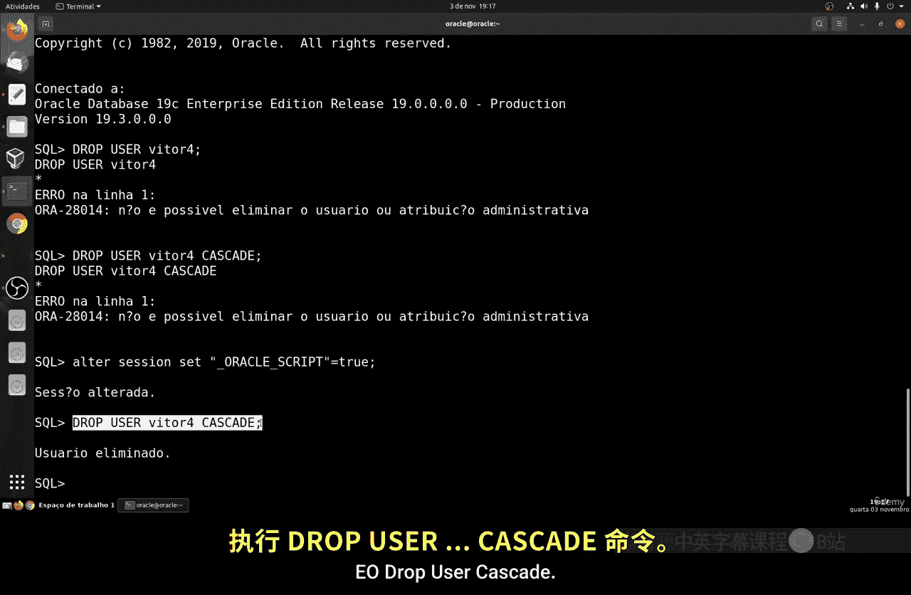
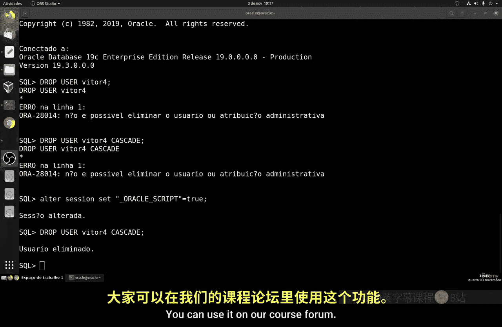

# 151：删除用户 👤

在本节课中，我们将要学习如何在Linux系统中删除一个用户账户。这是一个相对简单的过程，但需要注意一些关键细节，特别是当用户拥有关联的数据或对象时。

## 概述

删除用户是系统管理中的一项常见任务。我们将学习使用 `drop user` 命令，并理解其基本语法和重要选项。特别需要注意的是，如果用户拥有数据库对象（如表），删除操作会变得稍微复杂。

## 命令语法

删除用户的基本命令语法如下：

```sql
DROP USER username;
```

其中，`username` 是你要删除的用户名。这是一个核心命令。

## 删除无关联对象的用户



首先，我们来看一个最简单的场景：删除一个没有创建任何对象的用户。

以下是操作步骤：

1.  创建一个用于测试的新用户（例如 `user5`）。
2.  使用 `DROP USER` 命令直接删除该用户。

这个过程非常直接，因为用户没有“拥有”任何数据库对象。

## 删除有关联对象的用户



上一节我们介绍了删除简单用户的方法，本节中我们来看看更常见的情况：用户拥有自己创建的对象（例如数据库表）。此时直接删除用户会失败。

以下是操作步骤：

1.  创建一个新用户（例如 `vitor4`）并授予其创建表的权限。
2.  切换到该用户，创建一个示例表。
3.  尝试使用 `DROP USER vitor4;` 命令删除用户，此时系统会报错，提示无法删除拥有对象的用户。

为了解决这个问题，我们需要使用 `CASCADE` 选项。

## 使用 CASCADE 选项



当用户拥有对象时，必须使用 `CASCADE` 关键字来强制删除。该选项会同时删除该用户以及其拥有的所有数据库对象。

核心命令格式为：



```sql
DROP USER username CASCADE;
```

例如，要删除拥有表的用户 `vitor4`，应执行：

```sql
DROP USER vitor4 CASCADE;
```

**重要提示**：使用 `CASCADE` 前务必确认，因为此操作会不可逆地删除用户及其所有数据。

## 注意事项与警告



在进行用户删除操作时，有两点必须牢记：



以下是关键注意事项：



*   **切勿删除系统用户**：绝对不要删除如 `SYS` 或 `SYSTEM` 这样的核心系统用户。删除这些用户将导致数据库完全损坏。
*   **确认会话状态**：在删除用户前，请确保该用户没有活跃的登录会话。如果有，需要先终止这些会话。

## 总结



本节课中我们一起学习了Linux（或数据库）中删除用户的方法。我们掌握了 `DROP USER` 命令的基本语法，区分了删除“干净”用户和拥有对象用户的不同场景，并重点学习了使用 `DROP USER ... CASCADE` 来删除后者。请始终谨慎操作，尤其是使用 `CASCADE` 选项和对待系统用户时。