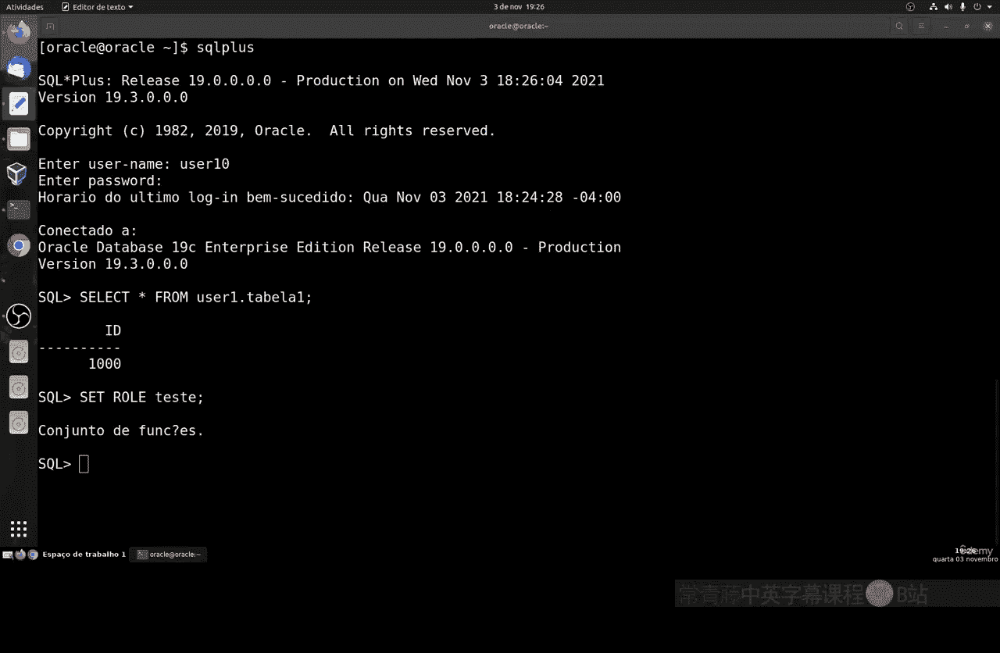
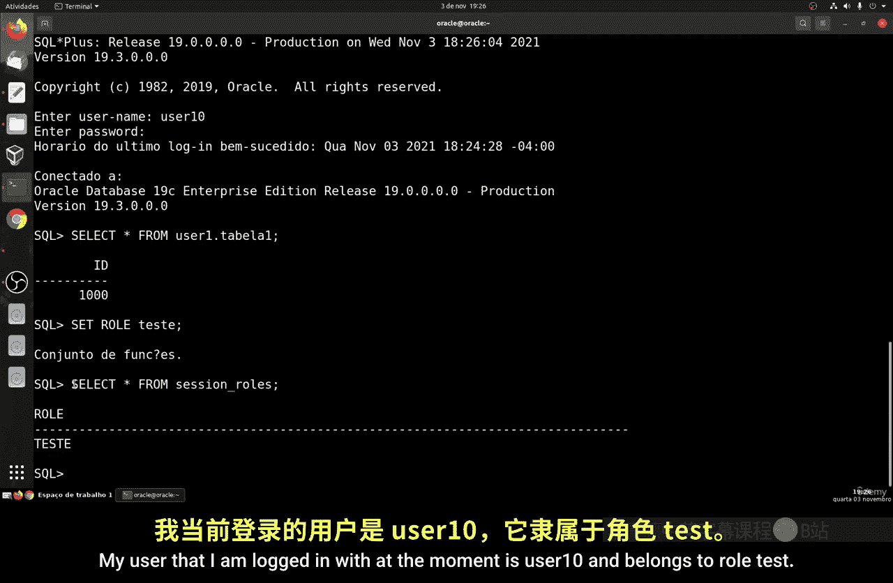
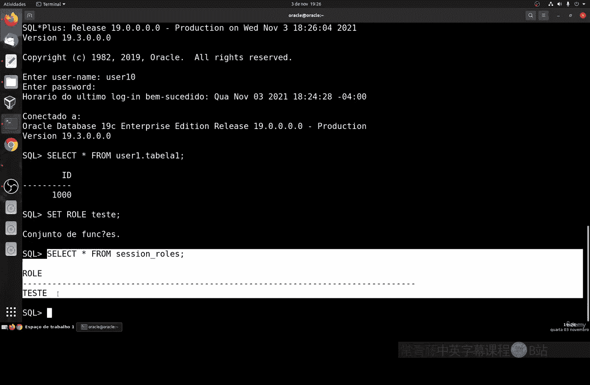
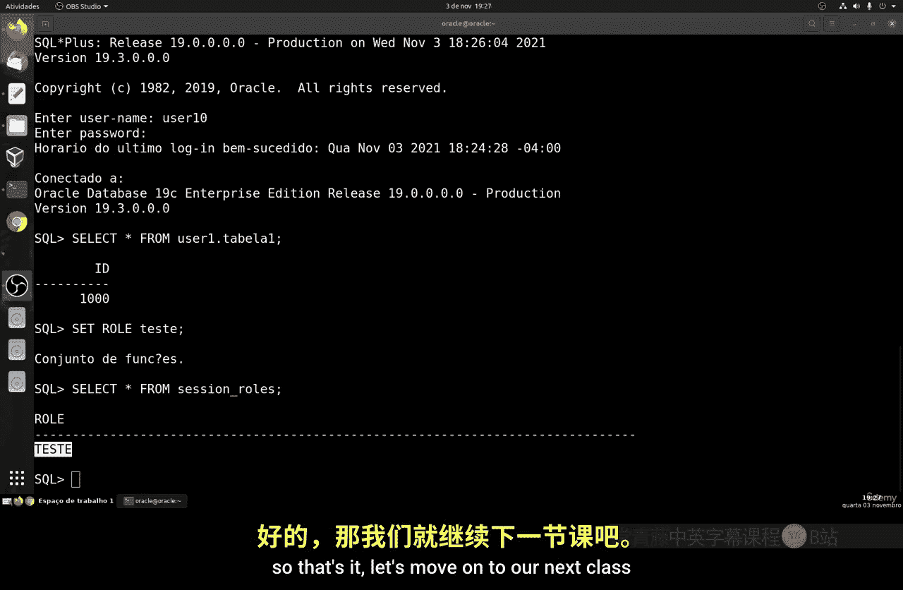

# 152：创建与管理角色 👨‍💻

在本节课中，我们将学习如何在Oracle数据库中创建和管理角色。角色是一种权限集合，可以简化用户权限的分配与管理。

## 概述

角色是Oracle数据库中的一种对象，本质上是一个权限的集合或“职能”。通过角色，管理员可以更高效地管理用户权限，避免为每个用户单独分配权限的繁琐操作。

上一节我们介绍了基本的权限管理，本节中我们来看看如何通过角色来优化这一过程。

## 角色的概念与优势

角色的核心优势在于简化权限管理。其基本逻辑是：将一组权限授予一个角色，然后将该角色授予用户。这样，用户就自动获得了该角色包含的所有权限。

**核心公式**：
`用户权限 = 直接授予用户的权限 + 角色所包含的权限`

这种方法在日常管理中非常实用。例如，公司有众多员工，你可以创建一个“管理员”角色，包含所有高级权限；再创建一个“普通员工”角色，仅包含基本的数据访问权限。当需要调整某类用户的权限时，只需修改对应的角色，所有拥有该角色的用户权限会自动更新。

## 创建角色的语法

创建角色的基本命令是 `CREATE ROLE`。其语法结构如下：

```sql
CREATE ROLE role_name [NOT IDENTIFIED | IDENTIFIED BY password];
```

以下是参数说明：
*   `role_name`：要创建的角色的名称。
*   `NOT IDENTIFIED`：指定启用该角色时不需要密码验证（这是最常用的方式）。
*   `IDENTIFIED BY password`：指定启用该角色时需要提供密码（较少使用）。

## 实践：创建并应用角色

现在，让我们进入实践环节，一步步创建一个角色并将其授予用户。

### 第一步：创建角色

首先，我们创建一个名为 `test_role` 的角色。

```sql
CREATE ROLE test_role;
```

### 第二步：为角色授权

接着，我们将特定的表操作权限授予这个角色。例如，我们将用户 `user1` 的表 `table1` 的查询、插入、更新、删除权限授予 `test_role`。

```sql
GRANT SELECT, INSERT, UPDATE, DELETE ON user1.table1 TO test_role;
```

至此，`test_role` 角色已经拥有了对 `user1.table1` 表的完整操作权限。

### 第三步：创建用户并授予角色

仅有角色还不够，我们需要创建用户并将角色赋予他。首先创建一个新用户 `user10`。

```sql
CREATE USER user10 IDENTIFIED BY abc;
GRANT CREATE SESSION TO user10;
```

现在，我们将 `test_role` 角色授予用户 `user10`。

```sql
GRANT test_role TO user10;
```

### 第四步：验证权限



让我们来验证权限是否生效。以 `user10` 身份登录并尝试查询之前授权的表。





1.  使用 `user10` 登录数据库。
2.  执行查询命令：
    ```sql
    SELECT * FROM user1.table1;
    ```
    此时，查询应该成功执行，因为 `user10` 通过 `test_role` 获得了相应权限。
3.  我们还可以查询当前用户拥有的角色：
    ```sql
    SELECT * FROM USER_ROLE_PRIVS;
    ```
    结果会显示 `user10` 拥有 `test_role` 角色。

通过以上步骤，任何授予 `test_role` 角色的权限都会自动赋予 `user10` 用户，这极大地简化了权限管理工作。

## 总结



本节课中我们一起学习了Oracle数据库中角色的创建与管理。我们了解到角色是一个权限的集合，使用角色可以集中、高效地管理用户权限，避免重复劳动。关键步骤包括：使用 `CREATE ROLE` 创建角色，使用 `GRANT` 为角色授权，最后再将角色授予相应用户。掌握角色的使用，是进行高效数据库安全管理的重要一环。