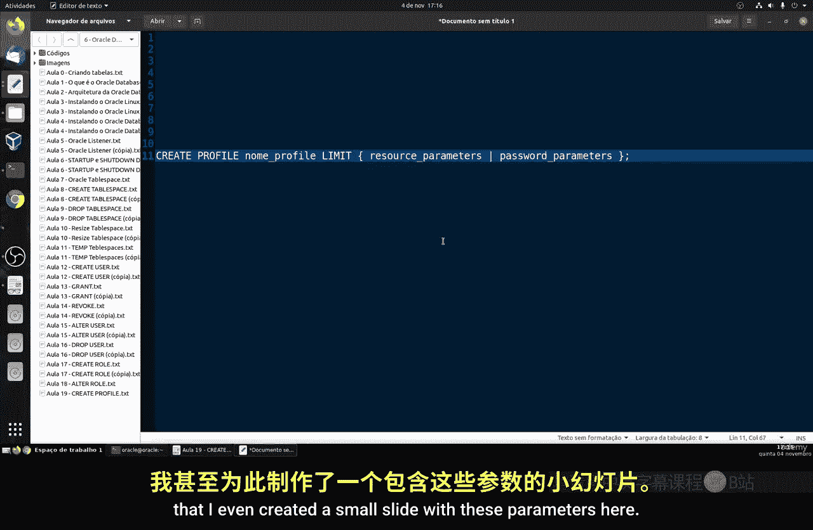
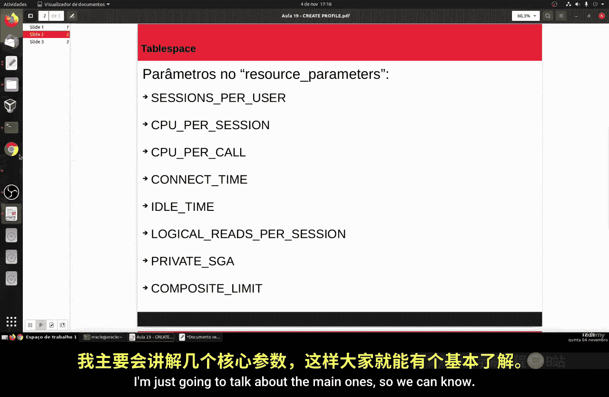
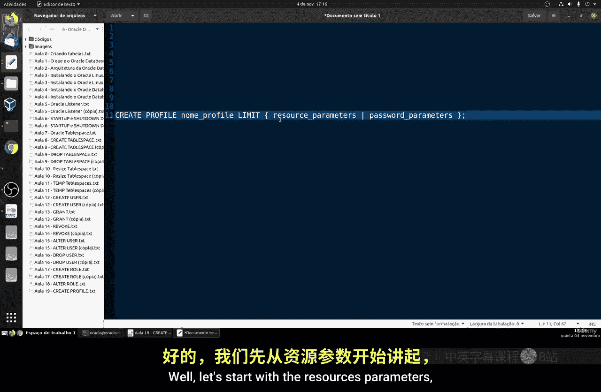
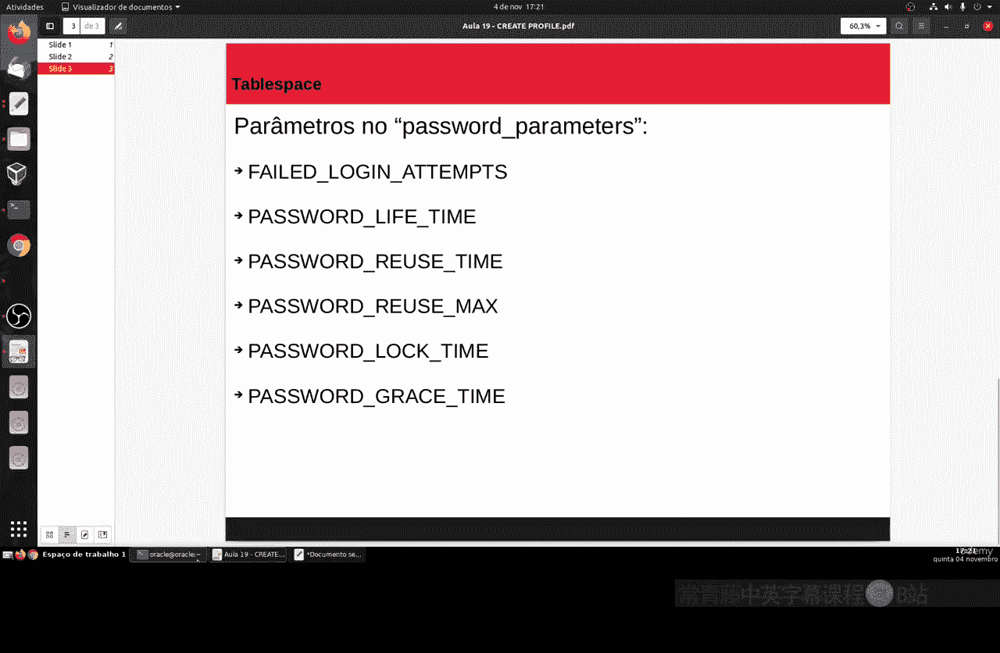
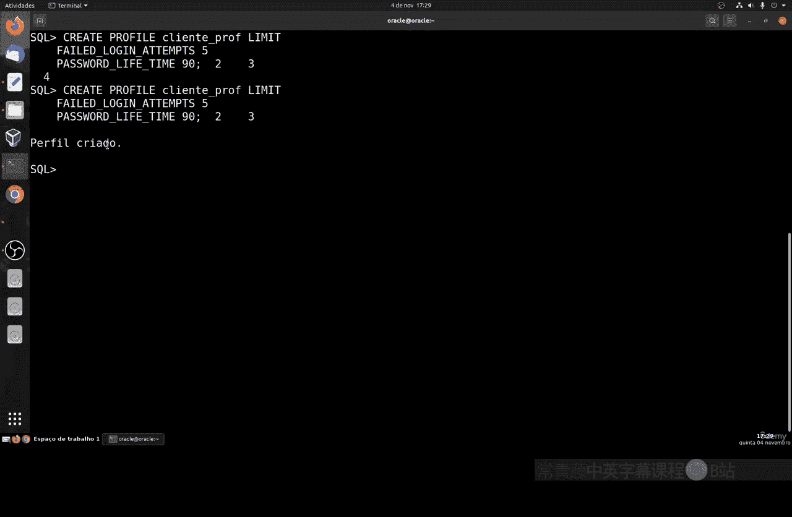

# 154：创建配置文件 👨‍💻

在本节课中，我们将要学习Oracle数据库中的一个重要概念——配置文件。配置文件用于限制数据库用户对系统资源的使用以及管理密码策略。


上一节我们介绍了用户和权限管理，本节中我们来看看如何通过配置文件来精细化控制用户的行为和资源消耗。

## 什么是配置文件？

配置文件是一组施加于数据库用户的限制集合。它主要管理两个方面：
1.  **资源限制**：控制用户对服务器物理资源（如CPU、内存、会话数）的使用。
2.  **密码限制**：管理密码策略，例如密码有效期、失败登录锁定等。



创建配置文件后，需要将其分配给特定的数据库用户，该用户就会受到配置文件中定义的所有规则约束。



## 配置文件语法



创建配置文件的基本语法非常简单，其核心结构如下：

```sql
CREATE PROFILE profile_name LIMIT
    resource_parameters
    password_parameters;
```

以下是创建配置文件时可用的主要参数概述。我将它们分为资源和密码两类，以便于理解。

### 资源参数

资源参数用于限制用户对服务器硬件资源的使用。

*   **SESSIONS_PER_USER**： 限制用户可建立的**同时会话**数量。这是一个重要的安全设置。
*   **CPU_PER_SESSION**： 限制**每个会话**可以使用的CPU时间（单位通常是百分之一秒）。
*   **CPU_PER_CALL**： 限制**每次调用**（如一次查询）可以使用的CPU时间。
*   **CONNECT_TIME**： 限制用户**会话的总连接时间**（单位是分钟）。
*   **IDLE_TIME**： 限制会话因**持续不活动**而允许存在的分钟数。
*   **LOGICAL_READS_PER_SESSION**： 限制**每个会话**可以读取的数据块数量（包括内存和磁盘）。
*   **PRIVATE_SGA**： 限制在**系统全局区**中可为会话分配的私有内存空间大小。

### 密码参数

密码参数用于增强数据库的账户安全策略。

*   **FAILED_LOGIN_ATTEMPTS**： 允许**连续登录失败**的次数。超过此限制，账户将被锁定。
*   **PASSWORD_LIFE_TIME**： 密码的**有效天数**。到期后用户必须更改密码。
*   **PASSWORD_REUSE_TIME**： 密码**可以被重用前**必须经过的天数。
*   **PASSWORD_REUSE_MAX**： 密码**可以被重用前**必须更改的次数。此参数常与 `PASSWORD_REUSE_TIME` 配合使用。
*   **PASSWORD_LOCK_TIME**： 登录失败导致账户**被锁定的天数**。
*   **PASSWORD_GRACE_TIME**： 密码过期后，**提醒用户修改密码的宽限天数**。超过此期限未修改，账户可能被锁定。

> **提示**： 对于生产环境，`FAILED_LOGIN_ATTEMPTS` 和 `PASSWORD_LIFE_TIME` 这类参数几乎是强制性的，它们能有效提升系统安全性。

## 实践操作：创建与分配配置文件

理论部分我们已经了解，现在让我们进入实践环节，学习如何创建和分配配置文件。



首先，我们可以查看数据库中现有的配置文件。默认情况下，Oracle会提供一个名为 `DEFAULT` 的配置文件。

```sql
SELECT profile, resource_name, limit FROM dba_profiles WHERE profile = 'DEFAULT';
```

运行此命令后，你会看到 `DEFAULT` 配置文件的各项参数值。例如，`FAILED_LOGIN_ATTEMPTS` 通常默认为10次，`PASSWORD_LIFE_TIME` 默认为180天。**当创建用户时，若未指定配置文件，系统会自动为其分配 `DEFAULT` 配置文件。**

### 示例1：创建资源限制配置文件

现在，让我们创建一个自定义的配置文件，主要侧重于资源限制。

```sql
CREATE PROFILE test_profile LIMIT
    SESSIONS_PER_USER UNLIMITED
    CPU_PER_SESSION UNLIMITED
    CPU_PER_CALL 3000
    CONNECT_TIME 15;
```

这条命令创建了一个名为 `test_profile` 的配置文件，它定义了以下规则：
*   用户并发会话数：无限制。
*   每个会话的CPU时间：无限制。
*   每次调用的CPU时间：不超过3000单位（例如百分之一秒）。
*   每次会话的连接时间：不超过15分钟。

创建成功后，我们可以将其分配给一个新用户。

```sql
CREATE USER victor6 IDENTIFIED BY mypassword PROFILE test_profile;
```

创建用户 `victor6` 并指定其使用 `test_profile` 配置文件。之后，我们可以验证分配是否成功：

```sql
SELECT username, profile FROM dba_users WHERE username = 'VICTOR6';
```

### 示例2：创建密码策略配置文件

接下来，我们创建一个侧重于安全密码策略的配置文件。

```sql
CREATE PROFILE client_profile LIMIT
    FAILED_LOGIN_ATTEMPTS 5
    PASSWORD_LIFE_TIME 90;
```

这条命令创建了 `client_profile` 配置文件，它定义了更严格的安全规则：
*   连续登录失败尝试：最多5次，超过则锁定账户。
*   密码有效期：90天，到期后必须更改。

---



本节课中我们一起学习了Oracle配置文件的核心概念与创建方法。我们了解到，配置文件是管理用户资源消耗和密码安全的关键工具，通过 `CREATE PROFILE` 命令可以灵活定义资源与密码规则，并使用 `CREATE USER ... PROFILE ...` 或 `ALTER USER ... PROFILE ...` 命令将其分配给用户。合理使用配置文件，是进行精细化数据库管理和提升系统安全性的重要步骤。