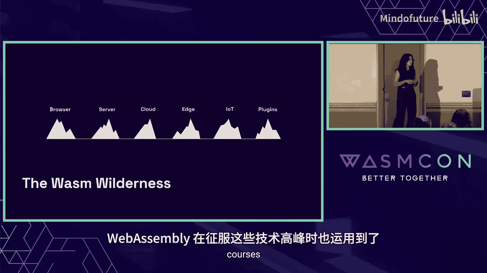
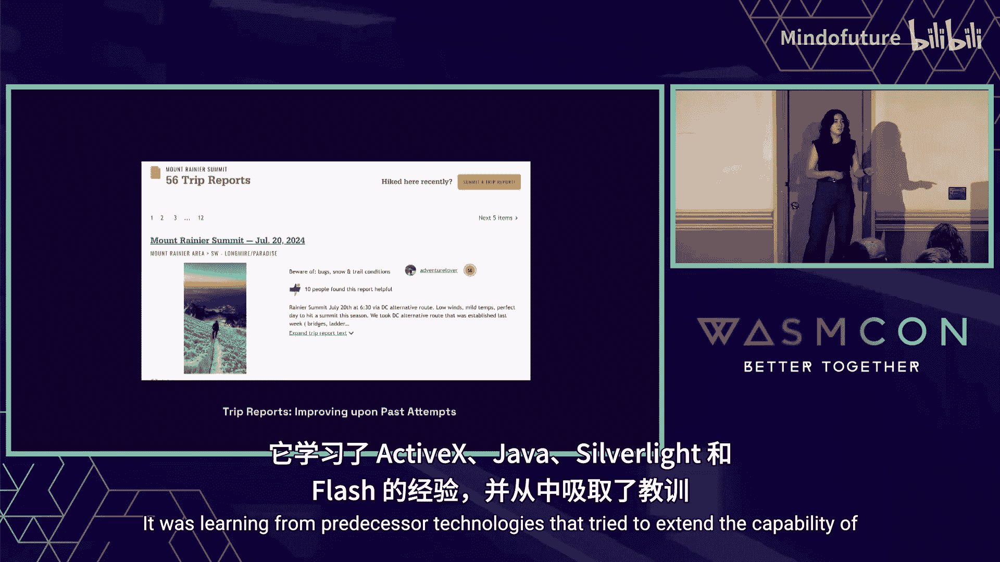
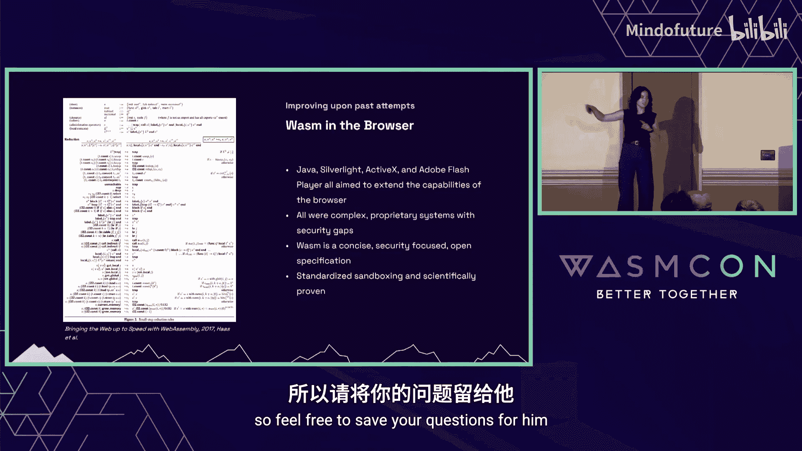
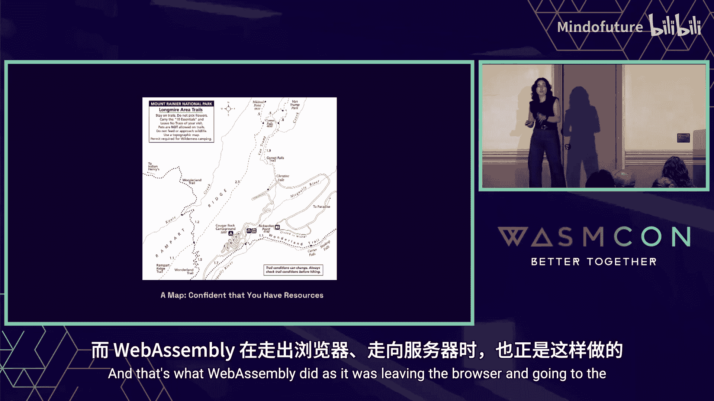
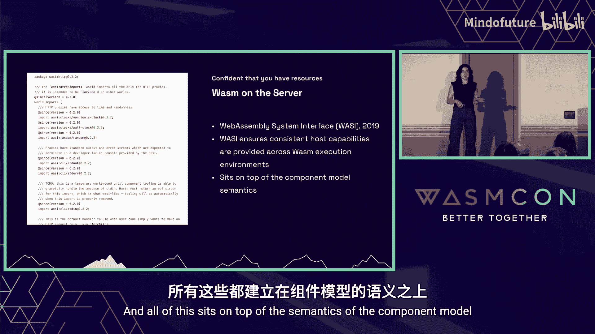
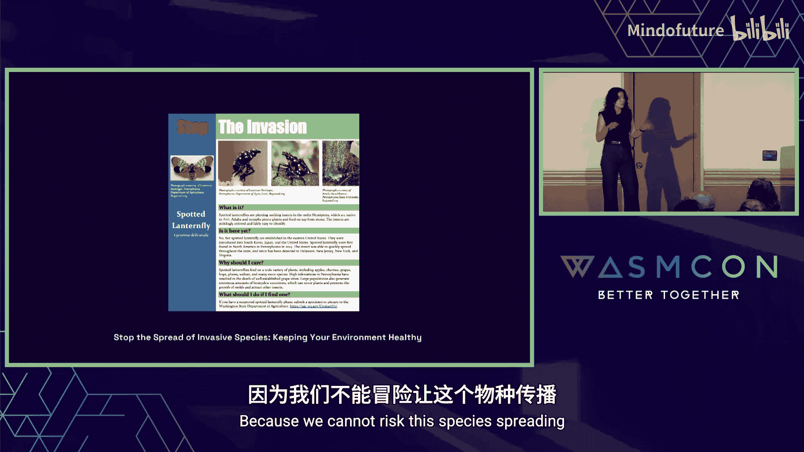
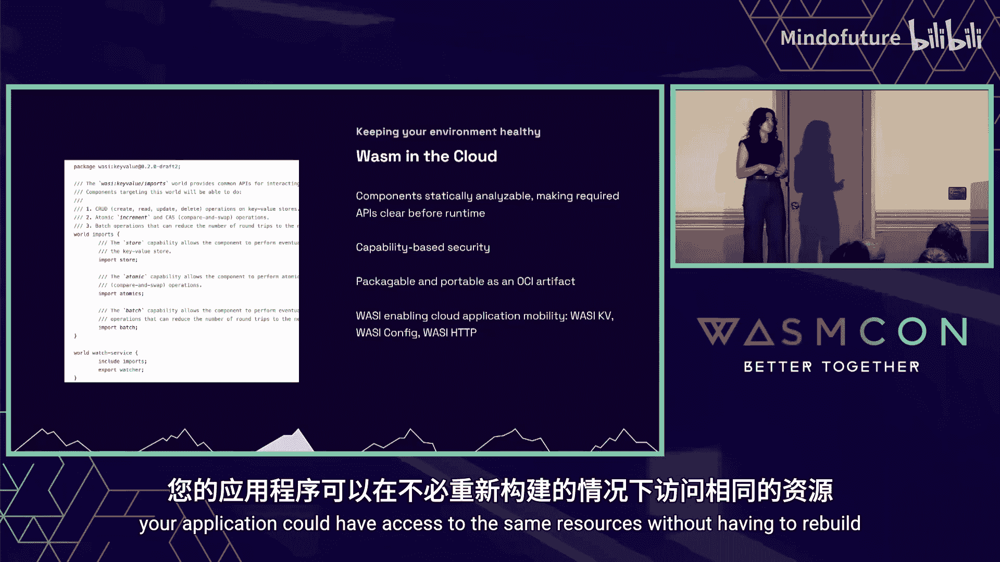
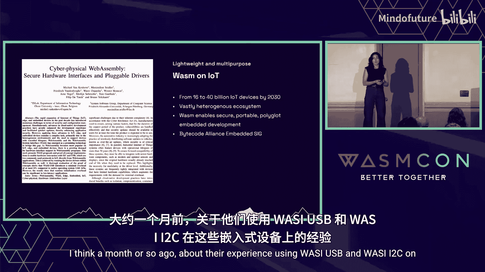

# 002：我们已抵达的技术高峰 🏔️


在本节课中，我们将跟随 Kate Goldenring 的视角，探索 WebAssembly 如何借鉴登山运动的智慧，成功攀登一系列技术高峰。我们将看到 WebAssembly 如何从前人经验中学习、如何为新的环境做好准备、如何确保安全与隔离、如何高效利用资源、如何成为通用工具，以及如何增强现有生态系统。

---

## 学习前人经验 📚

在攀登一座山峰之前，登山者会研究前人的“登山报告”，学习他们的成功与失误，以便规划更成功的路线。WebAssembly 也采取了同样的策略。

WebAssembly 研究了早期试图扩展浏览器能力的技术，如 ActiveX、Java、Silverlight 和 Flash。它从这些技术的不足中吸取了教训，特别是它们在安全性方面的缺陷——这些技术最终成为了恶意软件攻击的载体，未能成功登顶。



因此，WebAssembly 规范的设计者将安全性作为核心考量。他们不仅专注于安全设计，还将其打造为一个开放标准，而非专有系统。为了吸引更多人参与，他们力求规范简洁明了。

以下是一页纸的 WebAssembly 核心语义规范，理论上，理解它就能编写一个解释器：
```
(module
  (func $add (param $lhs i32) (param $rhs i32) (result i32)
    local.get $lhs
    local.get $rhs
    i32.add)
  (export "add" (func $add))
)
```
这份规范经过科学验证，能够在沙箱中安全地隔离执行代码。

---

## 携带地图进入新领域 🗺️



进入荒野时，携带地图至关重要。你需要确保拥有所需的资源，如庇护所、水和前进的路径。当 WebAssembly 离开浏览器，迈向服务器领域时，它也携带了自己的“地图”——**WASI**。



WASI 是 WebAssembly 系统接口。它确保了 WebAssembly 组件能够访问服务器上的资源，例如文件系统、I/O 和 HTTP。通过 WASI，开发者可以编写能够接收和发送 HTTP 请求的 WebAssembly 服务。

更重要的是，只要 WebAssembly 运行时实现了 WASI，同一个应用程序就可以在任何运行时上执行，成为一个真正的 WebAssembly 服务。这一切都建立在**组件模型**的语义之上，这是另一个开放标准。



---

## 防止“入侵物种”扩散 🚫



作为一名优秀的户外活动者，阻止入侵物种的扩散非常重要。在云计算领域，平台工程师们也秉持着“如有疑问，立即清除”的原则。他们不会允许任何未经严格隔离的程序在多租户云环境中运行。

WebAssembly 非常擅长防止“入侵物种”扩散，因为它具备**安全的沙箱**和**基于能力的安全模型**。它比当前云环境中更普遍的容器隔离方式更加安全，但同时保持了相同的可打包性。



WebAssembly 组件可以像容器一样，被打包成 **OCI 镜像**。CNCF 内的 WebAssembly 工作组在过去一年中致力于标准化 WebAssembly OCI 镜像的布局格式。现在，所有 WebAssembly 运行时都能理解相同的 OCI 格式，并在任何云平台上执行你的组件。

此外，WASI 正在为云原生的 WebAssembly 应用提供特定接口。除了服务器端已知的 HTTP，还有正在开发的 **WASI Key-Value**（用于访问缓存）和 **WASI Config**（用于访问密钥）。这意味着，跨云平台，你的应用无需重建就能访问相同的资源。

---

## 高效利用能量的“休息步”法 ⚡



攀登高山非常耗费体力。登山者会使用一种名为“休息步”的技巧：要么积极移动，要么静态站立。其核心思想是，只在向目标前进时才消耗能量。

WebAssembly 非常擅长这种“休息步”。它的独特之处在于，作为一种隔离的执行代码形式，它能够**瞬时启动**。实例化并启动一个 WebAssembly 模块只需不到一毫秒。


这意味着，当你不需要使用它时，可以将其销毁；当需要时，又能立即将其启动，真正实现**缩容到零**。这对于资源受限的边缘计算环境尤为重要，它为在边缘构建安全、多租户的无服务器平台打开了大门。

---

## 轻量且多用途的工具 🧰


为了节省登山时的体力，另一个方法是尽可能减轻负重。登山者会优化装备，选择**多用途的装备**，而不是携带一堆功能单一的物品。

WebAssembly 正是一个轻量级、多用途的出色工具。没有哪个领域比 **IoT** 更需要多用途性。目前已有数十亿设备在线，预计到 2030 年将超过 400 亿台。这个领域高度异构，存在不同的板卡、平台和 SDK，成为一个通用的嵌入式开发者非常困难。


有时，开发者甚至被限制只能使用 C 等系统语言。而 WebAssembly 的作用是：只要能在设备上放置一个 WebAssembly 运行时（例如精简版的 `wasm-micro-runtime`），你就可以在上面运行 WebAssembly 应用，并且可以用任何能编译成 WebAssembly 的语言来编写它。

Bytecode Alliance 内的嵌入式特别兴趣小组正在致力于标准化这个异构的生态系统，他们正在创建针对 IoT 空间的 WASI 接口。

---

## 增强现有体验 ✨



最后一个重要的登山原则是：充分利用目的地。一个湖泊可能因为其周边可进行的活动（如攀登邻近的山峰、露营、水上活动）而变得极具吸引力。

WebAssembly 同样非常擅长**增强现有体验**。它是一种为现有架构提供插件的通用机制。这一切始于浏览器，WebAssembly 提供了一种与语言无关且安全的方式来扩展浏览器功能。

现在，我们已经在各种应用中看到了这一点：
*   **Envoy 扩展**：提供了使用 WebAssembly 扩展 Envoy 网关的方法，是较早的采用者。
*   **Shopify 函数**：现在你可以用任何语言通过 WebAssembly 来编写，以扩展结账体验。
*   **代码编辑器**：如 VS Code 和新近发布的 Zed 编辑器，也允许使用 WebAssembly 来编写扩展。


---

## 总结

本节课中，我们一起穿越了 WebAssembly 的“技术荒野”，探索了它成功登顶的六座高峰。回顾这段旅程，支撑我们攀越所有这些高峰的基石，正是**开放标准**。

我们从将 WebAssembly 带入浏览器的核心规范开始，接着是使其得以离开浏览器的 WASI，然后是让我们能为模块定义更高级类型的组件模型，最后是统一了 WebAssembly 打包方式的 OCI 镜像规范。

我们可以想象这样一个未来：应用程序不再局限于某一个技术高峰或领域。得益于其**可移植性**和**安全性**，以及统一的运行时，我们的应用可以伴随我们从浏览器无缝迁移到边缘。而这一切，都依赖于这些开放标准的持续演进。


感谢你与我一同完成这次 WebAssembly 荒野探索之旅。