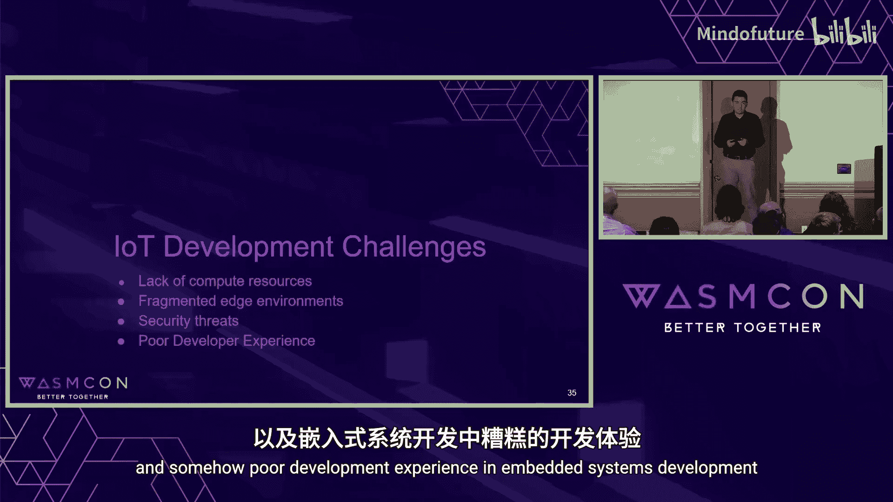
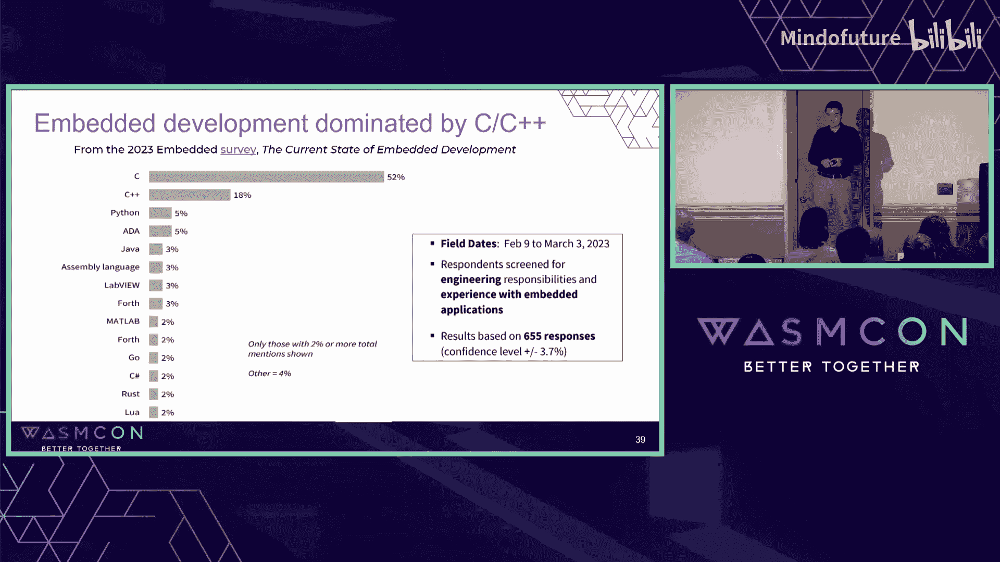
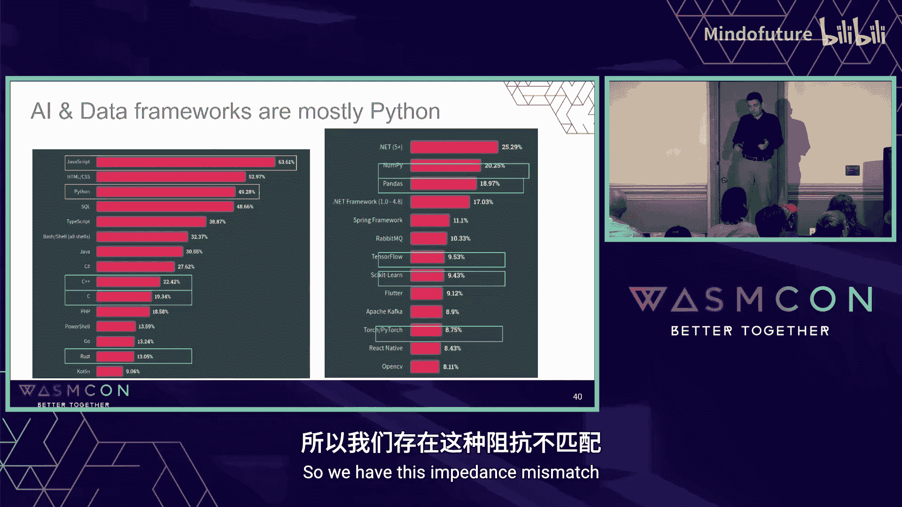
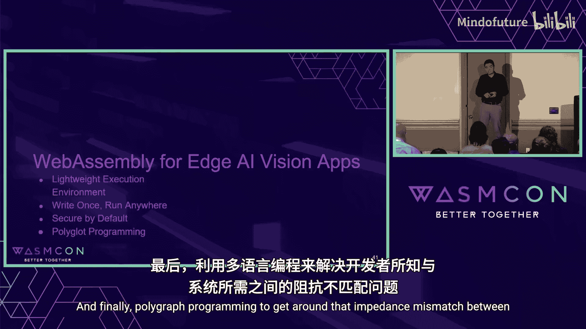
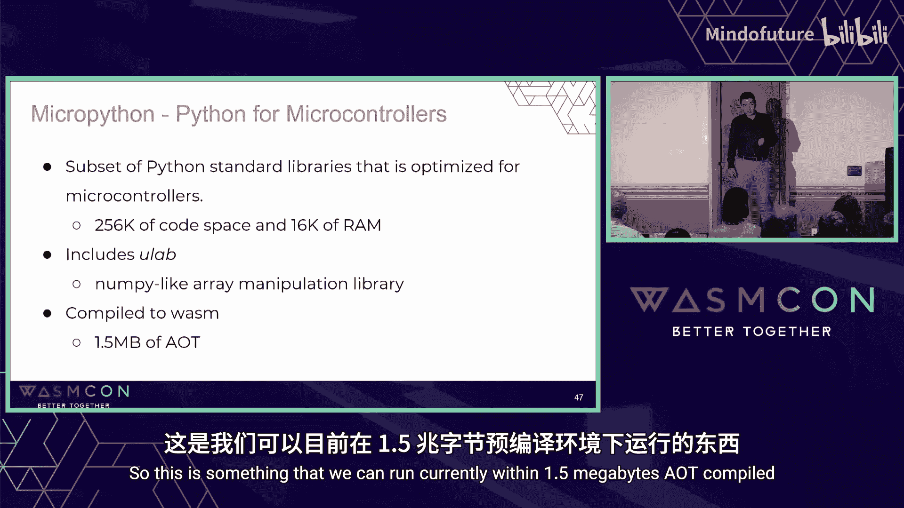
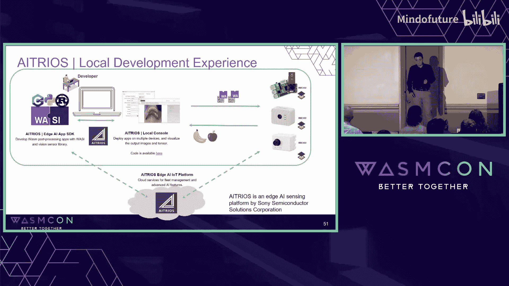

# 003：使用Wasm构建安全高效的传感应用

在本节课中，我们将要学习WebAssembly（Wasm）如何解决边缘计算和计算机视觉应用开发中的关键挑战，包括资源限制、环境碎片化、安全威胁和开发体验问题。我们将探讨Wasm的轻量级、安全隔离和跨平台特性如何为物联网和嵌入式视觉应用提供理想的解决方案。

## 边缘AI与计算机视觉的需求与挑战

当前，对边缘AI和计算机视觉的需求正在快速增长。这并不令人意外。问题是，由于需求增长过快，资源消耗变得非常巨大。如果将大量视频数据传输到云端并在那里进行所有的计算机视觉处理，这种模式是不可扩展的。因此，业界正努力将计算推向边缘。

当我们将计算推向边缘时，会面临一系列开发挑战。你可能对这些挑战非常熟悉：计算资源匮乏、边缘环境碎片化、安全威胁，以及嵌入式系统开发体验不佳。

## 边缘设备面临的开发挑战

以下是边缘设备开发中遇到的主要问题：

*   **资源高度受限**：许多物联网设备或微控制器的资源极其有限。虽然从历史标准看，其内存容量已相当可观，但与云原生世界中丰富的资源相比，这些设备的资源仍然微不足道。
*   **环境高度碎片化**：在物联网和嵌入式开发领域，存在多个层面的碎片化，例如操作系统、硬件架构、指令集架构和通信协议。WebAssembly有助于缓解其中一些问题。
*   **缺乏内存隔离**：在这些环境中，缺乏内存管理单元（MMU）和内存保护机制是一个真正的担忧。而通常很大比例的安全漏洞都与内存问题相关，这使得物联网环境非常脆弱。
*   **开发语言不匹配**：嵌入式开发主要由C/C++语言主导。然而，如今许多AI和数据框架主要使用Python。大量Python开发者不一定愿意深入C/C++世界来完成他们的工作，这就产生了阻抗不匹配。

上一节我们介绍了边缘设备开发面临的多重挑战，本节中我们来看看WebAssembly如何为解决这些问题提供方案。

## WebAssembly作为解决方案

WebAssembly为边缘和视觉应用可以解决上述部分问题。

*   **轻量级执行环境**：我们使用WAMR（WebAssembly Micro Runtime）。其“一次编译，到处运行”的理念，至少在一定程度上减轻了移植的开发负担。
*   **默认安全与隔离**：这是一个非常重要的方面。在WebAssembly环境中，我们可以强制执行内存保护，并且可以相对容易地限制对不应使用的接口的访问。
*   **支持多语言编程**：特别是Python，可以绕过开发者所掌握技能与系统需求之间的不匹配。WebAssembly社区对Python的兴趣正在快速增长。

## 安全模型与Python运行时

WebAssembly的安全模型非常适合物联网。我们可以利用其内存保护功能并限制接口访问，还可以在运行前进行更多的静态分析。

关于Python编程，我们已做了大量工作，以在WASM沙箱环境中高效运行Python。我们尝试了多种方法，包括转译、完整运行CPython，或将CPython代码直接编译为WebAssembly。目前，我们正在使用MicroPython，并将其运行在WAMR沙箱内。在非常受限的环境中，我们并不需要完整的通用Python，只需要类似NumPy的功能就足够了。目前，我们可以在AOT编译后约1.5MB的空间内运行它，这对于某些微控制器来说仍然很大，但我们正在取得进展。

了解了WebAssembly的核心优势后，让我们看一个具体的应用案例，了解这些技术如何整合到实际产品中。

## 实际应用案例：索尼智能视觉传感器

将上述技术整合起来，索尼开发了智能视觉传感器IMX500。它基本上是将数字信号处理器（DSP）、内存和实际像素单元集成在同一个封装内。我们可以对它进行编程，以运行AI模型。

我们将这项技术用于我们的物联网设备中。我们构建了一个设备栈，其中WebAssembly是栈的关键部分，使我们能够在微控制器上的物联网设备中运行应用程序。

在我们的本地开发环境中，开发者可以用Python开发应用程序，在将其上传到Aitrios云平台进行大规模设备管理和部署之前，先在本地设备上部署、监控和测试它。

## 跨平台兼容性与总结

作为前瞻，我们可以在不同的设备上运行相同的应用程序，例如树莓派或基于ESP32的微控制器摄像头。

本节课中我们一起学习了WebAssembly如何为边缘计算和计算机视觉应用提供一个安全、高效且开发友好的解决方案。我们探讨了它如何应对资源限制、环境碎片化和安全挑战，并通过支持Python等语言改善了开发体验。WebAssembly的轻量级和可移植性使其成为连接现代AI开发与嵌入式系统需求的理想桥梁。