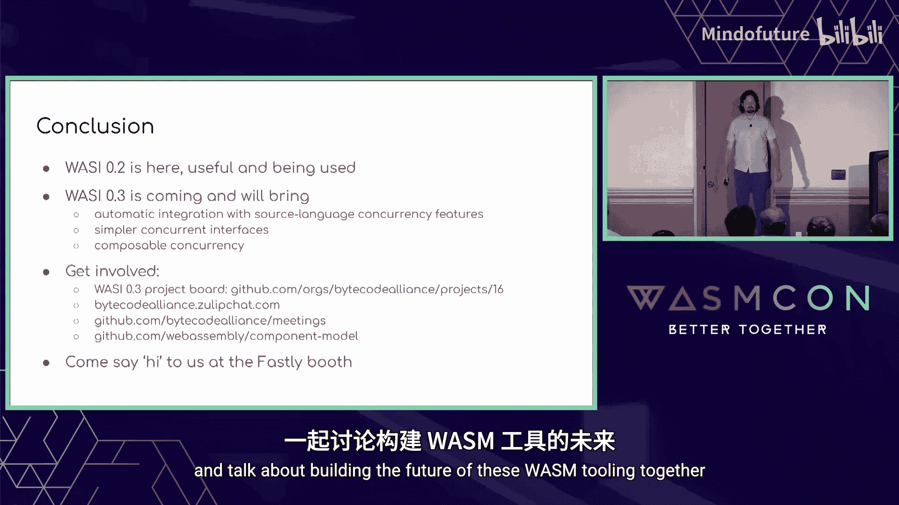

# 004：从 WASI 0.2 到 0.3 及未来的增量扩展

在本节课中，我们将要学习 WebAssembly 系统接口（WASI）的核心概念、发展历程以及从 0.2 版本向 0.3 版本演进的关键特性。我们将重点关注 WASI 如何作为 WebAssembly 与外部世界交互的模块化接口，并深入探讨即将到来的异步支持如何改变我们编写和组合组件的方式。

## 什么是 WASI？🤔

WASI 代表 WebAssembly 系统接口。简单来说，WASI 是 WebAssembly 与外部世界之间一系列可虚拟化的模块化接口集合，目前正处于标准化进程中。

WASI 是 WebAssembly 的自然补充。WebAssembly 抽象了各种物理 CPU，允许我们编写可移植的 WASM 代码。但是，当这些可移植的 WASM 代码需要与外部世界通信时，就需要 WASI。

那么，什么是“外部世界”呢？这个概念有很多不同的视角。最初，外部世界指的是传统操作系统提供的接口，例如文件系统、套接字、随机数和时钟。但随着 WASM 被应用到更多场景，我们的视角必须拓宽。

当 WASM 进入云原生领域时，所需的原始接口看起来有所不同，更侧重于 HTTP、配置存储、键值存储、Blob 存储、消息传递等。当希望 WASM 与更多不同类型的硬件交互时，我们意识到需要新的接口来与 GPU、神经网络、USB、I²C、加密设备等通信。随着 WASM 嵌入到更多环境中，就需要更多的接口。

这说明了我们不能期望一个主机实现所有这些接口。主机只需要实现对其有意义的模块化子集。因此，WASI 是一个模块化接口的集合。

这些接口在设计上也是可虚拟化的。因为当 WASM 与外部世界通信时，有时我们希望外部世界本身就是 WASM。例如，用较低级别的接口（如 WASI 套接字）来实现较高级别的接口（如 WASI HTTP）。

我们正在标准化这些接口，以便能够构建一个共享工具生态系统。这让我们能够分摊在自动化那些繁琐、低级别、易出错且涉及安全性的工作时所需的大量精力，否则我们将不得不重复发明轮子。

这也让我们能够将这些接口上游集成到流行的语言工具链和其他我们希望内置这些接口的流行工具中。如果我们只是某个特定项目或公司特有的接口，并试图将它们上游化，我们可能会被要求先去制定标准。有了标准，我们才能真正将这些内容上游化。

这让我们能够将精力集中在构建平台独特价值上，而不是重复地发明基础功能。标准还让我们能够汇集来自不同背景的深厚经验，最终带来更高质量的成果。

## WASI 的发展历程与发布节奏 📅

我们尚未完成标准化，这是一个正在进行的过程。我们正在实践规范和实现的增量协同开发，因为历史经验告诉我们，如果只做其中一项而忽略另一项，结果往往不佳。我们通过一系列版本发布来实现这一点。

你可能已经注意到，WASI 确实在持续发布。上一次主要版本是今年一月的 0.2 版，这是一个包含重要内容的重大发布。它包含了组件模型，该模型定义了一个可组合的、语言中立的代码单元。它包含了 WIT，这是我们用于组件的接口定义语言。

使用 WIT，我们定义了一系列接口，共同构成了 CLI 命令世界，这为我们提供了一个类似 POSIX 的命令执行环境。我们还定义了一个 HTTP 代理世界。如果你将这些世界看作维恩图，它们会相交，因为它们都提供某些接口，如时钟和随机数。但 HTTP 代理世界自然希望以原生 HTTP 方式与外部世界通信，而命令世界则希望使用文件系统和套接字。

这是 0.2 版本，一个重大发布。我们庆祝之后休息了一下，然后继续工作。八月，我们发布了 0.2.1。这个版本的主要特性实际上是发布流程本身，以及支持平稳进行次要版本发布所需的所有工具和运行时支持。我们还为 WIT 添加了一些不稳定和同步门控功能，以帮助我们控制新功能的推出。

然后在八月稍晚，我们发布了 0.2.2，增加了一些 OCI 集成功能，这是非常令人兴奋的内容，我稍后会再提到。此外，还增加了第三个弃用门控。我们计划在十二月发布 0.2.3，希望其中能包含 WASI 键值存储提案，该提案目前已经投入了大量工作。

你在这里看到的模式是，我们计划每两个月发布一次，采用类似火车模型的发布方式。当功能准备就绪时，它们就进入该次发布；如果没准备好，可以等待下一班“火车”。

虽然事情发生的具体顺序尚不明确，但围绕 WASI 配置、Blob、消息传递、加密和 WebGPU 有很多令人兴奋的工作正在进行。利用所有这些新接口，我们可以定义一个新的、更大的云世界，它将是之前维恩图中代理世界的超集。所以有很多令人兴奋的内容。

## WASI 0.3：原生异步支持 ⚡

与所有这些工作并行的是 0.3 版本发布，计划在明年上半年进行。WASI 0.3 中的主要特性是原生异步支持。

请不要惊慌，这不是像 0.1 到 0.2 那样的大变化。这不是一个破坏性变更。我们讨论的是对现有 0.2 组件模型二进制格式的类型和选项进行增量添加。因此，所有 WASI 0.2 组件在 WASI 0.3 世界中仍然是有效的组件。

我们将在推出期间同时支持 WASI 0.2 和 WASI 0.3 接口。但最终，利用 WASI 接口的可虚拟化特性，我们将能够用 WASI 0.3 来虚拟化 WASI 0.2 接口。这样，我们就可以从主机中移除 WASI 0.2，减少我们可信计算基的大小，同时保持所有现有的 WASI 0.2 代码正常工作。这正是虚拟化的全部意义所在。

我们实现原生异步支持的目标是：自动与源语言并发特性集成、简化并发接口，并使并发组件可组合。让我们深入探讨这三个目标。

### 目标一：语言集成

在 WASI 0.2 中，我已经可以声明一个函数 `load`，例如从一个名称字符串加载模型。我可以用各种语言的各种同步函数来实现它。但从 0.3 开始，我可以用异步函数来实现它。例如，在 C# 中，我可以将 `load` 实现为一个返回异步任务的函数。因为它是一个异步函数，它可以在返回新模型之前等待一个阻塞操作。

然后，我可以从 Python 导入这个 `load` 函数，Python 可以将其作为协程导入。这意味着在 Python 中，我可以使用 `asyncio` 来生成多个并发的 `load` 任务，然后再收集它们。这样，我现在就可以相当自然地进行跨语言并发调用，当第一个 `load` 在这里阻塞时，第二个就可以取得进展。

我可以对所有在 0.2 中能表达的函数签名都这样做。但我也可以使用新的 `future` 和 `stream` 类型来表达更多的函数签名。例如，我可以编写一个 `transform` 函数，将 `stream<bytes>` 转换为 `stream<bytes>`。

我可以在 JavaScript 中用异步函数实现它，该函数接收一个可读流。因为它只是 JavaScript 标准库内置的可读流，我可以使用像 `pipeThrough` 和 `decompressionStream` 这样的方法。然后，我可以从 Go 导入这个函数。Go 会允许我有一个 `transform` 函数，它接收一个只读通道，然后返回一个只读通道，我可以使用 Go 内置的语法进行迭代。

这里我展示了很多异步函数，但我们当然也希望能够在同步和异步代码中编写和实现这些接口。例如，我的 C# 代码可以像今天一样编写成普通的同步函数，调用它的异步 Python 代码仍然可以工作，只是 `load` 操作不会并发运行，而是顺序运行。或者反过来，C# 可以是异步的，但调用的 Python 可以是同步的，这样我仍然得到两个顺序的加载操作。

我也可以用传统的、同步的 WASI 读写调用来实现那个 `transform` 函数，这些调用已经与底层流集成。我可以从 Go 调用它，它会像预期的那样以块的形式流式传输。

因此，我们通过使用组件的隔离性来分离异步代码和同步代码，并让它们互操作，从而避免了由同名博客文章《你的函数是什么颜色？》所提出的“函数颜色问题”。

### 目标二：简化并发接口

在 WASI 0.3 中，我们还想简化并发接口。举一个具体的例子，在 WASI 0.2 中，HTTP 需要 13 个资源类型和 2 个处理程序接口。我没有时间详细解释为什么，但基本上有两个具有方向的流类型：输入流和输出流。这种方向性影响了所有想要使用它们的类型，因此我们必须有传入和传出的请求和响应，一直冒泡到处理程序接口：一个接收传入请求，一个接收传出请求。然后我们还需要一些模拟未来的资源。

但在 WASI 0.3 中，我可以只有 4 个资源类型，它们基本上是 HTTP 领域中显而易见的类型：字段、请求、响应和主体，以及一个处理程序函数，它接收一个请求并返回一个响应，正如你所期望的那样。

如果你仔细观察，魔法酱料就在资源 `body` 中。它的构造函数接收一个流，它的 `consume` 方法返回一个流。因此，可以只有一个资源 `body`，其他一切都基于它。

### 目标三：使并发组件可组合

最后，在 WASI 0.3 中，我们希望我们的并发组件更具可组合性。这里有两种有趣的组合方式。

第一种是更一阶风格的 Unix 管道式组合，其中值单向流动。例如，假设我有一个接口 `tools`，它有三个函数：`load`（返回一个流）、`unzip`（转换一个流）和 `jq`（消费一个流）。在 JavaScript 中，我可以导入这三个函数，它们就是三个 JavaScript 函数。`load` 的返回类型变成了可读流，而这正是 `unzip` 的参数类型。因此，我可以用一行 JavaScript 代码，使用普通的函数组合将它们链接在一起，这就能工作。在这一行 JavaScript 代码中，我已经能够连接三个异步函数调用，使结果相互流入，流单向流动。

这是一种一阶风格的组合。我们还可以表达一种稍微更复杂但表达能力更强的高阶风格组合，我称之为服务链式组合。

在这种组合中，假设我们有一个名为 `ChainableHandler` 的世界，它描述了一个组件的形状，该组件导入并导出一个 HTTP 处理程序。注意这是同一个处理程序接口，因此一个 `ChainableHandler` 的导出可以是另一个的导入，允许我将它们链接起来。然后，假设我有三个以这个世界为目标的组件，允许我将缓存逻辑、A/B 测试逻辑和压缩逻辑分离开来。最终，这实践了 Unix 哲学：让每个组件做好一件事。

现在假设我想组合这些组件，有多种方法可以做到这一点，我可以在主机中以多种方式完成。但我们一直在开发一种专门用于组件组合的语言，叫做 WAC，代表 WebAssembly 组合。在 WAC 中，我可以说我想通过组合这三个组件来构建一个复合处理程序：从一个 HTTP 缓存开始，用它作为 A/B 测试器的导入，再用那个作为压缩器的导入，然后使用压缩器的 HTTP 处理程序作为整个组合的入口点。

现在，在这四行代码中，我已经能够表达一个异步调用栈，其中请求以流式方式从压缩器流入 A/B 测试器和 HTTP 缓存，然后响应体流从 HTTP 缓存流出到 A/B 测试器再到压缩器。这是一种表达能力更强的组合形式。我们可以使用 WASI 0.3 来表达这种一阶和高阶组合。

## WASI 0.3 的进展与未来工作 🚀

好消息是，自从我上次谈到这个话题以来，已经取得了很大进展。

在设计和规范方面，如果你想更技术性地了解其工作原理，我在 Wasm I/O 做了一个名为《组件模型中未来与同步的流式思考》的演示，其内容在技术上仍然基本准确。现在，在组件模型仓库中，你可以通过阅读 README 并点击“异步支持”来查看所有细节和行为规范。

在实现方面，Fermion 的 Joel Dice 英勇地领导了这项工作。首先，Joel 通过两个连续的原型来验证基本设计思想，这两个原型非常有价值：`wasm-async` 和 `component-async-demo`。基于这些进展顺利，Joel 现在正在开发一个完整的、适当的预览 3 实现，你可以在 Bytecode Alliance 的项目跟踪板上关注。

一旦这个初始支持在 WASM 工具链中落地，我们可以并行进行许多工作。首先是扩展我们的浏览器垫片，它允许这些组件今天就在浏览器和 Node.js 中运行。很酷的是，我们将使用一个即将在浏览器中推出的全新功能，称为 JavaScript Promise 集成，它让我们无需使用 `Asyncify` 这个“重锤”就能进行栈切换。关于这个的更多信息，请查看 Calvin 和 Mendy 明天的演讲《使用 WASM 组件在浏览器中做更多事情》。

然后，我们可以在所有已经进行预览 2 工作的不同生产者工具链上开展工作，将它们与这个 0.3 的东西集成。每种语言都有自己不同形式的并发集成，因此我们可以实际测试这个假设：我们可以集成多种语言，并让它们与 Rust、JavaScript、C#、Python 和 Go 组合。这应该能给我们相当强的信心，证明我们有一个相当好的设计。

## 无需等待：WASI 0.2 的当前应用 🛠️

但重要的是，你无需等待 WASI 0.3。许多人已经在实践中使用 WASI 0.2。例如，在今天的 WasmCon 上，我鼓励大家查看美国运通和 Adobe 人员的演讲，了解他们如何使用 WASI 0.2 和组件。

生产者工具链已经开始集成 WASI 0.2。C# 已经将 WASI 0.2 上游化，并且有一个组件化的 .NET 工具。关于这个的更多信息，请查看 James 的演讲《探索 C# WASM 组件》。Go 已经在 `tinygo` 中上游化了 WASI 0.2。关于这个，请查看 Randy 和 Joe 的演讲《WASI 到 Go：一次编写，随处运行》。Rust 已经在 `cargo-component` 工具中上游化了 WASI 0.2。JS 在基于新 Bytecode Alliance StarlingMonkey JS 运行时项目的 `componentize-js` 中集成了 WASI 0.2。Python 在基于 CPython 的 `componentize-py` 中集成了 WASI 0.2。

运行时也开始集成 WASI 0.2。当然，Wasmtime 支持 WASI 0.2，并且 Wasmtime 被嵌入到许多其他高级项目中，如 Envoy、NGINX Unit、SPIFFE、Wasm Cloud、Hyperview 等。WAMR 正在为 WASI HTTP 和 Q1 版本努力，并积极组件化 WASI NN。`jco` transpile 再次成为那个浏览器垫片，让你能够根据已经发布在浏览器和 Node.js 中相当长时间的 WASM 1.0 标准来运行组件。

## 相关生态：WASM OCI 与工具 🔗

还有一些令人兴奋的工作正在进行，即定义 WASM OCI 工件布局。它定义了组件或模块作为 OCI 工件的规范表示形式，目标是利用已经存在的大量现有 OCI 工具和云基础设施。

这项工作由 CNCF T Runtime 和 WebAssembly 工作组开发，并得到了 Bytecode Alliance 的积极协作和参与。特别是，有一个 WASM 包工具项目，它实现了 `wac` CLI。`wac` 让你能够直接将组件和 WIT 包发布和获取到 OCI 注册表。实际上，我们正在使用 `wac` 作为开发 WASI 本身的一部分。我们能够将 WIT 包的版本（例如 `wasi-http-0.2.2`）发布到 GHCR。这让生产者工具链能够动态拉取这些新接口并动态绑定生成它们，而无需更新整个工具链来引入这些新接口。这非常酷。关于这个，请查看 Taylor 和 James 的演讲《在 OCI 规范中容器化 WASM》。

## 展望 0.3 之后 🔮

以上就是 0.3 版本之前的所有内容。那么 0.3 之后呢？这部分比较模糊，所以请带着一点怀疑态度看待。但我认为重要的是要解决剩余的主要开放用例。

有一组用例围绕动态嵌套组件和资源：作用域回调、可选导入和共分配缓冲区。还有一些新的核心 WASM 特性自组件模型启动以来已经添加，我们应该采用它们以实现最佳集成。

WASM GC 已经在浏览器中发布，所以这个肯定要集成。Memory64 刚刚达到 Stage 4，这意味着它应该很快在浏览器中发布。栈切换正在得到浏览器的大量积极工作，所以这是下一个逻辑步骤。然后，共享一切线程真的很酷，虽然目前进展不是特别快，但无论何时准备好，我们都应该集成它。但最终，还需要进行更多的优先级排序和范围讨论，所以请参与这些讨论。

## 总结与行动号召 🎯

总而言之，WASI 0.2 已经可用、实用并被使用。WASI 0.3 即将到来，它将带来与源语言并发特性的自动集成、可组合的并发性以及更简单的并发接口。

如果这让你感到兴奋并想参与进来，请查看 WASI 0.3 项目板，在 Bytecode Alliance Zulip 聊天中与大家交流，参加任何 Bytecode Alliance 会议（你不需要是正式成员即可参加）。如果你想讨论设计或规范，请参与组件模型 WebAssembly 组件模型仓库的讨论。最后，来 Fastly 展位向我的同事 Leslie 和我打个招呼，一起讨论构建这些 WASM 工具的未来。