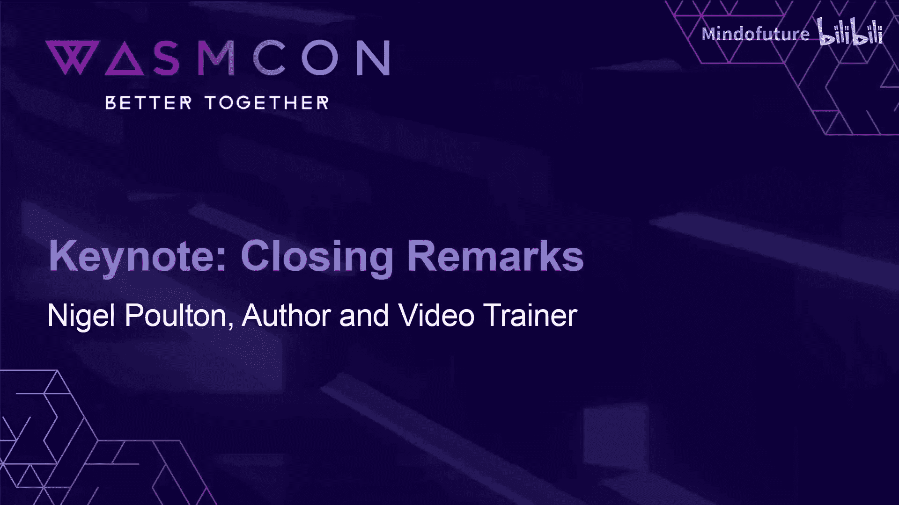

# 005：闭幕致辞与明日安排

在本节中，我们将回顾 WasmCon 2024 第一天的活动，并了解接下来的日程安排、参会建议以及如何提供反馈。

感谢 Luke，感谢所有上台演讲的嘉宾。感谢今天上午主持研讨会的各位。也感谢在座各位的参与。

接下来我们有一个休息时间，直到下午3点。之后我们将有三个并行分会场。

## 🗺️ 分会场与展厅信息

三个分会场就在展厅区域周围的房间里。我们鼓励大家休息后继续参加这些会议。

同时，也请大家花时间在展厅交流。请务必去各个展位与工作人员交流。Kate、Luke 以及今天在此发言的各位嘉宾都会在场，他们非常乐于为大家提供帮助，并且平易近人。

## ⏰ 明日活动提醒

明天上午9点，我们将继续活动。请确保定好闹钟，提前喝咖啡、吃早餐，然后再来参加。请注意，我们现在只是第一天的开始。

## 💡 反馈与建议征集

我想提前告知大家，活动结束后，大概是下周一，各位将会收到一封邮件，邀请您填写对本次活动的感受和建议。

请务必在收到邮件后填写。但是，如果您现在就有一些关于未来活动的想法，比如希望我们增加的内容，或者本次活动中您喜欢的部分，您也完全可以来找我，当面告诉我您的想法。我会很乐意将这些意见转达，因为我们非常渴望让这次活动、这个社区和生态系统，对所有人来说都尽可能精彩。

## 🤝 积极参与互动

不要害羞，主动与人交流。外面每个展位的工作人员都是为了帮助您而存在的。如果您有任何想法或建议，可以来找我。

现在，请大家去享受休息时间，吃点东西，喝杯咖啡或其他饮料。下午3点，分会场会议再见。我们明天上午9点再会。

---

**本节总结**
在本节中，我们一起了解了 WasmCon 2024 第一天下午的休息安排、分会场位置、明日活动时间，并学习了如何通过邮件或当面沟通为活动提供反馈。核心是鼓励大家充分利用休息时间进行交流，并积极参与后续环节。