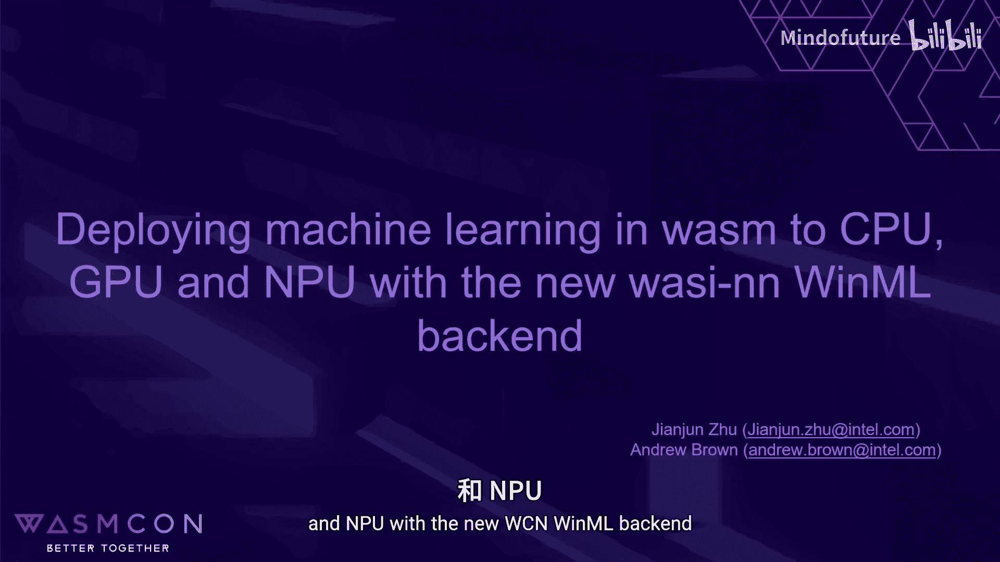
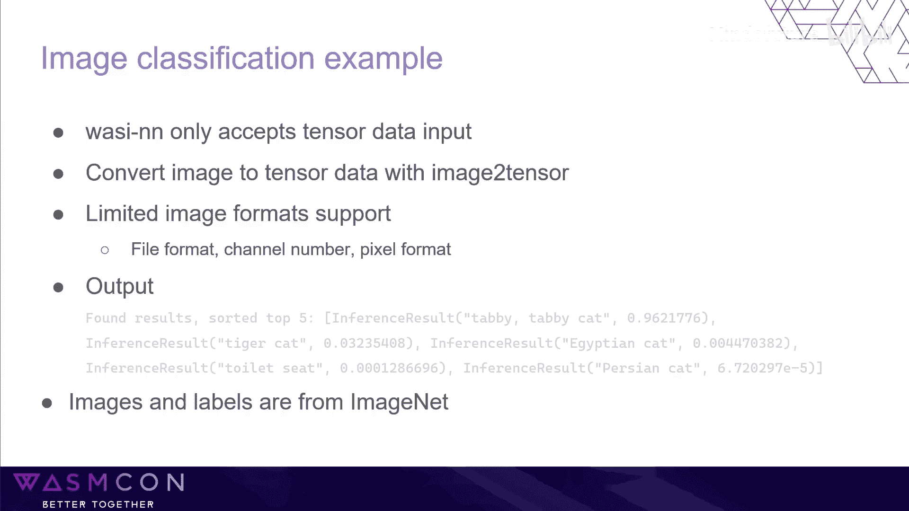
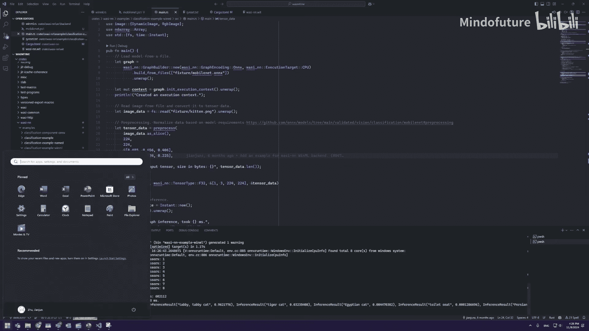

# 006：使用新的WASM后端在CPU、GPU和NPU上部署机器学习

在本节课中，我们将学习如何使用WebAssembly系统接口进行神经网络推理，并重点介绍新集成的Windows Machine Learning后端。我们将了解如何利用此后端，将机器学习模型部署到CPU、GPU乃至NPU等不同设备上。

## 概述：WASI-NN与WML后端

WASI-NN是为WebAssembly应用程序定义的一套机器学习推理API。通过这些API，Wasm应用只需调用几个简单的接口即可加载模型、输入数据，随后Wasm运行时会选择一个后端执行推理并返回结果。

最初，OpenVINO是首个实现的后端。过去一年中，我们增加了更多后端，包括ONNX Runtime、TensorFlow Lite以及新加入的**Windows Machine Learning后端**。WASI-NN也被其他运行时（如WasmEdge）支持，它们甚至提供了更多后端选项。

## WASI-NN推理工作流程

以下是一个简化的WASI-NN推理工作流程。根据实际用例，流程可能更为复杂，例如在设置输入张量前可能需要进行数据预处理。

1.  **加载模型**：首先，你需要加载一个模型。根据模型格式，Wasm运行时会为你选择一个后端。
2.  **设置输入**：使用 `set_input` API 输入数据。
3.  **执行计算**：设置完所有输入张量后，调用 `compute` 开始推理计算。这个过程可能需要几秒甚至几分钟。
4.  **获取输出**：计算完成后，通过 `get_output` API 获取推理结果。

请注意，WASI-NN目前处于第二阶段，因此API未来可能会有变动。同时，WASI-NN API同时提供了Web IDL和头文件版本。

## 认识Windows Machine Learning

WML是Windows 10（1809版）及更高版本的内置组件，这意味着你无需安装任何第三方依赖即可使用它。启用了桌面体验的Windows Server也支持WML。如果你的应用需要支持旧版Windows或未启用桌面体验的Windows Server，则需要安装独立的WML软件包。

WML仅支持ONNX模型。因此，如果你想使用WML后端，你的模型必须是ONNX格式。WML的一个执行提供程序是DirectML，因此它也支持与DirectML兼容的设备，如GPU和NPU。目前NPU支持有限，但我们正在努力改进。

## 实现WML后端

上一节我们介绍了WML的基本概念，本节中我们来看看WML后端是如何实现的。如果你想为WASI-NN添加新的后端，这个过程相当简单直接。

首先，理解线性推理的基本工作流程，然后将这些步骤映射到WASI-NN API。

1.  **选择推理设备**：对于CPU很简单。但对于WASI-NN中定义的GPU和NPU，没有与WML API一对一的映射。因此，在WML后端中，我们模拟所有DirectX设备，并检查它是否支持图形或仅为计算设备。如果支持图形，我们将其视为GPU；如果是纯计算设备，则视为NPU或GPU。
2.  **映射后续步骤**：其余步骤可以轻松映射，我们只需在WASI-NN的WML后端实现中调用相应的WML API。

由于Wasmtime是用Rust编写的，我们还引入了`windows-rs` crate来用Rust调用Windows API。

## 选择目标设备的注意事项

虽然WASI-NN提供了简单的API让你选择目标设备，但在实践中，仅通过更改一个值来切换设备可能并不那么容易。

原因是不同设备可能支持不同的数据类型和不同的算子集合。在新设备上运行模型之前，请检查你的硬件支持的类型。例如，如果你有一个F32模型，但目标设备仅支持F16，那么你可能需要转换模型才能在该设备上运行。

工具如ONNX Runtime可以帮助你转换模型，并针对特定类型的设备进行优化。

目前，对NPU的支持预测尚未合并，因为GitHub CI不支持NPU，很难获得测试覆盖。如果你想尝试，请查看Pull Request #8756。

## 图像分类示例

这是一个相当简单的用例，虽然不需要太多步骤，但仍需要一些预处理和后处理。

让我们看一下这个例子。

1.  **加载模型**：首先，我们从文件加载模型。模型格式为ONNX。
2.  **创建执行上下文**：然后，我们创建一个执行上下文。
3.  **读取并处理图像**：我们从文件读取图像并将其转换为张量数据。图像来自ImageNet，是一只猫。我们预处理数据，根据模型的要求（即模型训练的方式）对其进行归一化。
4.  **设置输入并推理**：使用`set_input`设置输入张量，并用`compute`运行推理。
5.  **获取并处理输出**：使用`get_output`获取结果。结果是类别ID及其概率。ID不便于人类理解，因此我们需要一个包含ID和标签的映射文件，以了解这些ID的含义。后处理数据后，我们生成前五个最可能的结果。

这是一个示例结果，排名第一的是“虎斑猫”，概率超过96%。

然后，我们将目标设备从GPU更改为CPU，重新编译示例并再次运行。由于更改了目标设备，概率可能与之前略有不同，但排名第一的结果仍然是“虎斑猫”。

## 当前限制与未来展望

目前仍有许多可以改进的地方。Rust的F16支持仍处于实验阶段。对于内部缓冲区，P16张量使用F32类型，这效率不高，但一旦F16支持稳定，这个问题就可以解决。

另一个限制是支持的数据类型和算子内核有限。开发者仍需首先了解其目标设备，以便对模型进行优化，从而获得更好的性能和更低的功耗。

如果你有任何问题，欢迎随时联系我们或提交新的Issue。

## 总结

本节课中，我们一起学习了WASI-NN的基本概念和工作流程，深入了解了新的Windows Machine Learning后端及其实现原理。我们还探讨了在不同设备（CPU、GPU、NPU）上部署模型时的注意事项，并通过一个图像分类示例演示了完整的推理过程。最后，我们了解了当前实现的限制和未来的改进方向。