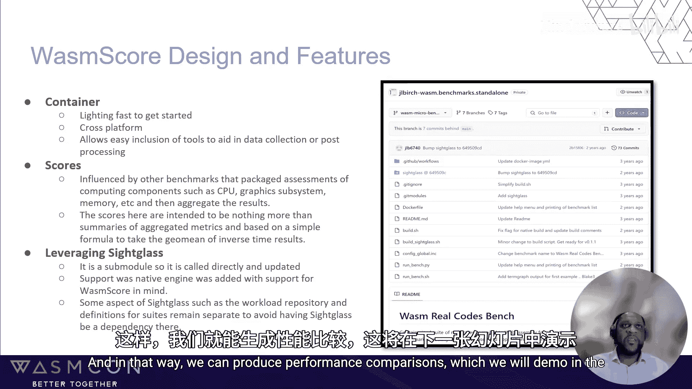
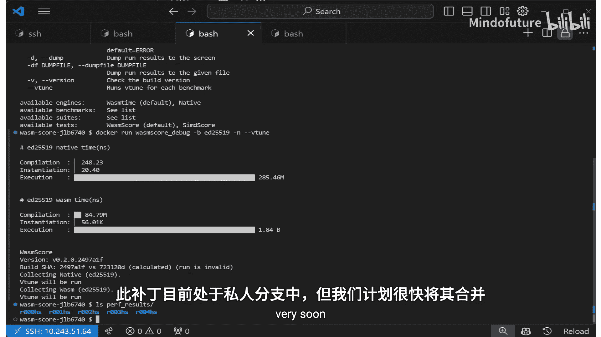
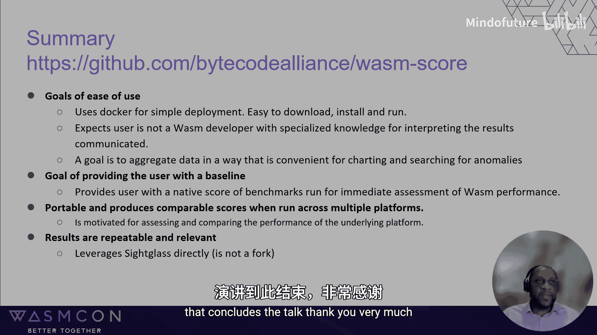

# 007：WasmScore 介绍 - 一款面向 Wasm 效率的新基准测试工具


在本节课中，我们将要学习 **WasmScore**，这是一款旨在评估 WebAssembly 效率和性能的新型基准测试工具。我们将了解其设计动机、核心特性、使用方法以及它如何帮助不同背景的用户理解和比较 WebAssembly 的性能表现。

## 动机与需求

上一节我们介绍了课程主题，本节中我们来看看开发 WasmScore 的动机。并非所有对 WebAssembly 性能感兴趣的人都熟悉其技术细节，他们可能来自市场部或其他非开发部门。这些人通常会有一些疑问。

以下是他们常见的问题：
*   应该使用哪个 WebAssembly 基准测试工具？
*   如何追踪性能表现？
*   平台 X 与平台 Y 上的 WebAssembly 性能对比如何？
*   某个基准测试运行了 N 秒，这个结果是好是坏？应该与什么进行对比？
*   “WebAssembly 具有接近原生性能”具体意味着什么？“接近”的程度是多少？
*   如果通常编译为原生代码的工作负载改为编译为 WebAssembly，性能是否会有明显下降？

目前，通过 GitHub 或网络搜索可以找到一些 WebAssembly 基准测试工作。这些工作可能是为了撰写文章提供数据支持，或是为了开发运行时功能而创建的基准测试驱动程序和用例。但大多数此类工作都是针对特定仓库的一次性努力，未经同行严格审查，且目标并非通用。它们通常由工程师为特定文章、功能或运行时创建，因此非常具体，不具备运行时无关性、平台无关性或工作负载无关性。

相比之下，成熟的编程目标或技术通常拥有用于标准化性能报告和比较的既定基准，例如 Java 或 C 语言的 SPEC 基准测试。

当前我们拥有的是分散的努力，而我们希望获得更多。我们希望工具易于访问且对新手友好，安装和运行简单，并能提供明确、易于解释的结果。我们希望它能提供一个衡量性能的基线，这意味着运行一次基准测试后，我们就能立即了解平台在 WebAssembly 上的表现。我们希望它是可移植的，能在多个平台上运行并产生可比较的分数。最后，我们需要它是可靠且可重复的，适用于各种工作负载和用例，并能与广大受众相关，从而确立其自身地位。

## 设计与核心特性

上一节我们介绍了动机和需求，本节中我们来看看 WasmScore 的设计方案。我们从一个基准测试驱动程序开始。虽然存在许多一次性基准测试，但有一个相对可靠的工具是 **Sightglass**。Sightglass 是 Bytecode Alliance 项目仓库下的一个基准测试套件/工具。它设计精良，最初用于帮助开发 Lucet 运行时，后来转而用于帮助开发 Wasmtime。它正在进行一些重新设计，包括支持为不同运行时添加插件的潜力。它包含许多用于控制运行稳定性的选项，并包含多种可能满足不同用例的基准测试。

这引出一个问题：为什么不直接扩展 Sightglass？这个方案曾被考虑，但最终确定最终需求和用例差异足够大，因此决定创建 WasmScore。

以下是 WasmScore 的设计和一些使其与众不同的特性：
1.  **使用容器**：WasmScore 使用 Docker 容器。这意味着启动速度极快，且具有跨平台性。这便于包含在数据收集或后处理过程中使用的工具。
2.  **使用分数**：这并非全新概念，但在需要汇总多个分数并总结结果时非常有用。
3.  **利用 Sightglass**：WasmScore 直接使用 Sightglass 作为子模块，而不是对其进行分叉。在开发 WasmScore 时，我们向 Sightglass 添加了一个原生引擎。我们同时迭代改进 WasmScore 和 Sightglass。此外，Sightglass 的某些方面（如工作负载仓库和套件定义）并未包含在 WasmScore 中，而是保持独立。

简而言之，设计思路是将 Sightglass 和其他工具放入 Docker 容器中，配置容器以便将结果转储到主机或访问主机进行性能分析等操作。容器内还有一个 Python 脚本，用于驱动运行 Wasm 基准测试的整个过程。独特之处在于，它还会将相同的基准测试编译为原生代码，从而能够进行性能比较。



## 快速上手与演示

到目前为止，我们花了很多时间讨论动机和设计方面。这里我们将展示如何下载和运行的快速示例。

下载过程就像执行一条 Docker pull 命令来获取镜像一样简单。
```bash
docker pull wasmscore/wasmscore
```
下载完成后，可以直接运行。
```bash
docker run wasmscore/wasmscore
```
运行后，您将看到各种基准测试正在运行以计算分数。请注意，您看到的“原生”基准测试是使用基准测试的高级源代码实时编译的。这与用于编译基准测试预编译 WebAssembly 文件的高级源代码相同。我们只实时编译原生代码，而不编译 Wasm。目前有有限数量的类别和基准测试被汇总以创建分数，但还有更多基准测试可供运行。

您可以看到人工智能推理、矩阵运算、阿克曼函数、斐波那契数列等类别的分数。我们对这些基准测试进行分类，并报告每个类别的时间和效率。这里使用的平均值用于计算整体的 **Wasm 效率** 和 **执行分数**，分数越高越好。效率分数只是 Wasm 性能与原生性能的比率，其中单个基准测试性能基于时间的倒数。简而言之，0.63 的效率分数表示 Wasm 的执行效率相当于原生执行代码的 63%。

另外请注意，由于我们使用容器，我们可以将任何需要的工具放入其中。例如，我们有一个调试版本的 WasmScore 容器，其中包含了类似 VTune 的性能分析工具。通过帮助菜单可以了解如何使用它来针对特定基准测试进行分析。性能分析会同时在 WebAssembly 和原生代码上运行。这样，我们不仅可以比较分数，还可以快速评估两者之间的性能问题并进行比较。生成的配置文件会映射到主机上。此功能的补丁目前在一个私有分支中，但我们计划很快将其合并。

## 结果分析与未来展望



因为我们同时拥有 Wasm 性能和原生性能数据，所以可以快速查看 Wasm 在哪些类别中表现良好，在哪些类别中表现不佳。请记住，这个比率在不同平台上具有可比性。

通过绘制一些数据，我们可以看到一些差距，也可以看到一些异常值。例如，这里突出显示的阿克曼函数和 ED25519 就是异常值。使用我们可以生成的性能分析文件，我们可以看到阿克曼函数的大量时间花费在 lowering 阶段，而 ED25519 的差距是由于对支持 64 位乘法的函数调用造成的，该操作目前尚未以原生方式完成。

简而言之，过去一年并没有进行大量工作，但这是一个正在缓慢迭代的项目。我们希望未来能够添加额外的分数，例如 WAI 或 CD。当我们谈论分数时，我们指的是某种比较，我认为这是 WasmScore 的基础——拥有那个基线比较。对于 CD，可能是标量比较；对于 WAI，可能是 Wasm 之间或与原生代码的比较。我们还希望增加对额外运行时的支持。可以想象一个运行时套件，我们甚至可以有一个“集成”模式，汇总所有运行时的分数，以获得 WebAssembly 的通用基线性能。当然，还需要更多的基准测试，随着 WebAssembly 用例的出现，这些基准测试也在不断变化。性能分析支持即将合并，但我们希望在汇总结果方面做得更好，并且还有其他功能想要添加。最后，需要增加参与度，需要不止几个工程师来共同探讨什么才是好的基准测试和好主意，这是我们一直希望改进的方面。

## 总结

本节课中我们一起学习了 WasmScore 基准测试工具。我们想以 WasmScore 的访问地址和创建该基准测试所遵循的原则作为结束。我们的目标是易于使用，因此使用 Docker 实现简单部署。我们以易于理解的方式汇总数据，并提供性能分析等工具。这些工具不要求用户是专家，但提供了足够的分析能力。目标是提供开箱即用的基线，我们通过包含原生比较来实现这一点。由于我们实时编译，因此该工具具有跨平台的可移植性，可以为特定平台获取原生分数。我们需要可靠、可重复且相关的结果，为此我们利用了久经考验的 Sightglass。我们没有使用其分叉，而是直接利用它，任何与 Sightglass 相关的支持需求，我们都优先添加到那个项目中，然后再整合到 WasmScore 里。

**项目地址**：`https://github.com/bytecodealliance/wasmscore`（注：根据演讲内容推断，实际地址请以官方发布为准）



**核心原则**：
*   **易于使用**：通过 Docker 实现简单部署。
*   **易于理解**：汇总数据，提供分析工具。
*   **提供基线**：通过包含原生编译实现开箱即用的性能比较。
*   **可移植**：跨平台运行，实时编译获取平台特定原生分数。
*   **可靠相关**：直接利用成熟的 Sightglass 项目，确保结果质量。