# 009：使用 WASI WebGPU 构建精美图形与安全运行 AI

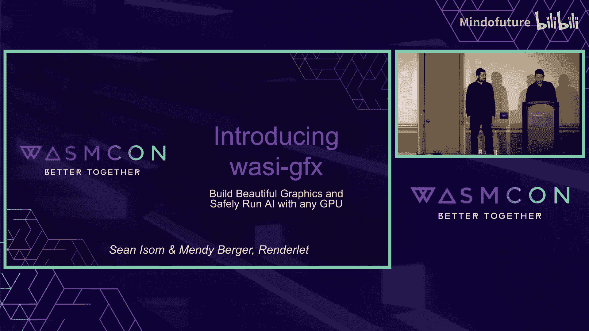

在本节课中，我们将学习如何通过 WASI GFX（原名 WASI WebGPU）为 WebAssembly 应用带来 GPU 能力。我们将探讨其架构、核心组件，并通过实际示例展示如何利用它构建图形应用和运行 AI 推理。

---

## 当前 WebAssembly 如何与 GPU 协作？

简短的回答是：目前不能。这是 WebAssembly 设计上的有意限制。

然而，在浏览器等富 Web 应用环境中，存在变通方法。通常，这需要通过 JavaScript 绑定来实现。例如，像 Emscripten 这样的 C++ 框架，允许你将 C++ 代码编译为 WebAssembly，并通过 JS 宿主在浏览器中运行。对于 WebGL，它们将 API 映射到 GLES，并通过浏览器的 JavaScript 绑定与浏览器原生的 GPU API 通信。

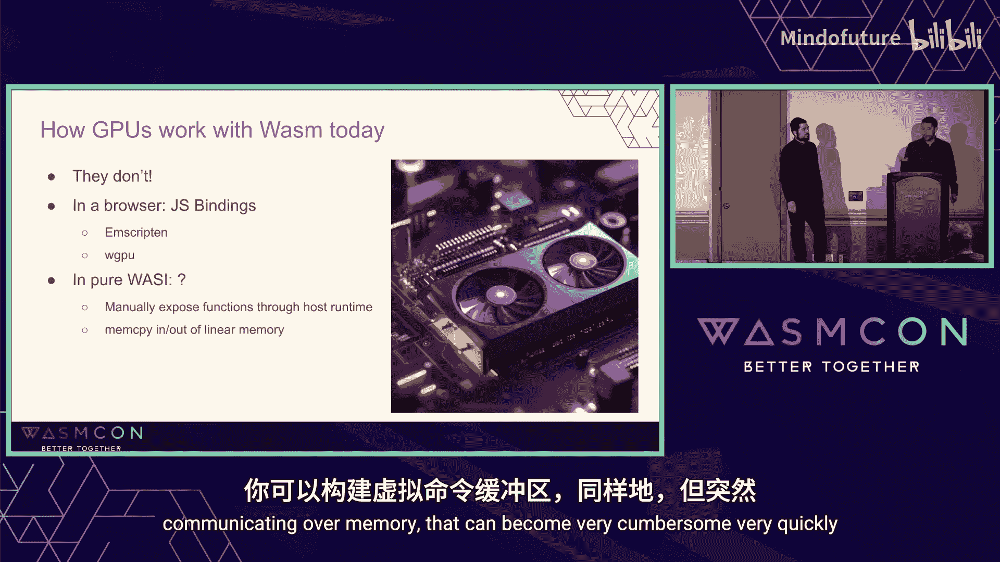

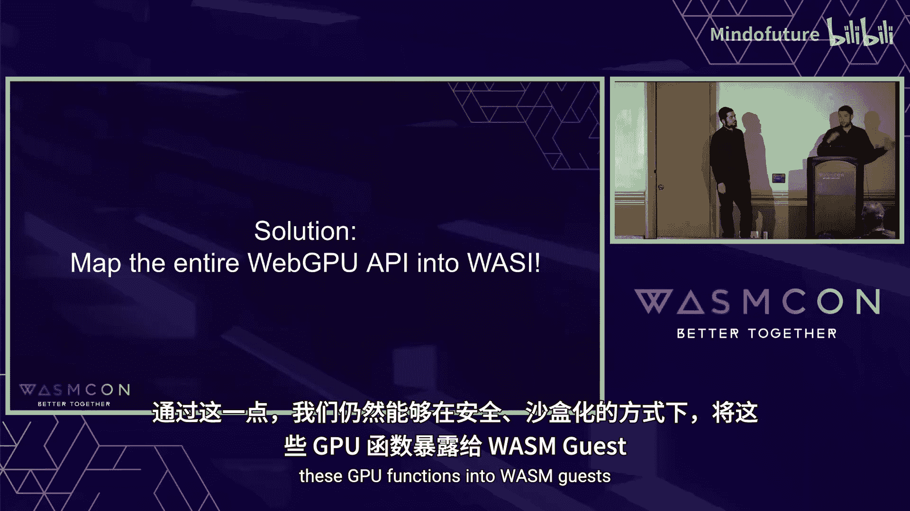

同样，对于 WebGPU，在 Rust 社区中，它通过 `wgpu` 库暴露给 WebGPU。你可以在浏览器中运行 `wgpu`，它有一个后端，允许通过 JavaScript 绑定接入浏览器的底层 API。

这套系统在浏览器中运行良好。但对于其他用例，例如无头应用、桌面端或服务器端，目前并没有标准化的方法。你可以手动从宿主运行时暴露函数，但这非常繁琐且难以维护。你也可以导出整个图形 API，但这会带来安全问题，因为无法保证第三方代码不会访问 GPU 上的其他资源。

为了解决安全问题，你可以通过复制数据进出 WebAssembly 线性内存来处理所有 GPU 交互，但这会带来严重的性能问题。因此，我们需要一种更好的方法。

---

## 为什么需要 WASI GFX？

WebAssembly 最有用的地方是作为一个编译目标，而非一个独立的平台。因此，你可以想象各种应用场景，它们需要与窗口系统交互或在画布上合成视觉层。

以下是几个关键用例：

*   **用户界面**：在原生应用中，需要将数据渲染到屏幕上的场景。
*   **无头图形渲染**：例如，在服务器端进程中通过 OpenGL 渲染帧、图像或流式视频。
*   **插件系统**：将应用内部对象模型的一部分暴露给第三方代码，允许其操作 GPU 上的特定资源，为不同类型的计算开辟新用例。
*   **人工智能**：这是当前 GPU 最流行的用例。WASI-NN 非常适合在其支持的后端上进行 ML 推理。但如果你需要使用不受支持的后端、进行模型训练或需要底层 GPU 访问，WASI GFX 就能派上用场。
*   **通用 GPU 计算**：用于科学计算，如 CFD 模拟等，需要访问通用并行处理器。

我们希望听到社区的反馈，了解更多的用例，以构建一个通用的框架。

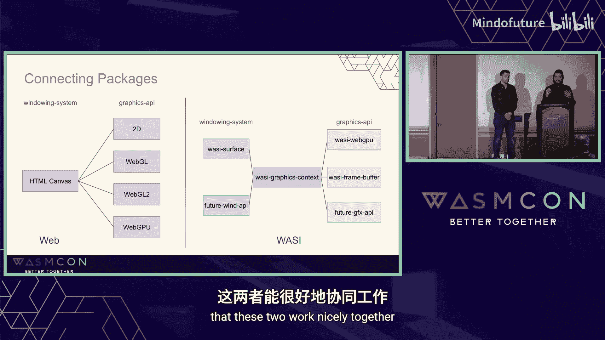

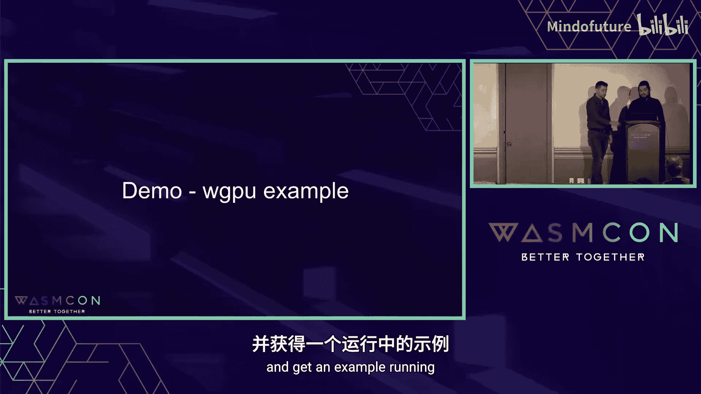

---

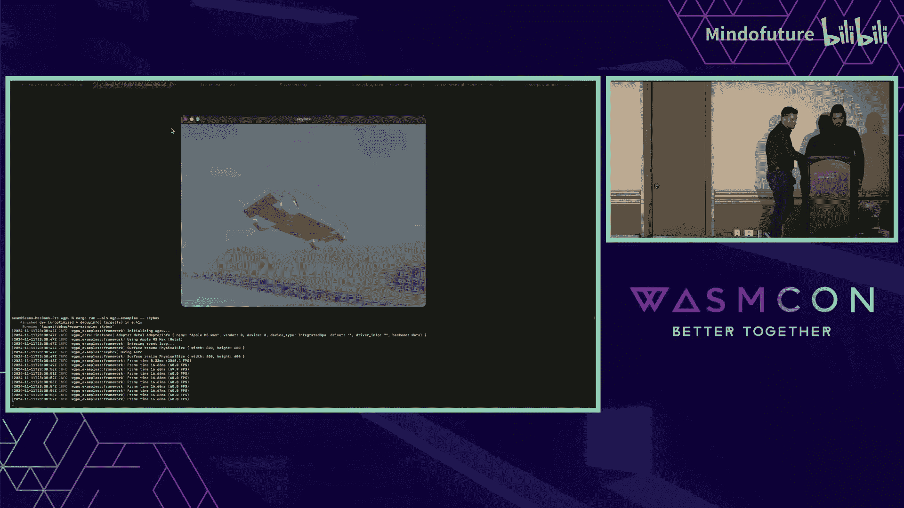

## WASI GFX 的结构

WASI GFX 包含以下几个部分：

*   **WASI WebGPU**：从 WebGPU 的 Web IDL 规范生成，语义上与 WebGPU 基本相同。
*   **WASI Surface**：允许你将内容绘制到屏幕并获取基本的用户事件，可以看作一个非常基础的窗口系统。
*   **WASI Graphics Context**：用于连接 WASI WebGPU 和 WASI Surface。
*   **WASI Frame Buffer**：一个简单的、基于 CPU 的帧缓冲 API。

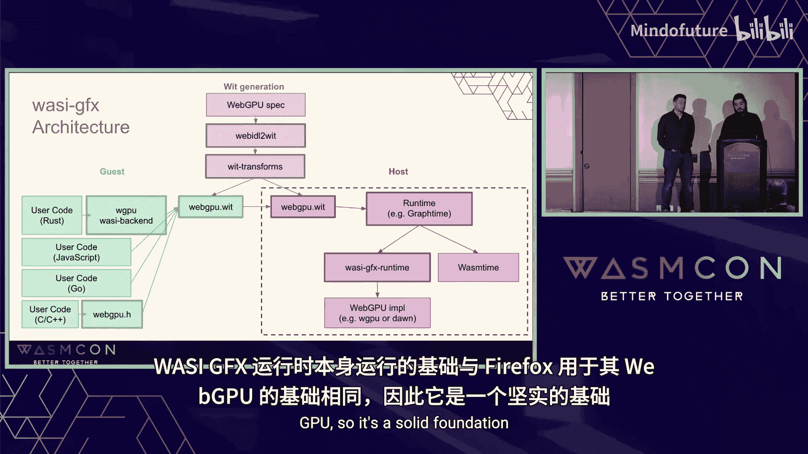

那么，如何连接这些包呢？

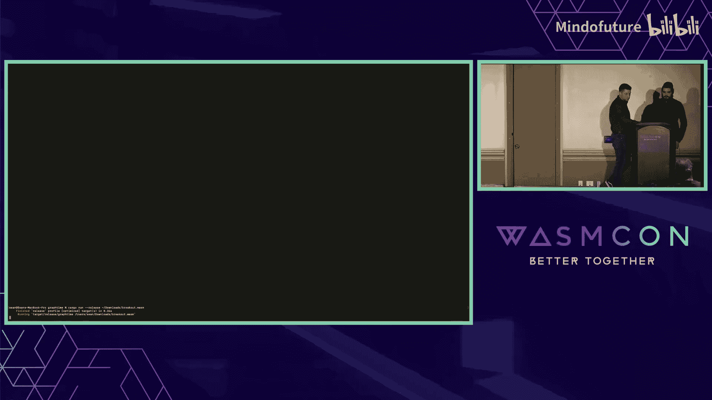

在 Web 上，有 WebGL 和 WebGPU 等图形 API，它们都绘制到 HTML Canvas 元素上，没有其他选择。

但在 WASI 中，我们希望更灵活。我们从 WASI Surface 开始，但也希望支持未来的窗口 API。同时，我们也有多个图形 API。为了确保任何窗口系统都能与任何图形 API 协同工作，我们引入了 **WASI Graphics Context**。

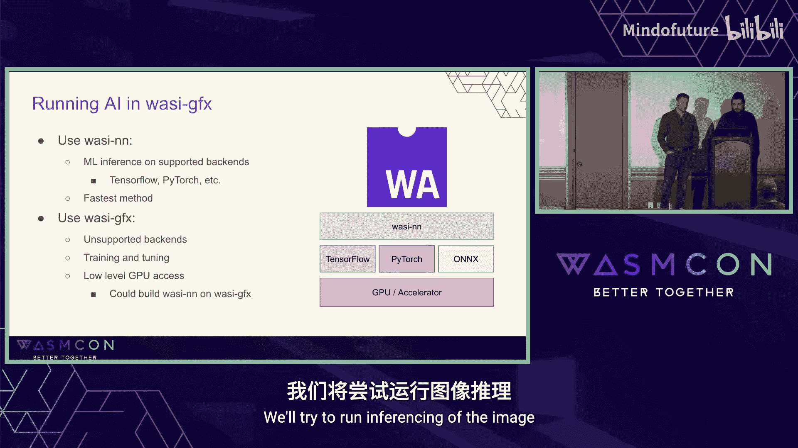

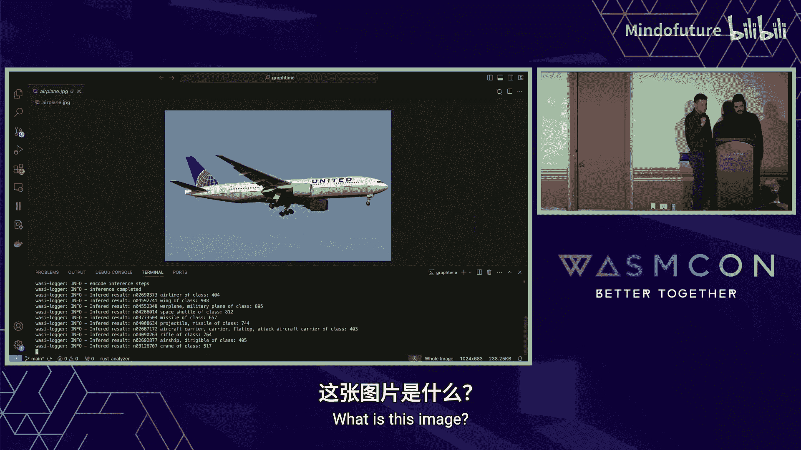

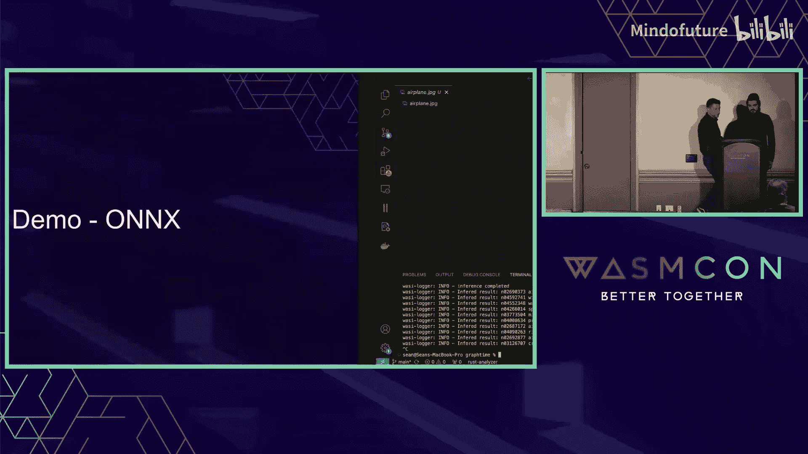

它的作用很简单：一端接收窗口系统，另一端接收图形 API，由宿主负责确保两者良好协作。

---

## 实际运行示例

`wgpu` 是 Rust 生态中一个重要的图形库，其设计与 WebGPU 非常相似，并且可以运行在 WebGPU 之上。那么，我们能否让 `wgpu` 也运行在 WASI GFX 之上呢？

答案是肯定的。我们已经成功实现了这一点，并且运行非常流畅。

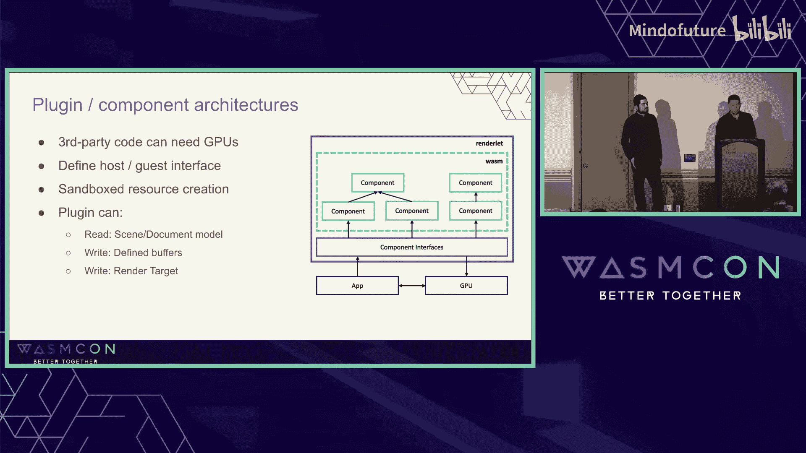

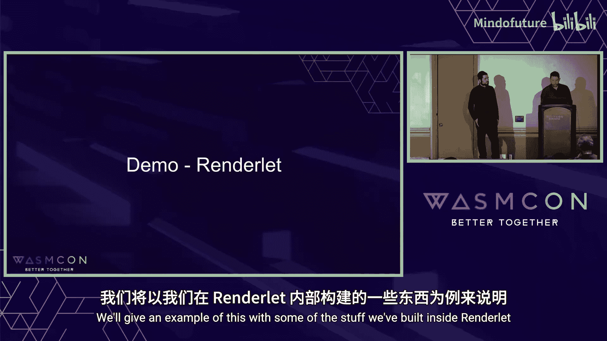

---

## 基础设施架构

让我们看看支撑这一切的实际基础设施架构。

1.  **WIT 生成**：我们使用一个名为 `webidl-to-wit` 的特殊工具，将 WebGPU 的 Web IDL 转换为 WIT（组件模型接口语言），并进行一些转换以移除对 JavaScript 或 Web 的假设。
2.  **Guest 端**：现在，任何语言都可以使用生成的 WASI WebGPU WIT。对于像 Rust 这样已有标准化 WebGPU 处理方式的语言，我们正在为其开发后端，以便现有代码可以直接编译为 WASI。
3.  **Host 端**：你需要一个支持 WASI GFX 的运行时。我们有一个实验性的运行时叫 `graphtime`，它嵌入了 Wasmtime 和 WASI GFX 运行时扩展。WASI GFX 运行时本身建立在与 Firefox 用于其 WebGPU 实现相同的基础之上，非常可靠。

---

## 运行复杂示例：Bevy 游戏引擎

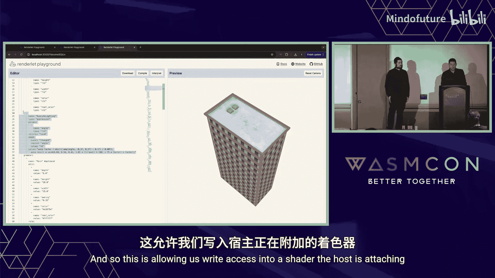

Bevy 是 Rust 中一个非常流行的游戏引擎，它使用 `wgpu` 进行绘制，包含更多复杂的部件。我们挑战将完整的 Bevy 游戏编译到 WASI GFX 中，并在上周成功实现了。

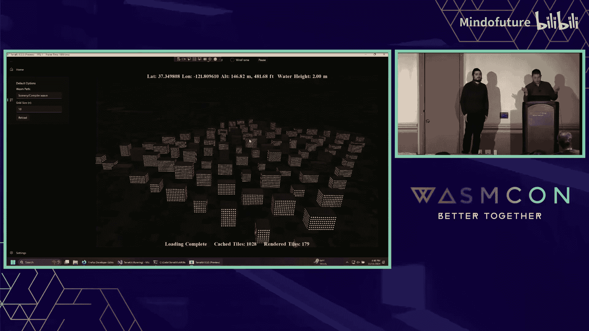

演示显示，游戏可以正常运行和交互。

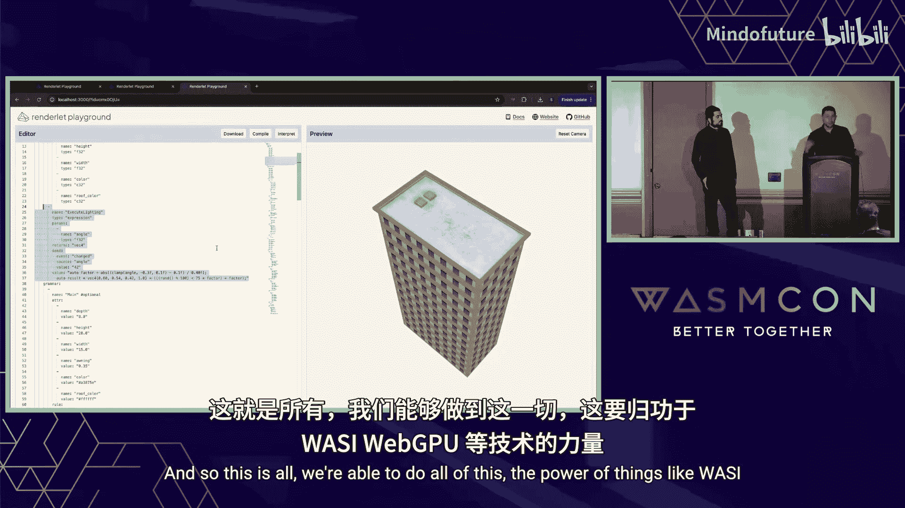

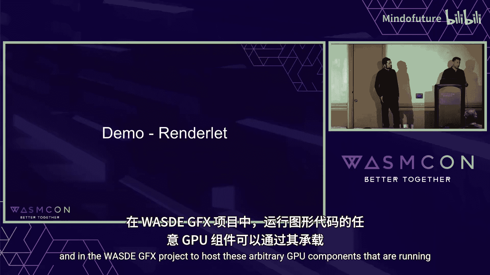

---

## 人工智能用例

如果你关注 WASI 生态系统，可能听说过 WASI-NN。对于在其支持的后端上进行 ML 推理，WASI-NN 非常出色且易于使用。

但是，如果你需要使用 WASI-NN 尚未支持的后端、进行模型训练，或者需要底层 GPU 访问，WASI GFX 就是你的朋友。事实上，你可以在 WASI GFX 之上实现 WASI-NN。

我们演示了一个使用 WASI GFX 进行图像分类推理的示例。

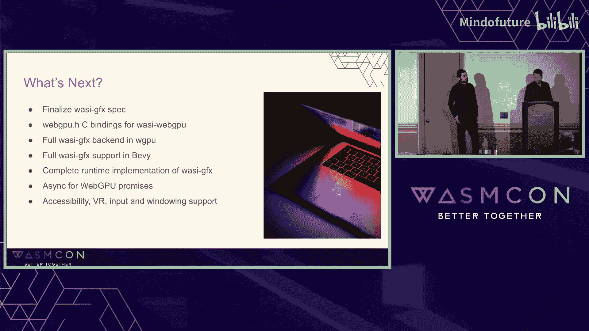

---

## 插件与组件化架构

对于插件或基于组件的架构，我们可能希望让 Guest 代码能够写入现有应用程序。第三方代码通常需要 GPU 来进行渲染。

通过 Renderlet，我们正在构建 GPU 可移植层，允许你为设计工具和游戏等构建插件。在插件模型中，你需要通过 WIT 定义宿主与访客之间的接口，从而在插件和宿主之间交换数据。

这些插件通过 WASI WebGPU 暴露和运行，可以在 GPU 上创建完全沙箱化、由插件拥有的资源。作为宿主应用程序的作者，你需要思考什么样的接口对插件有意义。例如，在游戏或编辑器中，你可能希望让插件能够读取场景图或文档模型的部分内容，这些可以通过纹理或缓冲区暴露。

核心价值在于能够通过 GPU 进行这些操作。插件可以写入特定的、定义了限制的缓冲区，宿主应用程序可以渲染这些数据，或者插件本身也可以渲染到渲染目标上。WASI WebGPU 为你提供了灵活性，来决定宿主与访客之间这种细粒度的交互方式。

我们通过 Renderlet 内部构建的内容演示了一个“程序化建模”的例子，展示了如何通过编写代码（编译为 Wasm 模块）来生成图形数据，并作为插件加载到宿主应用程序（如地图查看器）中，实现参数化渲染和双向通信。

---

## 未来发展

WASI GFX 本身在规范方面还有下一步计划：

1.  **最终确定规范**：规范已趋于稳定，但我们仍需要社区反馈。
2.  **C 语言绑定**：WebGPU 工作组已标准化了一个 `webgpu.h` 头文件，我们正在为其提供绑定，以便任何针对 WebGPU API 的 C/C++ 应用都能开箱即用地在 WASI GFX 主机上运行。
3.  **完善后端支持**：我们希望为 `wgpu` 和 Bevy 引擎提供完整的上游支持。
4.  **完成运行时实现**：目标是实现与 WebGPU 规范的 100% 兼容。
5.  **异步支持**：随着组件模型对异步的支持，我们将为 WASI GFX 和 WASI WebGPU 带来完整的异步 API 支持。
6.  **新用例支持**：如无障碍功能、VR 支持、不同类型的输入方法以及轻量级/完整的窗口 UI 系统。我们希望听到社区关于规范应支持哪些功能的意见。

我们很高兴地宣布，截至上周，WASI GFX 已成为第二阶段提案。我们还有很长的路要走，非常欢迎社区的帮助、用例分享和贡献。

---

## 总结

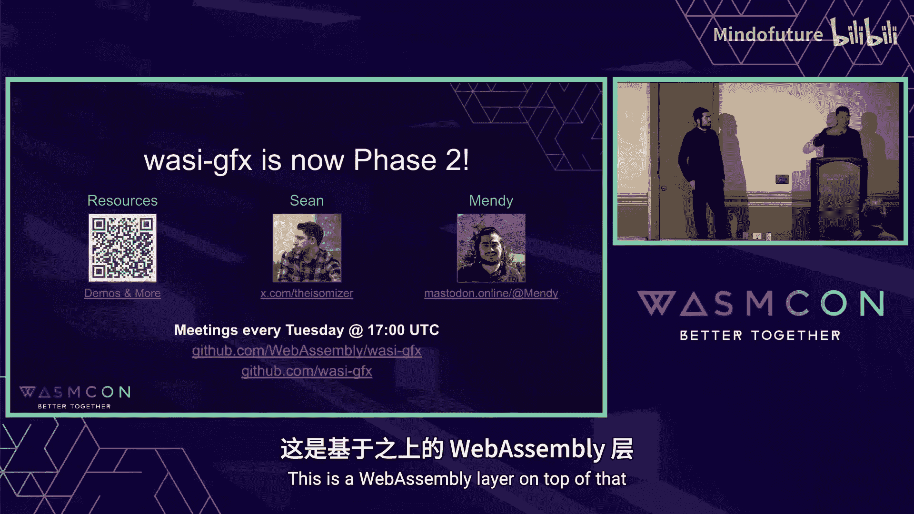

本节课中，我们一起学习了 WASI GFX 如何为 WebAssembly 带来安全、高效的 GPU 访问能力。我们了解了其架构、核心组件，并通过图形渲染、AI 推理和插件系统等实际示例，看到了它的强大潜力。WASI GFX 旨在成为一个通用的框架，为各种 WebAssembly 应用场景开启 GPU 计算的大门。