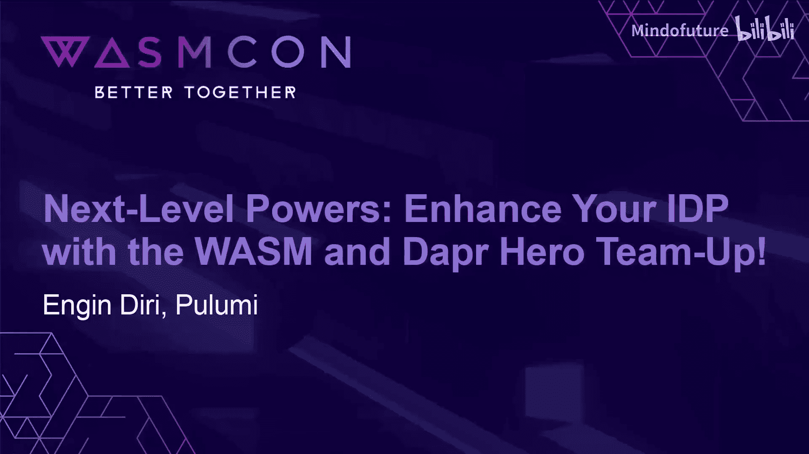
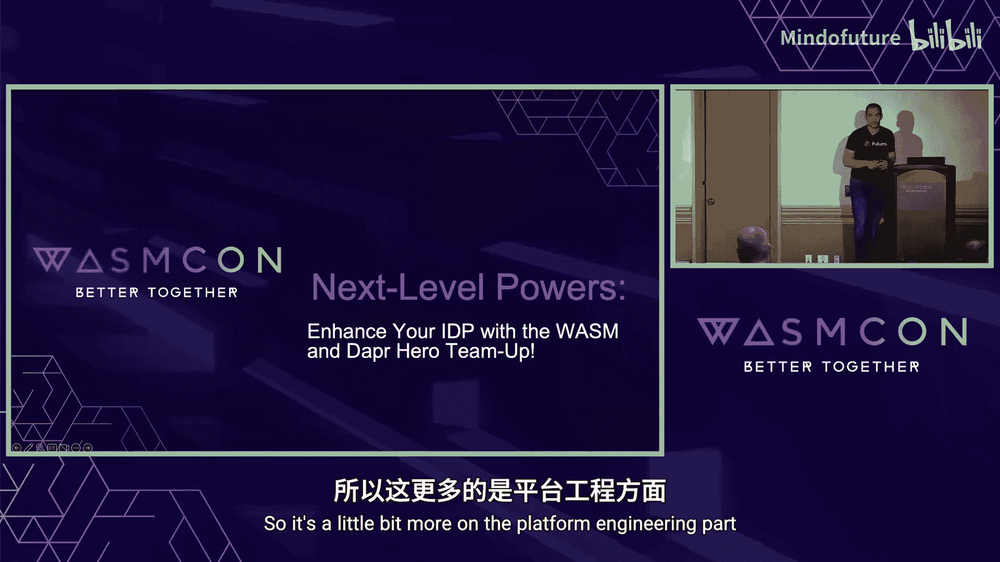
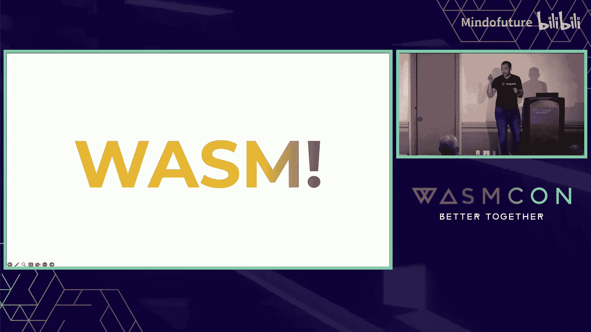
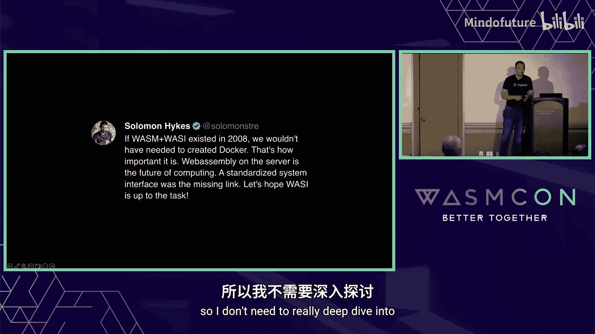
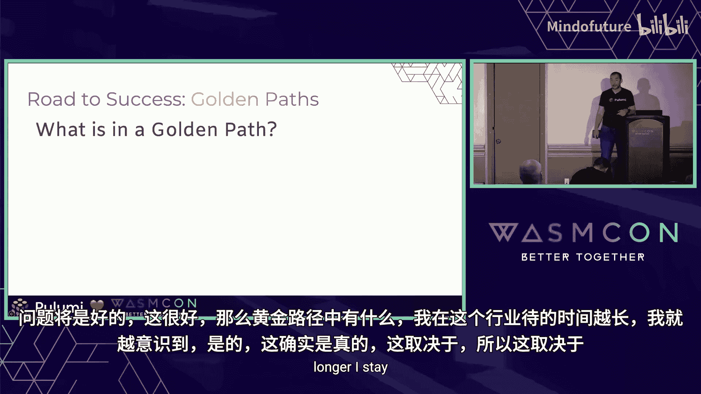
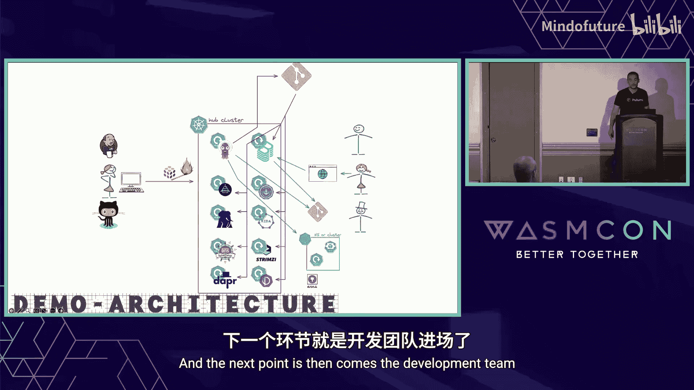
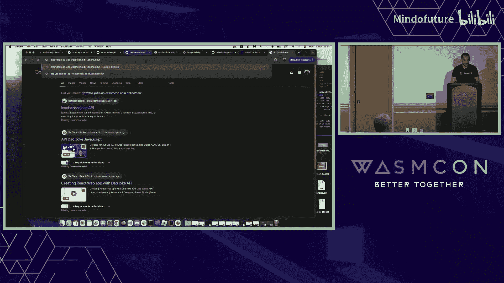
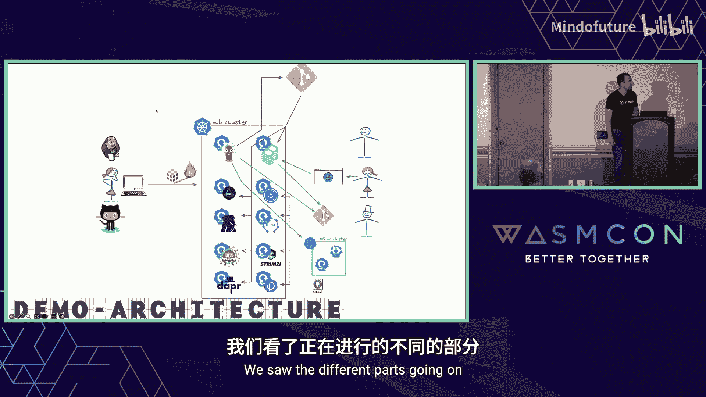
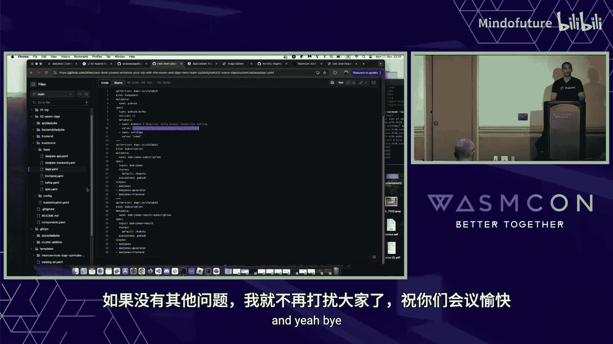

# 010：强强联手——用WASM和Dapr提升你的IDP！🚀

在本教程中，我们将探讨如何将WebAssembly和Dapr集成到内部开发者平台中，以提升开发者体验和平台能力。我们将从平台工程的基础概念讲起，逐步深入到Wasm、Dapr、Keda等具体技术，并最终展示如何构建一个支持Wasm的“黄金路径”。

## 概述：平台工程的挑战与机遇

在大型企业中，启动一个新项目可能非常复杂。这取决于公司的规模，可能简单到只需打个电话，也可能困难到不知从何入手。问题可能来自源代码管理，也可能来自基础设施配置。即使找到了方法，也可能需要经历漫长的等待，例如通过ServiceNow提交工单。本节将介绍平台工程如何解决这些问题。

## 平台工程简介 🏗️

上一节我们提到了项目启动的复杂性，本节中我们来看看平台工程如何应对。

平台工程通过提供自助服务能力和自动化基础设施操作，来改善开发者体验和生产力。其核心是为内部客户（即开发者）提供最佳的开发体验。

CNCF（云原生计算基金会）也在推进相关工作，并发布了平台工程白皮书。他们将平台分为不同层次：平台接口、工具（如Backstage）、平台能力（如基础设施即代码）以及各种底层组件（如外部密钥管理、身份管理等）。

以下是平台工程团队的主要职责：
*   设计和实施基础设施。
*   自动化部署流程。
*   提供故障排除支持。
*   保持技术栈的更新。

然而，最重要的是**为开发者客户提供最佳的开发体验**。平台的成功与否取决于团队是否将开发者视为客户，并建立直接的反馈渠道。

## 为什么选择WebAssembly？⚡

我们了解了平台工程，现在进入下一个关键部分：WebAssembly。

Wasm以其快速启动时间（毫秒级）、接近原生的性能、轻量级体积和“一次构建，随处运行”的承诺而闻名。其默认的沙箱安全模型也是一大优势。对于开发者平台而言，Wasm能够提供高效、安全且跨架构的运行时环境。

## 集成SpinKube到平台 🧩

我们知道Wasm很酷，也看到了它的好处。开发者团队可能已经要求将Wasm作为服务提供。现在，我们可以通过SpinKube项目来实现。

SpinKube是一个CNCF项目，用于在Kubernetes上交付Spin Wasm应用程序。它包含以下组件：
*   **Spin Operator**：负责部署Spin应用。
*   **Containerd Shim**：用于在Containerd节点上运行Wasm工作负载。
*   **RuntimeClass Manager**：用于安装Wasm运行时。
*   **SpinKube Plugin**（可选）：用于创建Kubernetes部署清单。

其工作流程如下：
1.  开发者使用`spin new`、`spin build`等命令创建和构建应用。
2.  将构建的OCI镜像推送到内部或公共镜像仓库。
3.  通过`kubectl apply`应用SpinKube生成的YAML清单。
4.  Spin Operator识别自定义资源并调度应用到Kubernetes集群。

## 引入Dapr和Keda：构建“三巨头” 🤝

我们已经有了SpinKube。为了进一步提升开发者生产力，让他们更少关注周边细节，我们可以引入Dapr和Keda。

Dapr是一个分布式应用运行时，它通过侧车模式抽象基础设施细节。开发者只需知道存在某种类型的组件（如发布/订阅），而无需关心其具体实现是Kafka还是RabbitMQ。Dapr基于Actor模型，并提供了状态管理、发布/订阅、安全、可观测性等构建块。

Keda是Kubernetes基于事件驱动的自动伸缩器。它可以监听特定事件源（如RabbitMQ队列或Kafka主题），并根据消息数量等因素自动伸缩部署副本数，甚至缩容到零。结合Wasm的快速启动特性，可以构建出能够根据负载动态、水平伸缩的系统。

将SpinKube、Dapr和Keda结合，我们获得了基础设施抽象、事件驱动伸缩和高效Wasm工作负载交付的强大组合。

## 定义“黄金路径” 🛣️

我们拥有了所有技术组件。现在，作为平台工程团队，我们如何将其交付给开发者？答案是通过“黄金路径”或“铺平道路”。

“黄金路径”是平台工程团队提供的一种预架构且受支持的方式来构建和部署软件。其核心是与开发者客户合作，收集他们的需求，同时整合安全团队等其他部门的输入，创建出一条标准化的、受支持的部署路径。团队承诺对此路径提供支持，包括升级和维护。

但这并不意味着限制自由。开发者可以选择“偏离”黄金路径进行创新尝试，但需要明白他们将无法获得同等级别的支持。关键在于与利益相关者沟通，将平台作为产品来对待，共同制定最佳路径。

一个“黄金路径”至少应包含以下元素：
*   **代码仓库模板**：例如GitHub模板仓库，包含预配置的工作流和脚手架。
*   **部署清单**：针对特定运行时（如Kubernetes）的部署配置。
*   **内置可观测性**：集成监控和日志。
*   **内置安全**：集成漏洞扫描和使用安全基础镜像。

## 整体架构与演示 🎬

最终，我们构建的内部开发者平台包含平台工程团队、消费服务的开发者，以及由安全、DevOps、基础设施、自动化等层次构成的平台本身。平台集成了GitLab、Jenkins、Kubernetes等各种产品，并保持足够的灵活性以集成像Wasm这样的新技术。

在演示部分，我们展示了一个具体实现：
1.  平台工程团队使用Pulumi基础设施即代码创建集群，并部署Argo CD和Backstage。
2.  Argo CD通过GitOps方式，从Git仓库自动部署所有必要的平台组件（外部密钥操作器、证书管理器、PostgreSQL、Dapr等）。
3.  开发者通过Backstage访问“黄金路径”模板（一个集成了Dapr和SpinKube的微服务模板）。
4.  开发者填写表单（如应用名称、是否部署Kafka等），Backstage会自动在Git仓库中生成对应的、完全配置好的代码库。
5.  应用被部署到Kubernetes集群。演示应用是一个Wasm后端，通过Dapr连接到Kafka，并由Keda根据队列深度进行自动伸缩（从0开始扩容）。

## 总结

在本教程中，我们一起学习了如何通过结合平台工程、WebAssembly、Dapr和Keda来增强内部开发者平台。我们探讨了平台工程的核心是提供卓越的开发者体验，介绍了Wasm的性能与安全优势，展示了如何使用SpinKube在K8s上交付Wasm应用，并解释了Dapr和Keda如何共同提供抽象和弹性。最后，我们定义了“黄金路径”作为标准化、受支持的交付方式，并概述了一个集成了Argo CD和Backstage的完整演示架构。通过这种方式，平台团队能够以合规、受支持的形式，为开发者提供强大的Wasm服务能力。