# 012：在超分布式云上释放开源 WebAssembly 的力量

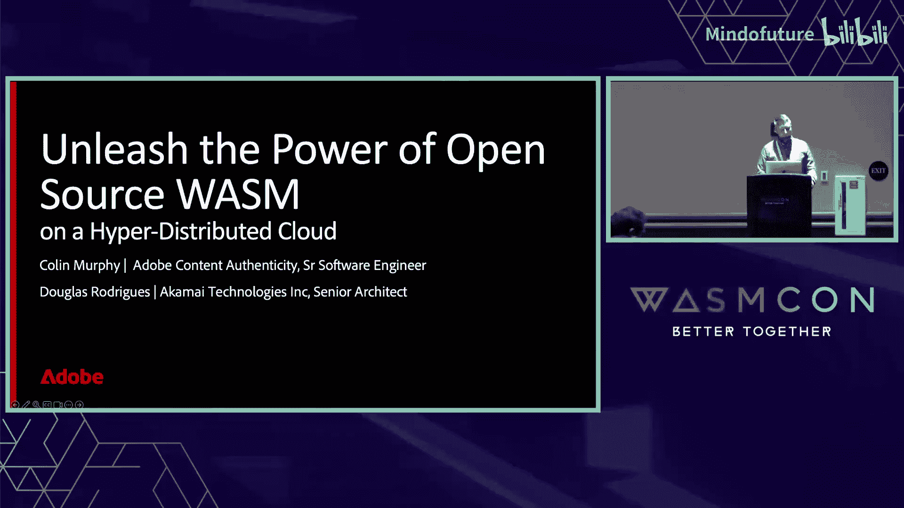

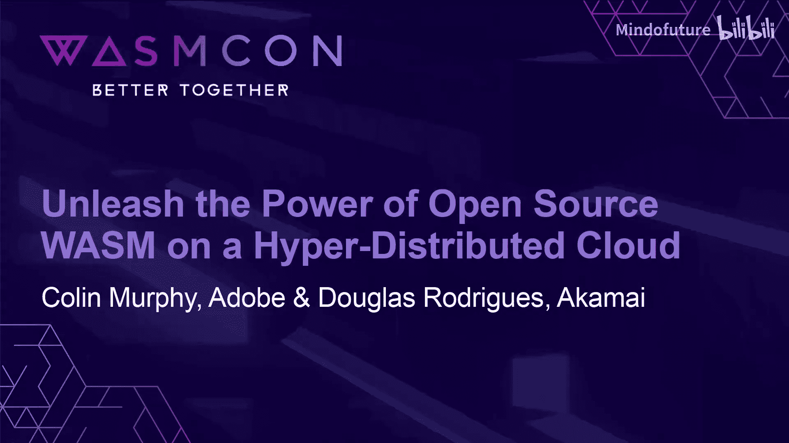

在本节课中，我们将探讨如何利用开源 WebAssembly 技术，在跨越边缘和核心数据中心的超分布式云架构上构建和部署应用。我们将通过一个具体的案例——Adobe 内容真实性倡议服务，来演示其实际应用与优势。

## 为什么企业尚未广泛采用边缘计算？

我叫 Colin Murphy，在 Adobe 工作。这位是 Doug，他在 Akamai 工作。

大家好。

首先，我想提出一个可能有些冒犯的问题：为什么像 Adobe 这样的公司没有大规模采用边缘计算？原因并非我们缺乏尝试。我曾努力推动我们使用几乎每一家云提供商的边缘服务。但现实是，存在一些障碍。

以下是我从公司内部得到的反馈：

*   **技术栈差异大**：许多工程师熟悉 Java、Spring 或 Go。边缘计算在编程模型和部署方式上与传统服务器端开发不同，需要学习新的框架和技能。
*   **部署与协调复杂**：为边缘计算组建专门的团队或培养专家后，还需要协调边缘部署与现有数据中心的部署流程，增加了运维复杂度。
*   **能力限制**：当前的边缘计算平台在功能上可能不如数据中心丰富。这也正是 WasmCon 等会议存在的原因——我们正在努力增强这些能力。

上一节我们探讨了企业采用边缘计算的障碍，本节我们来看看理想中的边缘计算平台应该具备哪些特性。

## 理想边缘计算平台的特性

那么，我们期望的边缘计算平台是什么样的？

*   **多租户**：平台应能服务公司内的多个团队，而不是为每个团队搭建独立的基础设施。理想情况下，它应该是一个服务。
*   **全局性**：部署和更新应能一键覆盖全球，而不是逐个集群管理。
*   **开发体验一致**：边缘部署的体验不应与数据中心部署有太大差异。
*   **持续更新**：平台应能快速集成 WebAssembly 生态系统的最新标准和技术，例如 WASI。
*   **具备 WebAssembly 优势**：继承 WebAssembly 的高效性和安全性。

接下来，我们将介绍一个符合这些理念的开源项目。

## 引入 WasmCloud 与内容真实性倡议

这里需要声明一下，我是 WasmCloud 项目的维护者。我参与其中是因为我喜欢它的理念。WasmCloud 能保持最新，例如 WASI-P2 标准发布后，它会很快集成。

现在，介绍一下我的工作背景。我隶属于“内容真实性倡议”。这是一个旨在制定行业标准，为数字内容（如图片、视频）添加来源和编辑历史等“溯源”元数据的联盟组织，我们称之为“内容凭证”，以帮助遏制虚假信息，增加在线信任和透明度。

联盟成员包括相机厂商、编辑软件公司（如 Adobe）、社交媒体平台（如 Meta）以及媒体公司（如《纽约时报》、《华尔街日报》）等。

我们还有另一个组织 C2PA，它提供开源库和工具。Adobe 也围绕这些工具构建服务。

核心思想是：当有人拍摄、编辑并发布一张图片后，用户下载该图片时，可以轻松查看其完整的处理链。这些信息被记录在一个经过签名的“清单”中，用于验证图片的来源和编辑历史。它并不能判断一张随机图片的真伪，但能证明“已知为真”的内容的可靠性。

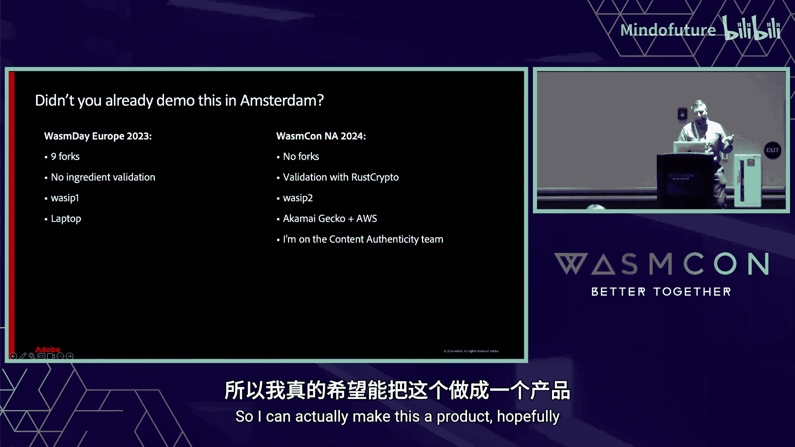

C2PA 的一个优势在于其开源库 **C2PA-RS** 是一个 Rust 库。Rust 非常适合编译为 WebAssembly。这带来了多种用例：Web 端（已实现）、服务器端（未来可通过 WASI 运行）以及嵌入式设备（如相机）。此外，还有 Python、JavaScript、Node.js、C 和 Rust 的多种 SDK。

一个理想的未来是，我们可以将核心功能打包成 WebAssembly 组件，从而减少维护多个 SDK 的负担。开源也让我们能够与行业先锋合作，共享代码，共同解决问题。

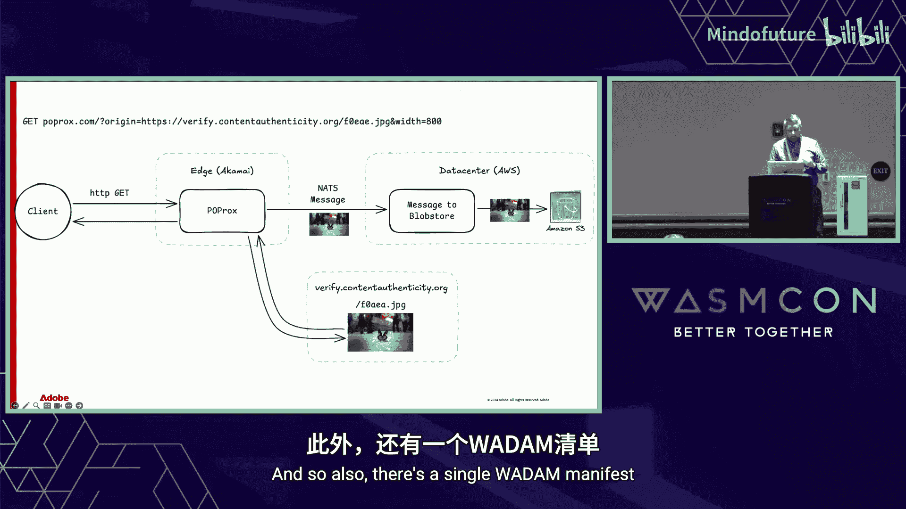

然而，目前存在一个服务缺口。用户使用合规的相机和软件，在合规的社交平台发布图片后，当其他用户通过内容分发网络下载时，图片的元数据通常会在 CDN 的图片处理（如调整大小）过程中被剥离。用户无法获得这些溯源信息。

本节课的核心演示将展示如何解决这个问题。

## 演示概述：分布式图像处理与签名服务

我们的演示将构建一个服务来解决上述问题。用户请求下载一张图片，并指定所需宽度。服务将在边缘（CDN）调整图片大小，并将这次调整操作记录到 C2PA 清单中，然后对清单进行签名。最终，用户下载到的图片将包含完整的、经过签名的溯源信息。

这个用例的独特之处在于，它无法完全在数据中心或完全在边缘运行。

*   **无法完全在边缘**：Adobe 的签名密钥非常敏感，不能存放在边缘节点。我们使用 AWS KMS 或云 HSM 来管理密钥。
*   **无法完全在数据中心**：如果所有图片流量都回源到数据中心，网络成本（尤其是视频等大流量场景）将非常高昂。

因此，我们需要一个架构：在边缘接收请求，与数据中心的密钥服务交互，再将结果返回到边缘。用现有的边缘计算技术实现这一点非常困难。

一年半前，我在阿姆斯特丹演示过一个雏形，但当时需要修改大量代码，且功能不完整。今天的演示则不同：我们将展示一个完全工作的系统，它编译为 WASI，并实际运行在跨越 **Akamai 边缘**和 **AWS 数据中心**的 WasmCloud 集群上。

整个应用通过一份统一的 WasmCloud 部署清单（YAML 文件）来定义。这份清单描述了应用的所有组件（2个组件，4个提供者）。我们可以声明式地指定哪些部分运行在 Akamai，哪些部分运行在 AWS。应用一次部署，即可全局更新。

接下来，有请 Doug 详细介绍我们对于超分布式云的愿景。

## 超分布式云架构愿景

谢谢 Colin。我想谈谈我们对云部署演进的愿景，以支持 Colin 刚才描述的这类解决方案。

首先，是传统的**核心云模型**。它提供有限的几个区域，但给人一种拥有虚拟无限资源的错觉。

其次，是**分布式云**。目标是将应用部署到成百上千个更靠近用户的位置，同时为开发者提供与核心云相似的体验。WebAssembly 因其轻量级和安全性，是此类解决方案的绝佳技术。

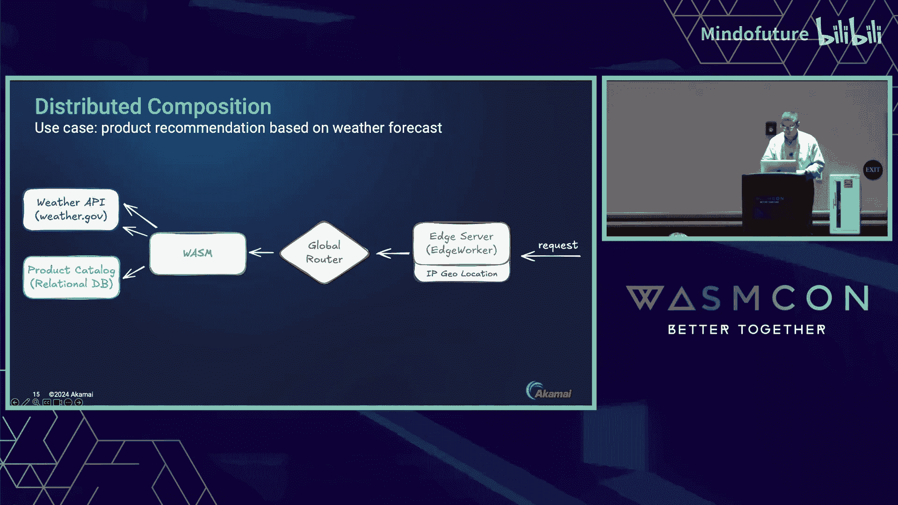

最后，是传统的**边缘计算**。通常指在 CDN 最外层运行代码，处理请求/响应事务。它非常普及，但有时受限于无状态和请求周期的约束。

我们的愿景是构建一个**超分布式云**，融合以上所有层次的优势，创造独特的使用场景。

让我用一个更具体的例子来说明：一个基于天气预报的**产品推荐功能**。

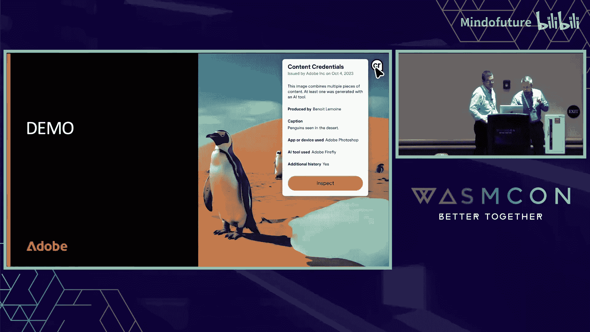

架构从左到右分为三层：
1.  **边缘层**：在数千个位置接收请求，进行基础处理（如通过本地地理数据库进行 IP 地理定位）。
2.  **分布式层**：通过**全局路由器**，将用户请求智能地路由到运行在数百个位置的 **WasmCloud 服务**。路由策略考虑健康状态和地理邻近性，以实现低延迟和节省数据传输成本。此服务作为协调器，调用外部天气 API 获取用户当地的预报。
3.  **核心层**：根据天气信息，查询位于核心数据中心的**产品目录数据库**，获取推荐商品。

这个架构展示了如何将逻辑拆分，并部署在最合适的层级上。

现在，让我们回到 Colin 的演示，看看实际运行效果。

## 现场演示

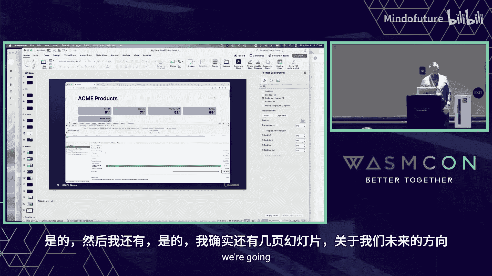

好的，我们来看实际网页。

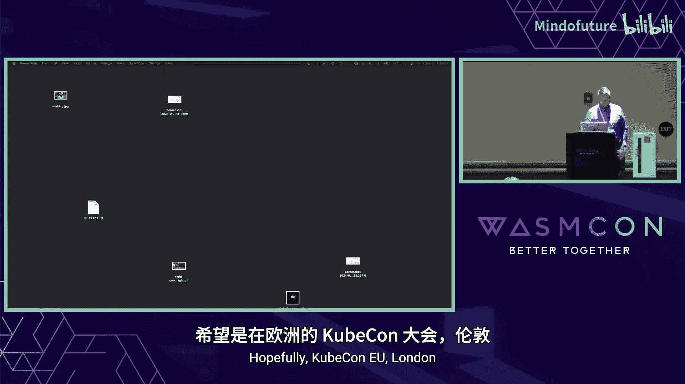

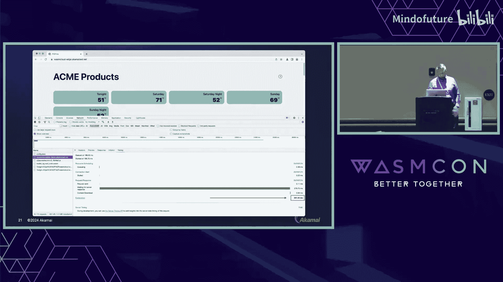

（刷新网页，页面快速加载）感谢 CDN。正如 Doug 所说，页面显示了基于本地天气的推荐产品。当前温度大约 60 华氏度，所以显示的是温暖天气的产品。

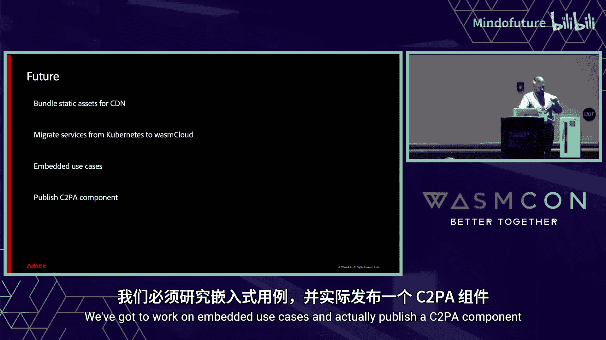

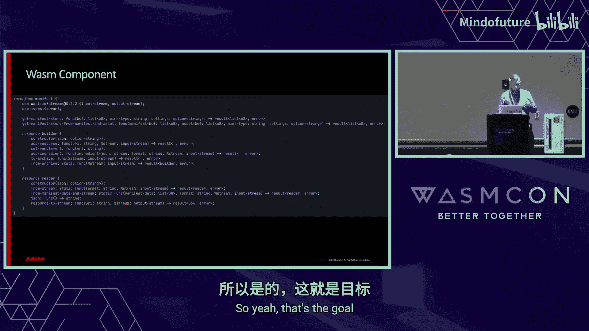

如果我们检查页面中的图片，并使用内容真实性验证网站，可以看到图片的溯源信息。例如，这张图片最初由不支持 C2PA 的相机拍摄，然后上传到 Adobe Stock 并签名，最后在我们运行于 Akamai 边缘的 WasmCloud 代理服务中被调整大小，并添加了新的签名记录（使用测试证书）。

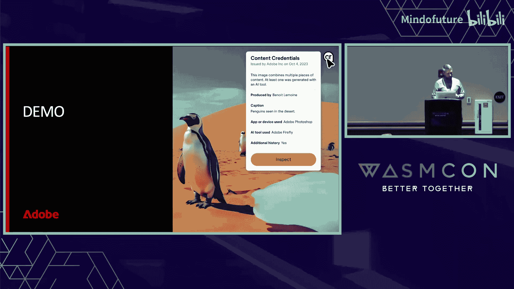

另一张由 Adobe Firefly 生成的图片，也经历了类似的边缘处理流程。

我们还可以手动输入图片 URL 和宽度参数，服务会在服务器端获取、处理并返回带签名的图片。这一切都是在服务器端完成的，为未来集成更复杂的 AI 推理等操作奠定了基础。

## 未来展望

展望未来，我们希望：
1.  制定与静态资源捆绑的通用规范，以便跨 CDN 使用。
2.  将更多现有服务从 Kubernetes 迁移到 WasmCloud。
3.  探索嵌入式设备用例。
4.  发布标准的 **C2PA WebAssembly 组件**。

这样，任何开发者都可以直接使用这个组件来为应用添加内容真实性功能，无需关心底层实现，从而覆盖 Web、服务器和嵌入式全场景。

## 总结与问答

本节课中，我们一起学习了如何利用开源 WebAssembly 和 WasmCloud，在超分布式云架构上构建混合边缘-数据中心应用。我们通过 Adobe 内容真实性倡议的实际案例，演示了如何解决图片溯源信息在 CDN 传输中丢失的难题。关键在于，WasmCloud 提供了一致的部署和管理体验，使开发者能够轻松地将逻辑部署在最合适的位置（边缘、分布式节点或核心云），并安全地互联互通。这代表了边缘计算能力的一次重要演进。

现在进入问答环节。

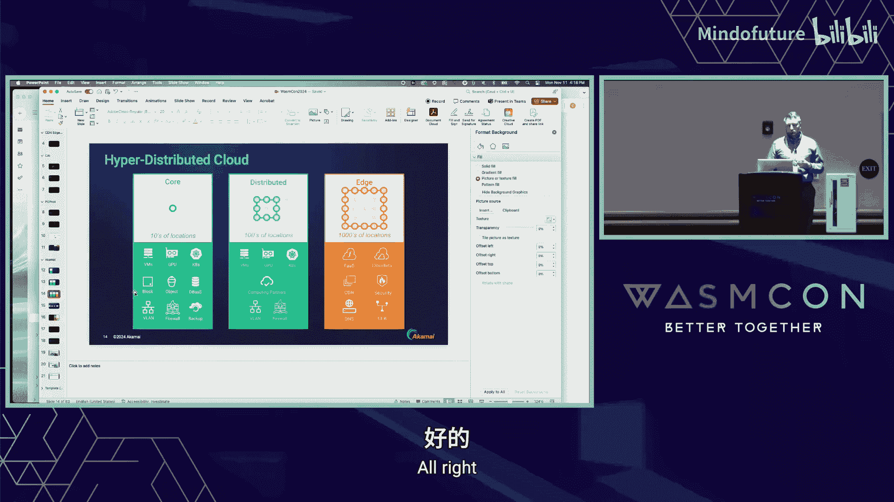

**(问答环节内容已整合到教程正文的相关部分，以保持行文连贯。)**