# 014：使用机密计算与可信执行环境

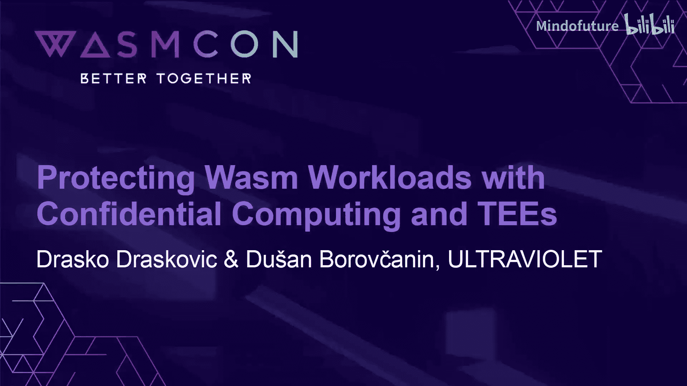

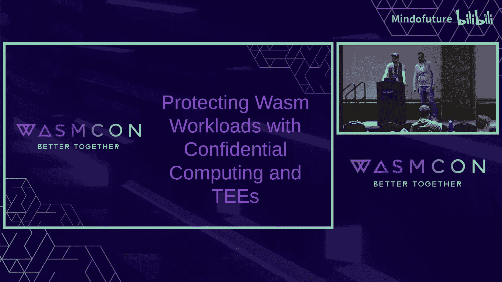

## 概述

在本教程中，我们将学习如何利用**机密计算**和**可信执行环境**来保护 WebAssembly 工作负载，特别是在处理敏感数据（如人工智能算法）的场景下。我们将探讨机密计算的基本概念、现有解决方案，并通过一个具体的演示来展示其工作原理。

---

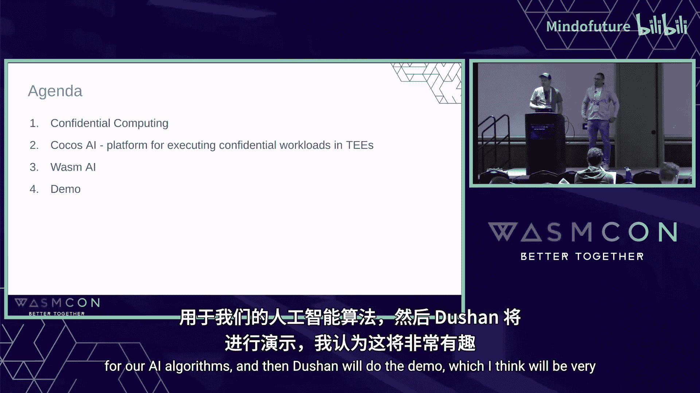

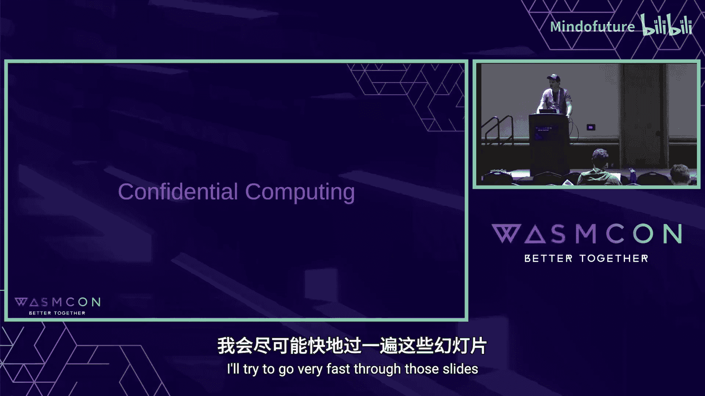

## 章节 1：机密计算简介

上一节我们概述了本课程的目标，本节中我们来看看什么是机密计算。

保护传输中的数据是一个已解决的问题。保护静态数据也可以通过磁盘加密来实现。然而，当 CPU 需要使用实际数据时，它需要从内存中以明文形式读取，此时数据并未受到保护。任何人都可以转储内存并获取机密数据。

目前有几种技术正在发展中以解决此问题。其中一种是纯加密方法，称为**全同态加密**。这项技术在 2009 年被证实，是一种较新但计算挑战性很大的密码学技术，对于像 AI/ML 算法这样的大量工作负载来说效率仍然很低。

另一种有前景的技术是**机密计算**，它是基于硬件的。该解决方案基于现代 CPU 供应商提供的扩展，例如 Intel 的 SGX 或 TDX、AMD 的 SEV-SNP、Arm 的 CCA 以及 RISC-V 的 Keystone 等。这项技术之所以有前景，是因为在机密虚拟机与内存之间，CPU 和内存之间会实时进行加密处理。这意味着虚拟机占用的那部分内存始终是加密的。

---

## 章节 2：可信执行环境的挑战与机遇

上一节我们介绍了机密计算的基本原理，本节中我们来看看其具体实现形式——可信执行环境所面临的挑战。

我们可以设想在可信执行环境或内存加密的虚拟机中进行集中式机器学习，将数据和模型带入进行推理。我们甚至可以进行分散式的联邦机器学习。

然而，这些 TEE 通常作为裸机虚拟机运行。这意味着没有底层的操作系统，也没有硬件抽象层，这使得事情变得困难。为了提供更高的抽象层，通常需要安装某种 Linux 操作系统。但问题在于，我们希望保持所谓的**可信计算基**尽可能小。那么，能够在那里提供并运行可靠的多语言应用程序的最小运行时是什么？这自然为 WebAssembly 提供了一个绝佳的机会。

---

## 章节 3：Elastic-6G 项目与解决方案探索

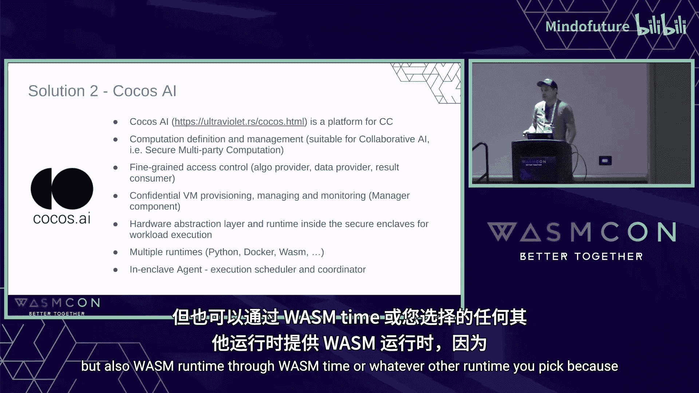

上一节我们讨论了 TEE 的抽象层问题，本节中我们来看看一个旨在解决此类问题的研究项目。

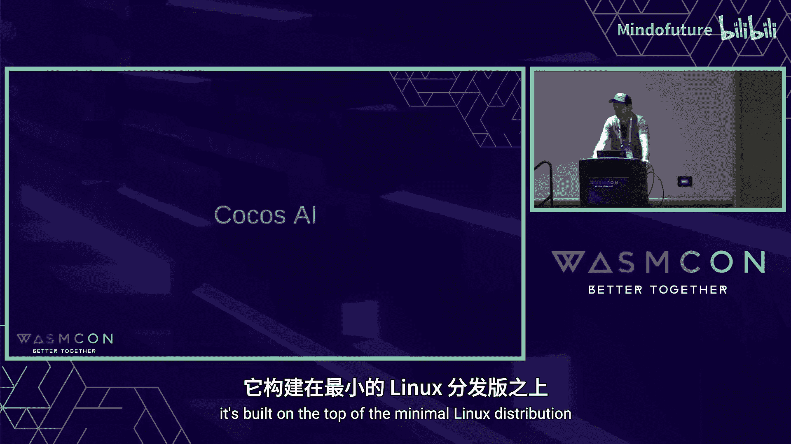

Elastic-6G 是一个大型欧盟项目，由 13 个组织参与，包括爱立信、西班牙电信等大公司、研究机构和初创公司。该项目预算为 500 万欧元，为期三年。该项目专注于研究在新型 6G 电信基础设施上对 WebAssembly 功能（即函数即服务）的编排，并且对将机密计算节点纳入该编排非常感兴趣。

Elastic 项目研究能够解决机密计算赋能问题的优秀解决方案。其中一个非常成熟但开源状态并非完美的项目是 **Enarx**，它已捐赠给 Linux 基金会。Enarx 主要面向在可信执行环境中运行 Wasm，特别是部署那些虚拟机。这是一个不简单的任务，因为这些虚拟机必须经过认证，并且有一个必须执行的流程。在 TEE 内的 Wasm 运行时必须提供足够的能力来运行不同类型的服务，最终启用网络甚至文件系统等。

我们正在研究和开发的另一个解决方案叫做 **Coco AI**，由 Ultraviolet 公司构建。Coco AI 更侧重于**安全多方计算**，即多个互不信任的参与方（例如算法提供者和多个数据提供者）可以组合数据集。可信执行环境的安全飞地看起来是一个非常好的候选方案，它可以提供绝对的机密性，使得数据交换和算法应用可以在不向任何其他方泄露数据的情况下进行。

---

## 章节 4：Coco AI 平台架构解析

上一节我们提到了 Coco AI 平台，本节中我们来深入了解其架构。

在多方计算场景中，例如多家医院需要交换高度机密的数据，而一家 AI 公司可以提供算法。此时，机密虚拟机或可信执行环境可以成为一个场所，供他们上传数据和算法。算法可以在其中执行，只有推理结果或训练后的模型等结果可以返回给指定的结果消费者。

为了实现这一点，我们需要一种方式来启动可信执行环境，因为它本质上是虚拟机，需要某种能够启动特定类型机密虚拟机的虚拟机管理器。

在机密虚拟机内部，由于它是一个真正的密封盒子，除了可能通过 TLS 连接上传数据外，无人能访问。我们不仅需要硬件抽象层，还需要一种代理来协调这种安全多方计算执行，并接受不同的工作负载、数据集和算法，并拥有一个状态机，以便在所有不同的参与方（例如医院）上传其数据集后启动执行。

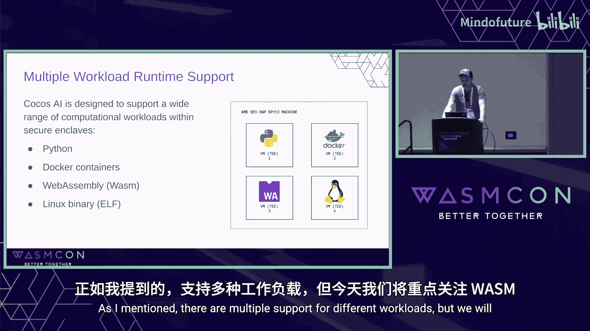

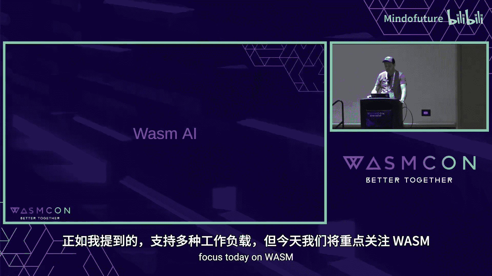

管理器需要内置一些逻辑，以便知道部署哪种安全虚拟机。这依赖于架构，因为可以有 AMD 的 SEV-SNP 技术或 Intel 的 TDX 等。管理器还能够抽象不同的架构。

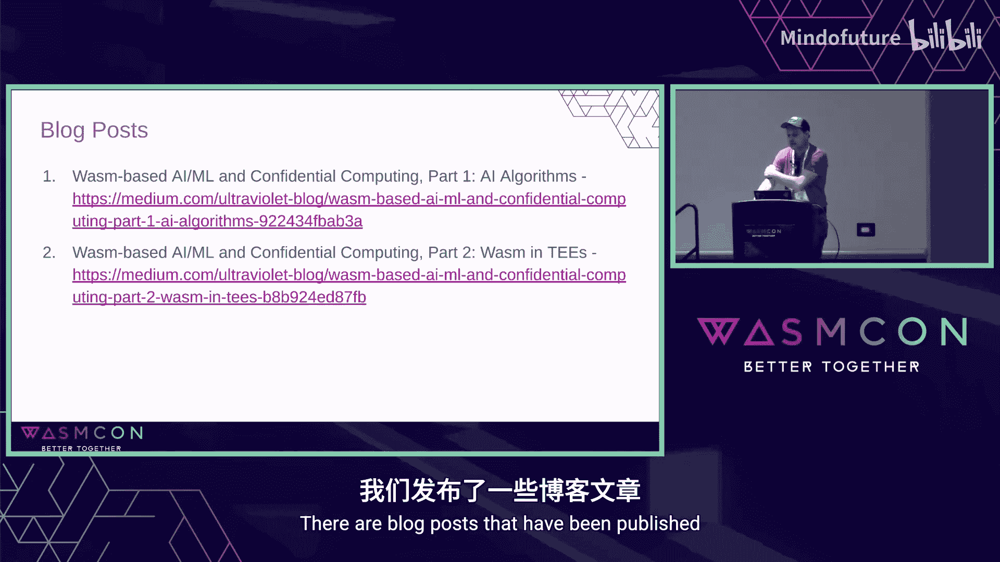

代理的作用是充当协调器，以便上传不同的数据集和算法，并能够启动执行。但机密计算的一个关键主题是所谓的**远程认证**。远程认证由硬件完成，测量由可信执行环境或 CPU 扩展本身执行。然后，整个虚拟机启动过程的测量值作为认证报告或测量值提供给验证者。验证者可以联系不同类型的背书者（取决于架构和供应商）来验证测量值，从而真正确定正在运行的是这种类型的机密虚拟机，并且飞地内只运行这种类型的软件系统。只有在认证完成并验证后，我们才能确信可以上传算法。

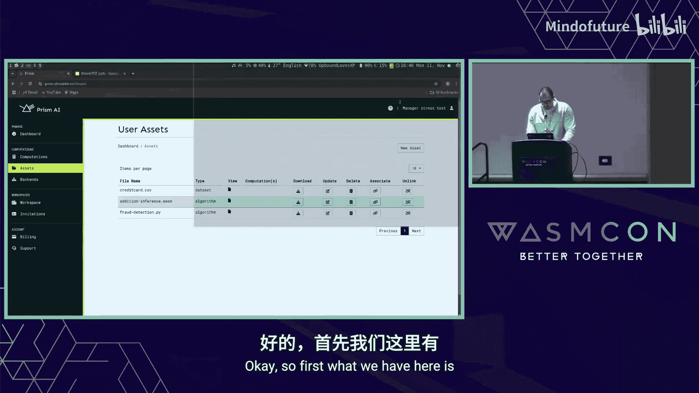

Coco AI 中的代理还具有执行这些远程认证的逻辑。在 Coco AI 的特定案例中，认证被内置在建立 TLS 连接的过程中，即在 TLS 握手期间。这是由 IETF 的 RATS 工作组标准化的技术，称为 **Attested TLS**。这是一个仍在开发中的新标准。

---

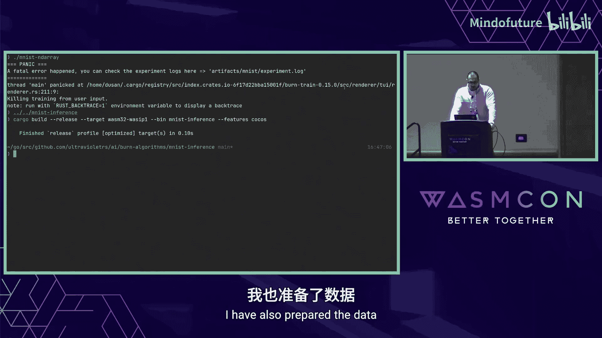

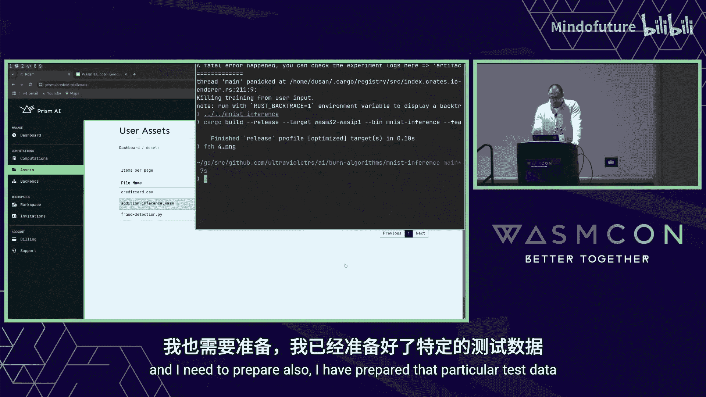

## 章节 5：用于 AI 的 Wasm 工作负载与 Burn 库

上一节我们介绍了 Coco AI 的架构，本节中我们来看看用于构建 AI 算法的 Wasm 工作负载。

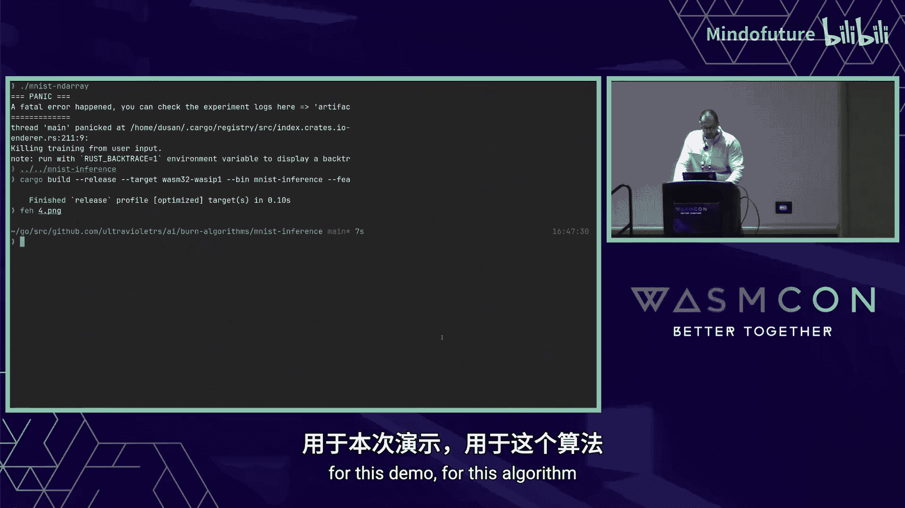

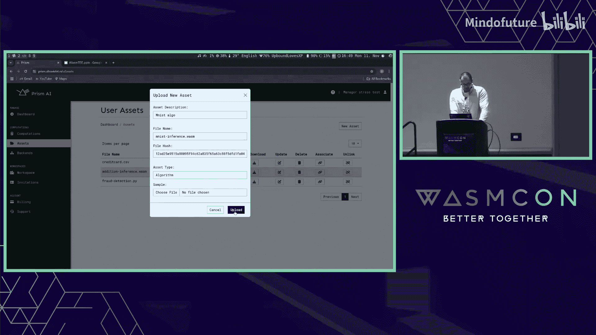

Coco AI 支持多种工作负载，但今天我们专注于 Wasm。为了测试、制作概念验证并进一步开发，我们需要找到一个优秀的库来在其上构建 Rust 算法。我们发现最好的库之一是 **Burn AI**。它在某种程度上可与 PyTorch 或其他有趣的库相媲美，支持 CPU 和 GPU。GPU 支持从机密计算的角度来看很有趣，因为 GPU 本身现在有非常相似的问题：在 GPU 中进行的计算也必须在内存的加密部分完成，因此它们需要具备相同的能力。目前市场上只有少数 GPU 具备这些能力，且很难获得，因此很难进一步开发和测试这些功能。

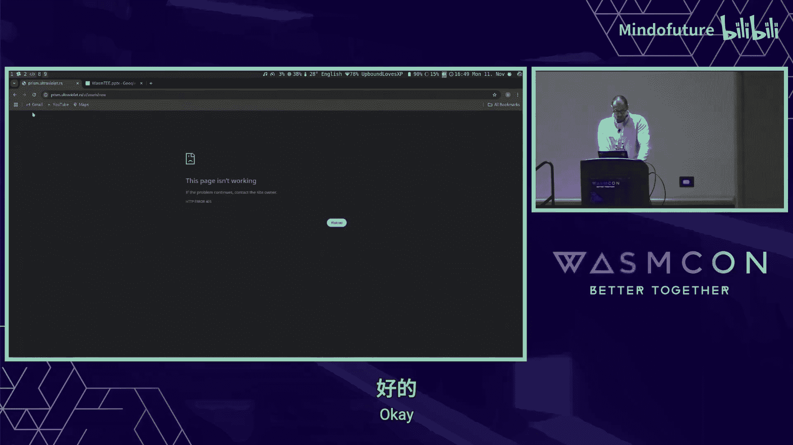

我们使用这个库，你可以在 Ultraviolet 的代码仓库中找到许多使用它构建的示例，用于测试机密计算。相关的博客文章已经发布，解释了演示中看到的内容。

---

## 章节 6：实战演示：在 TEE 中运行 Wasm AI 推理

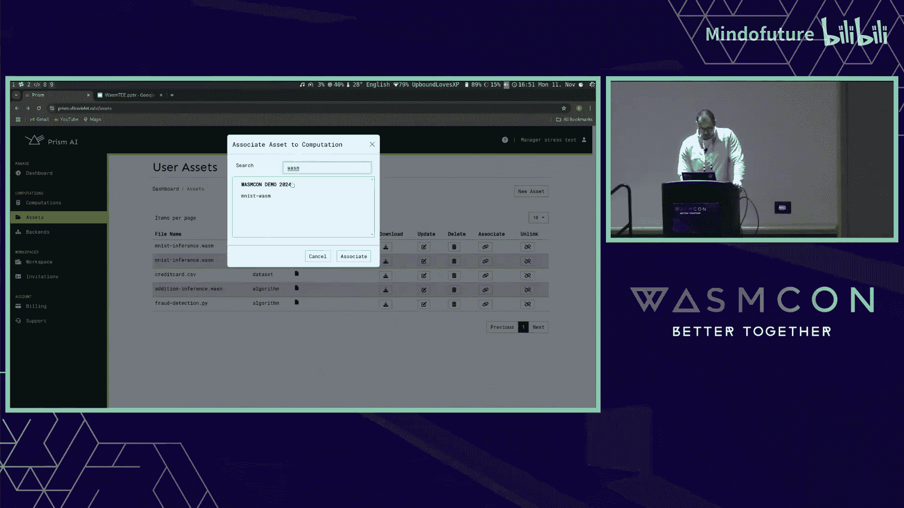

上一节我们介绍了用于 AI 的 Wasm 工具，本节中我们通过一个完整的演示来看看这一切是如何运作的。

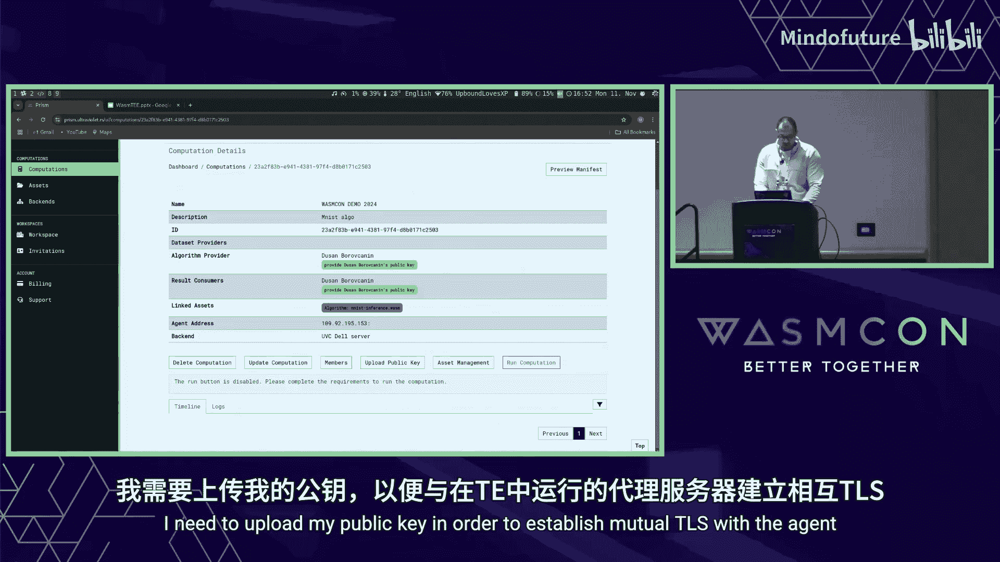

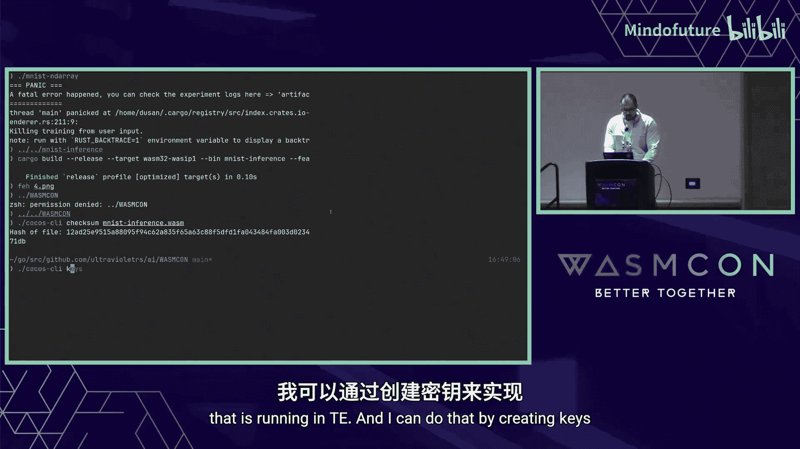

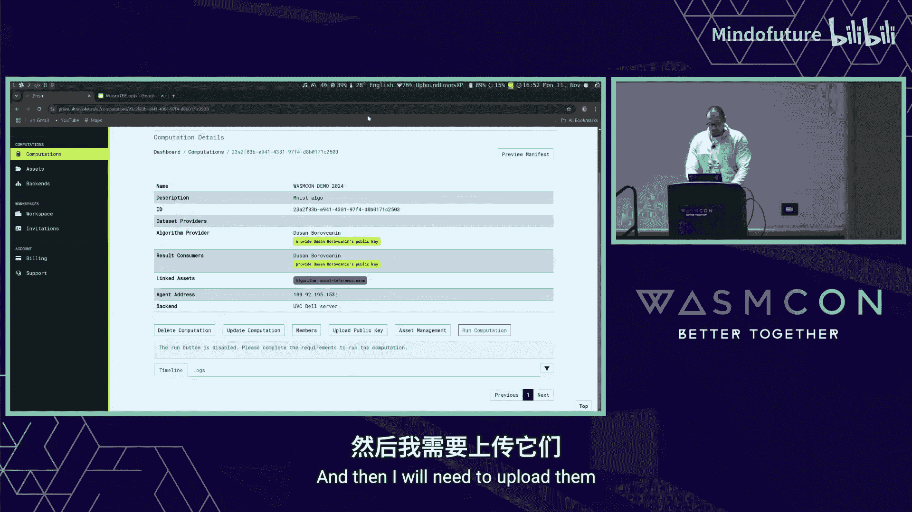

演示将展示一个光学字符识别的 MNIST 数据集示例。我们使用 Burn 库训练了一个模型，并构建了其推理版本。我们准备了一个 Wasm 二进制文件，该文件将使用通过 Burn 库训练的模型进行推理。我们还准备了测试数据（数字“4”的图像），并将其转换为字节数组作为输入。

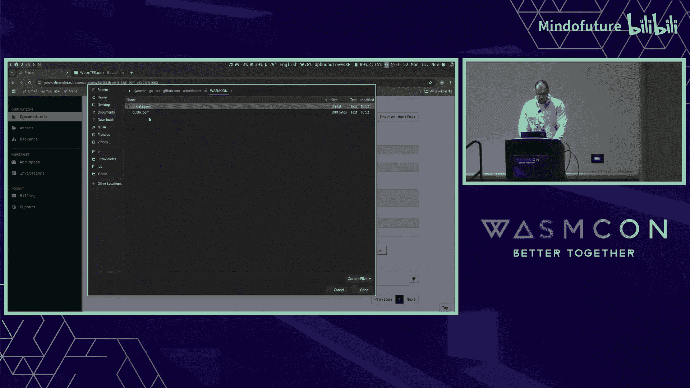

演示步骤涉及在 Coco AI 平台（此处称为 PrimAI）上创建资产（算法）、创建计算任务、关联算法、生成并上传用于 TLS 认证的密钥，最后启动计算。平台会与管理器通信，在 TEE 中启动一个机密虚拟机，并通过 Attested TLS 安全地上传算法和数据。计算完成后，只有被授权的结果消费者可以获取结果（识别出的数字“4”）。演示强调了整个过程中数据的机密性、完整性和计算的不可篡改性。

---

## 章节 7：未来工作方向

上一节我们完成了整个流程的演示，本节中我们展望一下未来的研究方向。

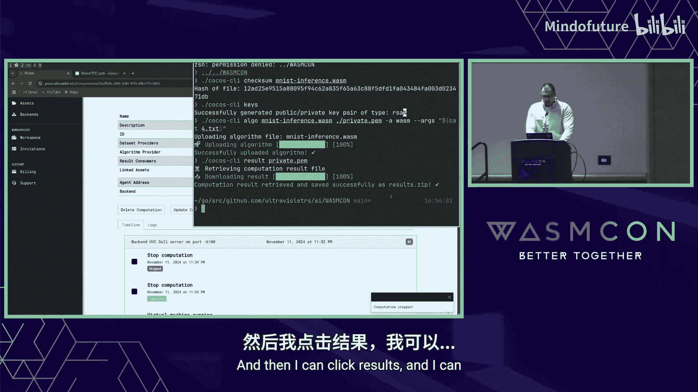

未来的工作主要集中在以下几个方面：
*   更好地支持 **Enarx**，特别是研究位于 Wasm 运行时和 Linux 操作系统之间、作为系统调用代理的微内核。
*   研究其他潜在的 Unikernel 方法，例如使用 HermitCore 或 Unikraft 构建 Linux Unikernel，甚至研究 seL4 微内核。
*   由于 Elastic 项目研究物联网设备上的编排，Zephyr RTOS 也是一个潜在的、可以运行 Wasm 运行时的高抽象层。
*   编排器本身是一个重大的研究课题，因为它现在不仅需要能够编排标准节点上的 Wasm 工作负载，还需要考虑可信执行环境及其必需的认证流程。
*   或许可以重用 CNCF 在机密容器方面的工作，并用 Wasm 替代 Docker。
*   RISC-V 是一个非常有吸引力的架构，特别是在物联网领域。我们希望致力于更好地支持 RISC-V，尤其是在 RISC-V 上的机密飞地内运行机密计算和 Wasm。

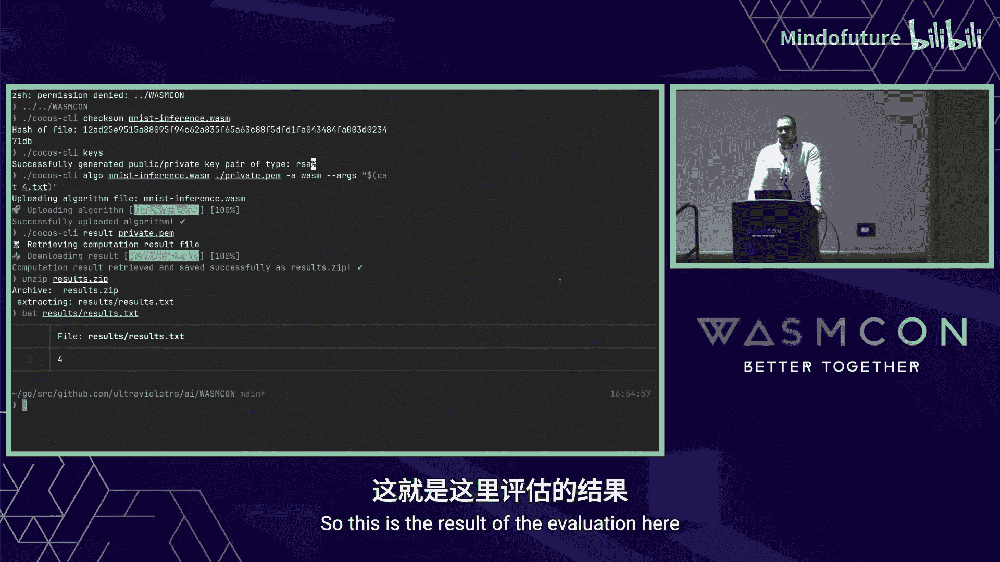

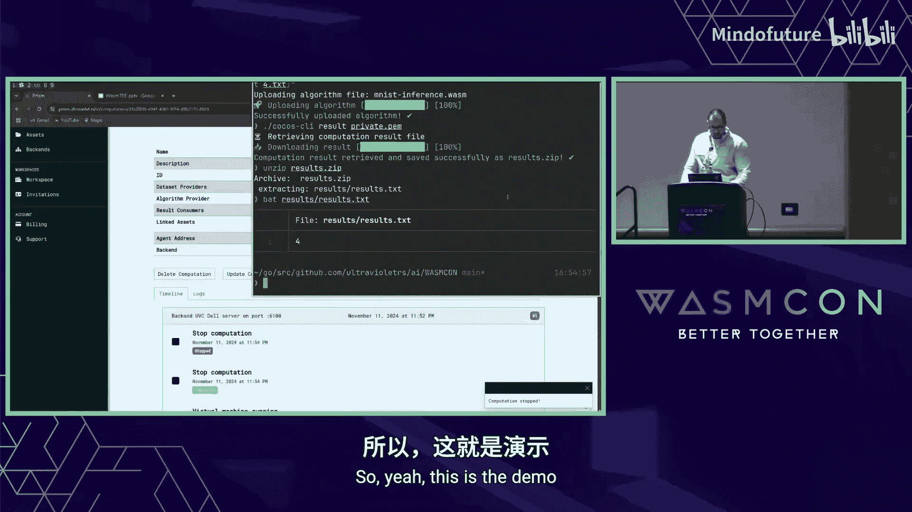

---

## 章节 8：关键补充：远程认证

在结束之前，需要补充一个非常相关且重要的部分：**远程认证**。

每次与可信执行环境建立连接时，除了标准的双向 TLS 之外，实际上还会进行这种远程认证。它包括许多步骤，本身就是一个主题。简而言之，它就是验证特定软件是否运行在特定硬件上，并且你可以信任它。这涉及到支持可信执行环境的特定硬件（例如我们的私有实例）。目前最流行的是 AMD SEV-SNP，但也有 Intel TDX。希望未来会有更多选择，并且能更多出现在消费级领域（目前主要是服务器 CPU）。

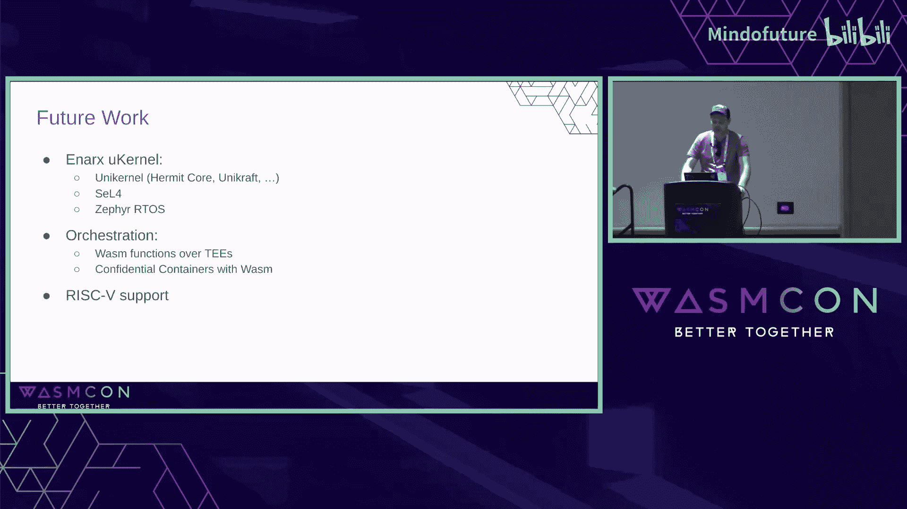

关于运行特定的 Wasm 运行时，在我们的硬件抽象层（即我们的最小化 Linux 发行版）中，更换 Wasm 运行时非常简单容易。目前我们运行的是 Wasmtime，但它可以是任何运行时。这对于在 TEE 中运行 Wasm 工作负载来说也是非常重要的一部分。

---

## 总结

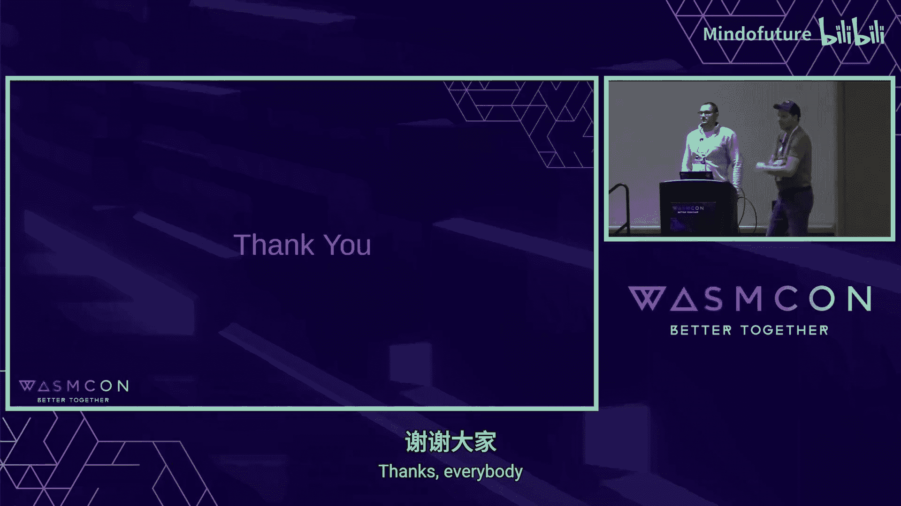

在本教程中，我们一起学习了如何利用机密计算和可信执行环境来保护 WebAssembly 工作负载。我们从机密计算的基本概念和挑战出发，探讨了 Enarx 和 Coco AI 等解决方案。通过深入分析 Coco AI 的架构和一个完整的 MNIST 推理演示，我们直观地理解了在安全飞地中执行敏感 Wasm 工作负载的完整流程，包括资产管理、计算编排、远程认证和安全数据传输。最后，我们展望了未来在微内核、Unikernel、跨平台编排以及 RISC-V 支持等方面的研究方向。机密计算为在不受信任环境中处理敏感数据提供了强大的硬件级安全保障，而 WebAssembly 则为其提供了灵活、高效且安全的软件运行时载体。