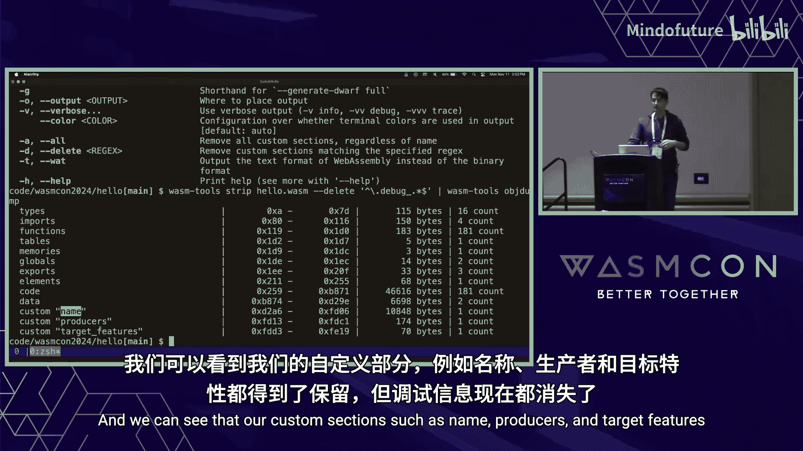
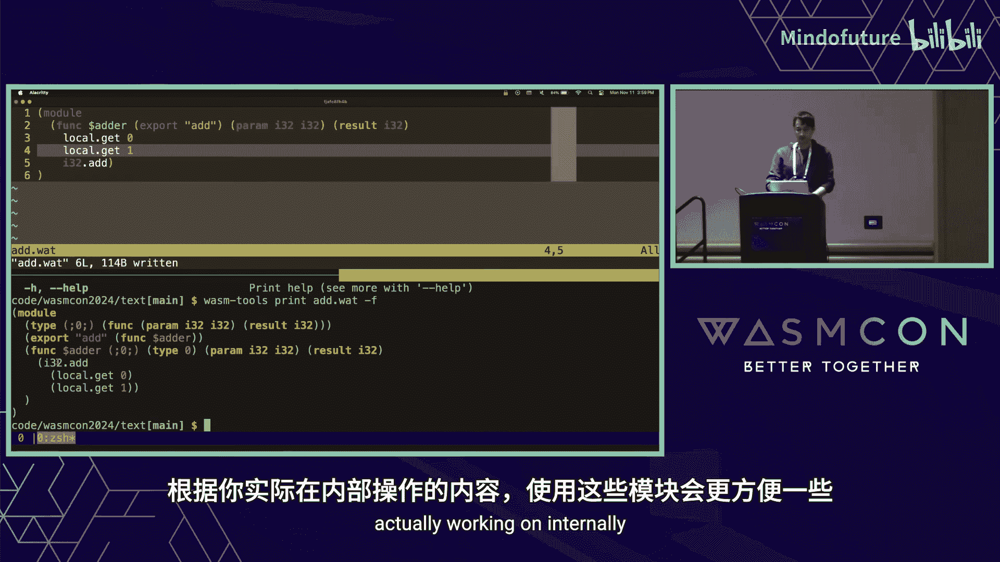
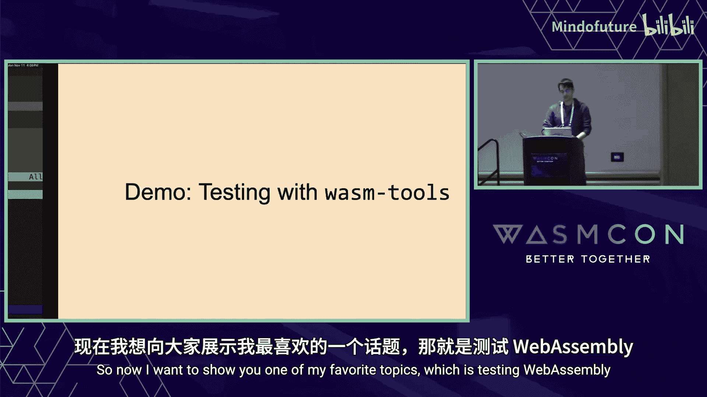
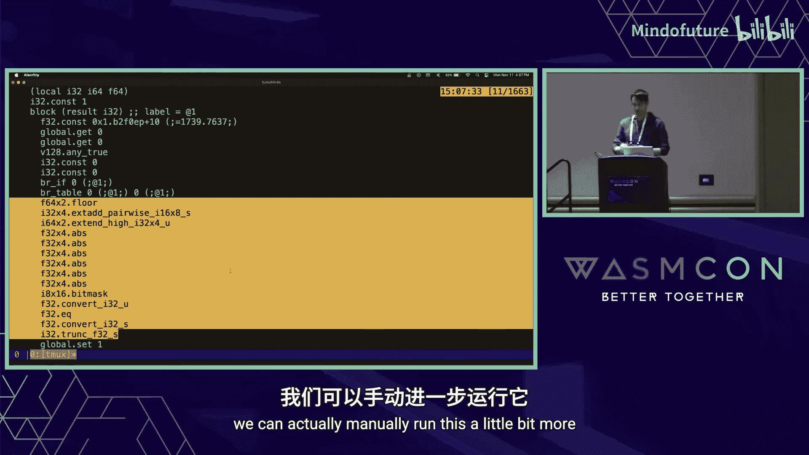
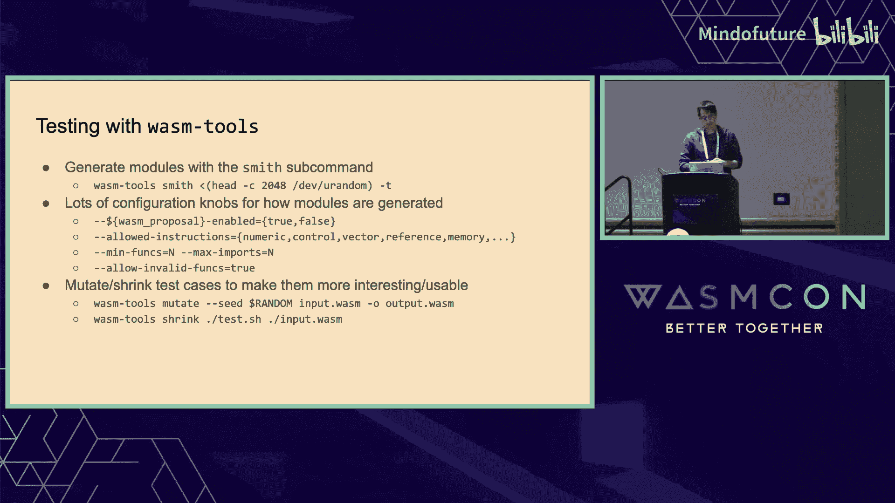
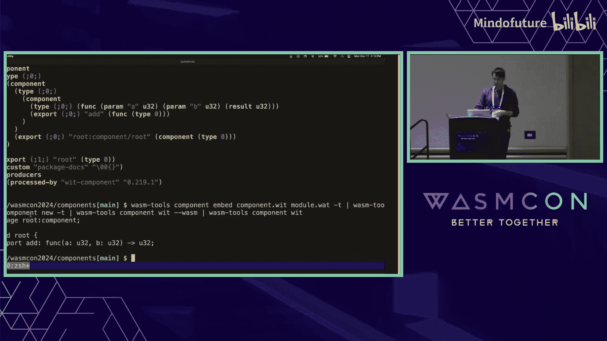
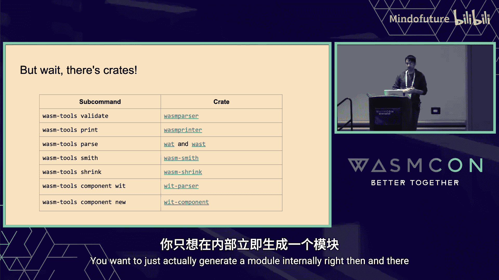
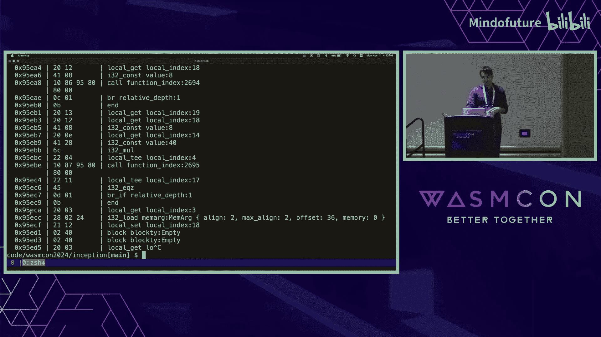
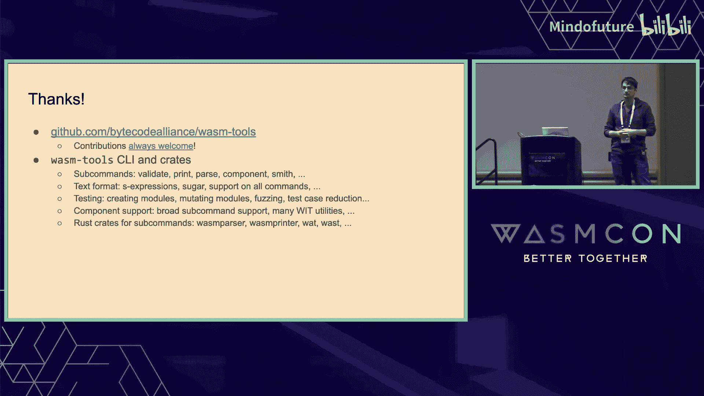
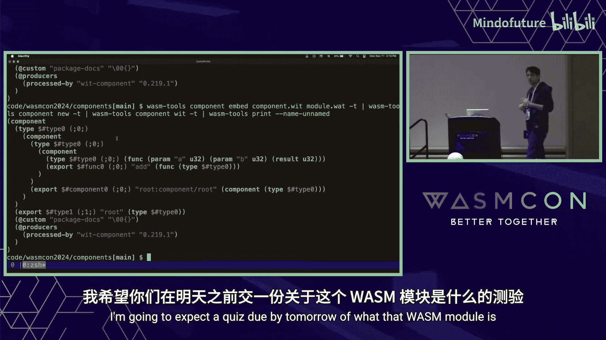

# 015：Wasm 工具漫游指南

在本节课中，我们将要学习 `wasm-tools`，这是一个用于操作 WebAssembly 模块的命令行工具套件和底层库。我们将通过一系列演示，探索如何检查、验证、转换、测试和操作 Wasm 模块及其文本格式。


---

## 1：什么是 Wasm Tools？ 🛠️

`wasm-tools` 是一个命令行接口和一套低级库，用于操作 WebAssembly 模块。这是一个托管在 Bytecode Alliance 的开源项目，欢迎任何有兴趣添加各种子命令或功能的人贡献代码。

其核心思想是将大量功能集成到一个名为 `wasm-tools` 的单一命令中，该命令内部包含许多子命令，用于探索 Wasm 模块并查看其内部功能。


它与其他项目类似，例如 `wasm-opt`、`wabt` 或 `binaryen`（不是其编译部分，而是文本与二进制转换等工具部分）。`wasm-tools` 的一个重要部分是，它也是 Wasmtime 运行时本身的基础。二进制解码器、二进制翻译、二进制读取以及大量测试都依赖于它。本次演讲将介绍其中许多功能，并演示它们如何工作。所有这些都旨在用于 Wasmtime，并且在生产环境中也是稳定可靠的。

---

## 2：探索 Wasm 模块内容 🔍

现在，让我们进入实际操作部分。假设我们想探索一个 Wasm 文件。首先，我们从一些 Rust 代码开始，并将其编译为 Wasm。

```bash
rustc --target wasm32-wasi hello.rs -o hello.wasm
```

这会生成一个 `hello.wasm` 文件。我们可以使用像 `wasmtime` 这样的运行时来执行它，它会打印出我们期望的信息。但我们好奇的是，这个模块内部到底是什么。

如果我们直接查看这个模块的二进制内容，会看到很多难以理解的字节。这不是 WebAssembly 二进制格式的预期阅读方式。这时，`wasm-tools` 就派上用场了。


我们可以使用 `wasm-tools` 的 `print` 子命令来查看模块内容。

```bash
wasm-tools print hello.wasm
```

屏幕上会瞬间闪过大量文本，内容非常多。我们可以将其重定向到一个文件中以便查看。

```bash
wasm-tools print hello.wasm > hello.wat
```

这个文件展示了 Wasm 模块的内部结构，即二进制格式的文本表示形式。它对应着我们之前看到的那些字节。文本格式大量使用括号，包含了类型、导入、表、全局变量、函数和指令等。滚动到文件底部，可以看到一些大的二进制数据块，这些是数据段和自定义段，其中包含了一些较大的调试信息。

总之，这让我们能够查看 Wasm 模块的内部结构。

---

## 3：验证与特性探测 ✅

接下来，我们可以看看 `validate` 子命令。一个随机的字节块不一定是有效的 Wasm 二进制文件，必须通过验证谓词检查。

```bash
wasm-tools validate hello.wasm
```

如果没有输出，并且返回码为零，则表示验证成功。我们可以通过 `--features` 标志来控制启用的 Wasm 特性，甚至可以将其回退到原始的 Wasm 提案版本。

```bash
wasm-tools validate hello.wasm --features=-all
```

这时，模块可能不再有效，说明它使用了一些新特性。为了找出具体是哪些特性，我们可以使用 `print` 子命令的 `--print-offsets` 选项。

```bash
wasm-tools print -p hello.wasm | less
```

通过搜索错误信息中提到的偏移量，我们可以定位到导致验证失败的特定指令。例如，可能是 `call_indirect` 指令（其编码随引用类型提案而改变），或者是 `memory.copy` 指令（来自批量内存提案），亦或是符号扩展提案中的指令。我们可以逐一启用这些特性来验证。



```bash
wasm-tools validate hello.wasm --features=reference-types,bulk-memory,sign-extension
```

通过这种方式，我们可以探索 Wasm 模块，查看它使用了什么，或者精确定位模块内部出错的位置。

---


## 4：简化查看与名称还原 📄

之前打印模块时，内容非常多。`print` 子命令有一个 `--skeleton` 参数，可以帮助我们在更高层次上探索模块。

```bash
wasm-tools print --skeleton hello.wasm
```

使用这个参数后，调试信息会被替换为 `...`，所有函数体也会被替换为 `...`，我们可以快速扫描并了解模块内部的大致情况。

不过，我们首先会注意到，这些函数名看起来像乱码。这是函数名的“混淆”形式，类似于原生平台上的名称修饰。如果我们想去掉这种混淆，可以使用 `demangle` 子命令。

```bash
wasm-tools demangle hello.wasm -t
```

这会产生大量输出。`wasm-tools` 的一个特性是我们可以将命令管道连接在一起。例如，我们可以将 `demangle` 的输出通过管道传递给带有 `--skeleton` 参数的 `print` 命令。

```bash
wasm-tools demangle hello.wasm -t | wasm-tools print --skeleton
```

现在，我们看到了漂亮的还原后的函数名，看起来更清晰，也更像原生的 Rust 代码。

---

## 5：分析模块大小与剥离 🔪

我们的 `hello.wasm` 文件有 1.7 MB，这对于一个简单的 Hello World 来说太大了。让我们探索一下为什么它这么大。我们可以使用 `objdump` 子命令，它是原生 `objdump` 的一个简化版本。

```bash
wasm-tools objdump hello.wasm
```

输出显示了 Wasm 模块的各个段、它们在二进制文件中的位置、大小以及内部包含的项目数。例如，这个模块内部有 181 个函数。从输出列中，我们可以清楚地看到调试信息是问题所在（这是在没有优化的情况下编译的，且未剥离）。

我们可以使用 `strip` 子命令来剥离这些信息。

```bash
wasm-tools strip hello.wasm -o hello-stripped.wasm
wasm-tools objdump hello-stripped.wasm
```



现在，调试段都消失了。我们还可以通过指定正则表达式，只删除特定的自定义段，比如调试信息段，而保留如 `name`、`producers` 等段。

```bash
wasm-tools strip hello.wasm -r 'name\.debug.*' -o hello-no-debug.wasm
wasm-tools objdump hello-no-debug.wasm
```

剥离后，文件大小从 1.7 MB 减小到了 54 KB。

---



## 6：处理文本格式 📝

以上是使用 `wasm-tools` 处理二进制模块的基础。`wasm-tools` 包含许多子命令，可以通过 `-h` 查看。这些子命令通常接受 Wasm 输入并输出 Wasm，可以选择处理文本或二进制格式，默认输出到标准输出，这使得我们可以轻松地将命令管道连接起来，交互式地处理模块。

现在，让我们更多地使用 WebAssembly 的文本格式。我们准备了一个简单的文本格式模块示例 `add.wat`：

```wat
(module
  (type (func (param i32 i32) (result i32)))
  (func $add (type 0) (param i32 i32) (result i32)
    local.get 0
    local.get 1
    i32.add)
  (export "add" (func $add))
)
```

这个模块定义了一个将两个数字相加并返回结果的函数。首先，我们可以使用 `parse` 子命令将其转换为二进制。

```bash
wasm-tools parse add.wat -o add.wasm
```

这会生成一个 `add.wasm` 文件，它比文本格式小得多。我们可以验证它是一个有效的模块。`wasm-tools` 的一个便利之处是，大多数命令都可以透明地接受文本格式作为输入，在内部将其编译为二进制后再进行处理。

```bash
wasm-tools validate add.wat
```

如果文本格式有错误，验证会失败。但错误信息指向的是二进制偏移量，而不是原始文本行号。为了帮助定位错误，我们可以在从文本编译到二进制时生成 DWARF 调试信息。

```bash
wasm-tools parse add.wat -g -o add.wasm 2>&1 | head -20
```

现在，错误信息会包含文件名和行号，这对于在大型文本文件中定位错误非常有帮助。

---

## 7：Wast 格式与测试 🧪

WebAssembly 还有一种用于规范测试的上游文本格式，称为 `.wast` 格式。它看起来与 `.wat` 类似，但可以包含断言。

```wast
(module
  (func $add (param i32 i32) (result i32)
    local.get 0
    local.get 1
    i32.add)
  (export "add" (func $add))
)
(assert_return (invoke "add" (i32.const 1) (i32.const 2)) (i32.const 3))
```

`wasm-tools` 提供了 `json-from-wast` 子命令来处理这种格式。

```bash
wasm-tools json-from-wast add.wast -p
```

这个命令会输出 JSON，它比直接解析整个 `.wast` 文本格式对工具来说更友好。JSON 中包含了模块二进制和断言信息，便于测试工具消费。

此外，文本格式有很多“语法糖”，使得读写更容易。例如，类型可以隐式定义，导出可以内联声明，指令可以以更符合人类阅读习惯的“折叠”形式书写。

---

## 8：生成与变异测试用例 🧬

如果你正在编写一个 Wasm 运行时，可能需要生成测试用例。`wasm-tools` 的 `smith` 子命令是一个 Wasm 测试用例生成器。

```bash
head -c 100 /dev/random | wasm-tools smith -t
```

每次运行都会生成一个完全不同的、但**有效**的 Wasm 模块。我们可以通过许多选项来控制生成模块的特性，例如限制指令类型、函数数量、启用或禁用特定提案（如尾调用、GC）等。

```bash
wasm-tools smith --num-types 1 --num-funcs 5 --enable-tail-call=false -t
```



更有趣的是 `--allow-invalid` 选项，它可以生成包含随机字节的无效函数，用于测试运行时的错误处理路径。

```bash
head -c 100 /dev/random | wasm-tools smith --allow-invalid -o invalid.wasm
wasm-tools validate invalid.wasm # 预期会失败
```



当遇到一个触发编译器错误的大型复杂测试用例时，我们可以使用 `shrink` 子命令来缩小它。`shrink` 会尝试在保持“有趣”属性（例如触发特定错误）的前提下，通过变异不断减小模块体积。

```bash
wasm-tools shrink --test-command="./check_panic.sh {input}" large_test.wasm -o shrunk.wasm
```

这个过程会迭代运行，最终输出一个最小化的、仍能触发错误的测试用例，极大地方便了调试。

---

## 9：组件模型支持 🧩

`wasm-tools` 也全面支持 WebAssembly 组件模型。组件也有文本和二进制格式，并且大多数顶级命令都能透明地处理组件和核心模块。

假设我们有一个简单的组件文本 `component.wat`：

```wat
(component
  (core module $m
    (func (export "add") (param i32 i32) (result i32)
      local.get 0
      local.get 1
      i32.add)
  )
  (core instance $i (instantiate $m))
  (func (export "add") (param i32 i32) (result i32)
    (canon lift (core func $i "add")))
)
```

我们可以像验证模块一样验证它，但需要启用组件模型特性。

```bash
wasm-tools validate component.wat --features=component-model
```

`wasm-tools` 还有专门针对组件的子命令，例如 `component wit` 可以提取或操作组件的接口类型。

```bash
wasm-tools component wit component.wat
```

我们还可以使用 `component embed` 和 `component new` 等命令，在核心模块与组件之间进行转换，或者处理 WIT 文档的各种格式。



```bash
# 从核心模块和 WIT 创建组件
wasm-tools component embed component.wit module.wasm -o embedded.wasm
# 从组件中提取核心模块（近似反向操作）
wasm-tools component new embedded.wasm -t | wasm-tools print
```

这些工具使得在组件模型领域工作变得更加容易。

---

## 10：作为库使用与自举 🚀



`wasm-tools` 项目中的所有子命令功能也都作为 Rust crate 提供。如果你在编写 Rust 项目，可以轻松地从 crates.io 拉取这些库，在代码内部解析、打印、生成或测试 Wasm 模块，这在模糊测试等场景中尤其有用。

最后，一个有趣的演示是：`wasm-tools` 本身可以编译成 Wasm。

```bash
# 假设我们已经有了 wasm-tools.wasm
wasm-tools validate wasm-tools.wasm
wasmtime wasm-tools.wasm --dir=. validate wasm-tools.wasm
```



这意味着你可以在浏览器或任何 Wasm 运行时中运行 `wasm-tools` 来检查它自身，这展示了 WebAssembly 的可移植性和自举能力。



---

## 总结 📚

本节课中，我们一起学习了 `wasm-tools` 这个强大的 WebAssembly 瑞士军刀。我们涵盖了如何：
*   使用 `print`、`validate`、`objdump` 等命令检查和验证模块。
*   利用 `demangle`、`strip`、`--skeleton` 简化视图和操作。
*   处理文本格式（`.wat`/`.wast`）并进行调试。
*   使用 `smith`、`mutate` 和 `shrink` 生成、变异和缩小测试用例。
*   操作 WebAssembly 组件模型。
*   将 `wasm-tools` 作为库集成到 Rust 项目中。



`wasm-tools` 是一个开源项目，欢迎任何形式的贡献，无论是新功能、错误修复还是改进建议。希望本教程能帮助你更有效地探索和操作 WebAssembly 模块。