# 019：WebAssembly 组件模型 - Web开发与API的火箭燃料


## 概述
在本节课中，我们将学习 WebAssembly 组件模型的核心概念、工作原理及其在构建和组合 API 中的应用。我们将从理论背景开始，了解组件与核心模块的区别，然后通过实际演示，展示如何使用工具链创建、组合和运行组件。

---

## 理论背景

### WebAssembly 核心模块
WebAssembly 核心模块是一种用于基于栈的虚拟机的二进制指令格式。它是多种编程语言（如 Rust、C、Go、Python）的可移植编译目标，支持在 Web 客户端和服务器应用程序上部署。

**核心模块的数据交换**仅限于简单的数据类型，如整数和浮点数。若要共享字符串或数组等非平凡数据类型，必须通过**线性内存**进行管理。开发者需要手动处理内存指针和偏移量，这个过程较为复杂。

### WebAssembly 组件模型
上一节我们介绍了核心模块的限制，本节中我们来看看更高级的抽象——WebAssembly 组件模型。

组件是**核心模块的容器**。它们通过 **WIT（WebAssembly 接口类型）** 文件来表达其接口和依赖关系。组件是自描述的代码单元，只能通过明确定义的接口进行交互，而不是共享内存。一个组件内部可以包含多个传统的核心模块或其他组件。

可以将组件想象成超市里装水果的网袋：它把零散的“水果”（核心模块）打包成一个易于携带和部署的单元。

### WIT（WebAssembly 接口类型）
WIT 不是编程语言，而是一种用于描述**合约**的语言。它定义了组件世界、包和数据类型。

*   **独立性**：WIT 文件独立于任何编程语言。
*   **生成绑定**：通过工具，可以从 WIT 文件为特定语言（如 Rust、TypeScript）生成代码绑定。
*   **规范ABI**：绑定会生成一个“规范应用程序二进制接口”，这是组件之间交换数据的协议。

初次接触 WIT 文件可能会觉得复杂，但关键在于动手实践。从简单的示例开始，例如创建一个返回“Hello World”的组件。

---

## 工具链与工作流程
理解了组件和 WIT 的基本概念后，我们来看看支撑整个生态系统的工具链。

使用组件主要涉及四个步骤：
1.  **创作**：创建组件。
2.  **组合**：将多个组件堆叠在一起。
3.  **运行**：在运行时（如 `wasmtime`、`spin`）中执行组件。
4.  **分发**：将组件发布到注册中心（如 `warg` 或 OCI 注册中心）以供他人使用。

以下是本演示中将用到的主要工具：
*   **`cargo-component`**：用于创建和构建 Rust 组件的工具。
*   **`warg`**：WebAssembly 包注册中心客户端。
*   **`wasm-tools`**：用于检查和分析 Wasm 文件的工具集。
*   **`jco`**：用于处理 JavaScript 和 WebAssembly 组件的工具。

---

## 实践演示：构建“Hello Bob”组件服务
现在，让我们通过一个具体的例子，将理论付诸实践。我们将构建一个简单的 HTTP 服务，它调用另一个组件来返回“Hello Bob”。

### 第一步：定义 WIT 接口（合约）
首先，我们为“Hello Bob”功能定义一个 WIT 包。这只是一个接口描述，并非可运行的组件。

```wit
// hello-bob.wit
package hello:bob-package

interface hello-bob {
    hello: func() -> string
}

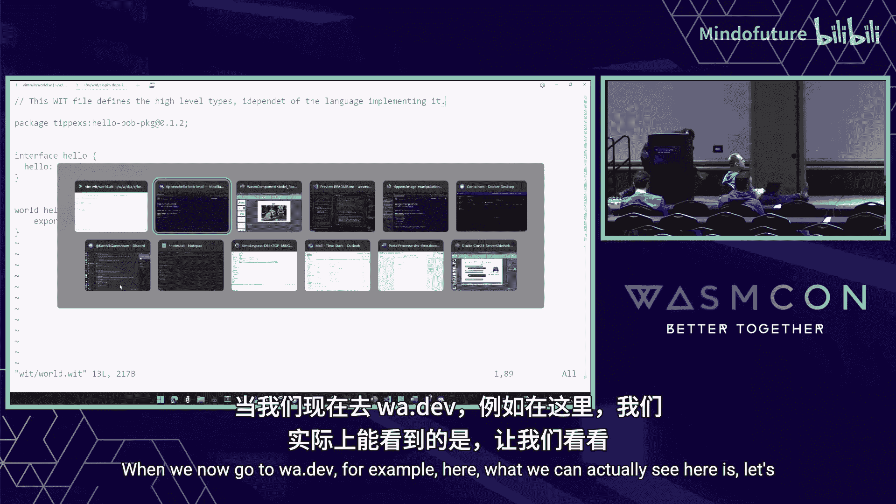


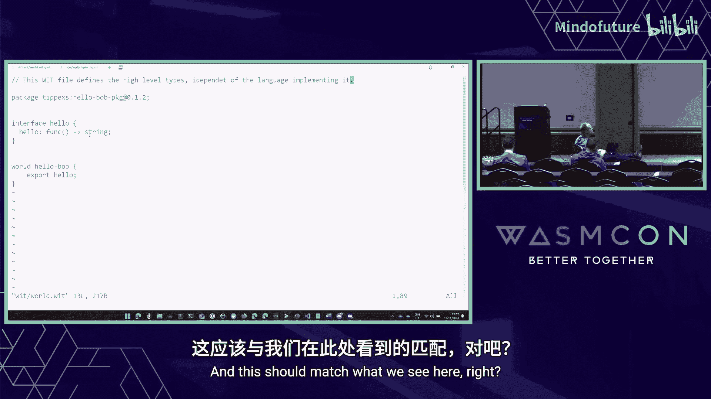

world hello-bob-world {
    export hello-bob
}
```
这个文件定义了一个包 `hello:bob-package`，其中包含一个 `hello` 函数，它返回一个字符串。`world` 声明了这个包对外提供的接口。

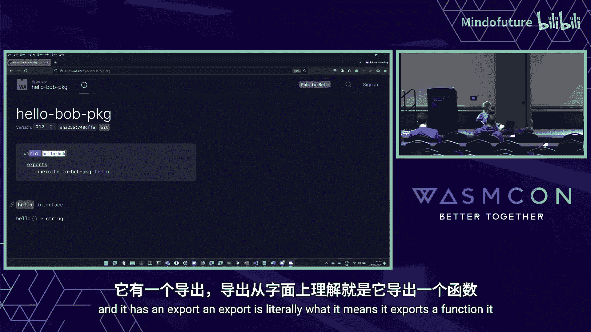

使用 `warg` 发布此 WIT 包后，可以在 `wa.dev` 等注册中心查看它。请注意，它被标记为 **WIT**，而不是 **Component**。

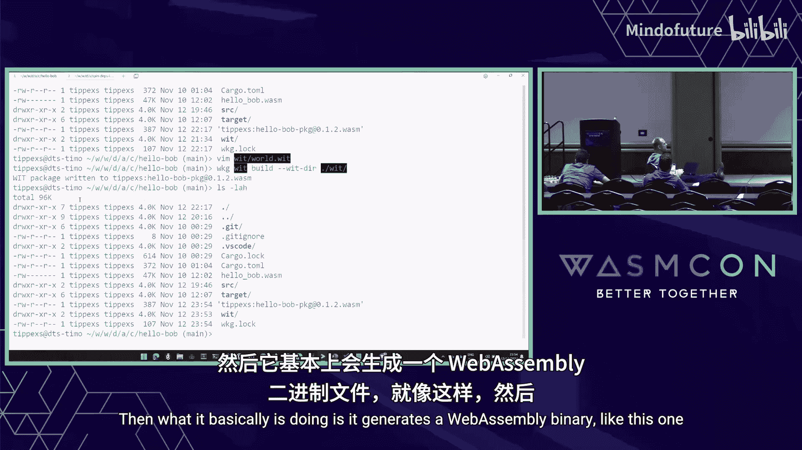

### 第二步：实现组件业务逻辑
接下来，我们创建一个 Rust 项目来实现这个 WIT 合约。

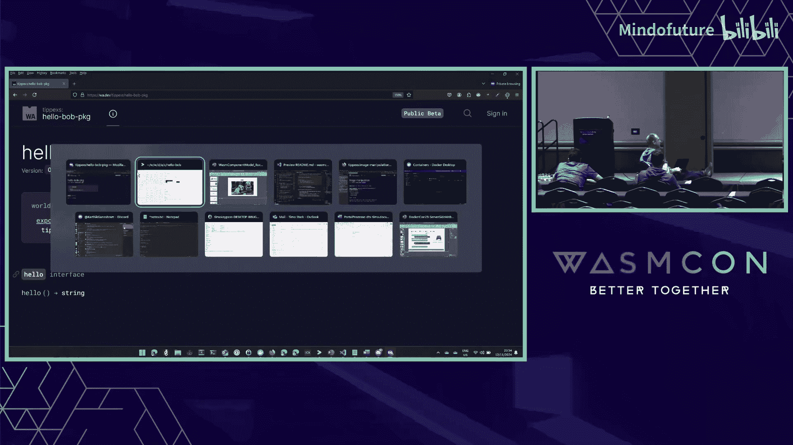

```bash
cargo component new --lib --target hello:bob-package hello-bob-impl
```
这个命令会创建一个新的库项目，并设定其目标为实现 `hello:bob-package` 这个 WIT 包中定义的接口。


首次构建项目时，工具会生成绑定代码（`src/bindings.rs`）。然后，我们可以在 `src/lib.rs` 中实现具体的 `hello` 函数：

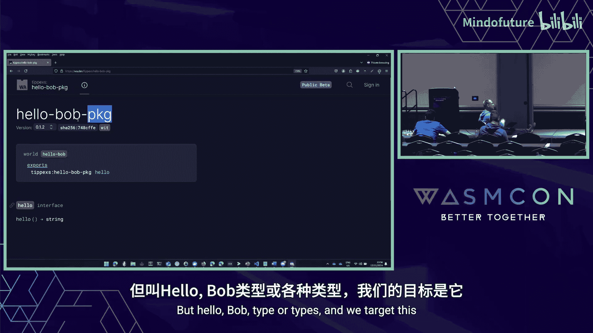

```rust
// src/lib.rs
use bindings::hello::bob_package::hello;
struct Component;

impl hello::Hello for Component {
    fn hello() -> String {
        "Hello Bob".to_string()
    }
}
```
绑定文件让 Rust 知道需要实现一个返回 `String` 的 `hello` 函数，这正是 WIT 文件中定义的。

构建并发布这个实现后，它在注册中心会被标记为 **Component**。


### 第三步：创建 HTTP 服务器组件
现在，我们需要一个 HTTP 服务器组件来接收请求并调用上面的“Hello Bob”组件。

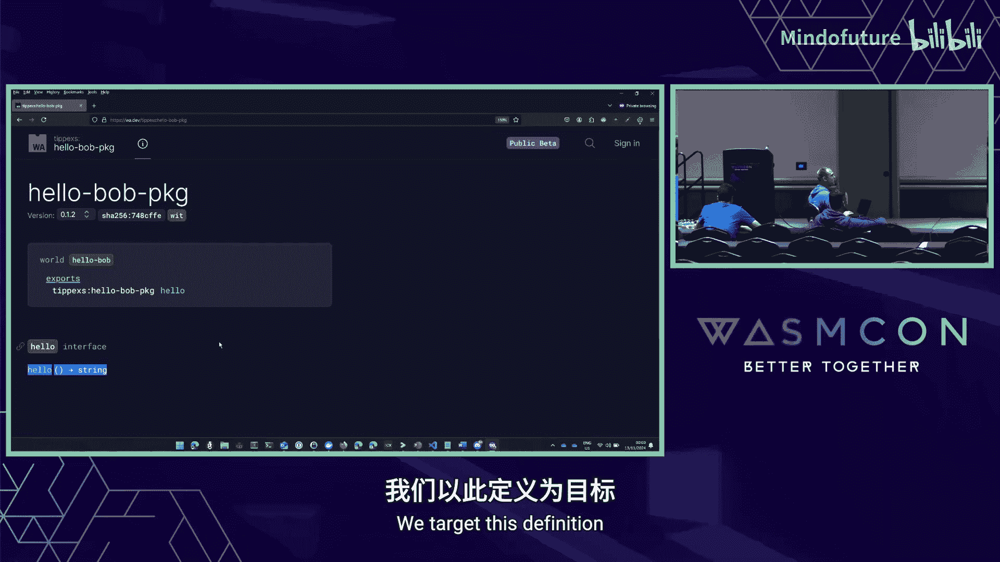

首先，定义一个新的 WIT 包来描述这个服务器：
```wit
// hello-bob-web.wit
package hello:bob-web

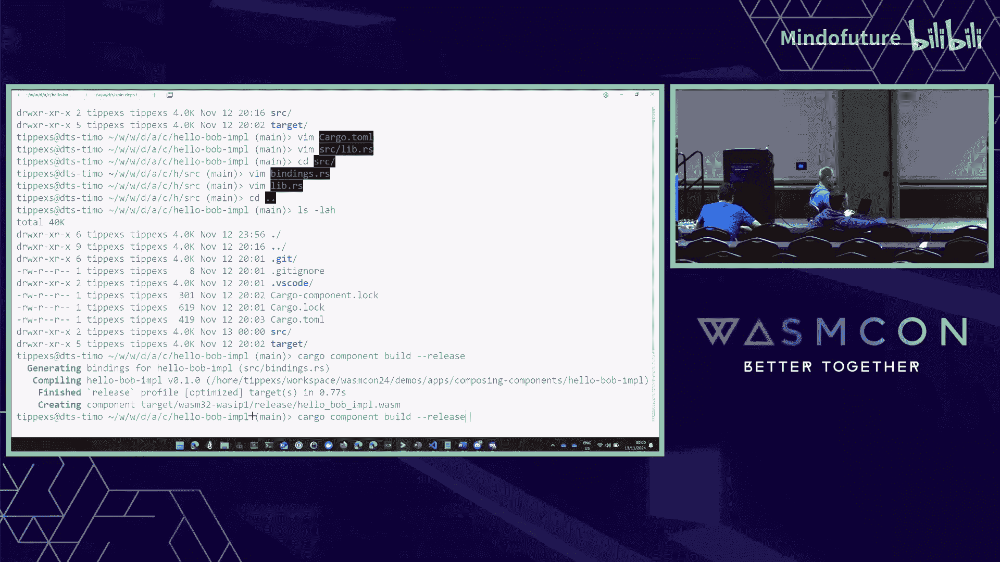

interface hello-bob-web {
    import hello:bob-package/hello-bob
    import wasi:http/proxy
}

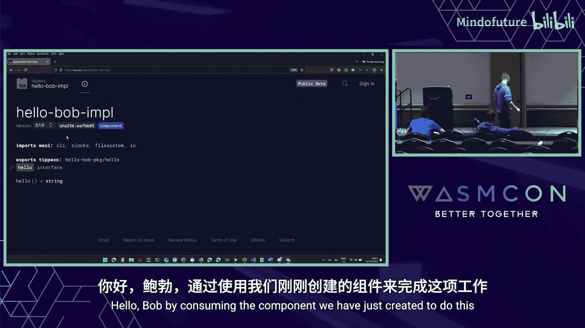

world hello-bob-web-world {
    import hello:bob-package/hello-bob
    export wasi:http/incoming-handler
}
```
这个 WIT 文件做了两件事：
1.  **导入** `hello:bob-package` 中的 `hello-bob` 接口。
2.  **导出** `wasi:http/incoming-handler`，以便运行时可以调用它来处理 HTTP 请求。

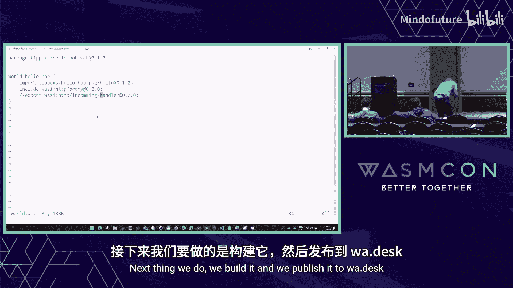


同样，先发布这个 WIT 接口。

然后，创建并实现这个服务器组件：
```bash
cargo component new --lib --target hello:bob-web hello-bob-web-impl
```
在实现代码中，我们需要处理 HTTP 请求，并调用导入的 `hello` 函数：
```rust
// 简化的实现逻辑
use bindings::wasi::http::...; // HTTP 类型
use bindings::hello::bob_package::hello; // 导入的 hello 函数

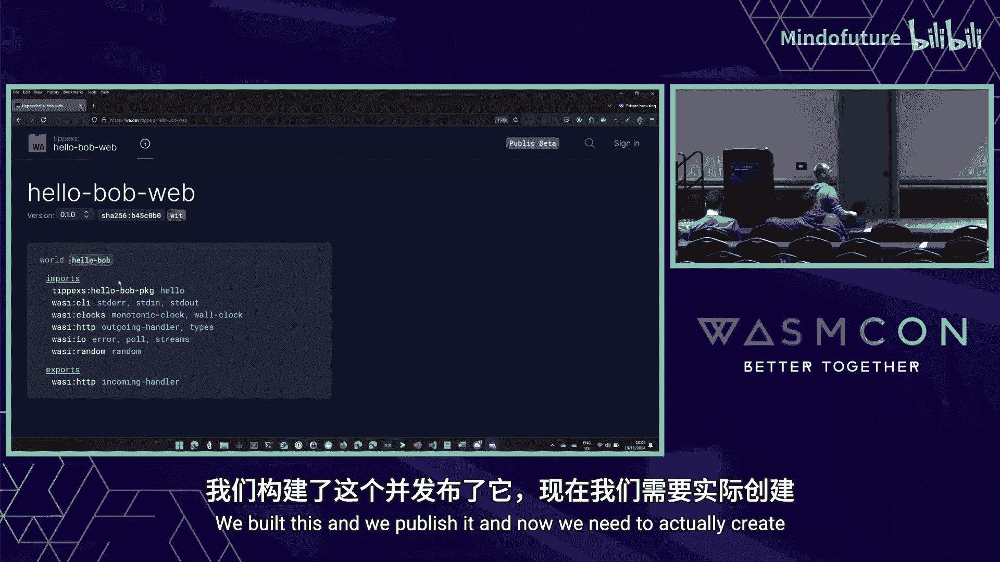

impl bindings::exports::wasi::http::incoming_handler::Guest for Component {
    fn handle(request: IncomingRequest, response_out: ResponseOutparam) {
        // 调用另一个组件提供的函数
        let greeting = hello();
        // ... 构建 HTTP 响应并返回 greeting ...
    }
}
```
构建这个组件。如果尝试直接运行它，会失败，因为它依赖的 `hello` 函数还没有被“连接”进来。

### 第四步：组合组件
这是最关键的一步。我们将使用 `wasm-tools` 把“Hello Bob 实现”组件和“HTTP 服务器”组件组合成一个新的、完整的组件。

```bash
wasm-tools compose hello-bob-web-impl.wasm -d hello-bob-impl.wasm -o service.wasm
```
这个命令将 `hello-bob-impl.wasm`（依赖项）链接到 `hello-bob-web-impl.wasm`（主组件）中，生成一个独立的 `service.wasm` 文件。

### 第五步：运行组合后的组件
现在，我们可以使用 Wasm 运行时来执行这个组合后的组件了。

```bash
wasmtime serve service.wasm
```
运行时将启动一个 HTTP 服务器。当我们用 `curl` 访问它时：
```bash
curl http://localhost:8080
```
服务器会处理请求，调用内部“Hello Bob”组件的逻辑，并最终返回响应：**Hello Bob**。

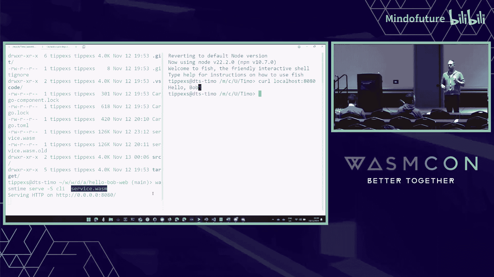

---

## 核心要点与最佳实践总结
本节课中我们一起学习了 WebAssembly 组件模型从概念到实践的完整流程。

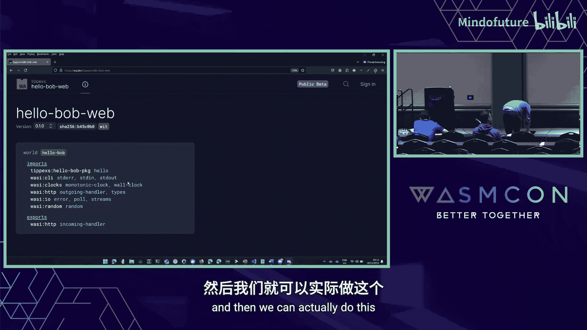

让我们总结一下最关键的心得：
1.  **严格分离合约与实现**：始终将 WIT 接口定义（合约）和具体组件实现分开管理。这有助于清晰的架构和团队协作。
2.  **理解组件与WIT的区别**：在注册中心，**WIT** 是接口描述，**Component** 是可运行的实现。组合时使用的是 **Component**，而开发时通过 `--target` 指向的是 **WIT** 包。
3.  **动手实践是关键**：WebAssembly 组件模型的强大之处在于其可组合性。只有亲自动手创建、组合和调试组件，才能深刻理解其价值和工作原理。建议从像“Hello World”这样的简单例子开始。
4.  **利用工具链**：`cargo-component`、`warg`、`wasm-tools` 等工具构成了强大的生态系统，能极大提升开发效率。


通过组件模型，我们可以像搭积木一样构建应用程序，每个组件职责单一，通过明确定义的接口通信，从而提高了代码的可复用性、安全性和可维护性。