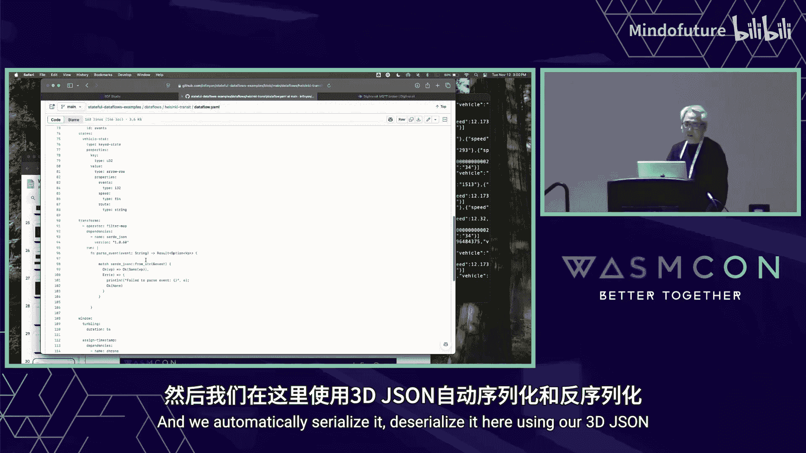

# 020：使用组件模型在 WASM 上集成 Apache Arrow

## 概述
在本教程中，我们将学习如何利用 WebAssembly 组件模型，将 Apache Arrow 数据框架集成到流处理引擎中。我们将探讨组件模型的基本概念、集成 Apache Arrow 时遇到的挑战、以及如何通过将 Arrow 建模为资源来解决这些问题。整个过程旨在实现跨语言、高性能的数据处理。

---

## 第1章：组件模型简介 🧩

上一节我们概述了本教程的主题，本节中我们来看看核心基础技术——WebAssembly 组件模型。

组件模型允许在所谓的“客座”环境中进行虚拟化执行，这个环境可以是 Rust、Python 或 JavaScript。它通过一种称为 WIT 的接口，实现了从一种语言到另一种语言的函数调用。

不仅如此，组件模型还能通过 WASI 接口调用外部世界，例如 HTTP、文件系统或 GPU 等资源。

以下是组件模型的主要优势：
*   **语言互操作性**：允许不同语言的代码相互调用。
*   **安全与沙箱**：提供隔离的执行环境。
*   **可移植性**：组件可以在不同平台上运行。
*   **组件复用**：组件可以独立于其实现语言被复用。

目前，WASI 支持广泛的系统调用、文件系统操作以及云服务接口。这些接口主要用于构建微服务或 HTTP 服务，在云服务集成中有大量应用案例。

---

## 第2章：构建数据栈的动机 📊

上一节我们介绍了组件模型的基础，本节中我们来看看如何将其应用于构建数据栈。

一个典型的应用场景是结构化数据栈。它涉及从批处理和流处理中处理结构化数据，进行数据仓库处理、构建仪表盘和指标。虽然工具众多，但其核心与微服务类似，都需要进行数据转换、过滤等通用计算操作。

另一个热门领域是通用 AI 栈。虽然涉及 AI 模型和提示工程，但本质上仍然是在处理数据（如向量和张量），同样需要进行数据转换和计算。因此，组件模型的优势同样适用于此。

我们正在开发一个名为 **Stateless Dataflow** 的流处理引擎协议，用于处理实时数据。它是 Apache Flink、Kafka Streams 等产品的轻量级替代方案，应用于实时分析场景，如欺诈检测、预测性维护和边缘传感器集成。

流处理引擎的核心是**转换逻辑**和**状态管理**。这非常适合使用组件模型。在我们的案例中，我们构建的是事件驱动架构，所有数据都被建模为流式事件，从而可以构建任意复杂的数据栈计算。

我们将从组件模型中学到的经验应用到我们的无状态算子中，用组件模型替换了原有的计算逻辑。这样，我们无需在 JVM 或专门的 Python 环境中运行，而是在组件模型和安全的执行引擎中运行，并能通过 WASI 访问 HTTP、GPU 或键值存储等其他资源。

当然，我们面临的挑战是**状态管理**，接下来我们将以 Apache Arrow 为例进行探讨。

---

## 第3章：Apache Arrow 的使用场景 🏹

上一节我们讨论了构建数据栈的动机，本节中我们来看看 Apache Arrow 在其中的具体作用。

在欺诈检测等用例中，我们需要在多个时间窗口内检测数据模式。例如，将数据按时间间隔分区并计数，以检测异常交易（如一张信用卡同时在巴黎和伦敦取款）。

我们通过 **DataFrame（数据框架）** 来实现这种分析。DataFrame 是数据科学和机器学习社区（如 Pandas、Spark、Polars）中流行的数据结构，类似于表格，由一系列数据列组成，支持复杂的结构化数据分析。

DataFrame 设计为**列式存储**。数据按列（Series）组织，而非按行。这是因为列式格式对于分析任务效率更高，通常能快 10 到 100 倍，即使不使用 GPU，也能利用 CPU 的 SIMD 指令集加速。

列式与行式的关键区别在于内存布局：相同字段的数据被分组存储在连续的内存区域，这有利于数据装入 CPU 寄存器进行处理。

这就引出了一个问题：如何在我们的“客座”环境中访问这个 DataFrame？

---

## 第4章：集成策略与挑战 ⚙️

上一节我们介绍了 Apache Arrow 的使用场景，本节中我们来看看具体的集成策略及其面临的挑战。

为了让用户体验无缝，我们希望来自 Pandas、Rust 或 JavaScript 的开发者能使用他们熟悉的数据框架 API。最直接的想法是**将内存共享给客座环境**。

WebAssembly 有一个**共享内存**标准，允许主机和客座环境共享内存。Apache Arrow 的价值在于它为解决不同语言间数据格式不一致的问题提供了标准。Arrow 格式是一种列式数据交换标准，被广泛支持。

因此，第一个实验是：将共享内存设置为 Arrow 格式。主机将数据写入 Arrow 格式，客座环境（如 Python 的 Pandas 库）可以直接导入此格式的数据。对于 Rust，我们需要构建适配器，以便 Polars 库能读取此内存。

然而，这种方法存在挑战：
1.  WebAssembly 共享内存提案主要针对 JavaScript 与浏览器设计，对 Rust、Go、Python 等其他语言的支持尚不广泛。
2.  经过实验，发现其支持度还不够。

于是，我们转向第二种策略：**复制缓冲区**。即将 Arrow 缓冲区复制到客座环境中，客座环境的数据框架库（如 Pandas、Polars）仍可消费此缓冲区。

我们假设在实时流处理中，每次操作的数据块不会太大。我们为此构建了一个 WIT 库来包装 Arrow 缓冲区。该 API 几乎是一一对应了 Arrow 的规范：Arrow 由一系列数组组成，每个数组有类型（如 i32, i64, f64）和定义类型的元数据列。

通过此 API，客座环境可以复制 Arrow 库并访问数据。

但此方法也有挑战：
1.  适配器实现相当复杂，且需要为多种语言（Rust、Go、Pandas 等）构建。
2.  当处理多个表或进行连接操作时，可能需要复制大量数据。
3.  无法高效处理大型表（尽管在实时流处理中多数表较小，但连接历史数据时可能变大）。
4.  客座库（如 Rust）的构建复杂，导致构建时间和问题增加。

---

## 第5章：新策略：将 Arrow 建模为资源 💡

上一节我们探讨了直接内存共享和复制缓冲区的局限性，本节中我们来看看一个更强大的新策略。

新的策略是：**将 Arrow 数据框架建模为组件模型中的“资源”**。

这是组件模型最强大的功能之一，它允许将外部资源表示为带有句柄的任意数据块。通过句柄，可以调用相关函数，并传递这些句柄。这与传统系统（如 Windows）中的句柄概念类似。

关键区别在于，组件模型中的资源句柄是**完全类型化**的。虽然示例中常用字节数组，但你完全可以定义自己的自定义数据类型（如 DataFrame、向量、张量），因此这是一种非常强大的方式。

思路是：将 Arrow 定义为我们自己的类型接口，并暴露给客座环境。客座环境无需构建复杂的适配器即可消费数据，因为 WASI 工具链会为我们生成适配器。

这样做的权衡是：客座环境可能无法直接使用语言原生的数据框架 API（如 Pandas 或 Polars 的 API），而需要使用我们通过 WIT 定义的接口。我们可能需要在此基础上构建其他适配器。这是用一定的灵活性换取复杂性的降低。

我们仍在探索这种方法的局限性和发展空间。

---

## 第6章：数据框架接口设计 🛠️

上一节我们提出了将 Arrow 建模为资源的新策略，本节中我们来看看如何具体设计数据框架的接口。

我们的数据框架接口包含几个部分：

**1. 表达式**
数据框架的强大之处在于可以使用编程式 API 构建查询表达式，而无需使用 SQL。我们借鉴了另一个流行的数据框架库 `datafusion` 来建模表达式，它比 Polars 等更简单。最终构建的是一个**表达式树**。例如，一个过滤表达式 `age > 30` 由操作符和操作数组成。

**2. 数据框架资源**
数据框架本身被表示为一个资源句柄。你可以对其运行表达式，从而创建另一个数据框架，并返回一个新的句柄。可以进行的操作包括：
*   `select`: 选择列。
*   `filter`: 过滤行。
*   `shape`: 获取数据框架的形状（行数和列数）。

**3. 行迭代器**
获取数据框架后，如何遍历数据？我们引入了另一个句柄：**行迭代器**。它类似于迭代器概念，可以告诉你何时开始、何时跳过、以及如何获取值。获取的值是字面量，可以是任何基本类型。

**4. SQL 接口**
除了编程式 API，也支持发送 SQL 语句进行查询。这可以执行任意 SQL 表达式。在我们的实现中，后端使用了 Polars API，但也可以提供 DataFusion 或其他提供者。

所有这些操作都在**客座环境**中运行。

---

## 第7章：完整示例与演示 🎬

上一节我们设计了数据框架的接口，本节中我们通过一个完整示例来看看它是如何运作的。

这是一个聚合算子的完整示例，用于按时间分区并计数（或统计单词数），获取前 10 行。

流程如下：
1.  运行一个 SQL 查询。
2.  运行一个表达式来检查数据的形状和类型。
3.  进行下一步操作（如过滤、聚合）。
4.  获取行迭代器进行遍历，并将结果转换为 JSON（可用于发送到仪表盘或下游处理）。

这展示了数据框架 API 的四个部分：SQL 执行、表达式运行、形状检查和迭代。

**演示：实时车辆速度分析**
我们有一个演示，从赫尔辛基的公共交通系统消费实时事件流（车辆速度、经纬度）。

目标：每5分钟计算一次平均速度最高的前5辆车。

我们的无状态数据流是一个算子链，每个算子都运行在 WebAssembly 中。在 UI 中可以看到这个算子图的运行状态，并实时输出计算结果（车辆ID、路线、速度等）。这演示了在 WASM 中运行数据框架操作的能力。

---

## 第8章：未来展望与总结 🌟

上一节我们通过示例看到了集成的效果，本节中我们来总结并展望未来。

我们还在探索集成其他数据类型，如**向量和张量**，以支持 AI 模型，并将其作为我们产品的一部分。

**总结**
在本教程中，我们一起学习了：
1.  **WebAssembly 组件模型**的核心概念及其在语言互操作、安全沙箱方面的优势。
2.  将组件模型应用于构建**数据栈**和**流处理引擎**的动机。
3.  **Apache Arrow** 作为列式数据交换标准在跨语言数据共享中的作用。
4.  集成 Arrow 时尝试的两种策略：**共享内存**和**复制缓冲区**，以及它们面临的挑战。
5.  创新的**将 Arrow 建模为类型化资源**的新策略，利用组件模型的强大功能降低集成复杂度。
6.  设计包含**表达式、数据框架资源、行迭代器和 SQL 接口**的完整数据框架 API。
7.  通过一个**实时车辆速度分析**的演示，看到了该方案的实际运行效果。

这种方法使得在轻量级、安全的 WebAssembly 环境中执行高性能的数据转换和分析成为可能，为边缘计算和实时处理提供了新的解决方案。