# 021：在支持Wasm的环境中分发和运行容器 🚀

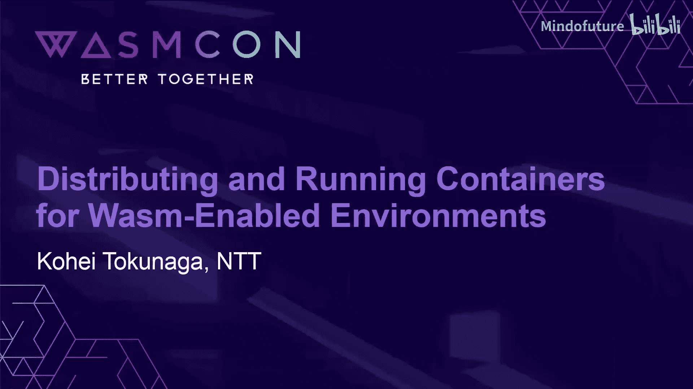

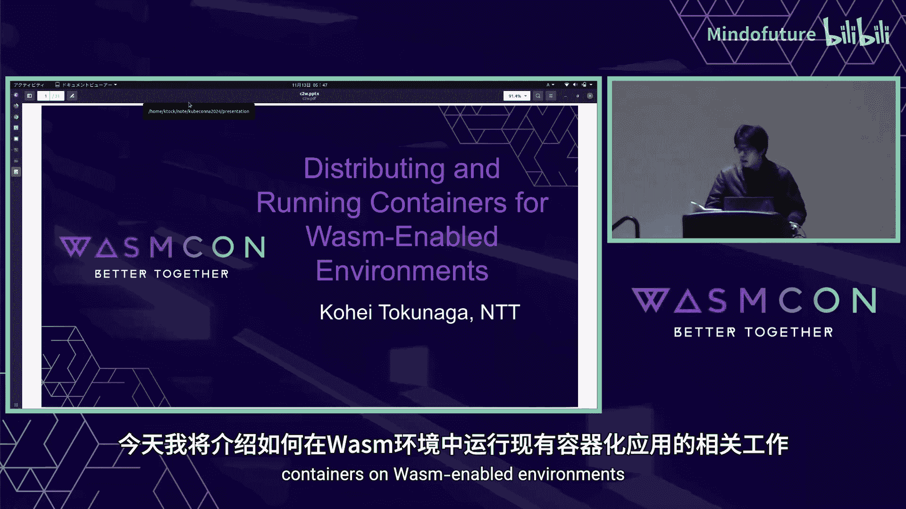

在本节课中，我们将学习如何利用 `container2wasm` 工具，在 WebAssembly 环境中运行未经修改的 Linux 容器。我们将探讨其工作原理、分发方式，并了解新引入的 QEMU 支持如何扩展架构兼容性和提升性能。

---

## 概述

`container2wasm` 是一个工具，它通过 CPU 模拟技术，使得基于 Linux 的容器能够在 WebAssembly 虚拟机中运行。这解决了将现有应用移植到 Wasm 环境时面临的 Linux 兼容性问题。本节课将详细介绍其工作机制、两种容器分发方法，以及新集成的 QEMU 支持带来的优势。

---

## 为什么需要将应用移植到 WebAssembly？

将应用运行在 WebAssembly 环境中主要有两大好处。

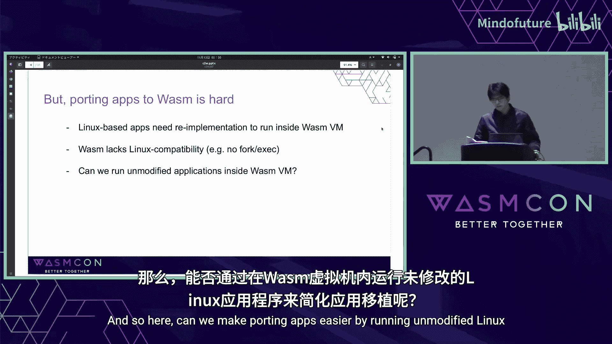

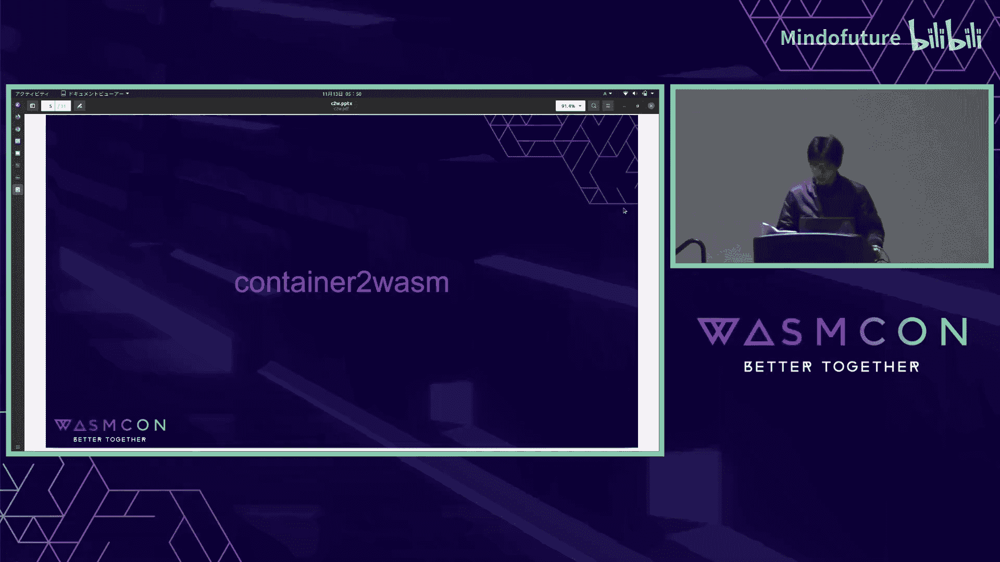

首先，它允许我们在浏览器中分发和演示广为人知的应用。例如，用于产品演示、开发环境搭建等场景。社区中已有一些服务和项目，让用户无需在主机上安装应用即可在浏览器中轻松运行。

其次，WebAssembly 是一个可移植的沙箱。我们可以在 Wasm VM 内运行未经修改的代码，而无需给予其直接访问主机的权限。此外，Wasm 生态系统也提供了一些对浏览器外现有应用有用的工具。

然而，将应用移植到 Wasm 并不容易。主要原因是基于 Linux 的应用需要在 Wasm VM 内重新实现，而 Wasm 模型本身缺乏 Linux 兼容性，例如不支持 `fork` 或 `exec` 系统调用。

那么，我们能否通过直接在 Wasm VM 内运行未经修改的 Linux 应用，来简化移植过程呢？

---

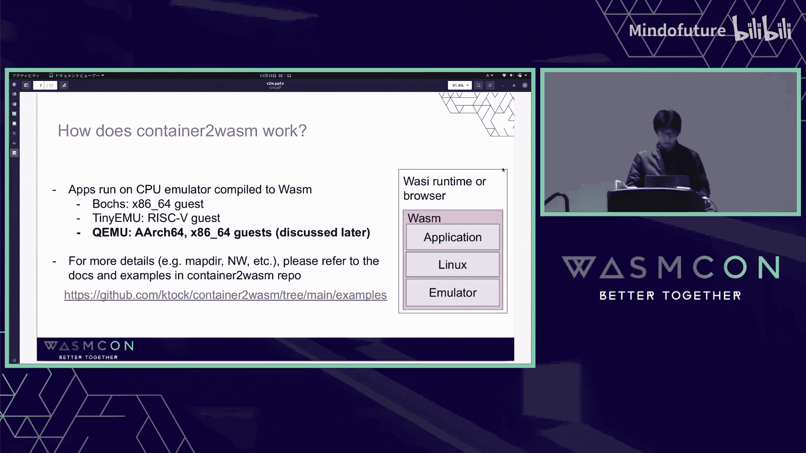

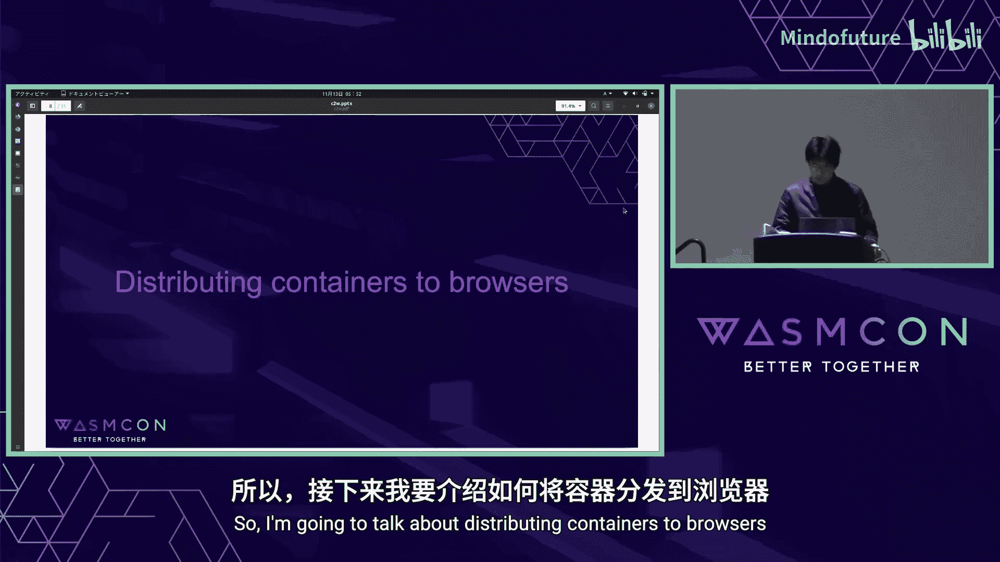

## `container2wasm` 简介 🛠️

`container2wasm` 应运而生，它是一个用于在 Wasm VM 内运行基于 Linux 的容器的工具。

其核心原理是：**未经修改的容器在模拟的 CPU 上运行真正的 Linux 系统**。该工具还支持浏览器和 Wasm 运行时中容器的网络功能，并支持 Wasm 的直接内存映射。

以下是运行容器的两个示例：
1.  在支持 WASI 的 Wasm 运行时（如 `wasmtime`）上运行容器。
2.  在浏览器中直接运行容器。

---

## 工作原理

`container2wasm` 使用 CPU 模拟器来在 Wasm 环境中运行容器。
*   对于 **x86-64** 容器，默认使用 `box86` 模拟器。
*   对于 **RISC-V** 容器，使用 `tinyemu` 模拟器。
*   在最新版本（0.7）中，实验性地添加了对 **QEMU** 的支持，以获得更广泛的客户机架构支持和性能优势。

其内部架构大致如下：容器镜像被加载后，在模拟的 CPU 和 Linux 内核上启动。`container2wasm` 负责处理 Wasm 环境与模拟器之间的桥接，包括文件系统映射和网络配置。

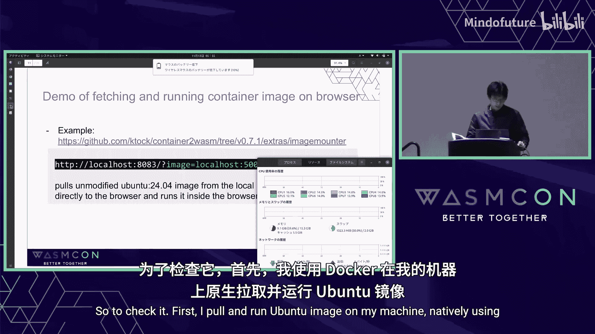

> 关于 `container2wasm` 内部细节、直接内存映射和网络的更多信息，请参阅其代码仓库中的文档。

---

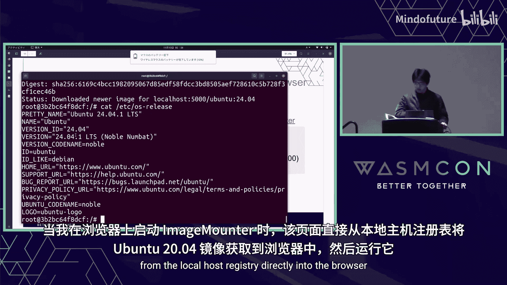

## 向浏览器分发容器

`container2wasm` 支持两种向浏览器分发容器镜像的方式。

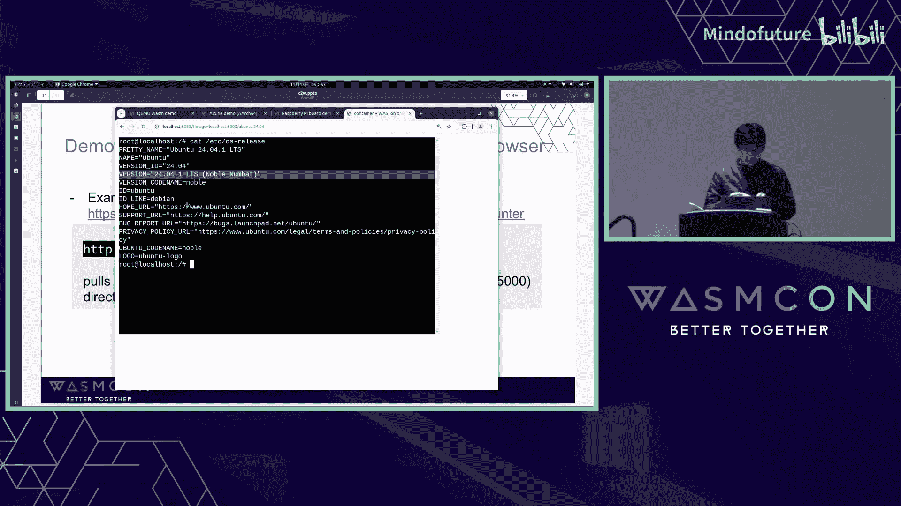

### 方式一：预转换为 Wasm 模块

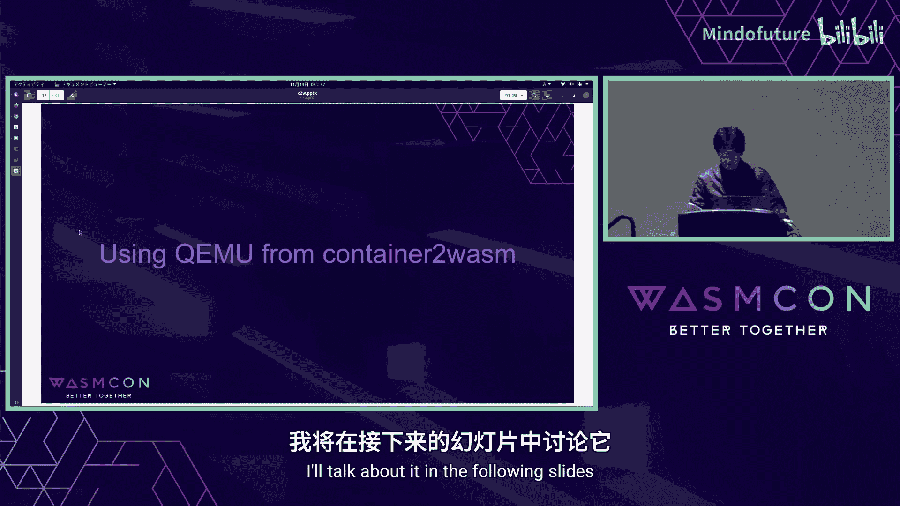

第一种方式是预先将容器转换为 Wasm 模块。`container2wasm` 提供了 `c2w` 命令来完成此转换。

转换流程如下：
1.  使用 `c2w` 命令将容器镜像转换为 `.wasm` 文件。
2.  将生成的 `.wasm` 文件上传到 Web 服务器。
3.  浏览器通过 HTTP 获取并运行该 `.wasm` 文件。

这种方式的好处是部署简单，与静态资源分发类似。

### 方式二：直接分发 OCI 容器镜像

第二种方式是直接在浏览器内获取和运行标准的 OCI 容器镜像，无需预先转换为 Wasm 模块。

其工作流程如下：
1.  浏览器中运行一个名为 `imagemount` 的 Wasm 组件。
2.  `imagemount` 从容器仓库（Registry）拉取未经修改的 OCI 镜像。
3.  拉取的镜像通过模拟器挂载到容器中。

这种方式允许浏览器直接获取容器镜像，因此服务器需要配置跨域资源共享（CORS）。目前尚无公开支持 CORS 的容器仓库，但你可以使用私有仓库进行尝试。

`imagemount` 还支持 **懒加载（Lazy Pulling）** 技术。该技术允许容器在镜像内容尚未完全本地可用时就开始启动，从而缩短容器启动时间。

---

## 演示：在浏览器中直接运行容器

以下是一个在浏览器中直接拉取并运行未经修改的 Ubuntu 24.04 容器镜像的演示。

首先，我们在本地机器上使用 Docker 原生拉取并运行该镜像，以确认镜像可用。
```bash
docker run -it ubuntu:24.04
```
命令成功执行，显示这是一个 Ubuntu 24.04 镜像。

接下来，我们在浏览器中运行同一个镜像。我们已经启动了一个提供 `imagemount` 服务的服务器。当在浏览器中启动 `imagemount` 页面时，它会从本地的私有仓库直接获取 `ubuntu:24.04` 镜像并运行。

在浏览器中，我们看到了 shell 提示符。执行 `uname -a` 和 `cat /etc/os-release` 可以确认，这正是在浏览器中运行的 Ubuntu 24.04 容器。

**关键点**：Docker 和浏览器从完全相同的仓库拉取了完全相同的镜像内容，但浏览器是在模拟环境中运行的。

---

## 集成 QEMU 支持 🚀

如前所述，`container2wasm` 最近添加了对使用 QEMU 的实验性支持。

### 什么是 QEMU？

QEMU 是一个由 Fabrice Bellard 创建的开源模拟器。它能模拟多种 CPU 架构（如 x86, ARM, RISC-V）和各种机器类型（包括开发板）。QEMU 具有可移植性，能在多种主机 CPU 上运行，并通过即时编译（JIT）和多核利用带来性能优势。

### 为何在 `container2wasm` 中使用 QEMU？

我们期望通过集成 QEMU 获得：
1.  **更广泛的客户机架构支持**，包括 AArch64 和 ARC64。
2.  **性能提升**，得益于 QEMU 的 JIT 编译和多核利用能力。

然而，QEMU 本身并不支持 Wasm 作为主机环境。为此，我们实验性地将 QEMU 移植到浏览器，称之为 **QEMU Wasm**。

### QEMU Wasm 的实现

QEMU Wasm 是使用 Emscripten 移植的 QEMU 系统模拟器版本。它支持 64 位客户机，并为 Wasm 实现了 JIT 后端，从而能够利用多线程。

**技术细节：QEMU 的 TCG 与 Wasm 后端**
QEMU 使用一个名为 TCG（Tiny Code Generator）的二进制转换器进行 JIT 编译。TCG 定义了一种中间表示（IR）。客户机代码由前端翻译成 IR，IR 再由后端翻译成主机代码。

为了支持 Wasm 主机，我们为 TCG 添加了一个 **Wasm 后端**。这个后端接收 IR 并将其翻译成 WebAssembly 代码。

由于 Wasm VM 采用哈佛架构，生成的 Wasm 代码（位于内存中）尚不能直接执行。需要借助浏览器 API：
*   `WebAssembly.Module`：编译 Wasm 代码缓冲区。
*   `WebAssembly.Instance`：实例化模块，提供其中定义的函数。

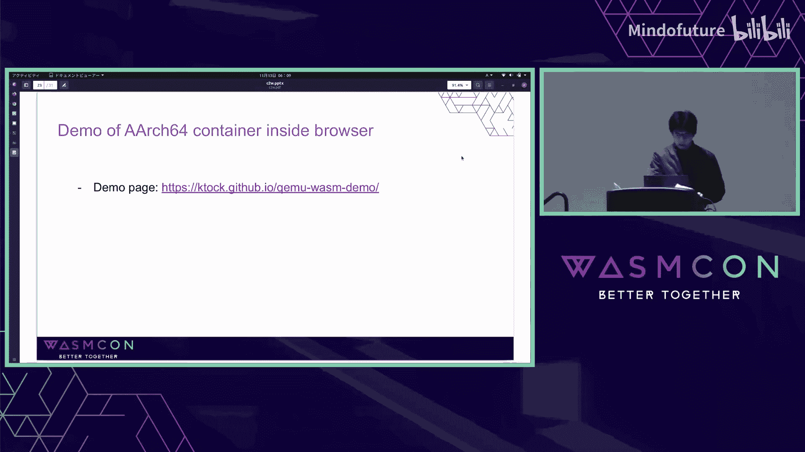

实例化后的函数通过 Wasm 的 **Table** 功能暴露给 QEMU 模块。Emscripten 允许以函数指针的形式访问 Table 中的函数，因此 QEMU 可以直接调用 Wasm 模块的入口点。

**优化策略：混合执行模式**
为每个翻译块（TB）创建独立的 Wasm 模块会带来编译开销。为了缓解这个问题，QEMU Wasm 同时支持 Wasm 后端和 TCI（TCG 解释器）。默认情况下，所有 TB 都在 TCI 上运行。只有被频繁执行的“热”TB 才会被编译成 Wasm 模块。

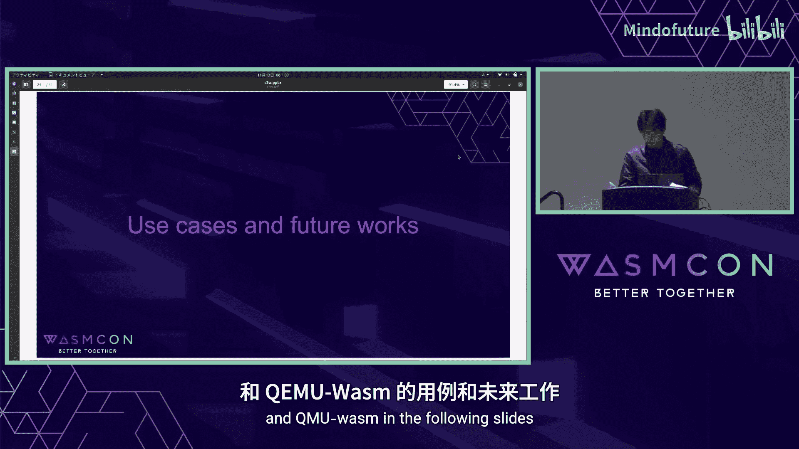

### 性能对比演示

我们进行了一项实验，测量在浏览器内的模拟器中，使用 `pzstd`（支持多进程的 Zstd 压缩工具）压缩 10MB 随机数据所需的时间。

我们对比了 **QEMU Wasm** 和移植到浏览器的 **box86**（`container2wasm` 默认用于 x86-64 容器的模拟器）的性能。

*   **box86** 完成该命令耗时超过 40 秒。
*   **QEMU Wasm** 完成该命令快得多。
*   当启用 **4 线程的 MTTCG（多线程 TCG）** 时，QEMU Wasm 的性能得到进一步提升。

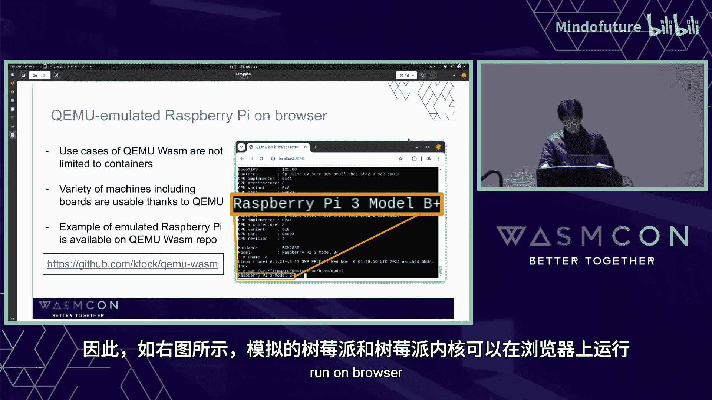

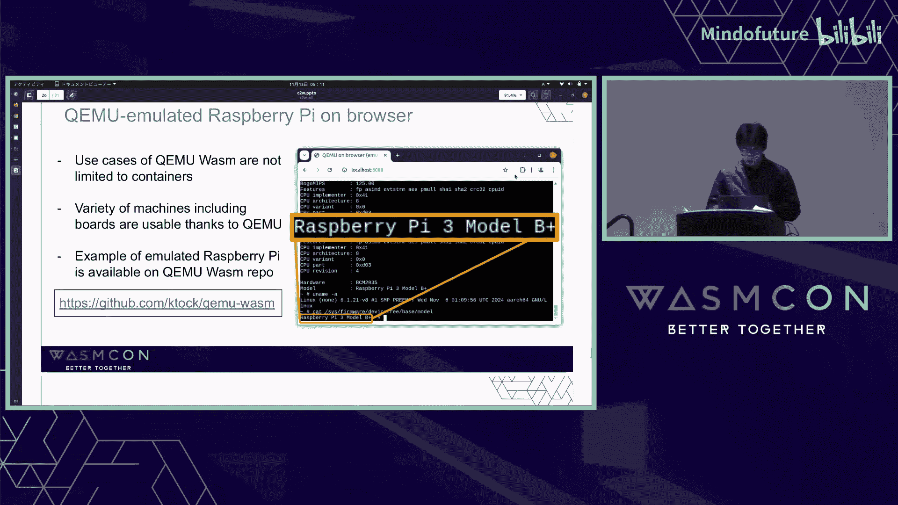

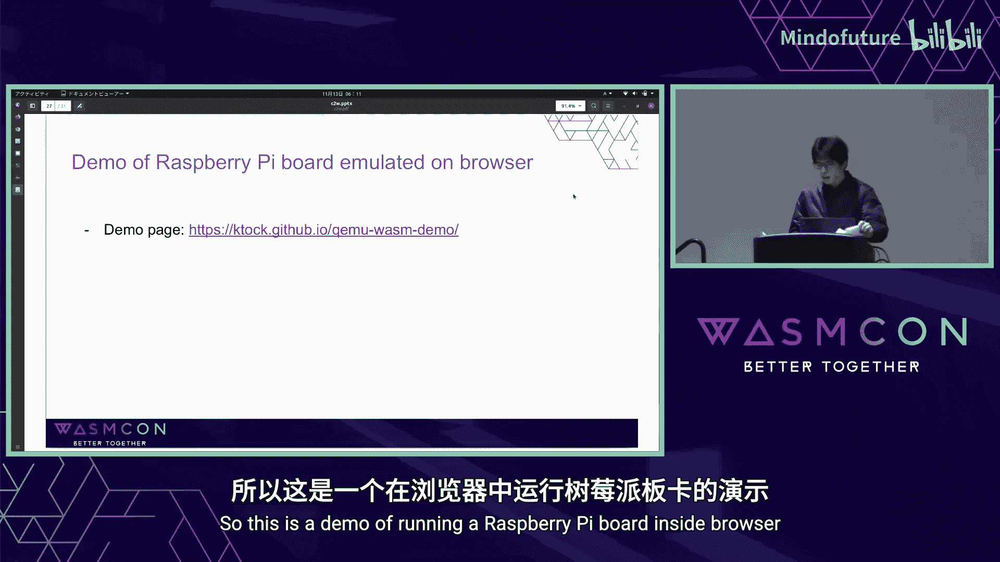

这个演示表明，QEMU 的 JIT 和多核支持能带来显著的性能优势。

---

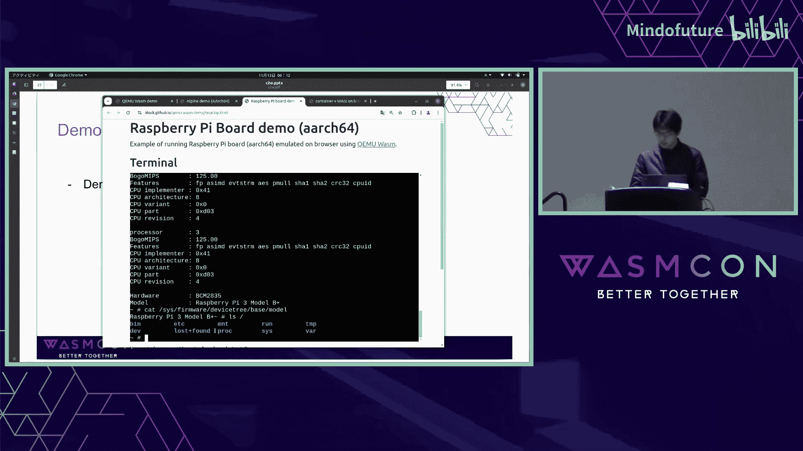

## 演示：在浏览器中运行 AArch64 容器

现在，我们演示在浏览器中运行 **AArch64** 架构的 Alpine 容器。

在浏览器中，QEMU Wasm 作为模拟器运行。Alpine 容器启动后，出现了 shell 提示符。
*   执行 `uname -m` 确认这是 **AArch64** 环境。
*   执行 `cat /etc/os-release` 显示这是 **Alpine Linux** 容器。
*   可以查看 `/` 目录下的根文件系统。

这证明了通过 QEMU Wasm，`container2wasm` 能够支持像 AArch64 这样的非 x86 架构容器。

---

## 用例与未来展望

在浏览器中运行容器是一项通用功能，相信它可以用于多种用例。

### `container2wasm` 的潜在用例
1.  **VS Code 扩展**：用于在浏览器中运行容器，已有实验性实现。
2.  **交互式浏览器演示**：带有模拟机器的产品演示。
3.  **容器沙箱执行环境**：提供安全的隔离环境。
4.  **浏览器内应用调试器**：支持记录和回放的调试场景。

### QEMU Wasm 的更广泛用例
QEMU Wasm 的用途不仅限于容器。得益于 QEMU 对多种机器的支持，例如**在浏览器中模拟单板计算机**也成为可能。

**演示：在浏览器中运行树莓派**
我们使用 QEMU Wasm 在浏览器中模拟了一个树莓派开发板，并运行了 BusyBox。
*   `uname -m` 显示是 **AArch64**。
*   `cat /proc/cpuinfo` 显示模拟的 CPU 是树莓派型号。
*   `cat /proc/device-tree/model` 确认是树莓派环境。
*   同样可以查看 `/` 目录下的根文件系统。

---

## 未来工作

`container2wasm` 和 QEMU Wasm 仍处于早期开发阶段，有许多未来工作方向：
1.  **性能与稳定性提升**：修复 QEMU Wasm 当前的限制（如网络支持、启动速度）。
2.  **集成 AOT（提前编译）方法**：探索与现有工具（如 `wasi2c`）的集成。
3.  **集成更多 QEMU 功能**：如支持更多机器类型、网络、图形显示等。
4.  **支持 Wasm 运行时**：目前 QEMU Wasm 主要面向浏览器，使其也能在 Wasm 运行时（如 Wasmtime）上运行是未来的方向。
5.  **与生态系统集成**：推动包仓库和容器仓库支持 CORS，以便更好地在浏览器环境中使用。

为了促进相关讨论，我们正提议将 `container2wasm` 作为沙箱项目加入 CNCF。旨在为解决兼容性问题提供方案，并建立一个中立的社区来讨论容器向 Wasm 的迁移。

---

## 总结

本节课我们一起学习了以下核心内容：

*   **`container2wasm` 工具**：它通过 CPU 模拟，使得未经修改的 Linux 容器能够在支持 WASI 的运行时和浏览器中运行。
*   **两种分发方式**：预转换为 Wasm 模块，或直接在浏览器中拉取运行 OCI 镜像。
*   **QEMU 集成**：新引入的实验性 QEMU Wasm 支持提供了更广泛的客户机架构（如 AArch64）和性能优势（通过 JIT 编译和多核利用）。
*   **多样化的用例**：从浏览器内演示、沙箱环境到模拟单板计算机，展示了该技术的广泛应用潜力。

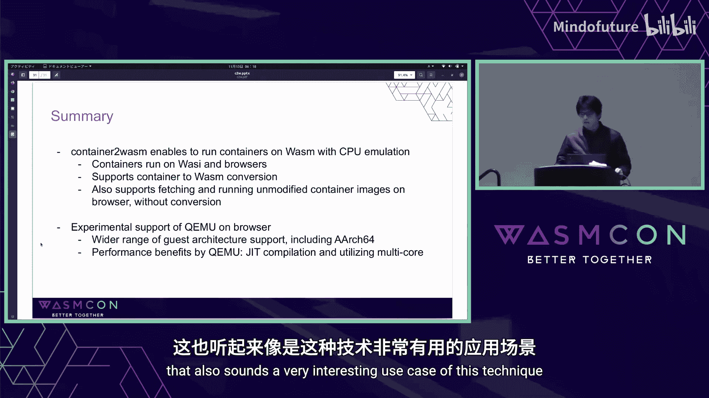

通过 `container2wasm` 和 QEMU Wasm，我们为在 WebAssembly 生态中运行现有容器化应用开辟了一条实用的道路。