# 022：绿色云计算的未来——Arm64架构上的无服务器WebAssembly

## 概述
在本节课中，我们将探讨如何构建更环保的云计算应用。我们将聚焦于两个关键技术：无服务器WebAssembly和Arm64架构，并解释如何将它们结合使用，以显著降低软件运行的能耗和碳足迹。

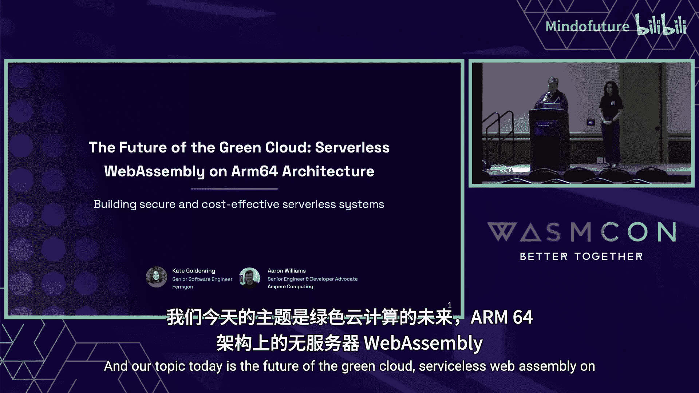

---

## 章节 1：问题背景与绿色软件理念

全球变暖是一个严峻的问题，但社会对计算资源的需求仍在持续增长。这给全球社区带来了挑战，例如，在伦敦西部，为了给新建数据中心腾出电力基础设施，2030年前将不会建设新的住房。

传统数据中心每个机架的功耗标准约为10-14千瓦。然而，为满足AI和GPU等高功耗硬件的需求，新建数据中心正在部署功耗高达40-60千瓦的机架。这导致了能源消耗的急剧增加。

作为开发者，虽然我们无法控制数据中心的建设，但我们可以控制代码的编写方式和运行的架构。我们可以通过以下方式提高效率：
1.  理解自己有能力做出改变。
2.  学习如何衡量代码的碳影响。
3.  选择更高效的软件平台和硬件。

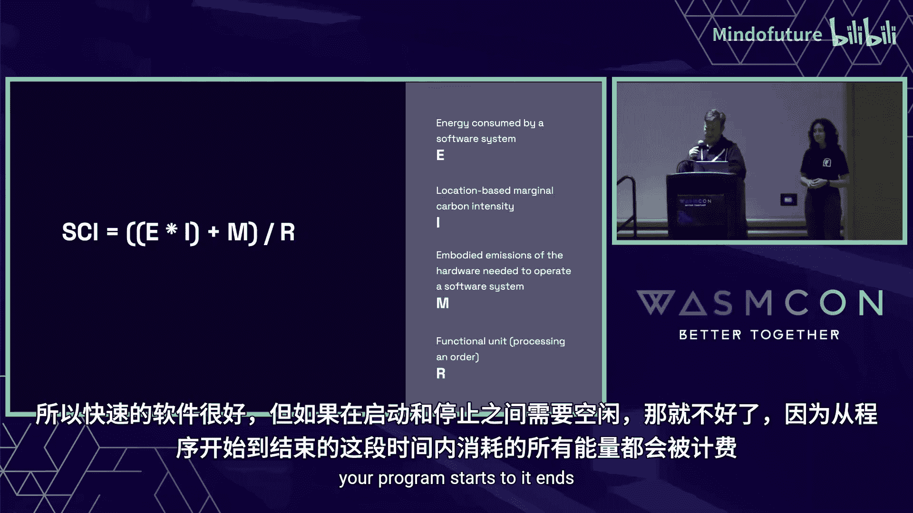

绿色软件基金会提出了构建绿色软件的三个核心原则：
1.  **能源效率**：运行软件时消耗更少的电力。
2.  **硬件意识**：选择更高效的硬件，用更少的资源完成相同的任务。
3.  **碳感知**：例如，调整任务运行时间，或将工作负载从高碳强度区域转移到更多使用可再生能源的区域。

---

## 章节 2：如何衡量软件碳强度

上一节我们介绍了绿色软件的理念，本节我们来看看如何具体衡量软件的碳影响。

绿色软件基金会定义了软件碳强度（SCI）公式：

**SCI = (O + M) / R**

其中：
*   **O** 代表运行排放，即软件运行直接消耗能源产生的碳排放。
*   **M** 代表隐含排放，即制造运行该软件的硬件（如芯片）所产生的碳排放。
*   **R** 代表资源，例如处理的请求数或运行时长等度量单位。

我们可以进一步分解运行排放 **O**：

**O = E * I**

其中：
*   **E** 是软件消耗的能量。
*   **I** 是能源的碳强度，取决于电力来源（如煤电碳强度高，太阳能碳强度低）。

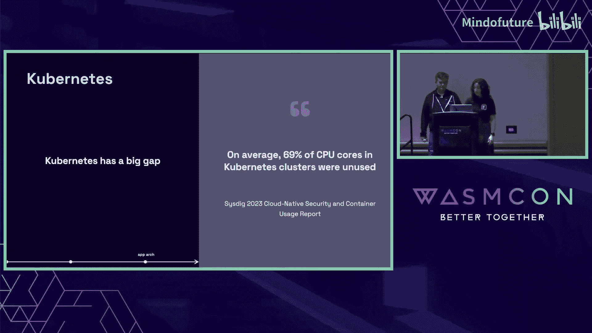

因此，降低软件碳强度的最佳方式是：
1.  尽可能少地使用硬件（减少 **R** 的分母效应，但更关键的是降低 **E**）。
2.  所使用的硬件本身要尽可能高效（降低单位能耗，并选择 **M** 更低的硬件）。

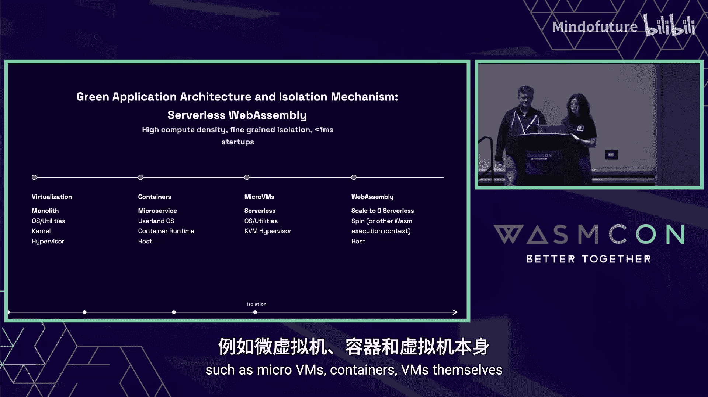

---

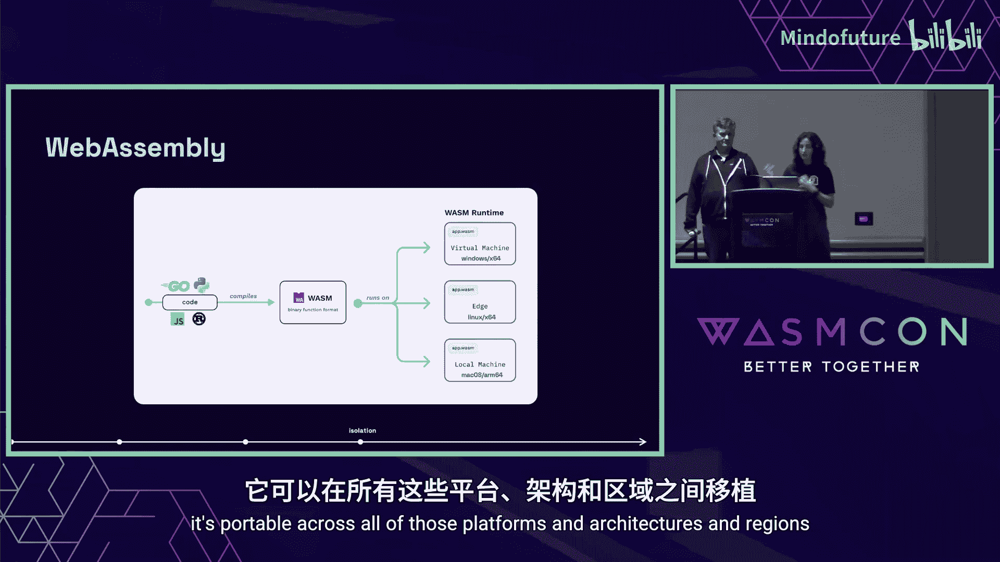

## 章节 3：构建绿色软件技术栈

基于上述公式，为了降低 **O** 和 **M**，我们可以构建一个包含四部分的绿色软件技术栈：

1.  **高效的编程语言**：使用更高效的语言编写应用。研究表明，用Rust实现的程序比用Python实现的程序能耗低75倍。
2.  **高密度的应用架构**：采用能在同一硬件上运行更多工作负载的架构。
3.  **快速切换的隔离机制**：使用能快速启动和销毁的隔离技术。
4.  **节能的基础设施**：在功耗意识强的硬件上运行所有组件。

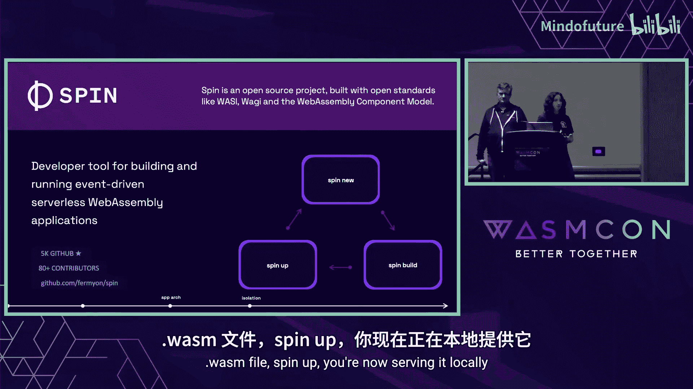

接下来，我们将详细探讨应用架构和隔离机制。

### 应用架构的演进
应用架构的演进始终围绕着提升硬件利用率：
*   **虚拟机**：允许在单台物理机上运行多个独立应用。
*   **微服务**：将应用拆分为独立服务，实现更精细的扩展。
*   **无服务器**：将扩展粒度细化到单个函数或业务逻辑单元。

然而，当前的无服务器技术尚未完全实现其目标，未能达到理想的密度。部分原因是其底层技术（如微虚拟机）无法真正“缩容到零”，导致资源闲置。

### 现有无服务器技术的问题
以下是现有无服务器技术面临的主要挑战：
*   **微虚拟机**：冷启动时间可能长达1秒。云服务商通常需要预热99%的实例来避免冷启动，这意味着在代码实际执行前就在消耗资源。
*   **容器**：在类似场景下，保持容器“温暖”以备调用的成本非常高，因为销毁后重新启动耗时过长。

研究表明，Kubernetes集群中平均有69%的CPU核心处于闲置状态，这造成了巨大的资源浪费。

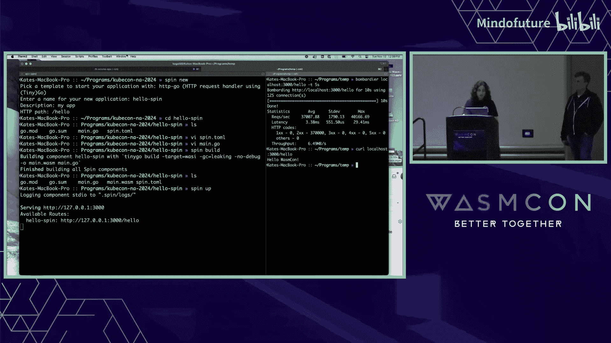

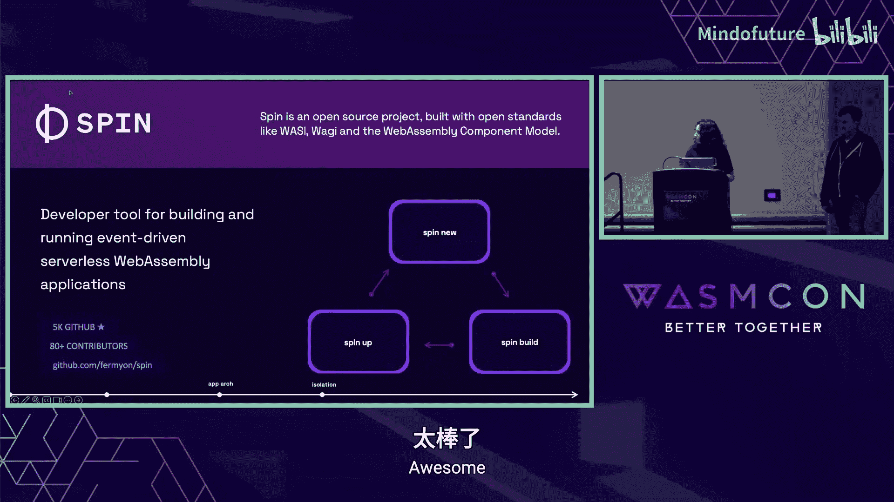

---

## 章节 4：解决方案：WebAssembly

上一节我们指出了现有架构的密度问题，本节我们将介绍能实现“缩容到零”的解决方案：WebAssembly。

WebAssembly是一种代码隔离机制，适用于多租户环境，其启动时间小于1毫秒。它是一个可移植的编译目标，意味着你可以将用Go、Rust、Python或JavaScript等语言编写的代码，编译成 `.wasm` 字节码文件。该文件可以在任何搭载了WebAssembly运行时的环境中运行，无论是边缘还是云端，实现了真正的跨平台和跨架构。

WebAssembly成为理想的无服务器隔离机制，主要因为：
*   **安全隔离**：提供安全的沙箱和基于能力的安全模型，确保只能访问被明确授权的资源。
*   **可移植性**：一次编译，到处运行。
*   **体积小**：一个Express.js应用容器镜像约300MB，而对应的WebAssembly组件可能只有3MB，如果用Rust编写甚至可降至200KB。
*   **启动快**：毫秒级启动速度，实现了真正的按需启动和销毁。

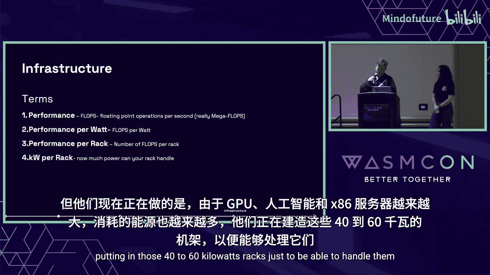

### 快速开始：使用 Spin
Spin是一个用于构建无服务器WebAssembly应用的开源开发工具，旨在简化开发体验。

以下是使用Spin的三个核心命令：
1.  `spin new`：创建新应用脚手架。
2.  `spin build`：将代码编译为 `.wasm` 文件。
3.  `spin up`：在本地运行应用。

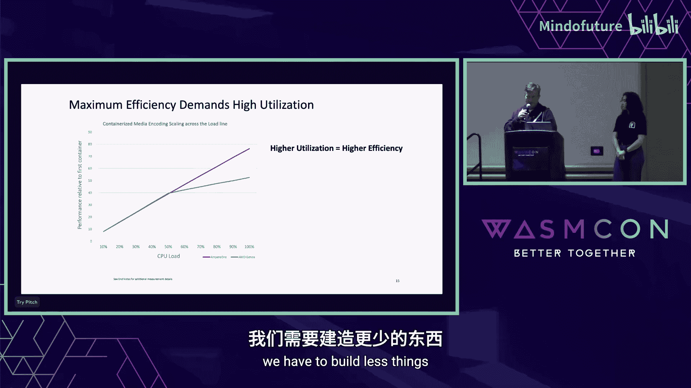

通过一个简单的HTTP应用演示，我们可以在5秒内发起数十万次请求，平均延迟仅3.38毫秒，展示了WebAssembly快速创建、沙箱化执行和销毁的能力。

### 部署选项
开发完成后，你可以选择多种部署方式：
*   **Fermyon Cloud**：多租户无服务器WebAssembly平台。
*   **Kubernetes + SpinKube**：一个开源项目，让你能在Kubernetes上轻松运行无服务器WebAssembly应用。SpinKube通过一个ContainerD shim，在底层让ContainerD执行WebAssembly模块而非容器，并通过Spin Operator在Kubernetes上管理应用。

---

## 章节 5：选择节能的硬件架构

在讨论了软件栈之后，我们来看看绿色软件栈的第四个部分：硬件基础设施。首先，明确几个关键术语：

*   **性能**：纯粹的速度，例如每秒浮点运算次数。
*   **能效**：每瓦特功耗所能提供的性能。
*   **机架级性能**：一个机架内所有服务器能提供的总性能。
*   **机架功耗**：单个机架消耗的功率（千瓦）。现代高密度机架功耗可达40-60千瓦。

### Arm64 与 x86 架构的能效对比
为了实现高利用率和高密度，我们需要在高负载下仍能保持高效能的芯片。Arm64服务器在此方面表现优异。

下图展示了随着负载增加，Arm64服务器能保持线性的性能增长，而x86服务器在负载达到约50%后，能效会显著下降。

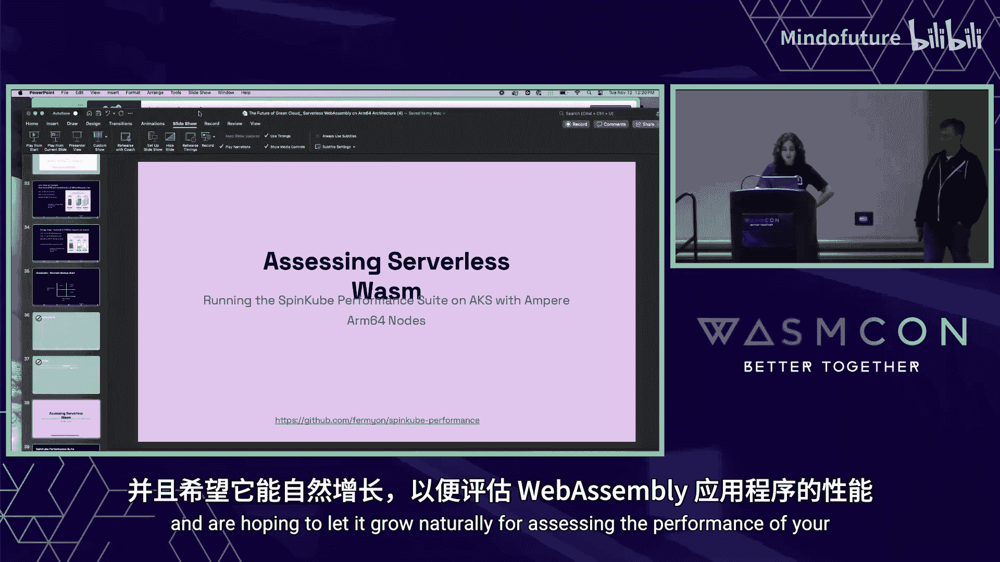

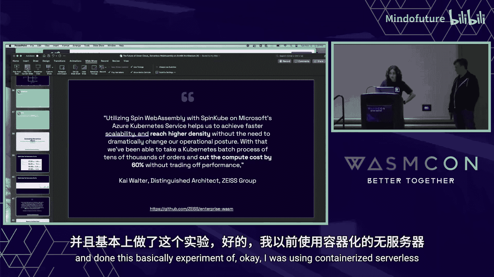

这主要源于**同步多线程**的差异：
*   **x86**：每个物理核心提供两个虚拟线程。当负载较高时，可能出现“吵闹的邻居”问题，即一个线程因I/O等原因阻塞时，会连累同一核心上的另一个线程，导致效率下降。
*   **Arm64**：采用单线程单核心设计，核心数量更多，密度更高。每个线程独立运行，避免了相互干扰，从而在高负载下提供更可预测的性能。

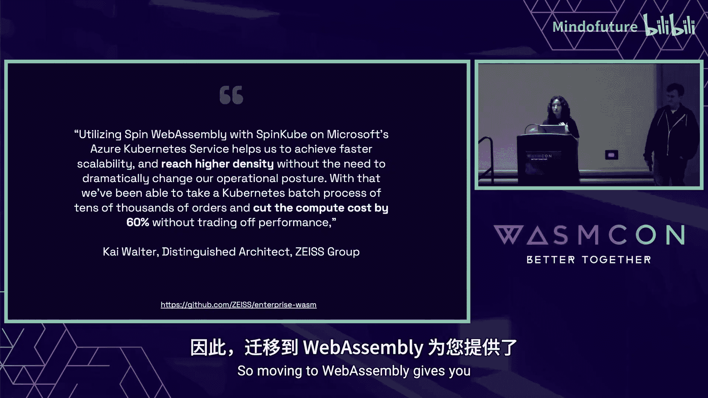

### 实际影响示例
假设需要处理每秒130万次请求：
*   **Intel x86**：需要82个CPU（假设每服务器2CPU，即41台服务器）。
*   **Arm64**：需要36个CPU（即18台服务器）。

在功耗方面：
*   Intel方案总功耗接近35千瓦/时。
*   Arm64方案总功耗约为12.7千瓦/时。

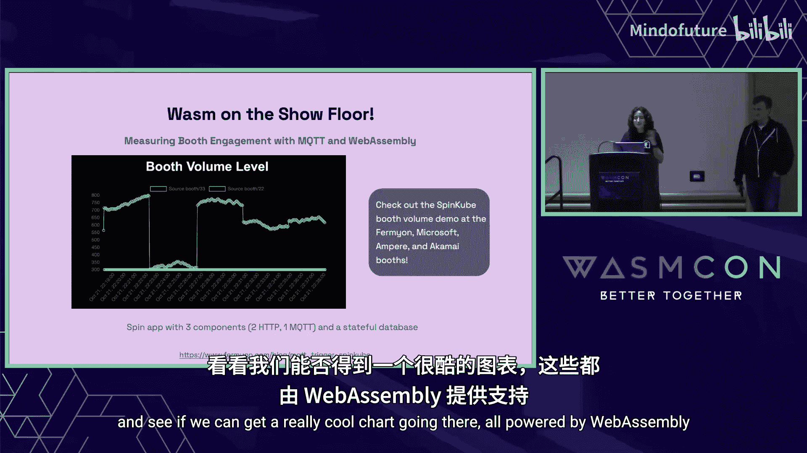

Arm64方案不仅服务器数量更少，单台功耗更低，总能耗也大幅下降，并且所有服务器可以整合进一个标准机架，实现了更高的密度和能效。

---

## 章节 6：强强联合：Wasm + Arm64

最理想的情况是将高效的软件栈（WebAssembly）与高效的硬件架构（Arm64）相结合。

为了帮助用户评估性能，我们创建了一个性能测试套件，基于K6负载测试工具和SpinKube。测试涵盖了不同语言实现的“Hello World”应用的执行速度、应用副本数扩展时的性能表现，以及请求速率攀升时的CPU使用情况。测试表明，系统能够根据负载快速扩展和收缩。

### 成功案例：ZeIS 集团
ZeIS集团从容器化无服务器迁移到基于SpinKube的WebAssembly无服务器后，在保持性能的同时实现了更高的部署密度。这使得他们的计算成本降低了60%。成本节约一方面源于更高的密度，另一方面也因为他们可以自由选择更经济的Arm64虚拟机。

---

## 章节 7：互动演示与总结

最后，我们有一个贯穿整个展区的互动演示。多个公司的展位将设置基于振动的声音传感器，收集环境音量数据。数据通过MQTT协议发送，由一个由Spin编写的MQTT触发应用接收并存入SQL数据库。后端组件处理数据后，前端会以图表形式实时展示各展位的“活跃度”。这展示了WebAssembly在事件驱动、实时数据处理场景下的应用能力。

## 总结
在本节课中，我们一起学习了如何通过技术选择构建更绿色的云计算应用。关键要点包括：
1.  使用**软件碳强度公式**来衡量和指导优化方向。
2.  采用**WebAssembly**作为无服务器隔离机制，实现毫秒级启动、高密度部署和真正的缩容到零。
3.  选择**Arm64架构**的硬件，以获得更优的能效和高负载下的稳定性能。
4.  将**Wasm与Arm64结合**，能最大化地提升能效、降低成本和碳足迹。

作为开发者，我们拥有通过技术选择为环境可持续性做出贡献的力量。

