# 024：揭秘组件模型的威力 🚀


在本教程中，我们将学习如何利用 WebAssembly 组件模型，跨越不同编程语言生态系统的界限，复用现有的库。我们将通过一个具体示例，展示如何将 Rust 编写的 Base64 库集成到 Grain 语言编写的 Web 应用中。

## 语言介绍：Grain 🌾

首先，我们来介绍一种名为 Grain 的编程语言。它始于 2017 年，是一个为 WebAssembly 设计的强类型、宽松的函数式编程语言。

Grain 融合了函数式编程的理念，例如数据优先和代数数据类型。同时，它也包含了命令式编程风格的元素，比如 `for` 循环和可变变量 `let mut`，以兼顾更广泛的开发者需求。

## 构建生态系统的挑战 🏗️

然而，构建一个完整的语言生态系统非常困难。开发者对一个语言的期望远不止一个编译器。

以下是构建生态系统所需的关键部分：
*   **健壮的编译器**：确保代码能编译并正确运行。
*   **完善的测试和调试体验**：提供排查代码问题的工具。
*   **语法高亮**：在代码编辑器中提供视觉辅助。
*   **语言服务器**：在编辑器中提供代码补全、错误提示等功能。
*   **包管理器和注册中心**：用于发布和共享代码库。
*   **丰富的可用库**：像 Python 或 Ruby 那样，拥有覆盖各种需求的库。

因此，构建一个完整的语言生态系统远比编写一个编译器复杂。

## 组件模型的威力：跨生态共享 🔗

WebAssembly 组件模型为我们提供了解决库生态问题的强大工具。它通过高级类型定义，使得不同语言编译的模块能够无缝组合在一起。

组件模型的核心是 **WebAssembly 接口类型**。WIT 是一种开发者友好的格式，用于描述组件接口。只要你能为某个功能编写一个 WIT 接口，就可以自动为多种语言生成绑定代码，实现“免费的 SDK”。

这意味着你可以从任何支持组件模型的语言中，随意引入其他语言生态系统的库，这从根本上改变了软件开发的方式。

## 实战演示：集成 Rust Base64 库到 Grain 应用 🛠️

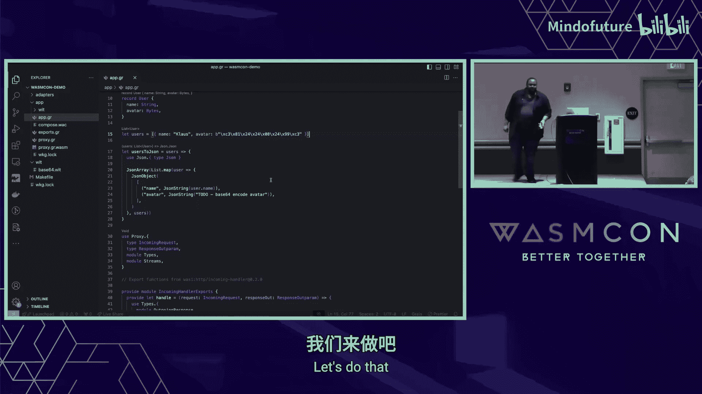

上一节我们介绍了组件模型的理论优势，本节我们将通过一个具体示例来实践。我们将在一个 Grain 编写的 HTTP 代理应用中，使用 Rust 生态的 Base64 编码库。

### 步骤 1：识别需求与问题

我们有一个 Grain 应用，需要将用户数据（包含名称和头像字节）转换为 JSON。由于 JSON 不能直接包含二进制数据，我们需要将头像字节进行 Base64 编码。

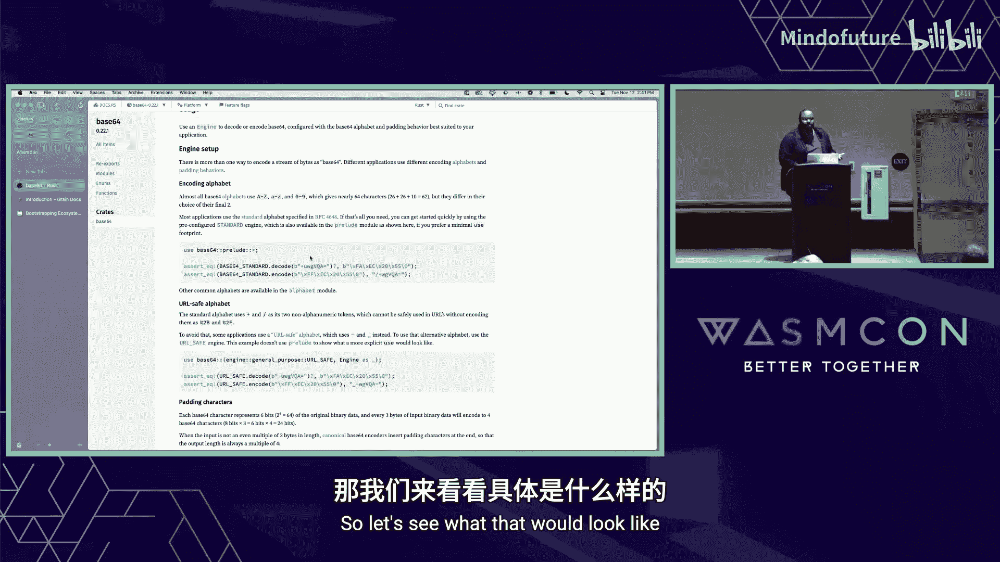

然而，Grain 的标准库目前没有提供 Base64 编码功能。作为开发者，我们不想从头实现一个 Base64 库。

### 步骤 2：寻找并定义接口

我们可以在 Rust 生态中找到成熟且高效的 Base64 库（例如 `base64` crate）。接下来，我们需要创建一个 WIT 文件来定义 Base64 组件的接口。

```wit
// base64.wit
package oscar:base64@1.0.0

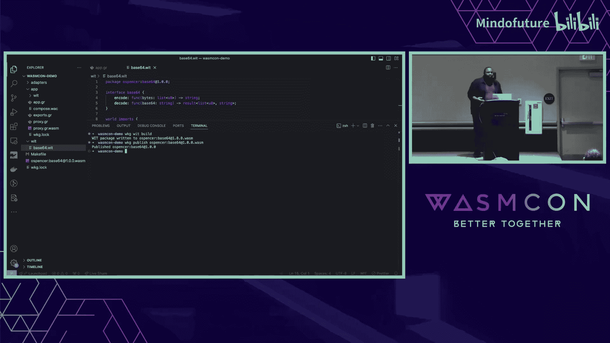

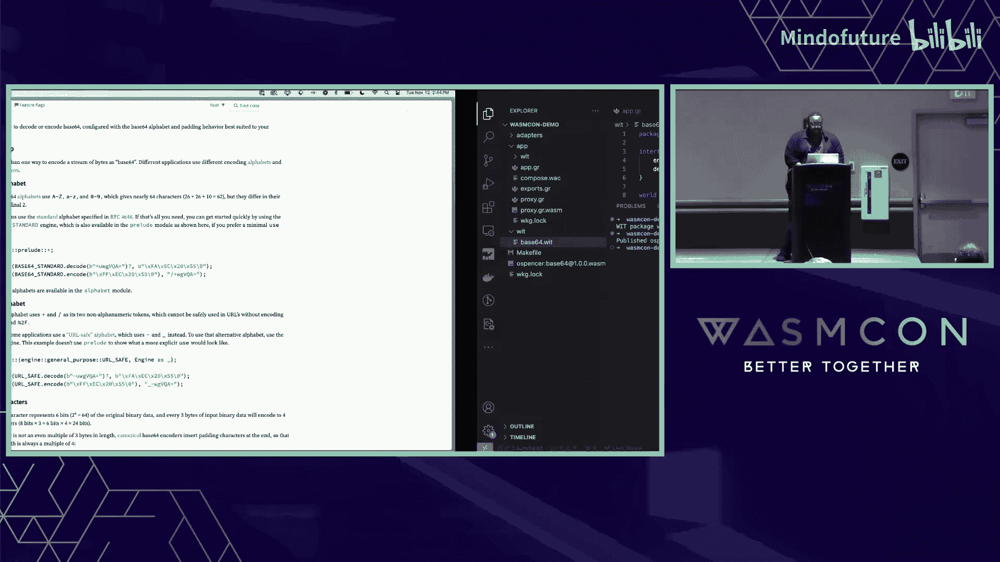

interface base64 {
  encode: func(bytes: list<u8>) -> string
  decode: func(b64: string) -> result<list<u8>, string>
}

world imports {
  import base64
}

world exports {
  export base64
}
```

我们使用 `warg` 工具发布这个接口定义到组件注册中心。

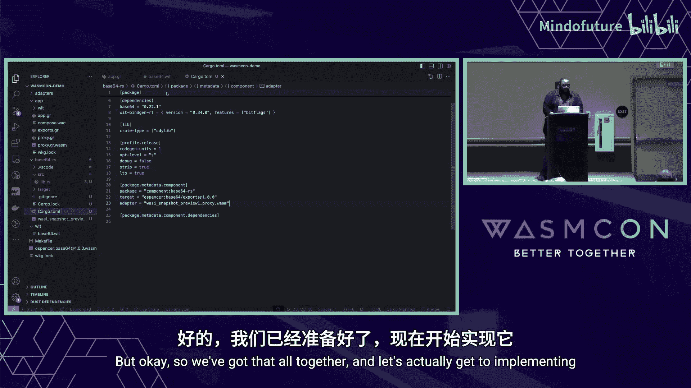

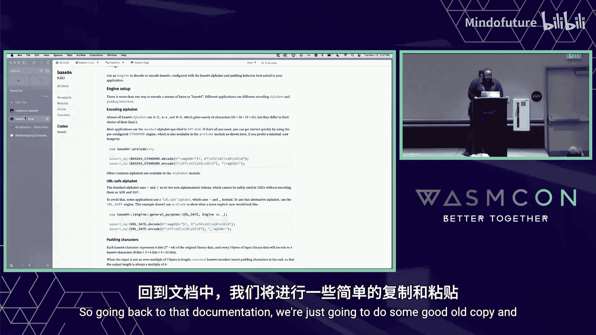

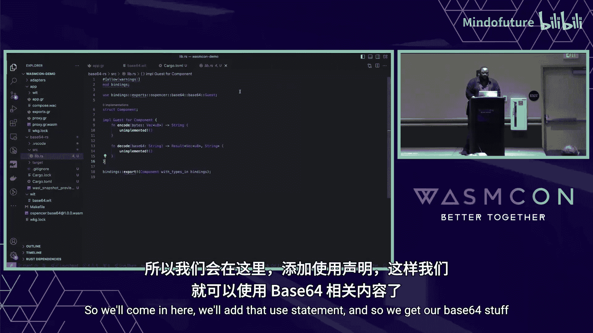

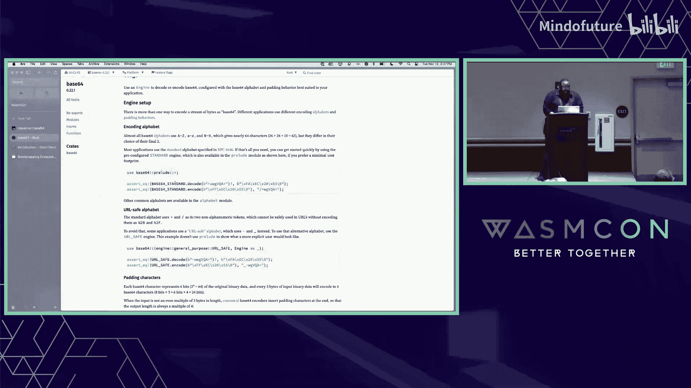

### 步骤 3：实现 Rust 组件

现在，我们需要创建一个 Rust 组件来实现上述接口。我们使用 `cargo-component` 工具来搭建项目。

```bash
cargo component new base64-rs --lib --world oscar:base64/exports
```

然后，添加 `base64` crate 依赖，并实现 `encode` 和 `decode` 函数。

```rust
// src/lib.rs
use base64::{Engine as _, engine::general_purpose};

pub fn encode(bytes: Vec<u8>) -> String {
    general_purpose::STANDARD.encode(bytes)
}

pub fn decode(b64: String) -> Result<Vec<u8>, String> {
    general_purpose::STANDARD.decode(&b64).map_err(|e| e.to_string())
}
```

使用 `cargo component build` 命令编译，即可得到一个实现了指定接口的 WebAssembly 组件。

### 步骤 4：在 Grain 中生成并使用绑定

接下来，我们需要在 Grain 应用中消费这个 Base64 接口。我们使用 `wit-bindgen` 工具为 Grain 生成绑定代码。

```bash
wit-bindgen grain --world imports base64.wit
```

这会产生一个 Grain 模块文件（例如 `base64.gr`）。我们将其引入到 Grain 应用中。

```grain
// 引入生成的绑定模块
from “./base64.gr” include { imports as base64-imports }

let Base64 = base64-imports.base64

// 在代码中使用
let encodedAvatar = Base64.encode(user.avatar)
```

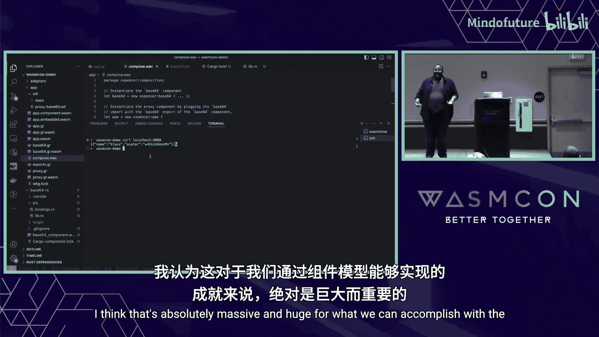

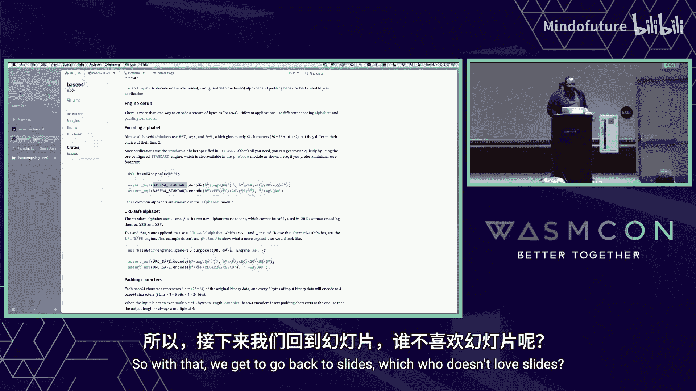

现在，在 Grain 代码中调用 `Base64.encode`，就像调用任何普通的 Grain 函数一样。

### 步骤 5：组合组件并运行

最后一步是将 Grain 应用组件和 Rust 的 Base64 组件组合成一个完整的应用。我们使用 `wasm-tools component embed` 将 WIT 描述嵌入到 Grain 编译出的核心模块中，再将其提升为组件。

然后，使用 `wac` 工具将两个组件链接在一起。

```bash
# 使用 wac 的自动链接功能
wac plug app.component.wasm -d base64-rs.component.wasm -o app.composed.wasm
```

现在，`app.composed.wasm` 就是一个包含了 Grain 业务逻辑和 Rust Base64 功能的完整组件。我们可以使用支持 WASI HTTP 的运行时（如 `wasmtime`）来运行它。

```bash
wasmtime serve --wasm-features=tail-call app.composed.wasm
```

通过 `curl localhost:8080` 访问，即可看到包含 Base64 编码头像的 JSON 响应。

## 总结与展望 🌟

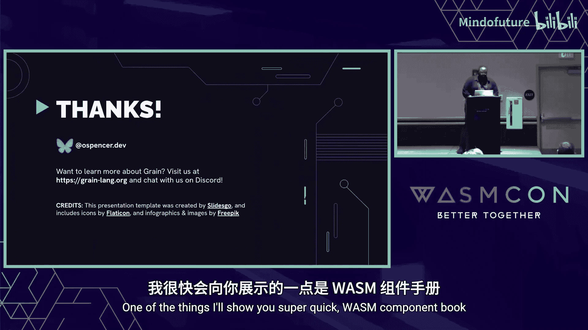

本节课中，我们一起学习了 WebAssembly 组件模型的强大能力。我们通过一个具体案例，演示了如何在约20分钟内，将 Rust 生态的库集成到 Grain 语言的应用中。这个过程涉及：
1.  定义标准的 WIT 接口。
2.  用 Rust 实现该接口的组件。
3.  为 Grain 生成类型安全的绑定。
4.  使用工具将不同语言编写的组件无缝组合。

这标志着软件开发方式的重大变革，未来开发者可以自由地混合使用不同语言生态中最优秀的库，而无需担心语言间的互操作障碍。

## 参与其中 🤝

如果你对以下内容感兴趣，欢迎参与进来：
*   **Grain 语言**：如果你喜欢编程语言或编译器开发。
*   **工具链**：如 `wasm-tools`、`warg`、`wasmtime`，这些都是构建生态的关键。
*   **文档**：帮助完善组件模型等相关文档，降低学习成本。

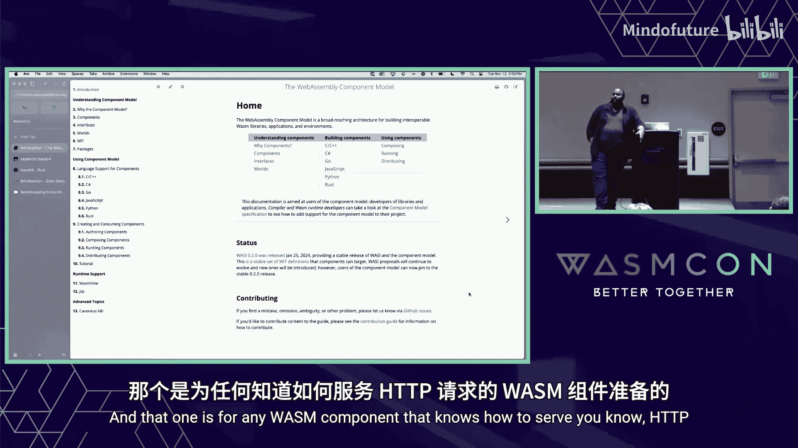


组件模型正在快速发展，更高的抽象和更优的开发者体验是未来的目标。最终，这些工具将深度集成到各语言的现有工具链中，使跨语言复用库变得像今天在单一生态内一样简单自然。