# 025：概述与核心概念

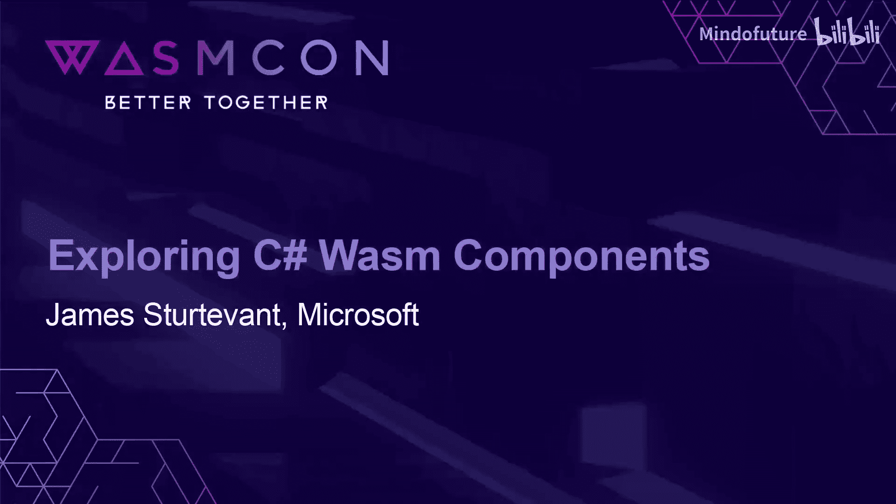

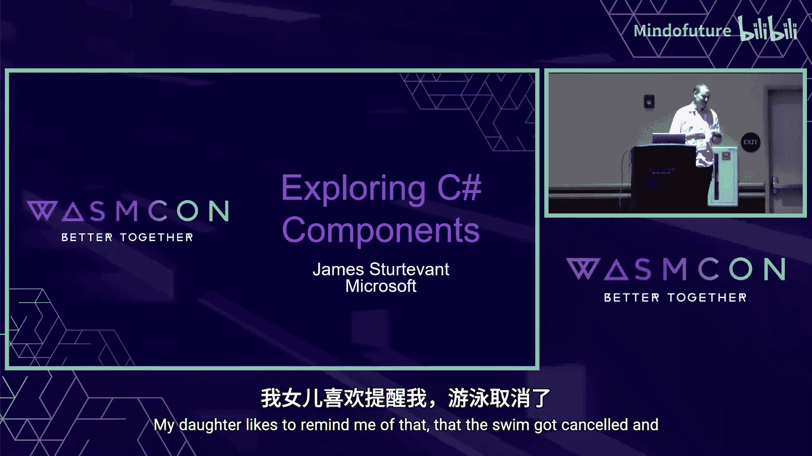

在本节课中，我们将要学习 WebAssembly 组件模型的基础知识，并了解 C# 如何支持构建 Wasm 组件。我们将从组件的基本概念开始，逐步深入到工具链的使用和 .NET 如何简化开发体验。

WebAssembly 组件模型扩展了传统 Wasm 模块的能力，使其能够通过定义清晰的接口与外部世界（如主机或其他组件）进行交互。一个组件可以导入所需的功能（如 HTTP 请求），并导出自身提供的功能供他人调用。这种模型带来了跨平台、高性能、安全和小体积等 Wasm 固有优势，同时实现了功能的模块化共享和静态安全分析。

为什么选择 C# 来构建组件？首先，C# 语言本身功能强大且拥有庞大的开发者社区。更重要的是，.NET 能够直接生成符合 Wasm 组件模型规范（WIT）的组件，无需额外的适配层。.NET 还为常见的 Wasm 接口（如 WASI HTTP）提供了高级别的 API 支持，并且有 `Componentize.NET` 这样的工具来帮助开发者快速上手。

---

## C# Wasm 组件探索：2：.NET 中的 Wasm 支持

上一节我们介绍了 Wasm 组件的基本概念，本节中我们来看看 .NET 目前提供的两种 Wasm 支持方式。

目前 .NET 主要提供两种 Wasm 支持风格：

1.  **Mono 解释器**：这种方式与 Blazor 使用的技术类似。它是一个解释器，支持反射等功能，随 SDK 一同发布，能提供完整的堆栈跟踪。需要注意的是，**它目前处于实验性支持阶段**，主要支持渠道是 GitHub 等社区平台。
2.  **Native AOT（提前编译）**：这种方式位于 runtime-lab 仓库中。由于代码被提前编译，它**具有更快的启动潜力**。它通常是 Wasm 新功能最先实现的试验田，待功能稳定后会向上游运行时合并。这项工作主要由社区驱动，尚未集成到官方的 .NET 运行时中。

---

## C# Wasm 组件探索：3：手动构建一个简单组件

上一节我们了解了 .NET 的两种 Wasm 支持方式，本节我们将动手实践，手动构建一个最简单的 Wasm 组件。

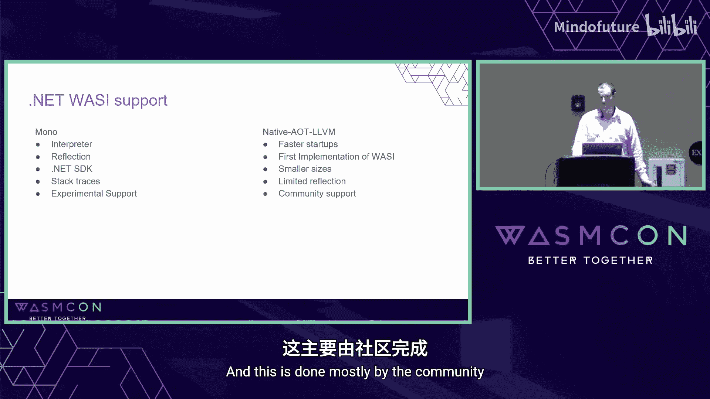


我们将构建一个仅导出一个加法函数的组件。这个过程会涉及多个工具，旨在帮助大家理解底层原理。

首先，我们需要一个定义组件接口的 WIT 文件。以下是一个简单的 `world` 定义：

```wit
// adder.wit
package example:adder

world adder {
    export add: func(a: s32, b: s32) -> s32
}
```

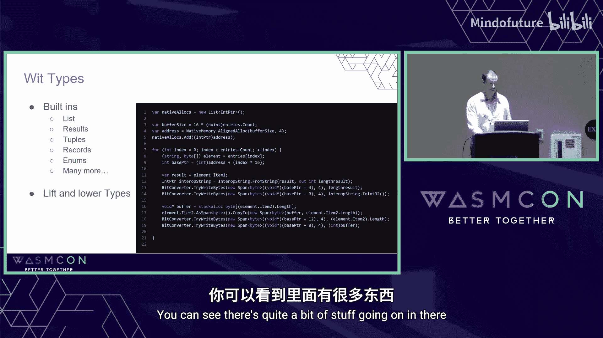

对应的 C# 项目文件 `.csproj` 需要配置以支持 Wasm 编译：

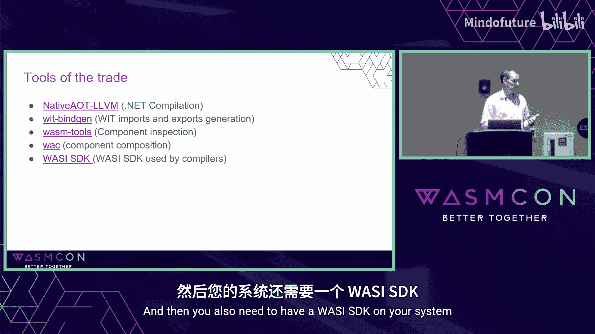

```xml
<Project Sdk="Microsoft.NET.Sdk">
  <PropertyGroup>
    <OutputType>Exe</OutputType>
    <TargetFramework>net8.0</TargetFramework>
    <!-- 指定 Wasm 运行时 -->
    <RuntimeIdentifier>wasi-wasm</RuntimeIdentifier>
    <!-- 生成独立部署的单文件 -->
    <PublishSingleFile>true</PublishSingleFile>
    <!-- 允许不安全代码块，为绑定生成所需 -->
    <AllowUnsafeBlocks>true</AllowUnsafeBlocks>
    <!-- 引入 Wasm 工具链 SDK -->
    <WasmSdk>true</WasmSdk>
  </PropertyGroup>
  <ItemGroup>
    <!-- 添加 Native AOT 编译支持 -->
    <PackageReference Include="Microsoft.DotNet.ILCompiler" Version="8.0.0-*" />
  </ItemGroup>
</Project>
```


在 C# 代码中，我们使用 `[UnmanagedCallersOnly]` 和 `[Export]` 属性来标记要导出的函数：

```csharp
using System.Runtime.InteropServices;

public class Program
{
    // 导出函数给 Wasm 组件调用
    [UnmanagedCallersOnly(EntryPoint = "add")]
    [Export]
    public static int Add(int a, int b)
    {
        return a + b;
    }

    // 程序入口点，对于组件，此函数可能由主机调用
    public static void Main() { }
}
```

编译并发布项目后，我们将得到一个 `.wasm` 文件。可以使用 `wasm-tools` 来检查这个组件：

```bash
wasm-tools component wit ./bin/Release/net8.0/wasi-wasm/publish/MyComponent.wasm
```

此命令将显示组件导出的接口，确认 `add` 函数已被成功导出。

---

## C# Wasm 组件探索：4：组件组合与绑定生成

上一节我们成功构建了一个简单的导出组件，本节我们来看看如何组合组件，并利用工具自动生成复杂的类型绑定。

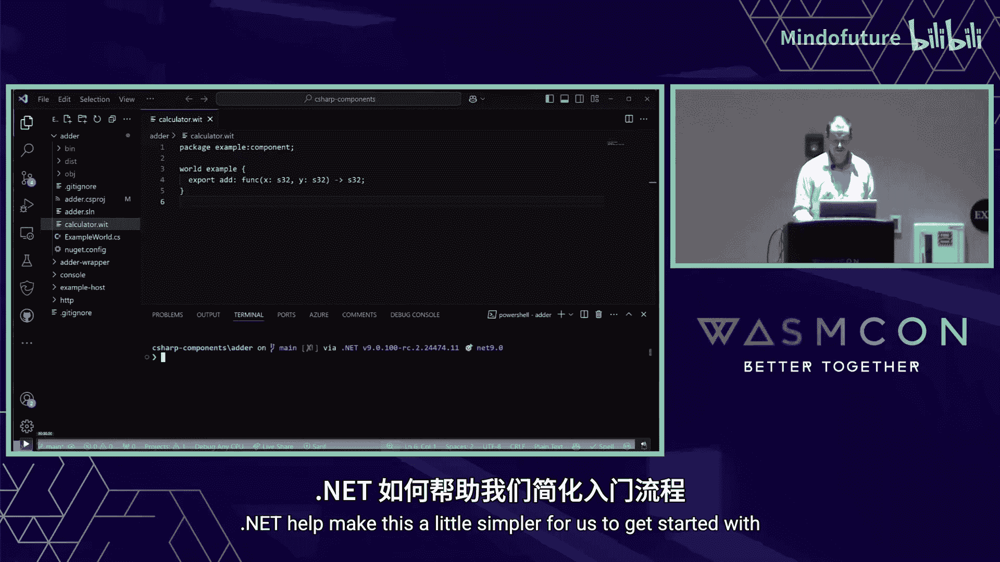

现在假设我们想在调用加法函数前添加一些逻辑（例如，特殊处理结果为 42 的情况）。我们可以创建第二个“包装”组件，它导入第一个组件的 `add` 函数，处理后再导出。

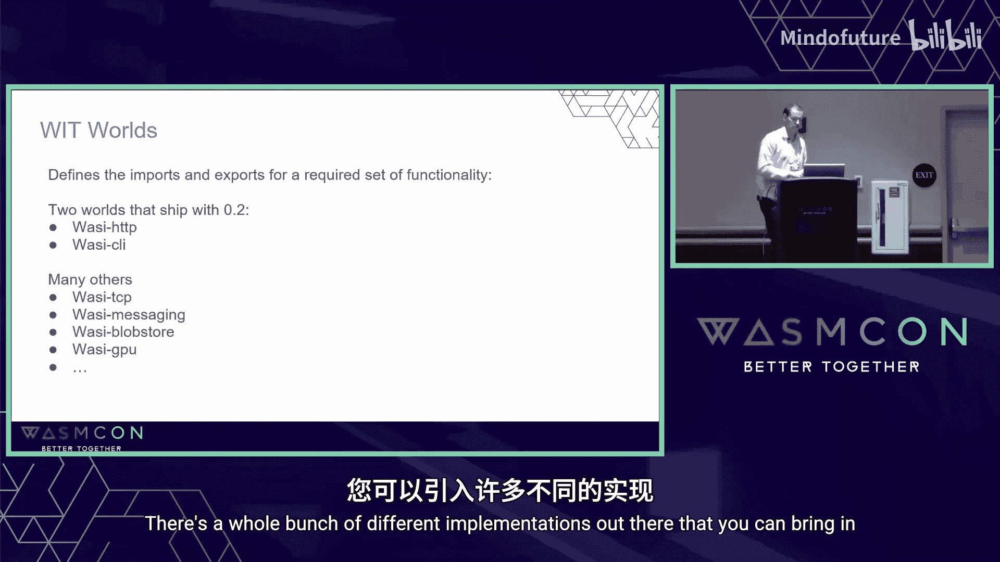

这个包装组件的 WIT 定义如下：

```wit
// wrapper.wit
package example:wrapper

world wrapper {
    import adder: interface {
        add: func(a: s32, b: s32) -> s32
    }
    export run: func(a: s32, b: s32) -> s32
}
```

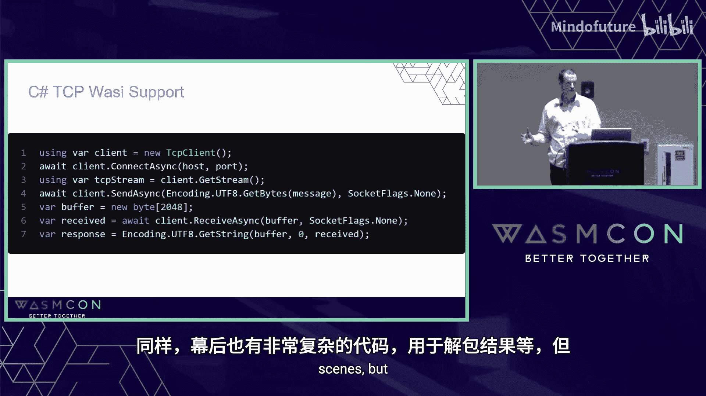

手动为这样的接口编写 C# 绑定代码非常繁琐，尤其是处理列表、结果等复杂类型时。这时就需要 `wit-bindgen` 工具。它可以自动根据 WIT 文件生成 C# 绑定代码：

```bash
wit-bindgen csharp ./wrapper.wit --out-dir ./Generated
```

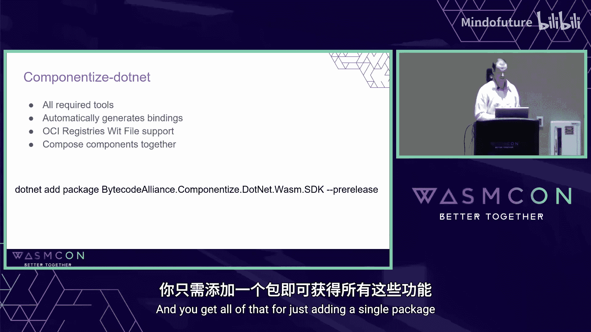

生成的 C# 代码会包含接口定义和用于“提升（lift）”、“降低（lower）”复杂类型的辅助方法。我们的实现类只需要实现生成的接口即可：


```csharp
using System;
using Generated.Exports; // 注意：由于当前工具链的一个小问题，导入的函数可能在 Exports 命名空间下

public class WrapperComponent : IWrapper
{
    // 实现生成的接口方法
    public static int Run(int a, int b)
    {
        // 调用导入的加法函数
        int result = adder.add(a, b);
        // 添加自定义逻辑
        if (result == 42)
        {
            Console.WriteLine("The answer to life, the universe, and everything!");
        }
        return result;
    }
}
```

最后，我们需要使用 `wac`（WebAssembly 组件组合工具）将第一个加法组件和这个包装组件组合起来，形成一个最终的可部署组件。

```bash
wac compose -o final.wasm ./adder.component.wasm ./wrapper.component.wasm
```

---

## C# Wasm 组件探索：5：使用 Componentize.NET 简化开发

上一节我们手动使用了 `wit-bindgen` 和 `wac` 等工具，步骤较多。本节我们将介绍 `Componentize.NET`，它极大地简化了 C# Wasm 组件的开发流程。

`Componentize.NET` 是一个 NuGet 包，它整合了所有必要的工具（`wit-bindgen`, `wac`, Wasm SDK），并自动处理 WIT 绑定生成和组件链接。

**简化 HTTP 组件开发**

.NET 库已经为 WASI 接口（如 HTTP、Cli）提供了高级别的 API 封装。这意味着开发者可以像在普通 .NET 程序中一样使用 `HttpClient`，而无需直接处理底层的 WIT 类型。

以下是如何创建一个使用 HTTP 的组件：

1.  创建新项目并添加 `Componentize.NET` 包引用。
2.  在 `.csproj` 中设置目标运行时为 `wasi-wasm`。
3.  编写普通的 C# HTTP 客户端代码。

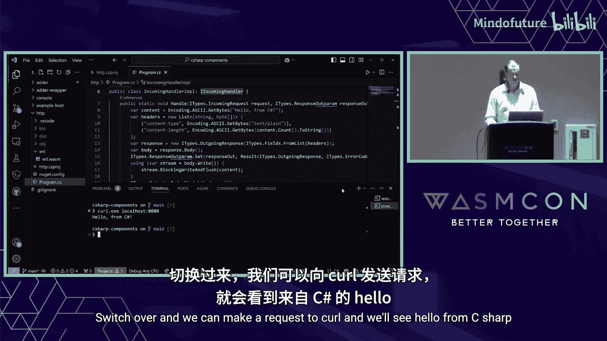

项目文件配置示例：
```xml
<Project Sdk="Microsoft.NET.Sdk">
  <PropertyGroup>
    <OutputType>Exe</OutputType>
    <TargetFramework>net8.0</TargetFramework>
    <RuntimeIdentifier>wasi-wasm</RuntimeIdentifier>
    <WasmSdk>true</WasmSdk>
  </PropertyGroup>
  <ItemGroup>
    <!-- 添加 Componentize.NET 包 -->
    <PackageReference Include="Componentize.NET" Version="0.1.0-*" />
  </ItemGroup>
</Project>
```

C# 代码示例：
```csharp
using System.Net.Http;

public class Program
{
    public static async Task Main()
    {
        // 像在普通 .NET 程序中一样使用 HttpClient
        var client = new HttpClient();
        var response = await client.GetStringAsync("https://api.example.com/random");
        Console.WriteLine($"Response: {response}");
    }
}
```

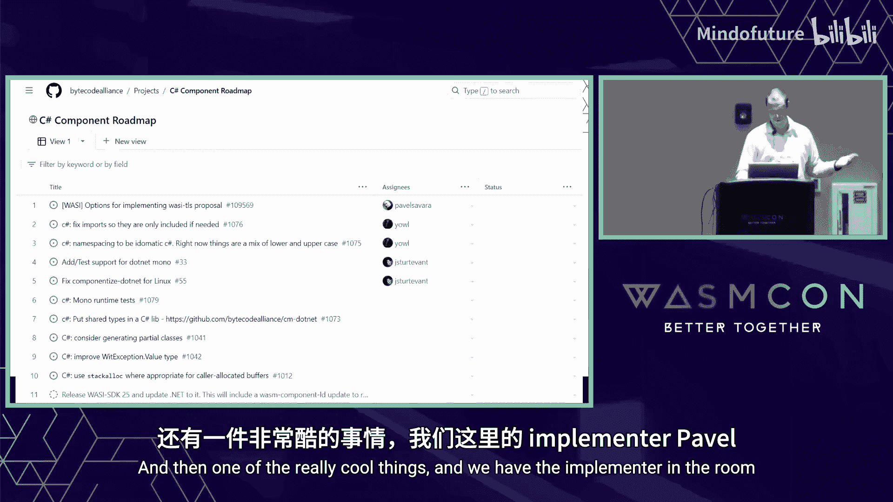

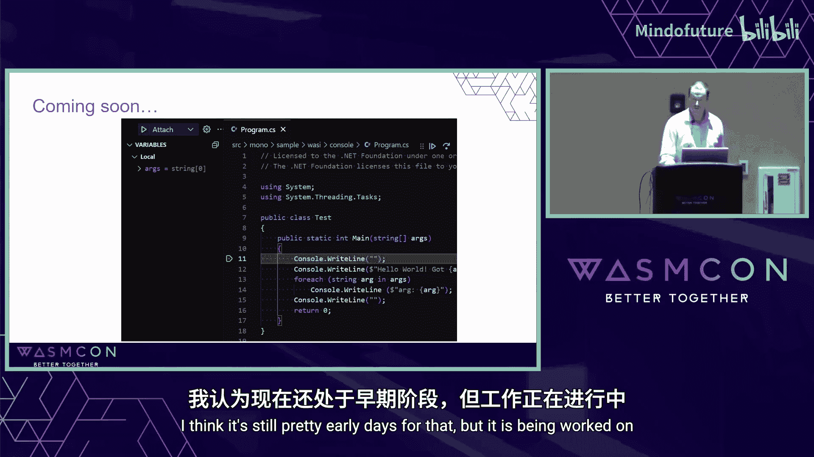

发布项目后，`Componentize.NET` 会自动处理所有底层细节，生成一个完整的 Wasm 组件。使用 `wasm-tools` 检查，可以看到它自动导入了 WASI HTTP 接口并导出了 `run` 函数。

**简化 WIT 集成与组件组合**

`Componentize.NET` 使得在项目中引用外部 WIT 定义和组合组件变得非常简单。只需在 `.csproj` 中配置 `Wit` 属性，它就会自动下载 WIT 包（支持 OCI 注册表）、生成绑定，并在发布时自动组合组件。

```xml
<Project Sdk="Microsoft.NET.Sdk">
  ...
  <ItemGroup>
    <PackageReference Include="Componentize.NET" Version="0.1.0-*" />
  </ItemGroup>
  <PropertyGroup>
    <!-- 指定要使用的 WIT 文件和世界 -->
    <Wit>package.wit</Wit>
    <WitWorld>my-world</WitWorld>
    <!-- 指定 WIT 包所在的 OCI 注册表 -->
    <WitRegistry>https://my-registry.com</WitRegistry>
  </PropertyGroup>
</Project>
```

---

## C# Wasm 组件探索：6：未来展望与总结

在本节课中，我们一起学习了 C# 与 WebAssembly 组件模型的结合。

我们首先建立了 Wasm 组件的基本心智模型，理解了组件通过导入和导出接口与主机或其他组件交互的范式。接着，我们探讨了 .NET 提供的 Mono 和 Native AOT 两种 Wasm 支持方式。

通过手动构建简单组件和包装组件的实践，我们深入了解了 `wit-bindgen`、`wac` 等底层工具链的作用。最后，我们介绍了 `Componentize.NET` 如何将这些复杂步骤封装起来，让开发者能够用熟悉的 .NET 方式（如直接使用 `HttpClient`）高效开发 Wasm 组件，并轻松集成外部 WIT 定义和组合组件。

**未来展望**

C# Wasm 组件生态仍在快速发展中。社区正在积极工作，未来可能会带来以下增强：
*   **项目规划**：在 GitHub 上有一个公开的项目看板，用于跟踪和优先处理各项开发任务。
*   **调试支持**：正在开发 F5 调试体验，允许开发者像调试普通 .NET 应用一样对 Wasm 组件进行单步调试。
*   **更完善的 WASI 支持**：包括对 HTTP/2、gRPC、TLS 以及更便捷数据库连接等功能的支持。
*   **更好的互操作性**：探索与原生代码库（通过 Wasm SDK）更深度集成的可能性。
*   **高级别框架集成**：未来可能探索将现有 ASP.NET Core 等框架中间件模式更直接地迁移到 Wasm 组件环境。

**加入社区**

这项工作由社区驱动，欢迎所有开发者参与。你可以通过以下方式贡献：
*   试用现有工具并提供反馈。
*   加入 Bytecode Alliance 的 C# 小组会议。
*   在相关聊天频道（如 Zulip）中交流。
*   从编写测试用例开始，逐步参与代码贡献。

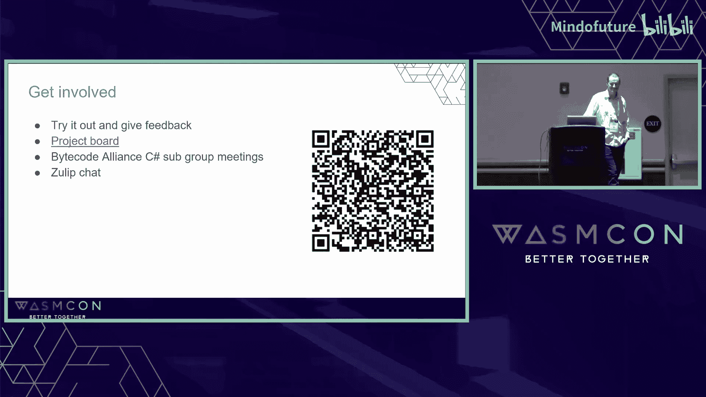

Wasm 组件模型为 C# 开启了一片新的、可移植、安全且高性能的部署天地，而 .NET 正在让进入这片天地的大门变得越来越宽敞和平坦。