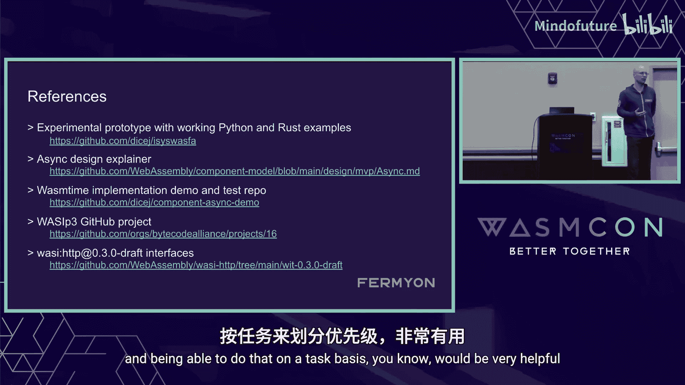

# 026：可组合的并发性 🚀


在本节课中，我们将学习 WebAssembly 组件模型（WASI）在并发性方面的最新进展，特别是即将到来的 WASI Preview 3（P3）如何解决当前 P2 版本的局限性，并引入可组合的并发性。我们将探讨其设计目标、核心概念，并通过代码示例了解其对多语言开发者的影响。

## 概述

WASI P2 虽然已经发布并可用，但在支持真正的可组合并发方面存在一些已知的局限性。WASI P3 的目标是解决这些问题，通过引入新的异步 ABI、支持栈式和无栈协程、以及简化接口（如 HTTP），来构建一个更强大、更符合语言习惯的组件生态系统。

## WASI P2 的局限性

在深入新特性之前，我们有必要回顾一下 WASI P2 存在的几个主要限制。这些并非意外，而是为了尽快交付价值而做出的权衡。

*   **WASI I/O 的复杂性**：WASI I/O 难以虚拟化，限制了组件间的高效通信。它主要处理字节流，对高级数据结构（如记录）的支持有限。
*   **实现效率与习惯用法**：在 WASI P2 中，实现诸如背压等网络流控机制显得笨拙，难以映射到大多数语言标准库的习惯用法。
*   **`poll` 调用的阻塞性**：`poll` 函数一次只能由一个组件调用，这会阻塞其他可能想要工作的组件。现有的变通方案会导致信息泄漏，不符合我们追求的沙箱模型。
*   **WASI HTTP API 的冗余与复杂**：API 庞大且存在冗余（例如入站和出站资源有独立的 API）。通过组合来实现流式中间件（如响应体转换）异常困难。

## WASI P3 的设计目标

基于上述限制，WASI P3 设定了明确的设计目标。

*   **完全向后兼容**：确保 WASI P3 与现有的 P2 组件完全兼容。初期宿主将同时支持两者，后续可通过 P3 虚拟化 P2 API。
*   **可组合的并发性**：提供必要的原语，让各语言（如 C#、Go、Rust）自身的事件循环能够委托给宿主中更高级别的事件循环进行统一调度，实现真正的并发组合。
*   **支持两种协程模型**：同时支持**无栈协程**（如 C#、Rust 的 `async/await`）和**栈式协程**（如 Go 的 goroutine），让不同语言都能以最习惯的方式使用并发。
*   **符合语言习惯的绑定**：缩小底层 WASI 绑定与各语言标准库接口之间的差距，使开发体验更自然。
*   **弃用 WASI I/O**：将 WASI I/O 的功能下移到组件模型本身，用更通用的流和未来（future）等原语来替代。

## 为什么共享无物的组合如此重要？

在探讨具体设计前，我们需要理解“共享无物”的组合模型为何是 WebAssembly 组件模型的核心优势。

*   **多语言互操作性**：通过定义良好的接口（而非不安全的 C ABI），可以在不同语言编写的组件之间实现安全、符合习惯的互操作。
*   **细粒度沙箱化**：组件模型允许将应用划分为不同的信任域。你可以控制每个组件能访问的资源（如网络、文件），从而限制第三方依赖漏洞可能造成的损害。
*   **供应链安全**：如果一个日志组件不应该有网络访问权限，就不要赋予它。这降低了潜在安全漏洞的影响范围。
*   **未来可扩展性**：为未来实现运行时实例化和 Erlang 风格的监督树（动态重启子组件）奠定了基础，进一步控制故障的影响范围。

## 核心设计摘要

上一节我们介绍了设计目标，本节我们来具体看看 WASI P3 为实现这些目标引入的核心机制。

*   **新的异步 ABI**：为导入和导出函数引入了新的异步调用约定。
    *   对于**无栈协程**，组件提供一个回调，允许宿主异步传递事件。
    *   对于**栈式协程**，组件可以进行阻塞调用，宿主在需要等待（如网络）时会挂起该调用栈（可能切换到其他栈），这依赖于协程栈切换提案。
*   **`return-then` 原语**：这是一个关键且强大的新概念。它允许一个导出函数在返回值给调用者（宿主）后，继续执行后续代码。这在返回流（`stream`）或未来（`future`）时特别有用，因为组件可以在返回流对象后，继续向其中填充数据。
*   **`stream` 与 `future` 类型**：这是两个新的内置类型，用于组件与宿主之间或组件之间的异步通信。
    *   `stream`：代表一个数据流，适用于 HTTP 响应体等场景。
    *   `future`：可看作单次使用的 `stream`，类似于一次性的通道（channel）。它们共同构成了跨组件通信的基石。

## 案例分析：WASI HTTP

WASI HTTP 是展示新特性威力的绝佳案例。通过将复杂性下移并精炼接口，P3 版的 WASI HTTP 得到了极大简化。

*   **接口简化**：资源类型从 13 个减少到 4 个，设计高度对称。处理入站请求和发起出站请求使用相同的类型和函数。
*   **核心类型**：主要包括 `body`（封装请求/响应内容）、`trailers`（用于 HTTP/2 或 gRPC）以及 `headers`。
*   **统一处理器**：一个 `handler` 接口同时用于处理传入的请求（作为导出）和发起传出的请求（作为导入）。代理模式变得非常简单：只需同时导入和导出 `handler`。

## 代码示例：流式中间件

理论需要实践来验证。让我们通过一个具体的例子——编写一个压缩响应的流式中间件——来看看 WASI P3 的代码是什么样子。以下是不同语言中的实现。

### Python 示例（无栈协程）

在 Python 中，我们利用其内置的 `asyncio` 和 `async/await` 语法来实现无栈协程。

```python
async def compress_middleware(request):
    # 1. 向上游处理器转发请求，获取响应
    upstream_response = await upstream_handler(request)

    # 2. 创建新的响应，设置压缩头
    compressed_response = Response()
    compressed_response.headers = upstream_response.headers
    compressed_response.headers.set("content-encoding", "deflate")

    # 3. 关键步骤：生成一个后台任务来处理流式压缩
    # 这个任务将在 `compress_middleware` 函数返回后继续运行
    spawn(stream_and_compress(upstream_response.body, compressed_response.body))

    # 4. 立即返回响应对象给宿主，宿主可以开始发送响应头
    return compressed_response

async def stream_and_compress(source_body, dest_body):
    # 使用标准库进行流式压缩
    async with source_body.read_stream() as reader, dest_body.write_stream() as writer:
        compressor = zlib.compressobj()
        async for chunk in reader:
            compressed = compressor.compress(chunk)
            if compressed:
                await writer.write(compressed)
        # 刷新压缩器，写入最后的数据
        final = compressor.flush()
        if final:
            await writer.write(final)
```

**代码说明**：`spawn` 函数是关键，它创建了一个异步任务，该任务在函数返回后继续运行，实现了 `return-then` 的语义。绑定生成器会为 `stream` 类型生成符合 Python 习惯的 `async for` 迭代器。

### Go 示例（栈式协程）

Go 使用 goroutine（栈式协程）和 channel 来实现并发，代码模式有所不同但同样直观。

```go
func compressMiddleware(request Request) Response {
    // 1. 调用上游处理器（假设是同步或可通过其他方式等待）
    upstreamResponse := upstreamHandler(request)

    // 2. 创建新的响应和用于流式传输的管道
    compressedResponse := NewResponse()
    compressedResponse.Headers = upstreamResponse.Headers
    compressedResponse.Headers.Set("content-encoding", "deflate")

    // 3. 关键步骤：启动一个 goroutine 来处理流式压缩
    // Go 关键字创建了一个新的并发执行流
    go streamAndCompress(upstreamResponse.Body, compressedResponse.Body)

    // 4. 立即返回响应
    return compressedResponse
}

func streamAndCompress(sourceBody, destBody Body) {
    // 使用 Go 标准库进行流式 IO 和压缩
    reader := sourceBody.Reader()
    writer := destBody.Writer()
    compressor, _ := flate.NewWriter(writer, flate.DefaultCompression)
    defer compressor.Close()

    io.Copy(compressor, reader) // 这里处理了循环读取、压缩和写入
}
```

**代码说明**：`go` 关键字启动了 goroutine，这与 Python 的 `spawn` 作用类似。组件通过 channel（在 Body 的读写接口背后）与 goroutine 通信，这非常符合 Go“通过通信来共享内存”的哲学。现在，这种通信可以跨越组件边界。

## 实现状态与未来展望

目前 WASI P3 的设计与实现正在稳步推进。

*   **设计规范**：支持异步 ABI、`future` 和 `stream` 的组件模型规范修改已于上周合并。
*   **原型与工具链**：已有用于 `wasm-tools`（绑定生成）和 `wasmtime`（运行时）的草案 PR，包含可工作的演示。
*   **下一步计划**：
    1.  完善并合并核心工具链的 PR。
    2.  基于新原语更新 WASI 接口定义（如文件系统）。
    3.  实现 `jco`（JavaScript 组件工具链）的支持，确保在浏览器和 Node.js 中可用。
    4.  为更多语言更新绑定生成器，确保生成符合习惯的代码。
*   **性能愿景**：设计考虑到了零拷贝的高性能场景。未来的运行时实现可以让 Guest 分配的缓冲区直接由内核填充（例如通过 io_uring），避免数据在主机和 Guest 之间的多次复制。

## 如何参与贡献？

如果你对这项工作的细节感兴趣并希望贡献力量，可以通过以下方式参与：

*   **试用原型**：查看提供的演示仓库和原型代码。
*   **加入社区**：在 Bytecode Alliance 的 Zulip 聊天群中交流。
*   **查看项目看板**：在 GitHub 项目看板上了解待办事项，我们欢迎讨论设计或代码贡献。

## 总结



本节课我们一起学习了 WebAssembly 组件模型在并发性方面的演进。我们从 WASI P2 的局限性出发，探讨了 P3 的设计目标：实现可组合的并发性、支持多种协程模型、并提供更符合语言习惯的 API。通过分析核心设计（如异步 ABI、`return-then`、`stream`/`future`）和具体的 HTTP 中间件代码示例，我们看到了 P3 如何让不同语言的开发者都能以自然的方式构建高效、安全、可组合的云原生应用。虽然实现仍在进行中，但其清晰的愿景和开放的开发过程预示着 WebAssembly 在服务端和边缘计算领域的广阔前景。