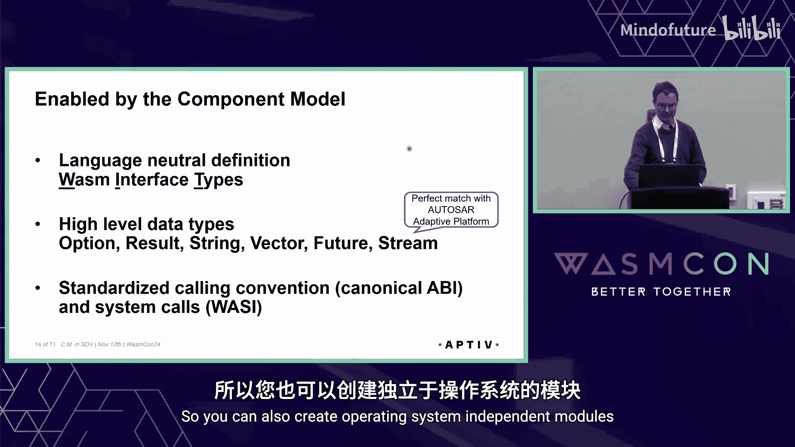
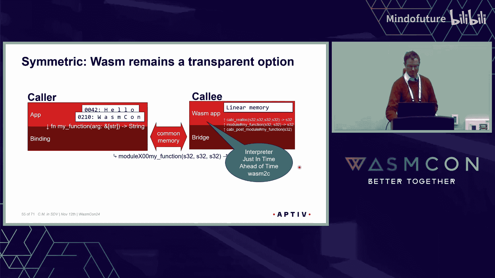
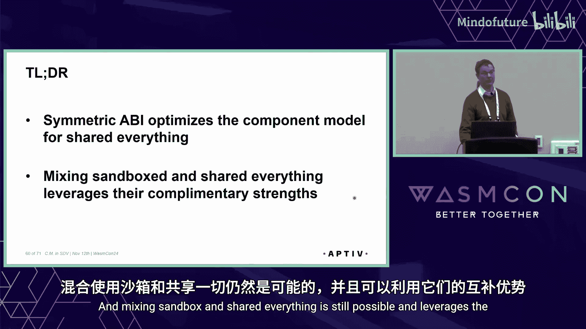

# 027：软件定义汽车中的组件模型

在本课程中，我们将学习 WebAssembly 组件模型如何应用于软件定义汽车领域。我们将探讨其核心优势、工作原理，并深入了解一种针对原生二进制优化的“对称ABI”方案。

## 概述：软件定义汽车的挑战与机遇

软件定义汽车是现代汽车架构的趋势，但其硬件环境复杂多样。典型的架构包含中央车载计算机、区域控制器和众多传感器，它们使用不同的CPU架构和操作系统。这为编写可移植的软件带来了巨大挑战。

## WebAssembly 组件模型的优势

上一节我们介绍了软件定义汽车的硬件复杂性，本节中我们来看看 WebAssembly 组件模型如何提供解决方案。

传统的容器技术依赖于特定的架构和操作系统，通常只能在中央车载计算机上运行。这意味着开发者只能将软件部署到众多控制器中的少数几个上，并且必须为不同的操作系统和CPU架构进行适配。

相比之下，WebAssembly 组件具有显著优势：
*   **轻量且普适**：它们非常轻量，能够在包括微控制器在内的各种设备上运行。
*   **安全沙箱**：能够安全地运行不受信任的第三方代码，而不会危及整车架构。
*   **灵活部署**：支持软件在控制器之间迁移，例如在车辆断电时将关键程序（如入侵检测系统）移至功耗更低的边缘设备。
*   **无重编译运行**：支持在边缘设备上无需重新编译即可运行组件，便于影子部署或红蓝开发。
*   **云边协同**：可以轻松地将组件移至云端运行，实现数字孪生。

## 深入组件模型：一个实例

了解了组件模型的整体优势后，我们通过一个具体的发布-订阅应用实例来深入其内部。这个实例结合了 C++ 和 JavaScript，展示了组件模型如何实现语言中立。

组件模型的核心是 **WebAssembly 接口类型**。它提供了高级数据类型，如 `option`、`result`、`string`、`vector`、`future` 和 `stream`。这些类型与 AUTOSAR 自适应平台的数据类型匹配良好，使得接口定义比传统的 C 接口（例如在 Rust 和 C++ 之间）更加容易和准确，特别是在处理值的所有权传递时。

此外，调用约定通过 **规范ABI** 实现了标准化，为组件间提供了二进制接口。系统调用也被标准化，从而可以创建独立于操作系统的二进制文件。

## 规范ABI详解：提升与降低

上一节我们看到了组件模型的实际应用，本节中我们来看看其底层通信机制——规范ABI中的“提升”与“降低”是如何工作的。

我们以一个简单的函数调用为例：`my_function` 接收一个字符串参数并返回一个字符串。

以下是调用过程中数据传递的步骤：
1.  **调用方准备**：调用方应用将字符串的内存地址和长度（例如地址`42`，长度`5`）传递给其绑定层。绑定层准备一个用于存放返回结果的内存区域。
2.  **调用运行时**：绑定层将源地址、长度和返回区域地址传递给运行时。
3.  **内存复制（降低）**：由于调用方和被调用方不共享内存（沙箱隔离），运行时需要在被调用方内存空间中分配新内存（例如地址`68`），并将字符串从调用方复制过去。
4.  **调用实现**：运行时调用被调用方的绑定层，传入新分配的字符串地址和长度。绑定层将其转换为对实际实现函数的调用。此时，字符串的所有权转移给了被调用方应用。
5.  **生成返回结果**：被调用方应用生成返回字符串（例如“world”），并分配内存存储（例如地址`210`）。由于ABI限制，绑定层需要将返回字符串的地址和长度写入一个已知位置（例如地址`230`），并返回该位置的地址。
6.  **内存复制（提升）**：运行时从地址`230`读取返回字符串的信息，在调用方内存中分配新空间（例如地址`440`），并将字符串从被调用方复制过来。
7.  **清理与返回**：运行时通知被调用方绑定层清理返回字符串的内存。然后，运行时将返回字符串的信息填入调用方之前准备的返回区域。最后，调用方绑定层从返回区域读取信息，并将其传递回调用方应用。

这个过程涉及多次内存分配和复制，虽然保证了安全隔离，但也带来了一定的性能开销。

## 转向原生二进制：对称ABI优化

上一节我们分析了规范ABI的开销，本节中我们来看看如何针对原生二进制环境进行优化。

为了追求极致的性能和能效以降低车载控制器成本，我们可以选择将组件编译为**原生二进制**。这牺牲了沙箱隔离，但换来了最高的CPU效率，并且保持了开发者的调试和部署体验不变。

当调用方和被调用方作为原生共享库链接到同一进程时，它们**共享一切**（内存、线程等）。利用这一点，我们可以优化ABI，减少不必要的复制。这种优化后的ABI称为**对称ABI**。

在对称ABI中：
*   **直接调用**：调用方绑定层直接调用被调用方绑定层，无需中间的运行时。
*   **简化复制**：虽然由于值传递语义可能仍需复制字符串，但所有内存分配和访问都在共享地址空间内完成，效率更高。
*   **保持接口**：对上层应用和下层的实现而言，接口没有变化，保持了源代码兼容性。

更进一步，如果我们修改调用方与被调用方之间的绑定层接口，使其也使用类似 `(ptr, len)` 的切片形式传递字符串，甚至可以消除实现侧的复制操作，达到理论上的最高效率。

## 对称ABI的灵活性与展望

对称ABI不仅高效，而且灵活。通过将组件间的链接从直接链接替换为一个充当代理的共享库或进程间通信桥接，我们可以在不重新编译组件的情况下，重新引入**完全隔离**。同样，我们也可以嵌入一个 Wasm 运行时，通过一个小桥接将对称ABI调用转换为规范ABI调用，从而无缝集成 WebAssembly 组件以实现沙箱化。

使用对称ABI还能带来一些独特优势：
*   **零开销插件**：可在 AUTOSAR 运行时或嵌入式系统中创建高效插件。
*   **稳定的 Rust 模块接口**：为不同编译器版本的 Rust 模块之间提供二进制兼容的稳定接口。
*   **完全宿主能力**：插件可以无限制地使用宿主能力，便于与硬件或网络交互（但也需充分信任插件）。

当然，在实际生产中应用仍面临一些挑战，例如对 C++ 多线程和异常处理的完整支持、为功能安全设计确定性（零动态）内存分配、以及为高级驾驶辅助系统所需的大数据量传输设计**零拷贝共享内存**机制等。目前这些领域已有一些原型探索。

## 总结

本节课中我们一起学习了 WebAssembly 组件模型在软件定义汽车中的应用。我们了解到：
1.  组件模型以其轻量、可移植和安全的特点，非常适合异构、复杂的汽车硬件架构。
2.  规范ABI通过提升和降低机制，在语言无关的组件间实现了安全的、标准化的通信，但会引入一定的复制开销。
3.  针对原生二进制共享内存的场景，**对称ABI** 可以大幅优化性能，减少不必要的复制，同时保持源代码兼容性。
4.  对称ABI设计灵活，允许在效率与隔离之间进行运行时权衡，并支持与 WebAssembly 沙箱组件的混合使用。

总而言之，对称ABI 针对共享内存场景优化了组件模型，它是完全源代码兼容的，并且混合使用沙箱化和共享内存化组件仍然是可能的，这充分发挥了两种模式的优势。