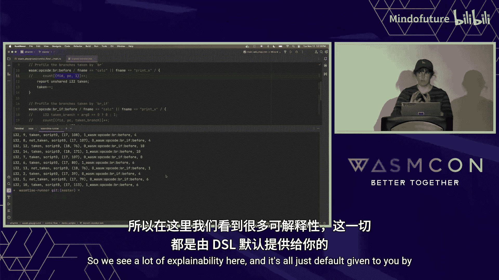
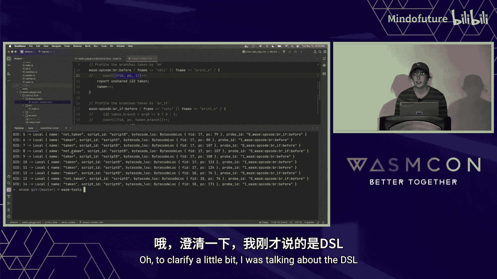

# 030：WAM 🛠️


## 概述

在本教程中，我们将学习一个名为 **WAM** 的新工具。WAM 是一个用于 WebAssembly 字节码插桩的领域特定语言。插桩是指在程序执行过程中注入额外代码，以进行监控、调试或分析等操作。WAM 的独特之处在于，它抽象了底层的注入技术，允许开发者通过统一的 DSL 编写插桩逻辑，然后由 WAM 编译器决定是通过引擎接口还是字节码重写的方式来实现注入。

## 什么是 WAM？🤔

WAM 是一个新的 WebAssembly 插桩 DSL。它抽象了底层的注入技术，因此你可以通过两种主要方式注入你的插桩逻辑：
1.  **与引擎接口**：通过特定的引擎 API 动态附加回调函数。
2.  **字节码重写**：直接修改 WebAssembly 模块的字节码，注入监控代码。

目前，WAM 可以与 Wizard 研究引擎接口，因为它是目前唯一支持管理插桩的引擎。对于字节码重写，WAM 使用了一个名为 **Orca** 的新 Rust 库。

## 为什么插桩很重要？🔍

调试低级别的字节码非常困难。随着 WebAssembly 的应用场景超越浏览器，其工具生态仍然匮乏。通过插桩，我们可以构建强大的工具来改善这一状况。

以下是可以通过插桩构建的工具示例：
*   **动态分析**：例如，为开发者显示代码执行时的火焰图。
*   **覆盖率统计**：显示代码运行时的覆盖率信息。
*   **控制流信息**：展示 WebAssembly 字节码执行过程中发生的不同控制流路径。
*   **调试器**：支持单步执行代码，这对开发者至关重要。

所有这些工具都可以通过**插桩**来构建。插桩意味着向程序的执行中注入一些代码，以执行特定的操作（如监控、记录）。其可能性仅受限于你的想象力。

## WAM 的插桩方法 ⚙️

WAM 支持两种主要的插桩方法，各有优劣。

### 方法一：字节码重写

这种方法直接修改原始的 WebAssembly 模块字节码。例如，如果你想监控一个 `call` 字节码，WAM 会直接在该字节码位置注入更多的监控字节码。

WAM 使用一个名为 **Orca** 的新 Rust 库来执行这种字节码注入。Orca 取代了旧的、不再维护且不支持组件模型的 `wasm-rewrite` 库。Orca 的 API 更直观，更容易调试插桩后的模块。

### 方法二：引擎 API 接口

这种方法通过 Wizard 引擎的 API 进行插桩。当应用程序被引擎加载时，WAM 会动态地将回调函数附加到特定字节码上。这些回调函数使用 Virgil 语言编写。

例如，监控一个 `call` 指令时，引擎会看到附加的回调并执行相应的 Virgil 函数（例如 `increment_count`），从而动态地计算该 `call` 被执行的次数。

### 权衡与选择

在软件工程中，选择总是伴随着权衡：
*   **使用引擎接口**：你的插桩逻辑将**绑定到特定引擎**（例如 Wizard）。优点是可能获得更好的性能或访问引擎特有事件。
*   **使用字节码重写**：你的插桩逻辑可以**在任何支持 WebAssembly 的引擎上运行**，因为你只是注入了更多的标准 WebAssembly 字节码。但需要注意，你可能会引入新的依赖。

**WAM 的优势**在于，它提供了“两全其美”的方案。你可以编写一次插桩脚本，WAM 编译器会根据目标环境自动选择最合适的注入策略（如果目标引擎支持 API 接口，则使用之；否则，回退到字节码重写）。

不过，有一个小限制：有些事件（如垃圾回收、线程管理、程序退出）无法通过字节码直接观察到，只能通过引擎接口进行插桩。

## WAM 插桩的构成 📝

一个 WAM 插桩脚本主要包含两部分：
1.  **匹配规则**：指定在应用程序的**何处**注入代码。
2.  **注入逻辑**：指定**注入什么**代码。如果 DSL 提供的功能不足，你还可以选择性地提供一个辅助的 WebAssembly 模块来包含更复杂的逻辑。

根据注入方式的不同，编译过程略有差异：
*   **字节码重写**：输入是应用程序模块和 WAM 脚本。WAM 编译器查找匹配点，注入逻辑，并输出一个**已插桩的应用程序模块**。
*   **引擎 API 接口**：输入只有 WAM 脚本。编译器输出一个**通用的监控器模块**。引擎在加载应用程序时，会读取这个监控器模块中编码的匹配规则，并动态附加相应的回调函数。

**核心要点**：WAM 编译器可以针对上述任一目标进行编译。


## WAM 语法示例 📖

WAM 的语法灵感来源于 DTrace 的 D 语言。以下是一个简单的示例：

```wam
global counter = 0; // 全局状态

probe wasm.opcode = br_if { // 匹配规则：当看到 br_if 操作码时
    location = before;      // 注入时机：在该操作码执行之前
    predicate = pc == 25;   // 进一步约束：仅当在函数内的 PC 偏移量为 25 时才匹配
    body = {                // 注入的逻辑体
        counter = counter + 1;
    }
}
```

*   `global`：定义全局状态变量。
*   `probe`：定义一个探针。`wasm.opcode = br_if` 指定要匹配的 WebAssembly 操作码。
*   `location`：指定在匹配点的`之前`、`之后`还是`替换`执行注入逻辑。
*   `predicate`：使用谓词进一步限制匹配条件。`pc` 是一个由 WAM 提供的全局变量，表示函数内的程序计数器偏移量。
*   `body`：当匹配成功且谓词为真时要执行的逻辑。

## 针对引擎的编译与优化 🚀

当 WAM 针对引擎 API 进行编译时，需要将 DSL 脚本编译成引擎可以理解的格式。WAM 选择将回调逻辑编译成 **WebAssembly 模块**，以保持未来的可移植性，而不是绑定到 Wizard 引擎特有的 Virgil 语言。

编译过程如下：
1.  **全局状态**：被编译为 WASM 模块中的全局变量。
2.  **逻辑体**：被编译为 WebAssembly 函数。
3.  **匹配规则**：被编码在 WASM 模块的**导入名称**中，告诉引擎在何处附加回调。
4.  **谓词**：被编译为返回布尔值的 WebAssembly 函数，并编码在**导出名称**中，供引擎在匹配时进行条件判断。

这里存在一个挑战：**谓词可能包含动态数据**（例如，依赖于运行时栈顶的值），而引擎在加载时（匹配阶段）需要静态地找到所有匹配点。

WAM 的解决方案是进行**静态分析**，将谓词拆分为静态部分和动态部分：
*   **静态部分**：在匹配时由引擎评估。如果静态部分为假，则根本不需要附加回调。
*   **动态部分**：被包装在回调函数体内，在运行时进行条件判断。

编译器还可以进行**优化**。例如，通过构建真值表和常量传播，可以消除某些匹配点上的所有动态检查，从而显著提升插桩代码的运行效率。

## 实战演示：编写分支监控器 🎬

上一节我们介绍了 WAM 的基本语法和编译原理，本节我们将通过一个实际例子来看看如何用 WAM 编写一个有用的工具。

我们将编写一个**分支监控器**，用于动态统计 WebAssembly 代码中分支指令（`br` 和 `br_if`）的执行情况。



假设我们有一段 Rust 代码编译成了 WebAssembly。我们想监控其中 `calc` 和 `print_x` 函数内的分支行为。

以下是完整的 WAM 脚本：

```wam
// 定义一个映射来记录分支次数：键为 (函数ID, PC偏移量, 是否跳转)，值为次数
global count = map<(u32, u32, i32), i32>();

// 监控无条件分支 br
probe wasm.opcode = br {
    location = before;
    // 只监控特定函数内的 br
    predicate = func_name == "calc" || func_name == "print_x";
    body = {
        // br 总是会跳转，所以 taken 为 1
        count[(fid, pc, 1)] = count[(fid, pc, 1)] + 1;
    }
}

// 监控条件分支 br_if
probe wasm.opcode = br_if {
    location = before;
    // 只监控特定函数内的 br_if
    predicate = func_name == "calc" || func_name == "print_x";
    body = {
        // arg0 提供了栈顶值，决定是否跳转
        i32 taken = (arg0 != 0) ? 1 : 0;
        count[(fid, pc, taken)] = count[(fid, pc, taken)] + 1;
    }
}

// 定义一个报告变量，用于输出结果
report count;
```

**脚本解析**：
*   我们使用 `global` 定义了一个映射 `count` 来存储统计结果。
*   我们定义了两个 `probe`，分别匹配 `br` 和 `br_if` 操作码。
*   `predicate` 使用了 `func_name` 这个 WAM 提供的全局变量，确保只监控我们关心的函数。
*   在 `body` 中：
    *   对于 `br`，我们知道它总是跳转，所以 `taken` 固定为 1。
    *   对于 `br_if`，我们通过 `arg0`（代表栈顶值）动态判断是否跳转。
    *   我们使用 `fid`（函数ID）和 `pc`（PC偏移量）来唯一标识每个分支点。
*   最后，`report count;` 语句告诉 WAM 需要输出 `count` 变量的内容。默认行为是通过 `wasmtime` 打印到控制台。


使用 WAM CLI 工具对目标 Wasm 模块应用此脚本后，运行程序，我们就能在控制台看到类似下面的输出，展示了每个分支点被跳转和未跳转的次数。



然而，最初的输出可能不够直观（例如，显示为 `(17, 107, 0): 4`）。为此，WAM 提供了 **“非共享变量”** 特性来改善可读性。


我们可以用非共享变量重写监控器：

```wam
// 为每个探针点创建独立的‘taken’变量实例
unshared i32 taken;

probe wasm.opcode = br {
    location = before;
    predicate = func_name == "calc" || func_name == "print_x";
    body = {
        taken = taken + 1; // br 总是跳转，直接递增
    }
}

probe wasm.opcode = br_if {
    location = before;
    predicate = func_name == "calc" || func_name == "print_x";
    body = {
        // 根据条件决定是否递增
        if (arg0 != 0) {
            taken = taken + 1;
        }
    }
}

report taken;
```

**关键变化**：
*   使用 `unshared i32 taken;` 声明变量。这意味着**每个**匹配到的探针位置都会有自己的 `taken` 变量实例，记录该特定分支点的跳转次数。
*   移除了复杂的映射结构，逻辑更清晰。
*   报告输出时，WAM 会自动将每个探针点的信息（如来自哪个函数、哪个PC偏移量）与它的 `taken` 值关联起来输出，可读性大大增强。

## 未来路线图与发展方向 🗺️

WAM 目前仍在积极开发中，目标是尽快推出一个最小可行产品。未来的计划包括：

1.  **完善 MVP**：完成字节码重写和 Wizard 引擎接口的核心功能。
2.  **降低系统要求**：目前需要 Wasm 多内存和 `wasmtime` 支持，未来将使其更通用。
3.  **可配置的报告行为**：允许用户自定义报告变量的输出方式（如写入文件、发送到网络等），而非仅打印到控制台。
4.  **支持新特性**：添加对 WebAssembly GC 类型、组件模型等的插桩支持。
5.  **标准化引擎 API**：推动一个跨引擎的、标准化的插桩 API，实现真正的可移植性。
6.  **可组合的插桩**：支持对单个应用程序同时应用多个监控器。
7.  **可视化工具**：构建 IDE 插件（如 VS Code 扩展），将低级别的插桩数据转化为开发者友好的可视化界面（如火焰图、源码映射调试）。
8.  **映射回源代码**：与 Orca 库协作，确保插桩后能通过 DWARF 等调试信息将观察到的低级别事件映射回高级语言源代码。

## 总结

在本教程中，我们一起学习了 **WAM**，一个用于 WebAssembly 字节码插桩的强大 DSL。

我们首先了解了插桩的概念及其在构建调试和分析工具中的重要性。接着，我们探讨了 WAM 的两种核心插桩方法：**字节码重写**和**引擎 API 接口**，并分析了各自的优缺点。WAM 的核心优势在于抽象了这些方法，让开发者用一套 DSL 即可编写可移植的插桩逻辑。

我们深入学习了 WAM 的脚本语法，包括如何定义全局状态、编写匹配规则和注入逻辑。我们还了解了 WAM 编译器如何将脚本智能地编译为 Wasm 模块，并利用静态分析优化谓词判断。

通过一个**分支监控器**的实战演示，我们看到了如何使用 WAM 编写有用的分析工具，并利用**非共享变量**等特性提升输出的可读性。


最后，我们展望了 WAM 的未来发展，包括对更复杂 Wasm 特性的支持、标准化引擎 API 的愿景，以及最终为多语言、多平台的 WebAssembly 生态带来丰富、易用的开发者工具链的宏伟目标。


WAM 为 WebAssembly 的工具生态开辟了新的可能性，让开发者能够更轻松地观察、理解和优化他们的 Wasm 应用。