# 033：在任意应用中释放 CMS 的全部潜力 🚀

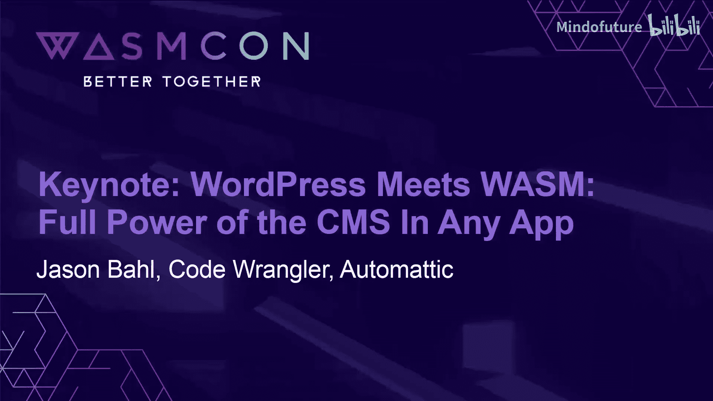

在本节课中，我们将学习如何通过 WebAssembly 技术，将 WordPress 这一强大的内容管理系统（CMS）的能力扩展到传统服务器环境之外，实现在浏览器、桌面应用乃至移动端等任意环境中运行。

## 概述

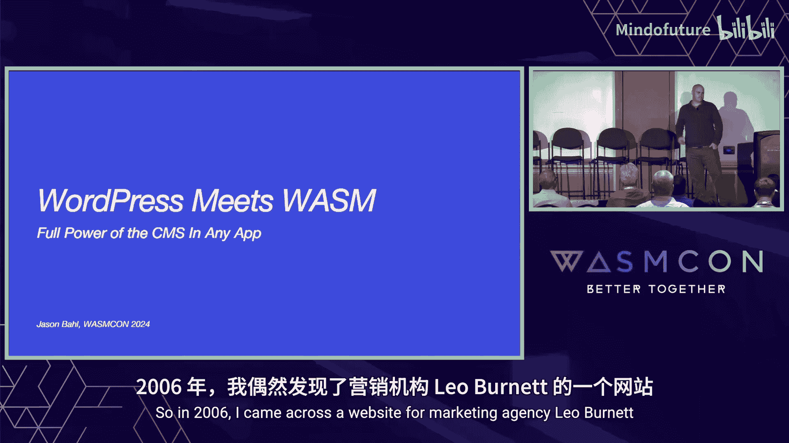

我是 Jason Ball，Automattic 的一名工程师。今天要讨论的主题是“WordPress 遇见 WebAssembly”，即如何在任何应用程序中利用 WordPress 作为内容管理系统的全部功能。


我的职业生涯大部分时间都在以非传统的方式使用 WordPress。这要从 2006 年说起，当时我遇到了一个名为 Leo Burnett 广告公司的网站。


那时，这是我见过的最具交互性的网站之一。它给我留下了深刻印象，并让我着迷于学习如何制作类似的交互效果。这最终引导我学习了 Flash，一个基于时间线的编辑器，用于为网页构建交互式站点。

我自学了如何使用 Flash 重建这个 Leo Burnett 网站，并继续使用 Flash 创建了越来越多的网站。有一天，有人问我：“嘿，如果你为我建一个这样的网站，我能在不懂 Flash 的情况下编辑这个 Flash 站点的内容吗？”当时，我只知道如何使用 Flash 甚至是一些 ActionScript 来编辑 Flash 站点，你必须知道如何编译并将其部署到网上。因此我做了一些研究，最终发现了一个叫做 WordPress 的内容管理系统。

那时我甚至没听说过“内容管理系统”这个词。但通过研究，我发现它有一个名为 XML-RPC 的 API，这让我可以编写一个能消费来自内容管理系统的 XML 数据的 Flash 站点。所以最终的答案是肯定的：你可以使用像 WordPress 这样的工具来管理内容，并使用像 Flash 这样的工具从中获取内容。

虽然那个项目最终没有继续下去，但我在 WordPress 领域的职业生涯却开始了。自那以后，我一直在使用 WordPress。多年过去，WordPress 已经发生了很大变化，但我使用它的方式却没有改变——我仍然以非常规的方式使用它。

## 从传统到现代：WordPress 的演变

上一节我们回顾了 WordPress 如何作为后端 CMS 与前端技术结合。本节中，我们来看看 WordPress 如何演变为一个更灵活、可分离的 API 驱动系统。

2016 年，我创建了一个名为 **WPGraphQL** 的项目。这是一个免费开源的 WordPress 插件，能将 WordPress 站点转换为 GraphQL API。

```php
// 示例：WPGraphQL 允许通过 GraphQL 查询获取 WordPress 数据
query {
  posts {
    nodes {
      title
      content
    }
  }
}
```

这使得用户可以将 WordPress 用作 CMS，然后使用 Next.js、Gatsby、Astro 甚至原生 iOS 等技术构建解耦的（或称无头）前端。内容在 WordPress 中管理，但在其他环境中渲染。此时，你可能会想：“嘿，伙计，这跟 WebAssembly 有什么关系？”

## WebAssembly 的引入：WordPress Playground

作为 WordPress 插件开发者，我需要为用户提供快速测试插件的能力。通常，这需要他们搭建一个完整的 WordPress 服务器环境，或者在现有服务器上安装并测试插件。这需要 PHP、MySQL、Apache、Linux 等一系列环境。

但我们有一个名为 **WordPress Playground** 的项目，它允许你在浏览器中完全运行 WordPress。其技术实现如下：

*   **PHP** 被转换为 **PHP Wasm**。
*   **MySQL** 被 **SQLite** 替代。
*   **Apache** 的功能被 **JavaScript API** 替代。
*   **Linux** 的功能被 **JavaScript Polyfills** 替代。

因此，像我这样的插件开发者可以为用户提供插件的实时预览。当你在 WordPress.org 插件库浏览超过 17,000 个插件时，如果某个插件支持此功能，你可以点击“实时预览”按钮，它将在浏览器中完全打开 WordPress，无需任何依赖，插件已激活，用户可以直接在浏览器中进行测试。

## 实际应用案例：内容管理的革新

以上介绍了 WordPress Playground 的基本原理。以下是它如何改变内容管理工作流程的具体例子。

对我个人而言，我使用 WordPress 作为传统 CMS 来管理营销和博客内容。但当我想管理文档时，我希望在靠近代码的地方用 Markdown 文件来管理。对于长期使用 WordPress 编辑内容的人来说，直接编辑 Markdown 感觉有些原始。许多管理内容的用户并不想在 Markdown 中管理内容。

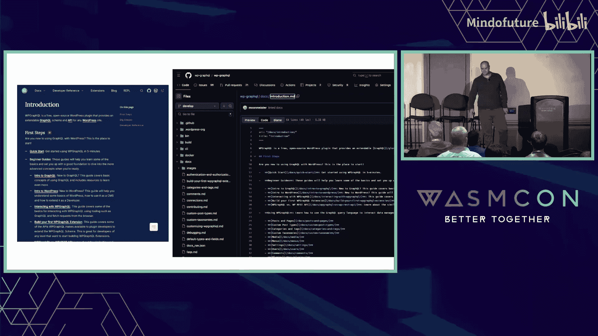

WordPress Playground 支持这样一种工作流程：我们可以在浏览器中完全打开 WordPress，连接 GitHub。这样就能在浏览器中获取我的 Markdown 文档，将其导入 WordPress（同样，没有服务器在运行，一切都在浏览器中）。它可以从我的 GitHub 仓库导入 Markdown 文件到 WordPress 中。然后，我可以使用功能完善的 CMS 编辑内容，例如修正拼写错误等。完成更改后，我可以将其作为拉取请求（Pull Request）导回 GitHub。这允许我从任何数据源编辑内容，Markdown 只是一个例子，你可以用它来在浏览器中编辑任何其他数据源的内容，同样无需运行服务器。


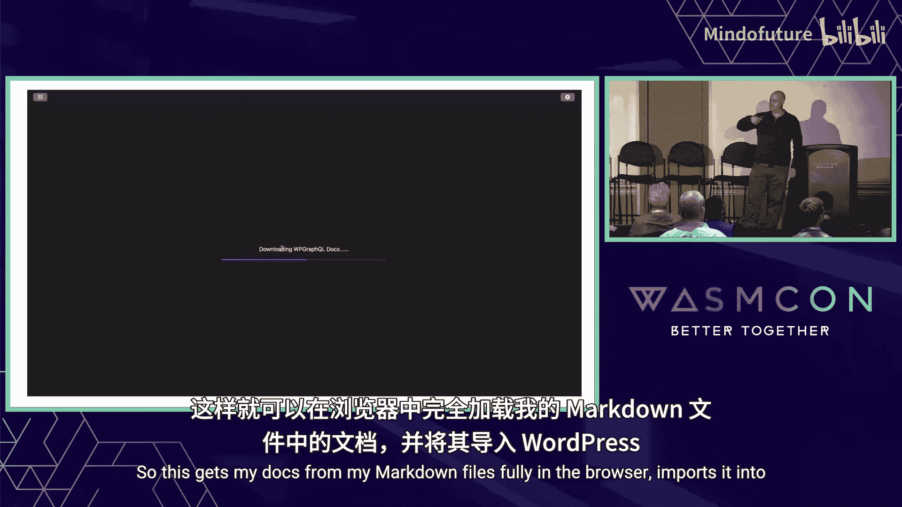
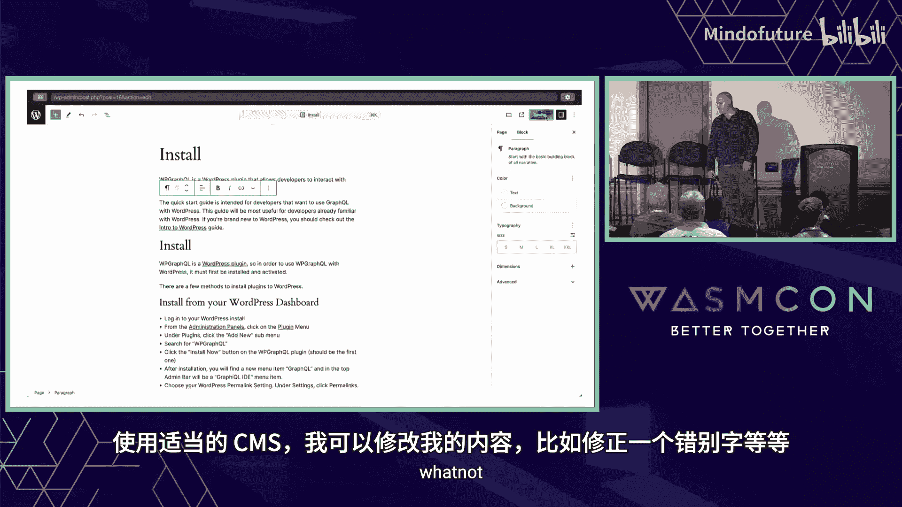
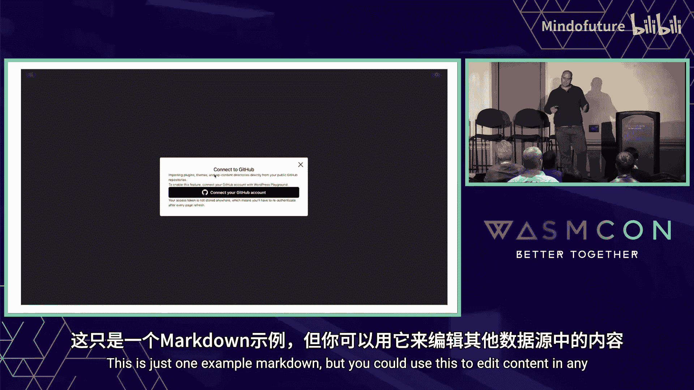

## 无限可能：WordPress 的新应用场景

这些只是你以前可能未曾想到的使用 WordPress 的两个例子。我们可以在终端、桌面、移动前端等各种场景中使用 WordPress。

另一个例子是，你可以将 WordPress 嵌入网页，甚至可以**在没有网络连接的情况下执行 PHP 函数**。

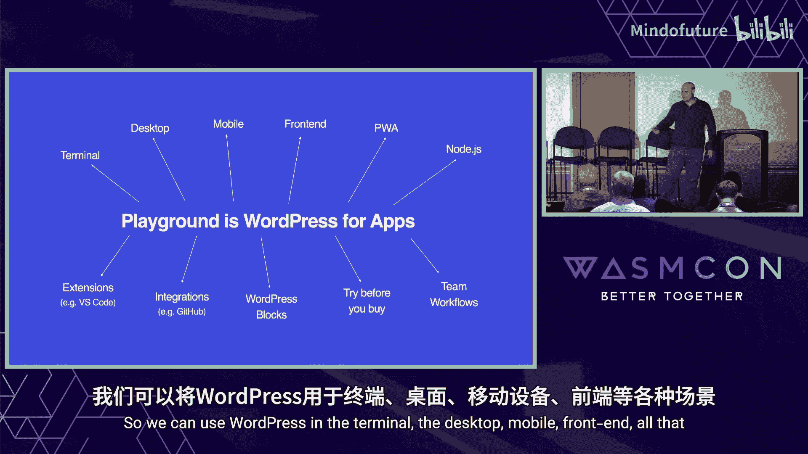
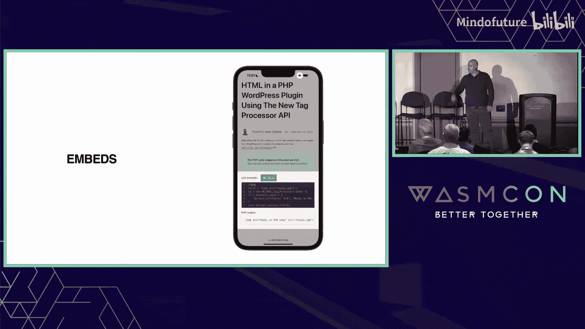


你可以在移动端的原生应用中使用 WordPress，也可以在终端应用中使用。这是一个名为 Studio 的桌面应用程序，你可以通过点击几下按钮就在本地启动 WordPress 站点进行测试。

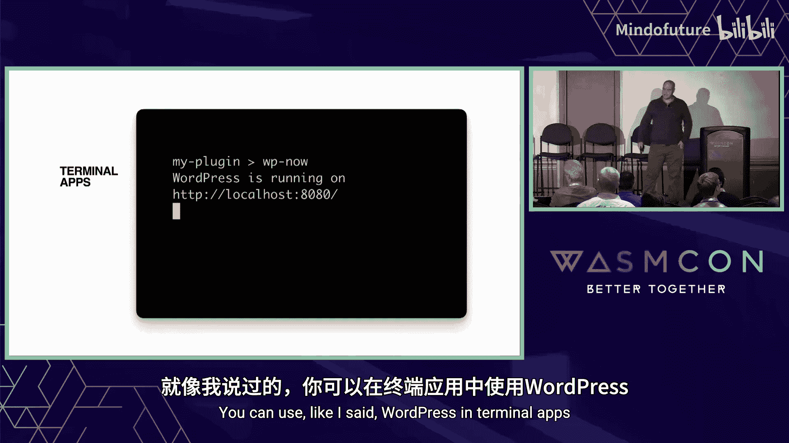

我们目前也正在开发一些 WordPress 的 VS Code 扩展。


## 总结与资源

本节课中，我们一起学习了如何通过 WebAssembly 和 WordPress Playground 项目，打破 WordPress 对传统服务器环境的依赖，使其能够在浏览器等任意环境中运行。这为插件测试、跨平台内容编辑和新型应用集成开辟了新的可能性。


核心在于将 **PHP -> PHP Wasm**，并用浏览器技术栈替代其他服务器组件。

这一切都是免费开源的。无论你是否对 WordPress 感兴趣，关键问题是：你能用这项技术构建什么？

如果你想了解更多信息，可以访问 [wordpress.org/playground](https://wordpress.org/playground)。我的 Twitter/X 账号是 @jasonball。谢谢。

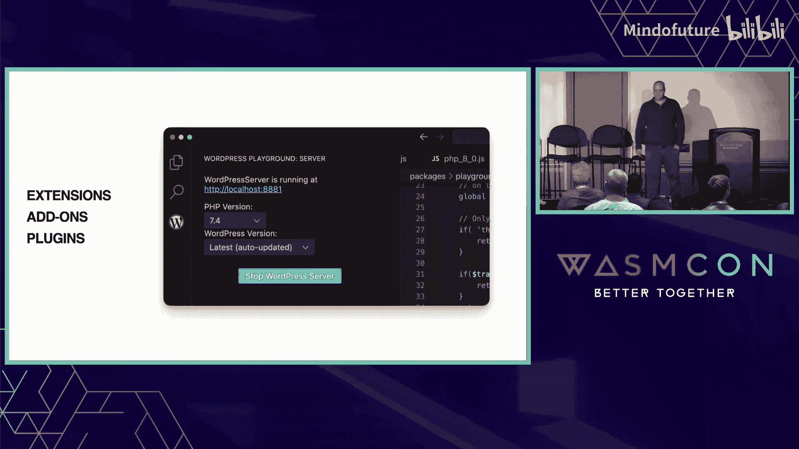

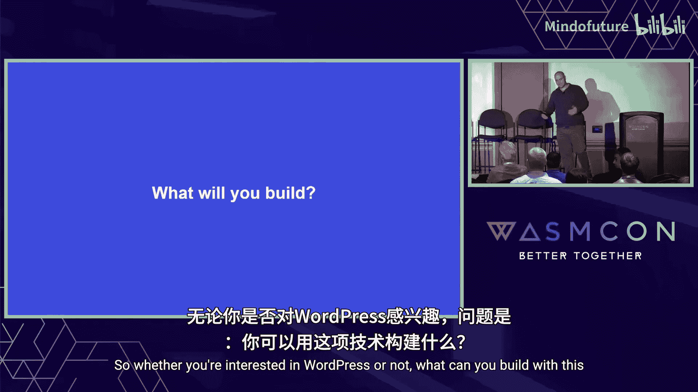

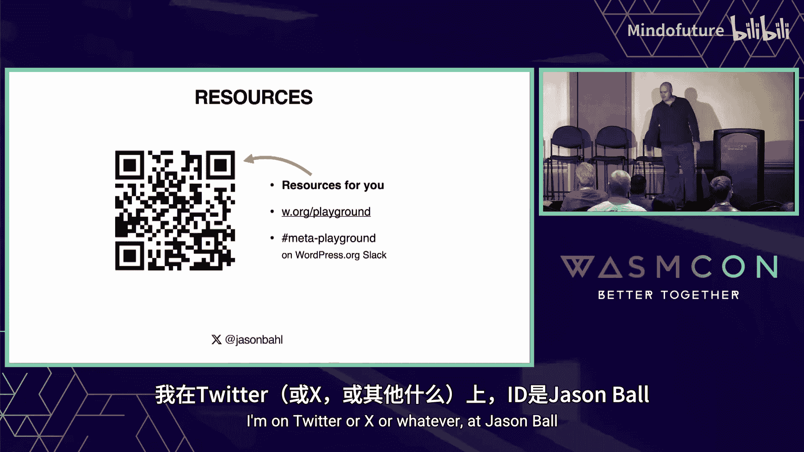


