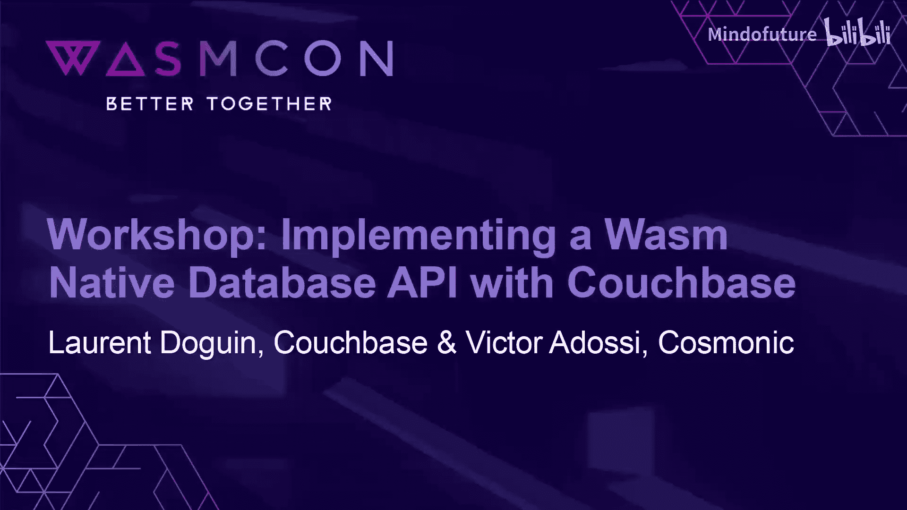
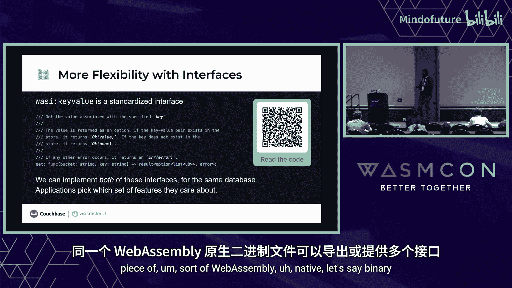
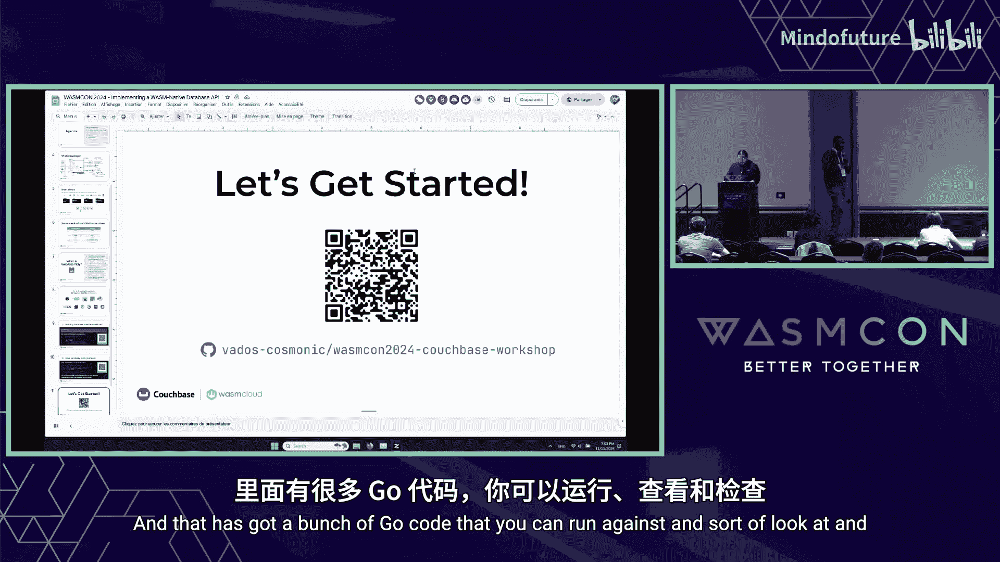
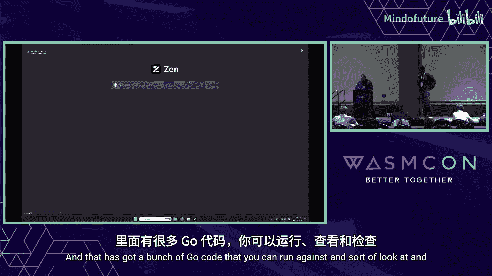
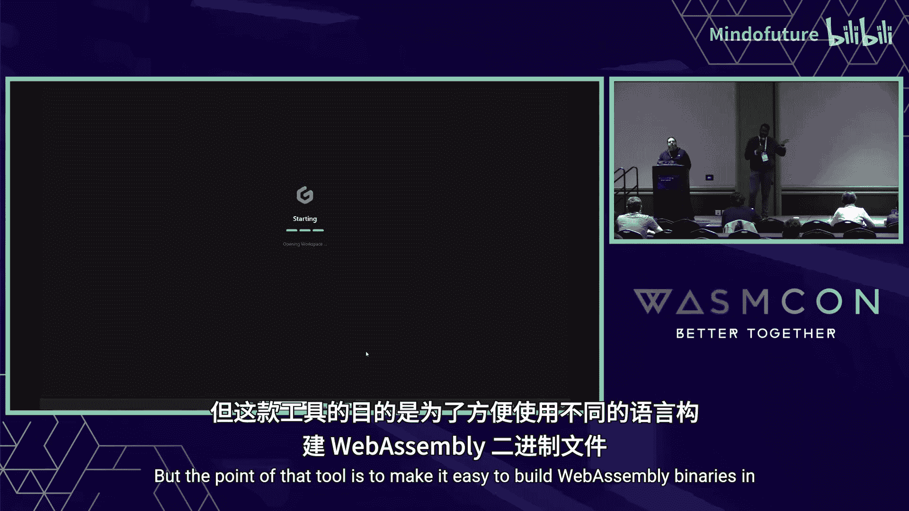
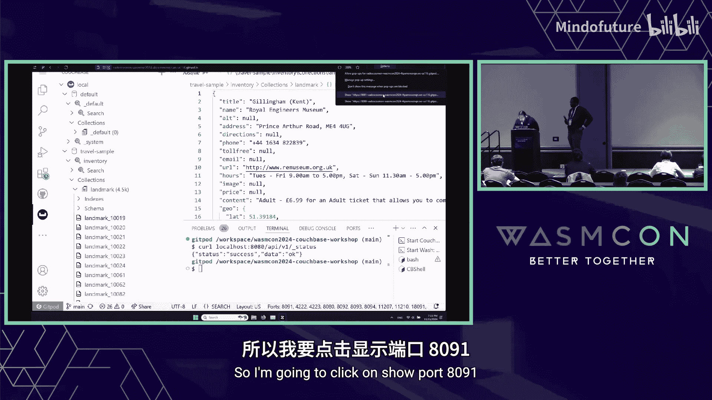
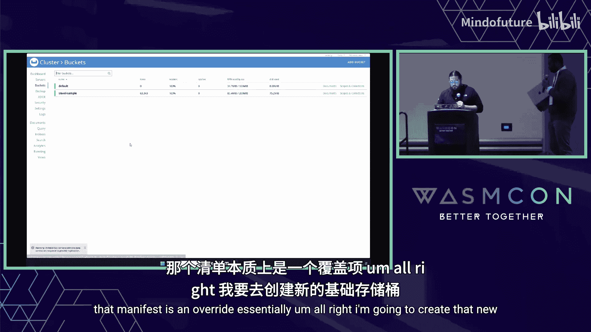
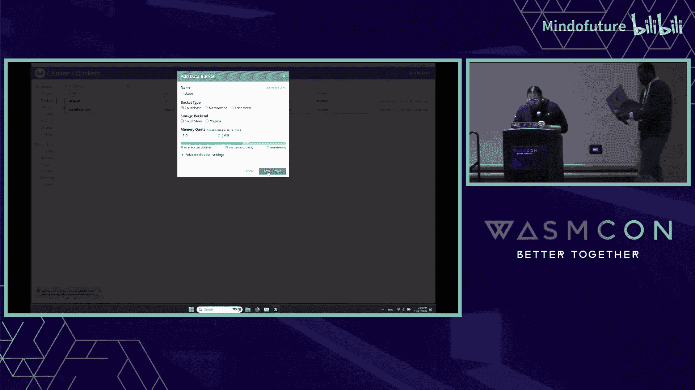
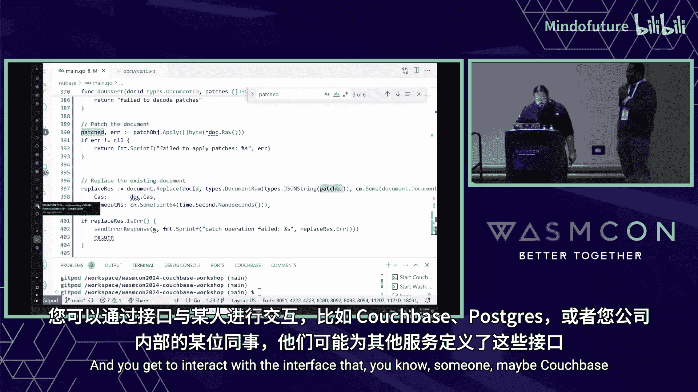
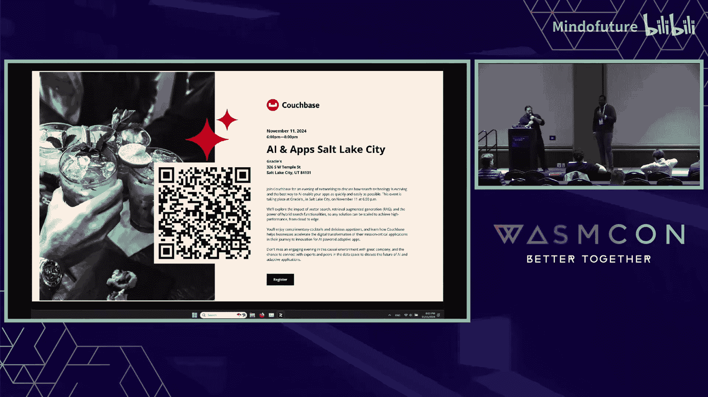

# 036：实现基于 Couchbase 的 Wasm 原生数据库 API




在本教程中，我们将学习如何结合使用 WebAssembly (Wasm)、WasmCloud 和 Couchbase 数据库来构建一个原生数据库 API。我们将从环境设置开始，逐步了解核心概念，并最终动手编写代码。

## 概述

我们将通过一个实践研讨会，探索如何使用 WasmCloud 组件模型和 Couchbase 的 Wasm 接口，构建一个能够与 Couchbase 数据库交互的 Go 语言 WebAssembly 组件。您将学习到 Wasm 的核心概念、WasmCloud 的开发流程，以及如何将数据库操作封装为可跨语言使用的 Wasm 接口。

---

## 第一部分：环境设置与工具介绍 🛠️

首先，我们需要设置开发环境。为了获得最佳体验并避免本地网络问题，我们强烈推荐使用在线 IDE。

以下是推荐的设置步骤：

1.  **访问代码仓库**：扫描二维码或访问下方链接，进入本次研讨会的 GitHub 代码仓库。
2.  **使用在线 IDE**：我们推荐使用 **Gitpod** 或 **GitHub Codespaces**。点击仓库 README 中的 “Open in Gitpod” 按钮，这将自动创建一个预配置好的在线 VS Code 环境。
3.  **自动配置**：该环境会自动拉取包含所有必要依赖（如 Couchbase、WasmCloud、`wash` CLI、TinyGo 等）的 Docker 镜像，无需手动安装。

如果您选择手动设置，仓库中也提供了相关说明，但这可能会花费更多时间。在研讨会期间，如果遇到任何问题，请随时举手示意，我们会提供帮助。

一切就绪后，环境将包含运行 Couchbase 服务器、构建 Wasm 组件以及进行 API 测试所需的所有工具。

---



## 第二部分：Couchbase 简介 🗄️

在深入代码之前，让我们先了解一下我们将要使用的数据库：Couchbase。



Couchbase 是一个分布式、内存优先的文档数据库，同时提供持久化存储。它起源于 CouchDB 和 Memcached 项目的合并。最初，查询需要通过编写 JavaScript 的 MapReduce 函数并创建索引来完成，过程较为复杂。后来，Couchbase 增加了完整的 SQL（N1QL）支持、全文检索、AI 集成等多种功能。



在架构上，Couchbase 包含数据服务（负责自动分片和键值存储）、查询服务、索引服务、全文搜索服务等。

对于本次研讨会，最关键的一点是 Couchbase 的**数据模型**：它以 JSON 文档的形式存储数据。数据组织在 **Bucket（桶）**、**Scope（作用域）** 和 **Collection（集合）** 中。您可以直接对 JSON 文档运行 SQL 查询。



我们的目标就是编写一个 Wasm 组件，连接到指定的 Bucket、Scope 和 Collection，并执行文档的读写操作。

传统上，Couchbase 需要为不同语言（Go、Java、Python等）维护各自的 SDK。而 Wasm 提供了一个“编写一次，随处运行”的可能性，只需一个 Wasm 二进制文件配合相应的接口定义，即可在各种语言环境中使用，这正是我们接下来要探索的。

---

## 第三部分：WebAssembly 与 WasmCloud 核心概念 ⚙️

上一节我们介绍了 Couchbase，本节中我们来看看本次技术的另一个核心：WebAssembly 和 WasmCloud。




**WebAssembly** 最初是作为在浏览器中运行 JavaScript 之外语言的一种方式而诞生的。您可以将其视为一种**跨语言的字节码编译目标**。就像 Java 编译成 JVM 字节码一样，Rust、Go、C++ 等语言可以编译成 Wasm 字节码。

Wasm 的核心特性包括：
*   **可移植性**：编译后的 Wasm 二进制文件可以在任何嵌入了 Wasm 运行时的环境中运行（如浏览器、服务器、边缘设备）。
*   **强隔离性与安全性**：Wasm 核心规范最初只包含数值操作，没有直接的文件或网络访问能力。所有高级功能（如字符串、系统调用）都通过宿主环境以受控的方式提供，这构成了其安全沙箱的基础。
*   **高性能**：Wasm 执行速度接近原生代码，并且函数调用通常在进程内完成，延迟极低。

**WasmTime** 是由 Bytecode Alliance 维护的一个旗舰级 Wasm 运行时，可以嵌入到任何应用程序中。

**WasmCloud** 构建在 WasmTime 之上，使其更易于使用，并增加了**分布式能力**。它引入了“组件模型”和“接口”的概念，使得 Wasm 模块之间可以通过定义良好的接口进行通信，这些通信可以是进程内的，也可以通过网络进行。

一个关键概念是 **WIT**。WIT 是 WebAssembly 接口类型语言，用于定义 Wasm 组件对外暴露或依赖的接口。这类似于 gRPC 的 proto 文件或 OpenAPI 规范。

例如，一个键值存储接口可以这样定义（概念上）：
```wit
// 示例：一个简单的键值存储接口
interface kv-store {
    get(key: string) -> result<bytes, error>
    set(key: string, value: bytes) -> result<_, error>
}
```
一旦定义了这样的接口，任何实现了该接口的 Wasm 组件（无论是用 Go、Rust 还是其他语言编写）都可以被任何能消费此接口的宿主调用。Couchbase 的 Wasm 接口就包含了文档管理、键值操作、查询等多种功能。





**`wash` CLI** 是 WasmCloud 的瑞士军刀，它可以用来构建、管理、部署 WasmCloud 组件和应用程序，并且支持多种语言。

---

## 第四部分：项目结构与初始化 🚀

现在，让我们把目光转回我们的研讨会项目。环境启动后，您会看到项目代码。

项目核心结构如下：
*   **`newbase/`**：这是我们将要主要编写代码的 Go 语言 WasmCloud 组件。它提供了一个 HTTP API，并将请求转换为对 Couchbase 的调用。
*   **WIT 定义文件**：在项目根目录或 `wit/` 文件夹下，存放着 Couchbase 功能的接口定义（如 `documents.wit`）。这些文件用于生成 Go 语言绑定代码。
*   **`wasmcloud.yaml`**：这是 WasmCloud 应用部署清单。它定义了如何运行我们的 `newbase` 组件，并将其链接到 `couchbase` 提供者（Provider）。Provider 是负责实际与 Couchbase 数据库通信的 WasmCloud 组件。
*   **`justfile`**：一个任务运行器配置文件，简化了常用命令（如 `just dev` 用于启动开发环境）。

启动开发环境非常简单。在终端中，进入项目根目录，运行：
```bash
just dev
```
这个命令会执行 `wash dev`，它会：
1.  启动 Couchbase 服务器。
2.  构建 `newbase` Go 组件为 Wasm。
3.  启动 WasmCloud，并按照 `wasmcloud.yaml` 的配置，将 `newbase` 组件与 `couchbase` 提供者链接起来。
4.  启动一个热重载的开发服务器，当代码变更时会自动重建。

启动成功后，您应该能在终端日志中看到 WasmCloud 和 Couchbase 的运行状态。

---

## 第五部分：验证与初次 API 调用 ✅

环境运行起来后，我们需要验证一切是否正常工作。

首先，**检查 WasmCloud 组件**。打开一个新的终端标签页，运行：
```bash
curl http://localhost:8080/api/v1/status
```
如果返回 `{"status":"success","data":{}}` 之类的 JSON 响应，说明 `newbase` 组件的 HTTP 服务器正在运行。

其次，**检查 Couchbase 数据库**。有几种方式：
1.  **VS Code Couchbase 扩展**：在侧边栏找到 Couchbase 图标，点击“+”添加连接。使用地址 `localhost`，用户名 `Administrator`，密码 `password` 进行连接。连接后，您应该能看到已有的 Bucket（如 `travel-sample`）。
2.  **Couchbase 管理 UI**：Gitpod 通常会在端口 8091 上运行 Couchbase 的 Web 管理界面。您可以在 Gitpod 的 “Ports” 标签页找到公开的 URL，点击访问。使用相同的用户名和密码登录。
3.  **`cbsh` 命令行工具**：在终端中直接输入 `cbsh` 可以进入 Couchbase Shell，执行如 `buckets list` 等命令。

**重要提示**：我们的 `wasmcloud.yaml` 配置中指定了 Bucket 名为 `newbase`。您需要先创建它。
*   在 Couchbase 管理 UI 中：进入 “Buckets” 页面，点击 “Add Bucket”，名称填 `newbase`。
*   在 `cbsh` 中：执行 `buckets create newbase`。

创建完成后，您可以尝试一个预置的 API 调用来插入文档：
```bash
curl -X POST http://localhost:8080/api/v1/documents \
  -H "Content-Type: application/json" \
  -d '{"doc_id":"test-doc","data":{"hello":"world"}}'
```
如果成功，您会收到一个包含 Couchbase 元数据（如 `cas` 值、`partition_id`）的响应。`cas` 是乐观锁控制的一种机制，用于确保数据更新的并发安全性。

---

## 第六部分：代码深入：Go 组件解析 🔍

现在，让我们打开 `newbase/main.go` 文件，看看 Go 组件是如何工作的。

首先看**导入部分**：
```go
import (
    // 标准库和通用库
    "encoding/json"
    "net/http"
    "github.com/gorilla/mux" // 或类似路由库（当前示例因TinyGo限制使用了简单路由）

    // WasmCloud 相关绑定和类型
    "github.com/wasmcloud/component-model/bindings" // 组件模型基础类型
    cbdocuments "github.com/wasmcloud/couchbase/bindings/documents" // 自动生成的Couchbase文档接口绑定
)
```
关键点是 `cbdocuments` 包，它是通过 `wash` 工具从 `documents.wit` 接口定义文件**自动生成**的 Go 语言绑定代码。这为我们提供了类型安全的函数（如 `Get`, `Insert`, `Replace`）来调用 Couchbase 功能。

接下来看**路由和处理函数**。示例中实现了一个简单的 HTTP 路由，将不同的路径映射到对应的处理函数，例如 `handleUpsert`。

我们以 `handleUpsert` 函数为例，看看它如何桥接 HTTP 和 Wasm 接口：
1.  **解析请求**：从 HTTP 请求体中读取 JSON，解析出文档 ID (`doc_id`)、要应用的补丁 (`patches`) 以及可选的初始插入数据 (`insert`)。
2.  **调用 Wasm 接口获取当前文档**：使用生成的 `cbdocuments.Get()` 函数，传入文档 ID。这个函数返回一个 `result` 类型，需要处理成功和错误两种情况。
    ```go
    getRes, err := cbdocuments.Get(ctx, docID, getOpts...)
    if err != nil {
        // 处理错误，例如文档不存在
    }
    // 从 result 中提取文档内容
    existingDoc := getRes.Unwrap()
    ```
3.  **应用 JSON 补丁**：如果请求中包含 `patches`，则使用 JSON Patch 库对获取到的文档进行修改。
4.  **替换文档**：将修改后的文档通过 `cbdocuments.Replace()` 函数写回数据库。这里可以传入 `cas` 等选项来实现乐观锁。
5.  **返回 HTTP 响应**：将操作结果（成功或错误信息）封装成 JSON 返回给客户端。

整个流程体现了 WasmCloud 组件的工作模式：作为**无状态**的业务逻辑单元，它通过定义良好的 WIT 接口与**有状态**的提供者（如 Couchbase 提供者）进行交互，而自身不直接管理数据库连接等资源。

---

## 第七部分：实践任务：实现批量更新 🧩

在提供的代码中，大部分 CRUD 操作已经实现，但 `handleBatchUpsert` 函数还是一个待完成的 `TODO`。这就是我们的动手任务。

**目标**：实现一个批量更新文档的端点。请求体应包含一个更新操作的数组，每个操作指定文档 ID 和要应用的补丁。

以下是实现思路的步骤：

1.  **修正路由路径**：首先，检查 `handleBatchUpsert` 函数注册的路由路径是否正确，确保它能被正确访问。
2.  **定义请求结构体**：创建一个 Go 结构体来映射期望的 JSON 请求体，例如 `BatchUpsertRequest`，其中包含一个 `Upsert` 切片。
3.  **解析请求**：在 `handleBatchUpsert` 中，解析 HTTP 请求体到定义的结构体。
4.  **循环处理每个更新**：遍历 `BatchUpsertRequest.Upsert` 切片。
5.  **复用更新逻辑**：对于数组中的每个元素，其核心操作（获取文档、应用补丁、替换文档）与单个 `upsert` 类似。为了提高代码质量，可以考虑将这部分逻辑重构为一个独立的辅助函数，例如 `doUpsert(docID string, patches []Patch) error`，然后在循环中调用它。
6.  **聚合结果**：收集每个独立操作的成功或失败结果，决定是返回一个聚合响应（如列出所有失败项），还是在第一个错误发生时立即失败。
7.  **返回响应**：向客户端返回适当的 HTTP 状态码和 JSON 响应。

在尝试实现时，您可以参考项目中已完成的 `handleUpsert`、`handleGet` 等函数，以及自动生成的 `cbdocuments` 包中的函数签名。

---

## 总结

在本教程中，我们一起学习了：




1.  **环境搭建**：如何使用 Gitpod 快速配置包含 Couchbase、WasmCloud 和 Go 工具链的开发环境。
2.  **核心概念**：了解了 Couchbase 作为文档数据库的特性，以及 WebAssembly 和 WasmCloud 如何通过组件模型和接口定义（WIT）实现跨语言、安全、高性能的服务构建。
3.  **项目结构**：分析了研讨会项目的组成，包括 WasmCloud 组件、WIT 接口定义、应用清单和任务配置。
4.  **代码实践**：深入查看了 Go 语言 WasmCloud 组件的代码结构，理解了它如何通过自动生成的绑定代码调用 Couchbase 接口，并处理 HTTP 请求。
5.  **动手任务**：明确了如何通过重构和复用现有代码，来实现一个批量的文档更新接口。



通过将数据库 SDK 的能力抽象为 Wasm 接口，我们获得了一种语言无关、部署灵活且安全隔离的方式来集成数据库功能。这为构建微服务、边缘计算应用或插件系统提供了新的可能性。希望本次研讨会为您打开了探索 Wasm 原生开发生态的大门。