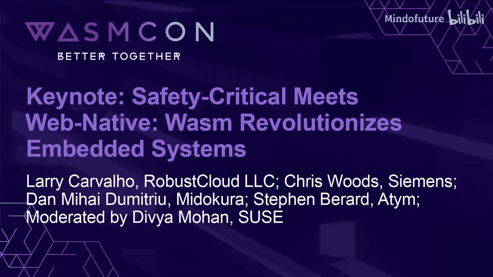

# 038：安全关键与Web原生相遇 - WebAssembly 如何革新嵌入式系统

## 概述
在本节课程中，我们将探讨 WebAssembly 如何为资源受限的嵌入式系统带来革命性变化。我们将了解其核心优势、在实时与安全关键环境中的应用、面临的挑战以及未来的发展方向。通过本次学习，您将理解 WebAssembly 如何成为连接云原生与嵌入式世界的关键桥梁。

---

## 章节 1：小组成员介绍

大家好，我是 David Brod，是 At 公司的联合创始人兼首席技术官。At 是一个面向资源受限设备的边缘应用框架。它允许开发者在最小的受限设备上构建、部署、更新、管理和监控边缘应用。我的背景主要在操作系统领域，曾在微软的 Windows 内核团队工作，并在施耐德电气积累了丰富的工业领域经验。这些经历让我深刻理解如何大规模构建、部署和管理这类系统。

我是 Chris Woods，来自西门子。我负责协调西门子在 WebAssembly 方面的工作，我们对此已研究了四到五年。西门子是一家大型企业，在座的各位很可能都接触过西门子制造、生产或维护的产品。例如，这里的电力供应、火车、轻轨以及 80% 的铁路道口都来自西门子。这些系统内部的软件架构开始变得与我们在云端看到的非常相似，但区别在于，当这些系统出错时，你不会收到 500 服务器错误，而是可能导致人员伤亡或电力中断。这两个领域之间存在惊人的相似之处，这也是我们开始研究 WebAssembly 的原因之一。

我是 Larry Kvallo，一名独立分析师，专注于云原生技术和边缘计算。随着我对边缘计算的兴趣增长，我认为必须关注 WebAssembly，以了解它将在我们接下来要讨论的领域中扮演何种角色。

我是 Dan de Mitriru，来自索尼集团旗下的 Midora。我们主要构建用于边缘计算机视觉的智能传感器。我们是在一个真实的技术需求下偶然发现 WebAssembly 的，即需要为这些传感器的可部署、可变更组件构建安全性和隔离性。我们在这方面已经工作了大约四年。

我是 Dea，正如 Bailey 刚才提到的，我是 Suusa 公司的首席技术倡导者。我的工作主要集中在云原生和 WebAssembly 领域。因此，虽然大家将从这次讨论中学习，但我可能会学到更多。

---

## 章节 2：WebAssembly 在资源受限环境中的优势

上一节我们介绍了小组成员的背景，本节中我们来看看 WebAssembly 为资源受限的嵌入式生态系统带来了哪些具体好处。

首先，这些受限设备无处不在，它们存在于我们的汽车、智能家居设备以及许多我们甚至不知道的地方。它们的共同点是资源非常受限，包括有限的 CPU、内存容量和速度、网络连接（如果有的话，也可能非常慢且延迟高），并且通常是电池供电的。

从编程模型来看，这很大程度上类似于 90 年代服务器端的做法：采用 C 或 C++ 语言的单体编程，所有代码链接成一个单一的二进制文件。在大型组织中，这带来了很多摩擦。例如，传感器组、分析组和应用支持组必须协同工作，集成代码，构建单一镜像。即使只修改一行代码，也需要重新测试整个镜像并重新部署。这种模式在更新、打补丁、故障排除或构建模块化架构方面都存在巨大阻力。

当我们审视这个世界并思考如何革新它时，再看看云原生领域，他们拥有容器、组件、动态加载等许多酷炫的工具。我们开始思考，为什么嵌入式设备不能拥有这些？如今嵌入式设备的 CPU 虽然受限，但已具备运行这些功能的能力。因此，我们开始重新构想嵌入式开发，并由此发现了 WebAssembly。

以下是 WebAssembly 带来的关键优势：

*   **安全默认设计**：WebAssembly 最初为在浏览器中安全运行未知来源的代码而设计，其核心安全特性对嵌入式空间极具吸引力。
*   **轻量级运行时**：我们可以构建非常小的运行时。我们使用 WebAssembly 微运行时，能够将其压缩到约 50KB，足以适应这类设备。昨天还有演讲提到通过精简运行时可以将其降至约 5KB。
*   **软件隔离**：这些设备通常没有虚拟内存或内存管理单元，因此缺乏进程边界和硬件隔离。WebAssembly 能够在软件层面实现隔离，这意味着我们可以在更便宜的硬件上大规模实现这一点。
*   **多语言支持与模块化**：开发者可以使用多种编程语言编写代码，实现模块化，并进行增量更新。这带来了与云中容器类似的开发体验和优势。

此外，我们的一位同事 Dominic 曾指出，WebAssembly 允许在设备上使用 C 以外的语言。随着越来越多的智能被推向边缘，有多少机器学习专家同时也是嵌入式 C 语言专家呢？非常少。WebAssembly 提供了一种将不同技能引入这些设备的方式。

目前，WebAssembly 微运行时已在约 150 万台设备中投入生产。例如，观看亚马逊 Prime 视频、Disney+ 流媒体或使用小米产品时，背后可能就有 WebAssembly 在运行。它已经成功部署，提供了类似云的隔离机制和编程风格，但运行在成本仅为个位数美元的设备上。这正在彻底改变我们构建嵌入式软件的方式。

---

## 章节 3：嵌入式环境的关键特性与考量

上一节我们探讨了 WebAssembly 的优势，本节中我们将深入了解在嵌入式环境中必须考虑的一些关键特性，特别是实时性和确定性。

首先，需要理解“实时”的含义。它不仅仅意味着“快”，更意味着“确定性”，即操作必须在已知的、有界的概率时间内完成。为了实现这一点，必须消除非确定性的来源。

以下是嵌入式环境中 WebAssembly 的关键特性与考量：

*   **无垃圾回收**：这是 WebAssembly 与 Java 或 CLR 等运行时的一个关键区别。垃圾回收会引入非确定性，对于内存可能只有几十到几百 KB 的设备来说是不可接受的。WebAssembly 通过线性内存来实现内存安全，这是一个关键设计。
*   **提前编译**：在嵌入式平台上，我们通常进行提前编译，而不是即时编译。在仅有 32KB 内存的设备上，JIT 编译是不可行的。
*   **混合临界性**：这是一个非常令人兴奋的概念。系统的一部分可以是真正的实时安全关键代码（可能用传统的、经过认证的 C 语言编写），而另一部分则可以运行在 WebAssembly 运行时中，用于处理用户界面、配置服务器等任务。即使后者出现故障或变慢，也不会影响前者的正确运行。这类似于云中将不同租户托管在同一服务器上的好处，但现在可以实现在没有管理程序、只运行微型实时操作系统的小芯片上。
*   **确定性挑战**：除了垃圾回收，内存分配器、运行时与操作系统之间不协调的线程管理，甚至缓存未命中都可能引入非确定性。这些领域仍需持续改进。

从商业价值角度看，实时性在预防性维护和制造质量方面至关重要。能够实时获取信息并立即识别错误，对于保持生产线高可靠运行和降低成本具有巨大价值。

一个现实世界的例子是航空业。飞机上的黑匣子收集所有数据，这部分是 FAA 认证的安全关键系统。但许多航空公司希望消费这些数据用于流程改进、飞行员培训和预测性维护。传统上，这需要一个硬件实现的只读端口，增加了物料成本和设计复杂度。而通过 WebAssembly 和混合临界性，可以在同一块芯片上，通过软件实现这种隔离的“只读端口”，运行数据分析组件，而无需额外的硬件成本。

---

## 章节 4：安全、认证与未来展望

上一节我们讨论了实时性和混合临界性，本节我们将关注 WebAssembly 如何增强嵌入式系统的安全性，并探讨其未来的发展方向，特别是在安全关键领域的应用。

在安全关键系统中，当出现故障时，必须以可预测的方式出错，这样你才知道会发生什么。安全性不是指特斯拉汽车在行驶时突然重启给用户带来的感受。

目前，还没有一个完全通过安全关键认证的 WebAssembly 运行时，但这正在到来。令人兴奋的是，其基础构建模块已经开始出现。例如，核心 WebAssembly 规范使用一种名为 Specte 的 DSL 编写，可以被机器读取和解释，并自动生成正确性证明。这为未来构建安全关键运行时奠定了基础。

从安全角度看，WebAssembly 带来了显著优势。传统的嵌入式系统通常是运行在同一进程空间的单体应用。一旦存在安全漏洞被利用，整个系统（包括安全关键部分）都可能被攻陷。而将系统划分为独立运行的模块后，攻击一个模块的影响范围通常会被限制在该模块内。这种模块化和纵深防御的方法可以构建更具弹性的系统。

此外，许多嵌入式设备是单体的，始终暴露着管理端口。而通过 WebAssembly 动态加载和卸载代码的能力，可以在需要时加载管理控制台，不需要时关闭它，从而减少攻击面。

法规也在推动变革。例如，欧盟的《网络弹性法案》即将出台，要求我们能够更新那些原本认为无需更新的设备。类似组件模型和软件物料清单这样的技术，可以让我们精确知道部署的每个软件组件包含什么。如果发生类似 Log4j 的安全事件，我们可以仅替换那个受影响的组件，这非常强大。

另一个关键点是，能够指定一个组件或模块被允许做什么，并且默认情况下什么都不允许。这与在 Linux 服务器上运行的情况非常不同，在服务器上通常默认拥有所有权限。而在嵌入式场景中，情况应该恰恰相反。WebAssembly 有能力实现这一点，尽管可能尚未达到 100% 的完善。

---

## 章节 5：对社区的呼吁与总结

在课程的最后，小组成员向社区发出了呼吁并进行了总结。

**Stephen**：我希望大家能参与我们所做的工作。我们有一个名为 Project Oker 的开源项目，它是我们运行时的核心，也是 Linux 基金会边缘计算项目的一部分。欢迎大家查看，如果有问题可以来找我。如果你正在构建这类系统，想了解如何划分应用、有哪些可用的构建工具链，我们非常乐意听取你的意见并获得你的贡献。

**Chris**：我们成立了嵌入式特别兴趣小组，它是 Bytecode Alliance 的一部分。我们关注核心 WebAssembly 规范和 WASI 规范的发展，并研究如何让它们在嵌入式设备上工作。如果你正在为嵌入式设备开发软件，欢迎加入我们，我们重视你的专业知识和观点。在这个小组中，思想的碰撞、演进和完善令人兴奋，这也是同行之间（即使在某些领域是竞争对手）交流的绝佳机会。

**Larry**：边缘计算存在巨大机遇，特别是在制造业回流和自动化需求增长的背景下。未来，甚至可以设想在边缘进行生成式 AI 推理，实现更高水平的自动化。随着边缘视觉处理等需求的增长，将需要 WebAssembly 这样的技术来推动创新和效率。

**Dan**：我想对非嵌入式领域的同行说一点：我们有一个观念，即任何 WebAssembly 程序都应该能在任何地方运行（“一次编写，到处运行”）。但在嵌入式领域，我们对此的关注度要低得多。是的，我们针对 SDK 编写软件并进行编译，但在实际部署和运行之间，可以采用多种方式。例如，昨天的演讲中提到了 WAMR 到 C 的转换，如果它能工作并满足所有属性，那就是一种完全合理的方式。它不是解释器，也不是 AoT 编译器，而是另一种有效的方法。我们非常愿意在部署前对构建产物进行更多处理。这也回到了组件模型的问题上，我们在哲学上认同它，但实现方式可以多种多样。例如，我们可以用工具链构建组件，然后不依赖尚不完善的规范化 ABI，而是在每个模块内部处理组件间的交互，然后这样部署。从功能角度看，问题解决了。但这可能不完全符合规范。这正是我们需要更广泛讨论的话题，也是你应该加入嵌入式 SIG 的原因。

---

## 总结
在本节课中，我们一起学习了 WebAssembly 如何为嵌入式系统带来变革。我们了解到，其轻量级、安全隔离、支持多语言和模块化的特性，使其非常适合资源受限的环境。通过实现混合临界性，WebAssembly 允许安全关键代码与更灵活的应用程序组件共存于同一设备。虽然面向安全关键领域的完全认证运行时仍在发展中，但其基础已奠定。社区通过嵌入式 SIG 等渠道正在积极合作，解决效率、确定性和性能等挑战，这些努力将使整个 WebAssembly 生态系统受益。随着边缘计算和自动化需求的增长，WebAssembly 有望在连接云原生与嵌入式世界、推动下一代边缘创新方面发挥关键作用。