# 039：概述与编译器介绍 🧑‍💻


在本节课中，我们将学习 Kotlin/Wasm 编译器的基本知识，并了解其调试功能的实现原理。我们将从编译器架构开始，逐步深入到浏览器内和浏览器外的调试技术。

大家好。感谢参加本次分享。我是 Artem Kobzar。我在 JetBrains 工作，负责 Kotlin 到 Wasm 的编译器。我之前也参与过 Kotlin/JS 编译器的工作，并且协助制定 Source Map 规范。我们将在本次分享中稍微讨论一下它。今天的日程很紧。我会尝试快速介绍 Kotlin/Wasm 编译器的一些方面和事实，以便让大家理解我们做出某些决定的原因。

## Kotlin/Wasm 编译器简介


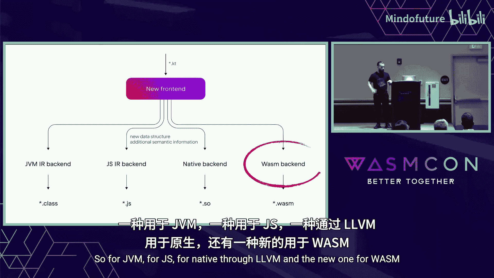

JetBrains 是一家公司，大家可能因为许多优秀的 IDE 而认识它，比如用于 Java、Rust、C++ 的 IDE。但这家公司也创造了 Kotlin 语言。你们中的一些人可能因为 Android 或“更好的 Java”而知道 Kotlin。实际上，Kotlin 是一种多平台和跨平台的语言。目前我们有四个编译器：用于 JVM、JS、通过 LLVM 的 Native，以及一个新的用于 Wasm 的编译器。

Kotlin 是开源的，所以我将引用 GitHub 仓库中的文件和实现细节。这个编译器是从零开始构建的。我们不使用任何 LLVM 或其他类似的东西。我们直接从 Kotlin 前端获取中间表示，并将其编译为 Wasm 二进制文件。同时，我们复用了 Kotlin/JS 编译器的一些组件。我们有两个子目标：一个用于浏览器，一个用于浏览器外。第一个称为 Wasm JS，第二个称为 Wasm Wasm。

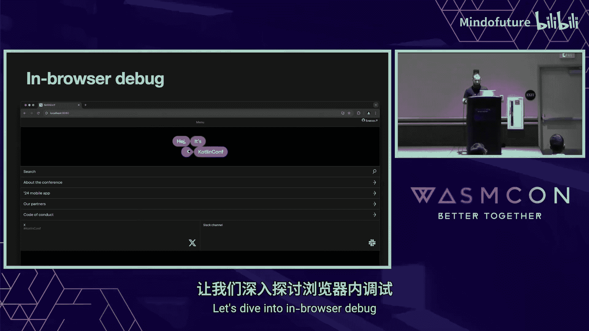

我们重度依赖 GC 和函数引用提案。这意味着，如果你尝试在尚未支持这些提案之一的虚拟机中运行我们的编译器生成的二进制文件，它将无法工作。我们软性依赖异常处理提案。这意味着默认情况下我们会开启异常处理，但你有能力将其关闭。如果某些虚拟机不支持它，你可以直接关闭它，这样就能工作。这就是 Kotlin/Wasm。


---

# Kotlin/Wasm 调试揭秘：第2章：浏览器内调试演示 🕸️

上一节我们介绍了 Kotlin/Wasm 编译器的基本架构。本节中，我们将通过一个实际应用来演示如何在浏览器内进行调试。

我们将调试一个应用程序。最初，它是为我们的 KotlinConf 开发的 Android 应用程序。通过 Compose Multiplatform，我们将其编译到了 iOS 和 Web 平台。

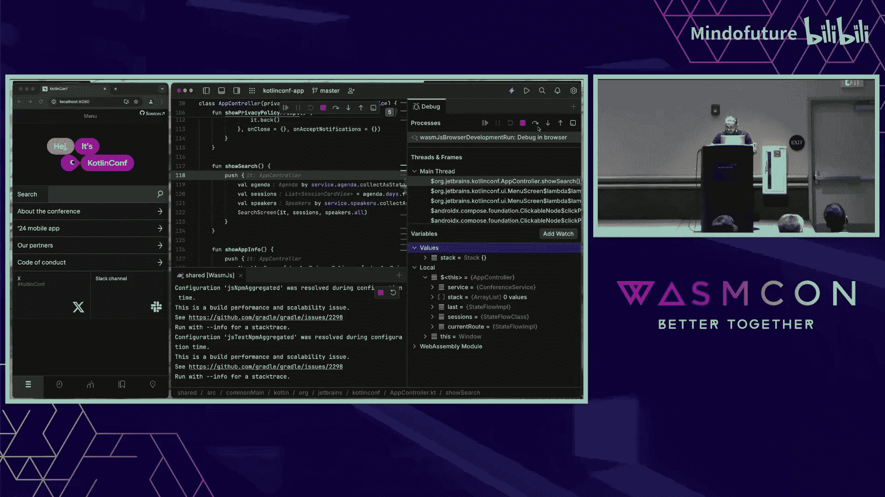


让我们看看如何调试它。


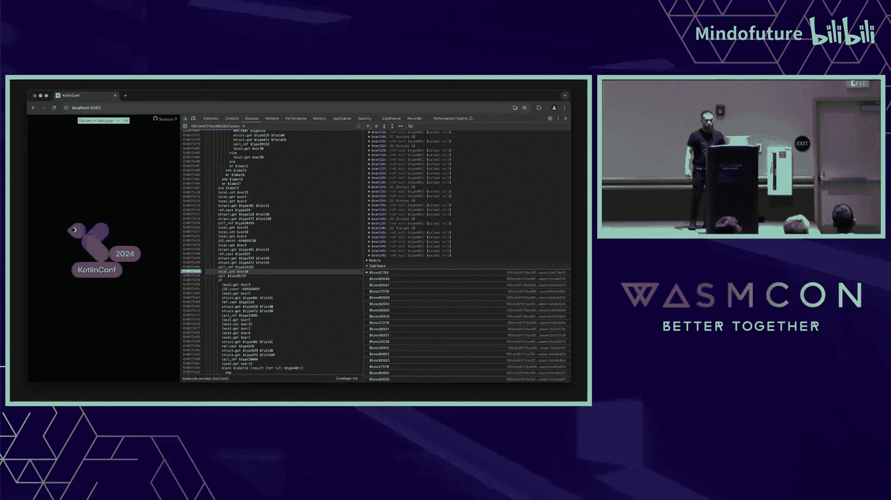


首先，我们直接在浏览器中调试。我们进入主屏幕。我们在这里。我们通过源代码进行调试，而不是原始的 Wasm 代码。单步执行可以正常工作。函数名非常可读，我们可以通过调用栈来回跳转。所有变量都被很好地格式化，使其不那么底层。例如，在服务中，我们可以看到一些字符串。这是基于 GC 提案的 Kotlin 字符串，但我们尝试将其格式化为更高级别的形式。


我们进入菜单屏幕，尝试调试一些操作。例如，我们进入搜索功能。我们单步进入搜索函数，尝试理解从服务器获取了什么数据。这里你也能看到一些演讲信息，它们也尝试以更可展开的形式显示。我们为许多结构构建了展开功能，以便我们可以展开并检查其内容。


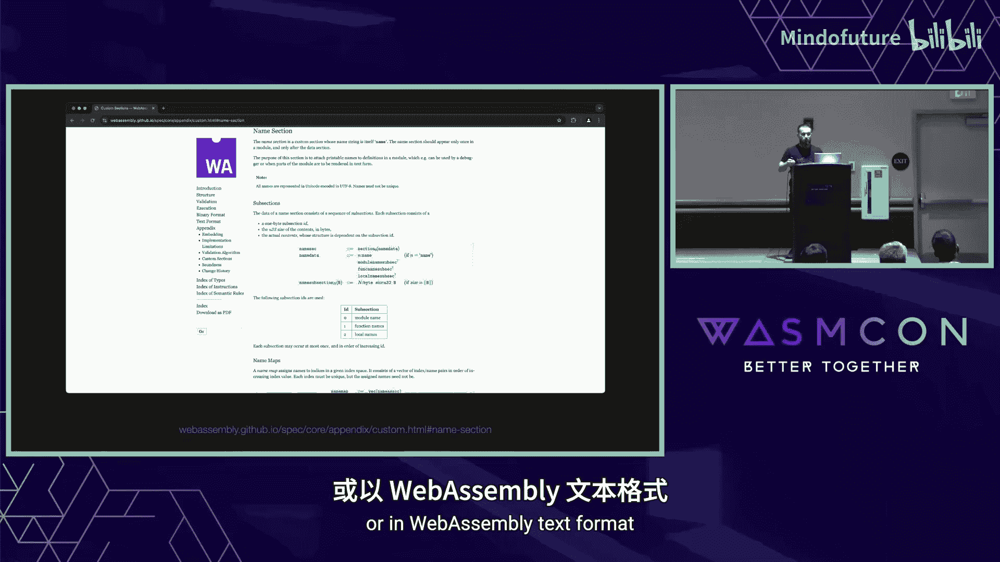

这就是关于高级数据结构的调试。这是关于浏览器内调试的部分。那么关于 IDE 呢？我们也在 IDE 中设置一个断点。我们看到的情况是一样的：漂亮的名称、基于源代码的调试，以及尽可能组织成高级形式的数据。我们也可以在菜单屏幕的控制器上做同样的事情。我们尝试单步执行，例如调试不同的部分，栈深度为 0，我们单步跳过，现在深度为 1。


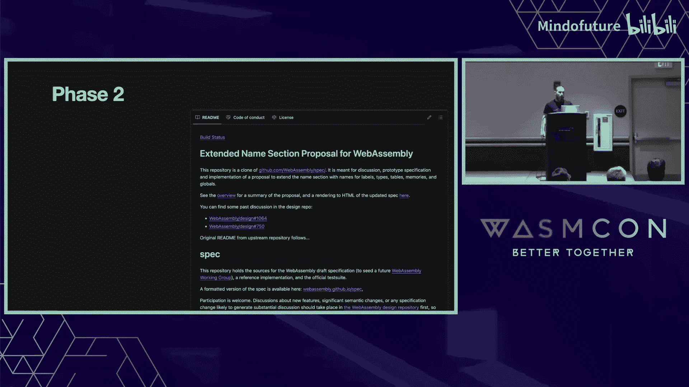

这看起来好吗？不完全对。因为我们需要理解可以与什么进行比较。让我们想象一下，如果调试器不向浏览器提供任何调试信息，它会是什么样子。

听起来就像这样。正如你所见，原始的 Wasm 代码，一些随机的名称，数据结构非常底层。我们将尝试逐步改进它，添加越来越多的调试信息，使其变成我们之前看到的样子。


---

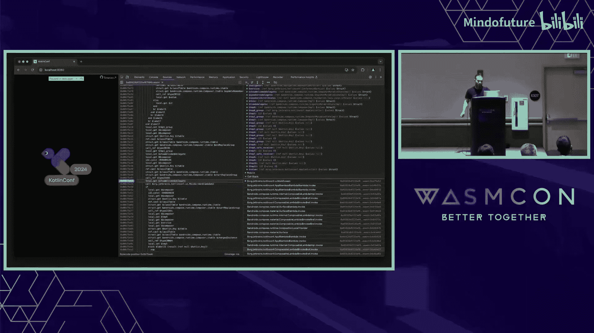

# Kotlin/Wasm 调试揭秘：第3章：改进调试信息 - 名称与源码映射 📝

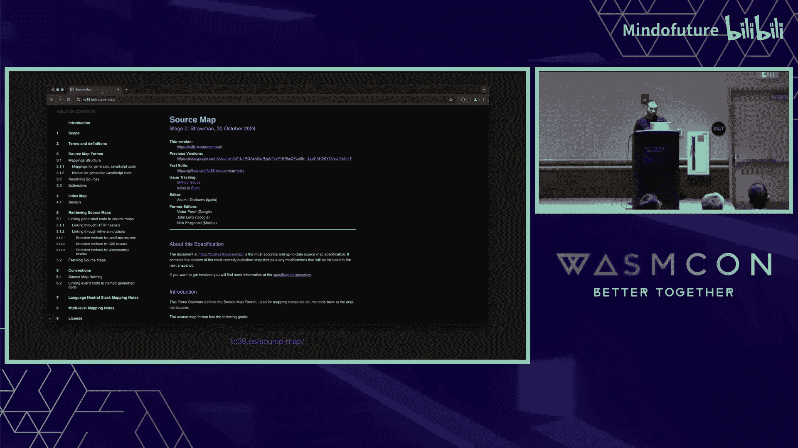

上一节我们看到了缺乏调试信息时的原始状态。本节中，我们将看看如何通过添加名称和源码映射信息来显著改善调试体验。

让我们首先从名称开始。如何改进它们？

Wasm 规范中有一个名为“名称节”的自定义节。这个节的目的是引入名称，以便在你的调试器或 WebAssembly 文本格式中漂亮地显示它们。正如你在这里看到的，它涵盖了模块名称、函数名称和局部变量名称，但还不够多。因为我们使用了 GC 提案，我们也依赖 GC 提案内部的一些扩展，这些扩展使我们能够为类型和字段声明名称。我们还希望覆盖全局变量。这是另一个名为“扩展名称节”的提案。我们也用它来为全局变量命名。

我们从前端的中介表示中获取这些信息，我们的声明有名称。我们只是将其添加到此节中。如果我们尝试使用 `wasm-objdump` 转储为此应用程序生成的二进制文件，我们会看到模块的名称、函数的名称、局部变量的名称、来自 GC 提案的类型名称以及来自扩展名称节的全局变量名称。

一旦我们提供了所有这些信息，我们的调试器就会从原始状态变成这样，稍微好看了一些。即使在 WebAssembly 文本格式中，你也会看到局部变量和函数的名称发生了变化。但还不够好，对吧？我们肯定希望通过源代码而不是二进制文件进行调试。那么我们如何改进这一点呢？

如果有一种格式可以将我们的指令映射到源代码，那就太好了。确实存在一个名为 Source Maps 的标准，我也在尝试改进它。这实际上是一种相当简单的格式。它是一种文本格式，基于 JSON，功能不多。版本目前总是 3，一旦我们更改并集成新功能，它将会改进，版本可能会变为 4 或 5 等。

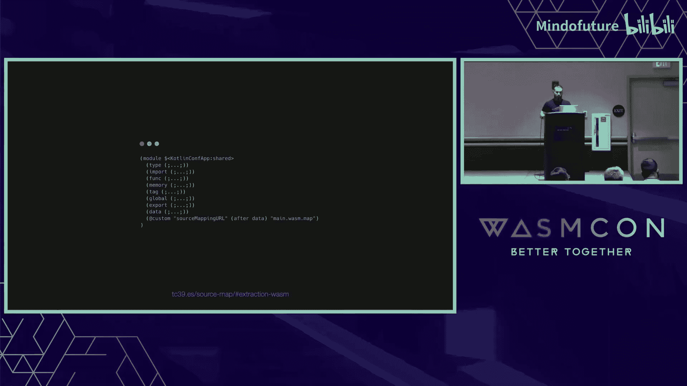

以下是该格式的核心结构：
```json
{
  "version": 3,
  "file": "output.wasm",
  "sourceRoot": "",
  "sources": ["source.kt"],
  "sourcesContent": [null],
  "names": [],
  "mappings": "..."
}
```
`file` 是我们为其生成此格式的文件。`sourceRoot` 是 `sources` 中路径的重复前缀部分。`sources` 是我们想要将指令映射到的源文件。`sourceContent` 是这些文件的内容。`ignoreList` 是一个相当有趣的部分，我们还没有使用它，但稍后我会多谈一点为什么。它的作用显然是让调试器忽略某些源文件。对于调试器来说，这意味着定义在标记为忽略的文件中的函数将不会出现在调用栈中，并且也不允许单步进入这些函数。`names` 部分是因为这种格式不仅适用于 WebAssembly，也适用于 JavaScript 和 CSS，而在 JS 或 CSS 中没有自定义节。`mappings` 是这份文档的核心。它将我们的指令映射到源代码。

每个段由逗号分隔，每个段代表以下数据：二进制文件内的绝对偏移量。之后的所有字段都是可选的：源文件索引、该文件中的起始行、起始列以及名称索引。我不会深入探讨这种格式的编码细节，因为它也使用了 VLQ 编码和差分计算，每个后续段都依赖于前一个段以减少大小。

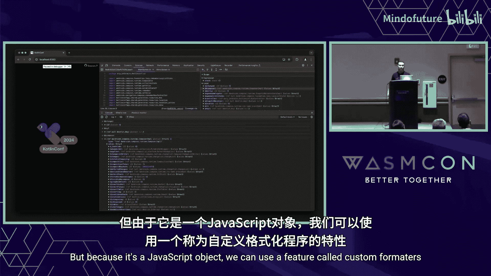

我们使用了来自中间表示的所有数据。在 IR 文件条目中，我们有名称，以及我们提供文件内偏移量并获取文件内行和列的函数。一旦我们提供了所有这些信息，我们还需要添加一个名为 `sourceMappingURL` 的新自定义节。浏览器首先获取你的二进制文件，检查这个自定义节，如果存在，它也会尝试获取映射文件。


一旦我们添加了这个，我们的调试器就变成了这样。友好多了，对吧？但还不完美。

---

# Kotlin/Wasm 调试揭秘：第4章：自定义变量格式化与待改进领域 🛠️


上一节我们通过源码映射实现了基于源代码的调试。本节中，我们将探讨如何自定义变量视图，并讨论当前面临的一些挑战和待改进的领域。

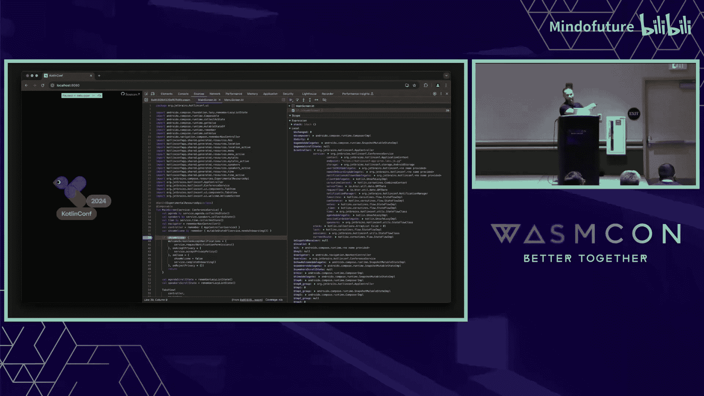

我们还希望稍微自定义变量视图，因为它们太底层了。我们如何做到这一点？这很有趣，因为如果我们在调试期间打开控制台并尝试检查局部变量，我们会发现它们看起来像 JavaScript 对象。这是因为 Chrome DevTools 和 Firefox DevTools 训练你使用表达式求值功能，而唯一可以使用的表达式求值语言是 JavaScript。因此，它们构建了代表 Wasm 内部数据的 JavaScript 对象视图。这实际上有点问题，我稍后会谈到。但因为它是一个 JavaScript 对象，我们可以使用一个名为“自定义格式化器”的功能。这是 Firefox 和 Chrome 支持的功能。它使你能够自定义 JavaScript 对象。


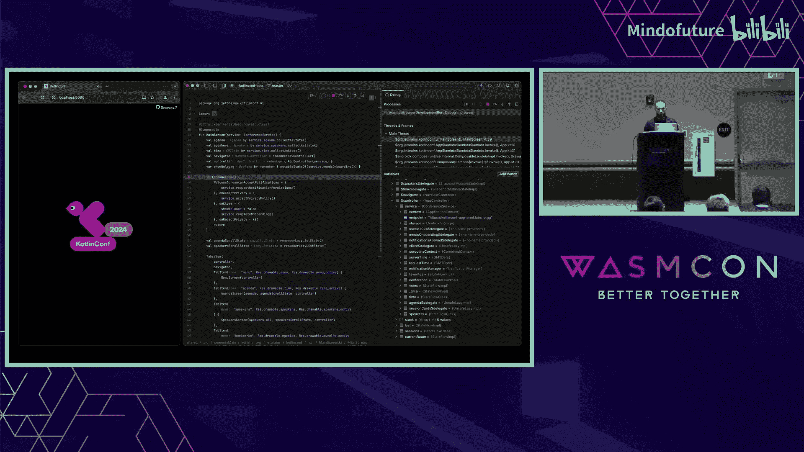

如何操作？你需要声明一个名为 `devtoolsFormatters` 的全局变量。它是一个对象数组，包含 `header`、`hasBody` 和 `body` 属性。`hasBody` 表示数据是否复杂，是否应该展开。`header` 表示数据的预览。`body` 是展开部分。它接受一个对象，如果对之前的格式满意则返回 `null`，或者返回一个受限制的 HTML 或 JSON 格式。它看起来像这样：一个数组，第一个元素是字符串标签，之后是一个只允许 `style` 属性的对象，然后是子元素。如你所见，只允许 `span`、`div`、`ol`、`ul` 和 `li` 这些标签。


我们这样声明它，并列出了所有我们想要自定义的 Kotlin 类型。我将展示一个用于类的简单格式化器。因为我们有一些实现细节字段，比如哈希表，这不是用户定义的，而是我们的实现细节，我们想隐藏这些。所以我只是遍历对象并移除这些字段，同时移除字段名的美元符号。

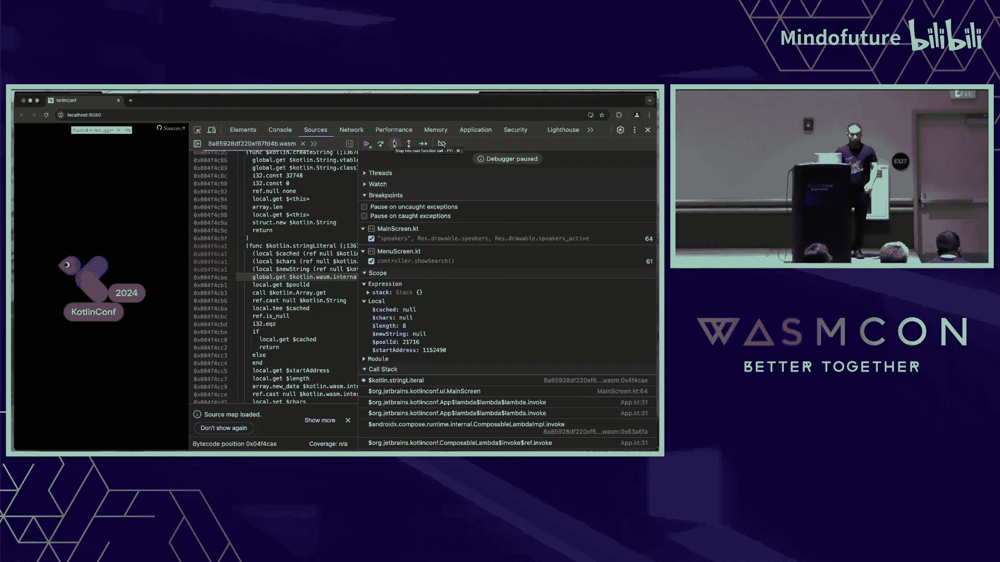

一旦我们将其作为导入添加到蓝图中，我们的浏览器就会看起来像……不，它默认是关闭的，我们需要开启这个功能。只有在开启之后，它才会看起来像这样。

但是 HTML 呢？如果你的 IDE 无法渲染一些随机的 HTML 怎么办？这就是我之前展示的 Fleet IDE 的情况。为了在那里自定义变量，我需要在 Kotlin for JVM 中重新实现与自定义格式化器中定义的相同逻辑。不幸的是，我无法展示源代码，但逻辑与自定义格式化器中的逻辑基本相同。

这就是目前的情况。我们能改进什么？我提到了忽略列表，忽略列表有些特殊。我的意思是，我们现在有一个问题。我来展示给你看。

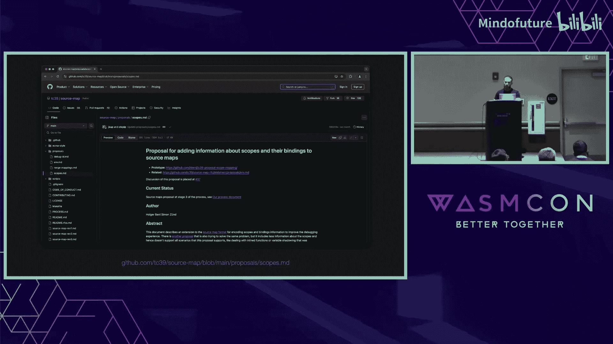

这实际上非常奇怪，在某种意义上甚至有些疯狂。我们运行它。让我进入主屏幕，在字符串的某个地方。如你所见，我们停在了字符串上。我们可以做一些奇怪的事情。这是一个字符串字面量。但在底层，我们使用了一些内部函数来检查字符串是否已存在于字符串池中，如果存在，我们就不会创建新的，这是一些优化。但因为我们使用了一些函数来构建字符串，我们可以单步进入字符串字面量，进入一些随机的 WebAssembly 代码。这绝对是我们不想提供给用户的。在这里，忽略列表可以帮助我们。我打算做的是声明一个虚拟文件，比如叫做忽略文件，并将所有像这样的指令（比如内部函数）引用到这个文件。这样，这个函数就会被忽略，不会单步进入，也不会出现在上下文中。


为什么我们之前没有使用它？因为它在 Chrome 中有一段时间不工作。感谢 Chrome 团队的 Eric Li 等人，我联系了他们，询问如何实现，他们帮助我实现了它，并且它已经合并到 V8 中，我希望它能在 Chrome 的下一个版本中可用。

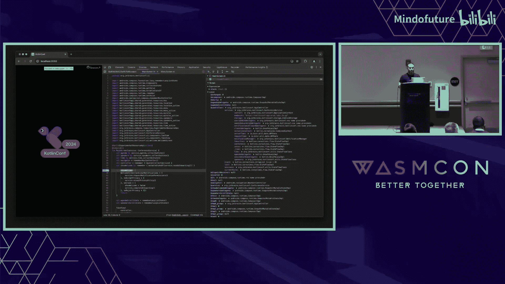

下一件事，新的作用域提案。正如我所说，Source Map 是一个标准和规范，它正在逐步改进。有很多新的提案。其中之一就是作用域。如果我们检查这个区域，你会看到有很多在源代码中未声明的随机变量，我们也不想向人们展示它们。作用域提案可以帮助我们解决这个问题。我们只需在 Source Map 中声明作用域，并说明在这个作用域中有以下变量。这样，只有这些变量会显示在调试器中。


它还可以帮助我们解决另一个问题：在 Kotlin 中我们有内联函数。目前，在 Source Maps 中，没有可能声明这是内联函数体。这意味着我们无法单步跳过任何函数，总是会单步进入这个内联函数。作用域提案也可以解决这个问题。

下一件事，表达式求值。这实际上是一个棘手的领域，因为我不知道如何改进它。这是我遇到的第一个问题。因为我使用了自定义格式化器，让我们尝试检查 `agendaDelegate.reader.kind`，显然它显示在我们的局部变量中，但它是未定义的，因为传递的值是自定义后的，原始值是不同的，所以我们需要使用 `.value`、`.field`、`.value`，这有点烦人。我现在不知道如何解决这个问题，但我们正在与 Chrome 工具团队大量合作以寻找解决方案。

第二个问题，你还记得我提到过所有的 WebAssembly 值都表示为 JavaScript 对象吗？所以你没有对原始结构的引用。如果你想在调试期间调用一些接受该结构作为参数的函数，你会失败，因为你没有原始引用。例如，在这里，我尝试使用字符串并调用已声明的 `isWhitespace` 函数。如你所见，出错了，因为它是 JavaScript 对象，不是结构体。我们没有对结构体的原始引用。这也是一个问题，我们也在尝试解决。我们提出的一个解决方案是，在这个对象内部也持有对原始结构的某种引用，这样我们就可以提供引用本身，而不是这个 JavaScript 对象。

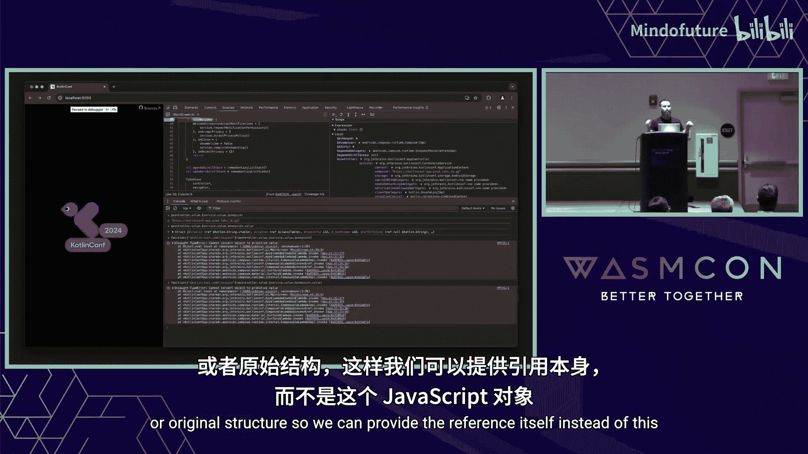


这就是关于浏览器内调试的内容。那么浏览器外调试呢？

---


# Kotlin/Wasm 调试揭秘：第5章：浏览器外调试与未来展望 🚀

上一节我们探讨了浏览器内调试的细节与挑战。本节中，我们将简要了解浏览器外调试的现状，并展望未来的改进方向。


我无法向你展示演示。这个演示是我不久前创建的。它不像之前的演示那样有前景。我只有几个简单的测试文件。我可以运行它。顺便说一下，这是 Wasmtime。然后运行 LLDB，连接到 LLDB。我们需要稍等片刻。我们停下来了，停在了 `startTest` 这里。我们可以在 `box` 函数处设置断点。定义在这里。然后继续执行，我们停在了这里。是的，它不像之前那样好。问题是，正如我所说，这个演示，即生成浏览器外调试信息的基本功能，大约是一周前创建的，我上周二才真正完成。我们继续努力，它也在不断改进。这实际上是一个相当大的领域。

我来解释一下原因。首先，我们仍在积极开发中。我们目前正在努力使其在 Wasmtime 和 Wasmer 上工作，因为这两个运行时为我们提供了可以使用的调试和 GC 提案支持。


其次，DWARF。我不会解释 DWARF，因为其规范大约有 500 页。我需要三场这样的分享才能解释整个格式。让我们看看我生成了什么。这实际上非常基础。我们生成了一些新的节，也是自定义的，如 `.debug_info`、`.debug_str`、`.debug_line` 和 `.debug_abbrev`。只有 `.debug_info` 和 `.debug_line` 对我们有趣。`.debug_line` 表示从指令到原始源代码的映射，`.debug_info` 表示更高级的结构，更像是关于声明的信息，比如声明函数、局部变量、类型等。对于我展示给你的这些文件，我们生成了这种调试信息。我们在这里看到的是编译单元，我们声明这是我们生成的二进制文件，以及几个函数：一个是我们中断的 `box` 函数，第二个是 `runBoxTest`，第三个是 `startTest`。

不算多。这里有趣的是偏移量。在 Source Map 格式中，偏移量是绝对的，从二进制文件开头算起。但在 DWARF 中，它是相对于代码节的。这是因为在 Source Maps 中，他们也试图覆盖全局变量中有表达式的情况。而在 DWARF 中，目前你无法覆盖全局变量中的表达式，因为它是相对于代码节的。

第二件有趣的事。我在推特上提到过，这部分我们使用了 Kotlin。为什么我们这里有 C++ 语言？这是因为在 LLDB 内部似乎有一个语言白名单。如果你声明 Kotlin、Swift 或其他语言，实际上它不会工作，你将无法中断。我花了三个小时比较 Clang 的输出和我的输出后才意识到这一点。但这很有趣，实际上也很明显。LLDB 是 C、C++、Objective-C、Objective-C++ 的调试器。

这是调试行信息。它实际上是整个程序中帮助你定义如何映射的虚拟机器。当我们用 `dwarfdump` 检查它时，我们会看到所有的映射都是这样的。顺便说一下，关于 `dwarfdump`，我可以使用常规的 LLVM `dwarfdump` 吗？因为 GC 提案，LLVM `dwarfdump` 也会尝试解析你的二进制文件。结果，它只是遇到未定义的指令就说“我失败了”。感谢 Gingerly 项目，在他们的示例中有他们自己的 `dwarfdump`，这就是我使用的那个。另外，有一个名为 `addr2line` 的 Wasm 工具对我真的很有帮助，我们可以提供二进制文件内的绝对偏移量，它会告诉我们映射到哪个文件以及哪一行。

未来的工作领域很多。首先，我想至少让它在 Wasmtime 上完全工作，能够按行和文件（也许还有列）中断。其次，让它在 Wasmer 上工作，因为即使有这些调试信息，它在 Wasmer 上也不工作，我不知道为什么。第三，我想让它为你的虚拟机工作。如果你是为 Wasmtime、Wasmer 或其他任何支持 GC 提案的虚拟机做贡献的开发者，请联系我。我希望它也能为你的虚拟机工作。当然，因为 JetBrains 提供工具，我们希望有一个好的工具链。我们想将其集成到我们的 IDE 中，以提供无缝且良好的开发者体验。

---

# Kotlin/Wasm 调试揭秘：第6章：总结与资源 📚

本节课中，我们一起学习了 Kotlin/Wasm 调试的方方面面。我们从编译器架构入手，深入探讨了浏览器内调试如何通过名称节、Source Maps 和自定义格式化器实现友好的调试体验。我们还了解了浏览器外调试的初步实现及其依赖的 DWARF 格式，并展望了未来的改进方向。


以下是一些有用的资源链接：
*   如果你对 Kotlin 和 Wasm 感兴趣，想了解更多关于 Kotlin/Wasm 的信息。
*   我们的公共 Slack 频道。你可以加入它，这是一个庞大的 Kotlin Slack，但里面有一个 wasm 房间，你可以在那里找到我。
*   如果你有兴趣合作让 Kotlin/Wasm 在你的运行时上工作，或者你有兴趣为 Source Map 规范做贡献，也请在这里联系我。
*   我也分享了我的 Twitter。谢谢。