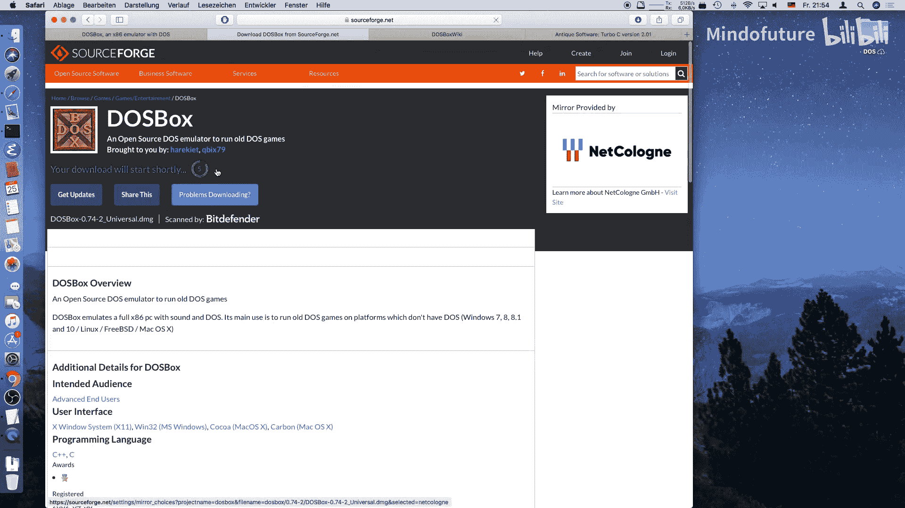
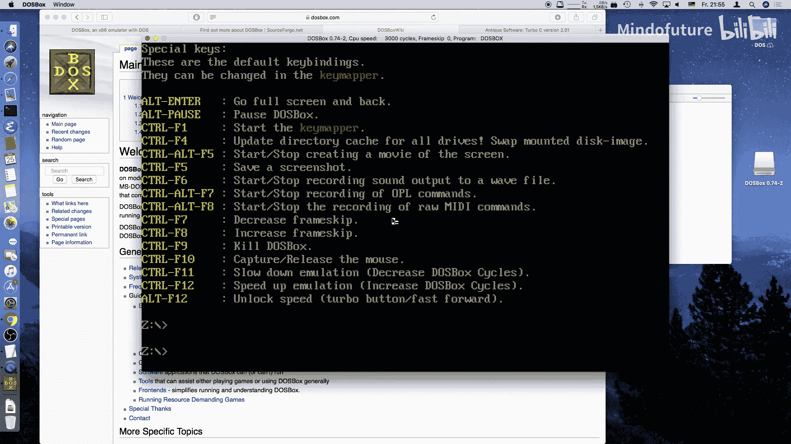
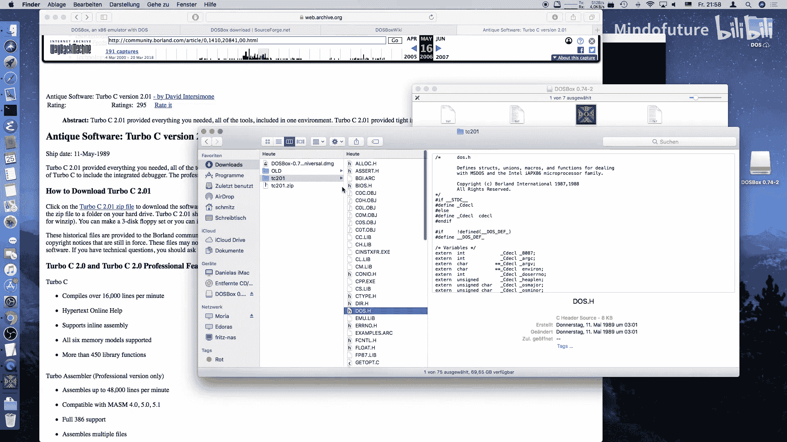
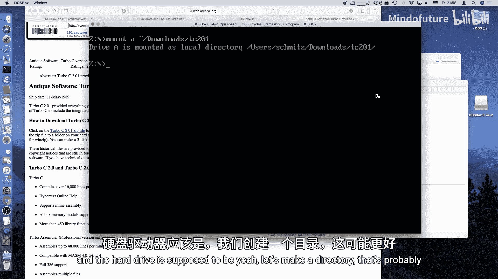
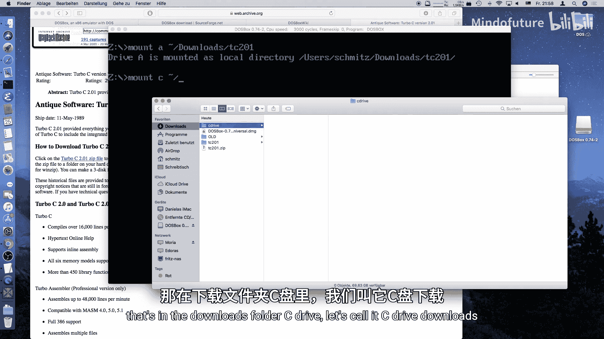
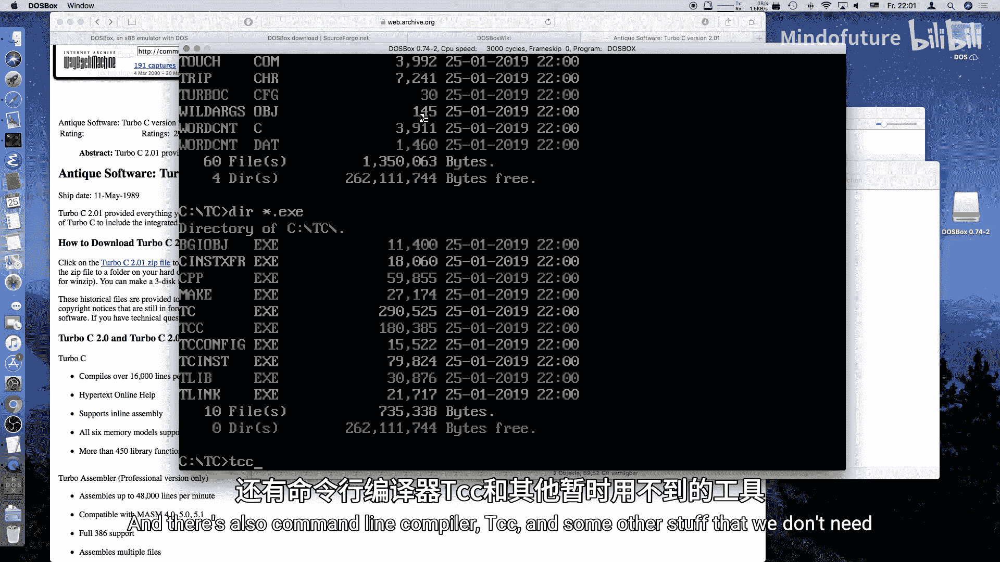
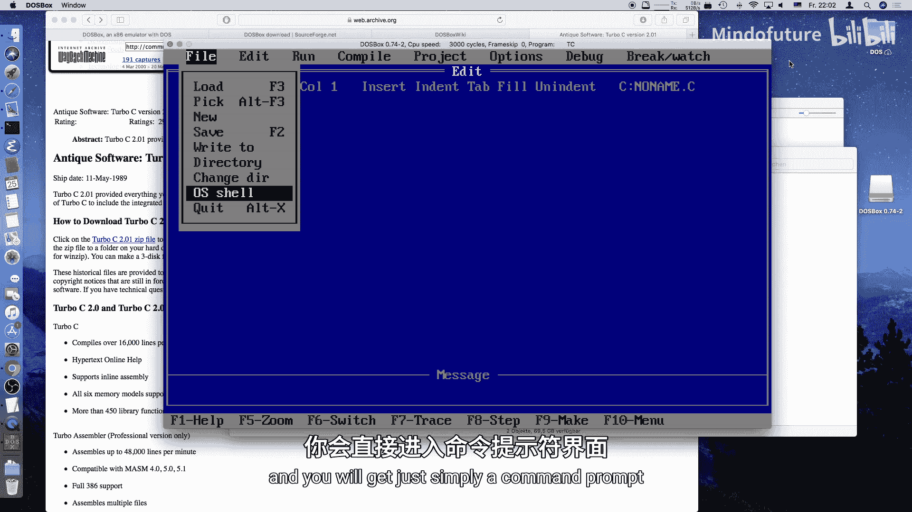
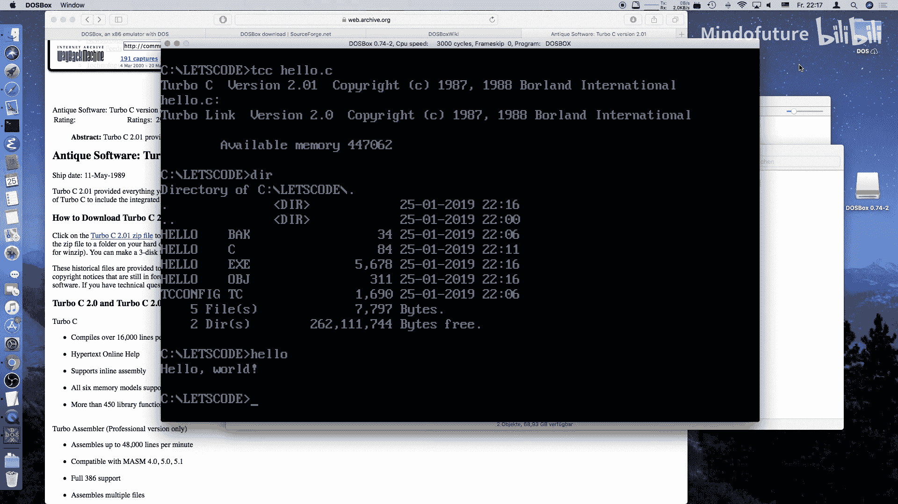

# 001：开发环境搭建与第一个程序

## 概述
在本节课中，我们将学习如何为古老的 MS-DOS 系统搭建一个 C 语言开发环境，并编写、编译和运行一个经典的“Hello World”程序。我们将使用 DOSBox 模拟器来创建一个复古的开发环境。



## 开发环境搭建



上一节我们介绍了本系列课程的目标，本节中我们来看看如何搭建开发环境。由于并非每个人都拥有一台老式 PC，我们将从模拟器开始。

### 选择模拟器：DOSBox
最著名的 MS-DOS 模拟器是 DOSBox。它是开源且免费的，支持多种操作系统。

以下是获取和安装 DOSBox 的步骤：
*   **下载**：访问 DOSBox 官网，根据你的操作系统（Windows、macOS、Linux）下载对应的安装包或可执行文件。
*   **安装**：Windows 用户运行安装程序；macOS 用户可以将应用拖入“应用程序”文件夹；Linux 用户通常可以通过包管理器安装。
*   **文档**：DOSBox 拥有一个内容丰富的 Wiki，包含大量配置文档，建议查阅。







启动 DOSBox 后，你会看到一个模拟的 DOS 命令行界面。

### 选择编程语言：Turbo C 2.0
我们将使用 Turbo C 2.0 作为编程语言。它体积小巧，其核心概念对现代编程语言（如 Java、JavaScript、C++）仍有借鉴意义。

以下是获取和安装 Turbo C 2.0 的步骤：
1.  **获取**：由于原版已下线，可通过互联网档案馆的 Wayback Machine 找到并下载 Turbo C 2.0 的 ZIP 文件。
2.  **准备文件**：解压 ZIP 文件，你会得到三个磁盘镜像目录（DISK1, DISK2, DISK3）。为方便起见，将所有文件复制到同一个文件夹（例如 `TC` 文件夹）中。
3.  **在 DOSBox 中安装**：
    *   使用 `mount` 命令将你的 `TC` 文件夹挂载为 DOSBox 的 A 盘（软盘驱动器）。
    *   在 DOSBox 中切换到 A 盘，运行 `install.exe`。
    *   在安装程序中，选择源驱动器为 A，并将 Turbo C 安装到硬盘（例如 C 盘的 `\TC` 目录）。
4.  **创建工作目录**：安装完成后，在 C 盘创建一个用于存放代码的目录，例如 `\letscode`。注意 DOS 的文件名限制为 **8.3 格式**（主文件名最多 8 个字符，扩展名最多 3 个字符）。





## 编写第一个 C 程序

环境搭建完毕，现在我们来编写第一个程序。我们将使用 Turbo C 的集成开发环境（IDE）。

### 启动 Turbo C IDE
在 DOSBox 中，切换到 Turbo C 的安装目录（例如 `C:\TC`），然后运行 `tc.exe` 启动 IDE。这个 IDE 界面简洁，包含菜单栏、编辑区和消息窗口。

### 理解 C 程序的基本结构
C 语言程序由函数构成，其中必须有一个名为 `main` 的主函数。它是程序的入口点。

一个基本的 `main` 函数结构如下：
```c
int main()
{
    /* 你的代码写在这里 */
    return 0;
}
```
*   `int` 表示该函数返回一个整数。
*   `main()` 是函数名和参数列表（目前为空）。
*   `{` 和 `}` 之间的部分是函数体，包含要执行的语句。
*   `return 0;` 表示程序正常结束，向操作系统返回 0。

### 输出“Hello World”
为了在屏幕上显示文字，我们需要使用 C 标准库中的 `printf` 函数。在使用它之前，需要包含对应的头文件。

以下是完整的“Hello World”程序代码：
```c
#include <stdio.h>

int main()
{
    printf("Hello World!\n");
    return 0;
}
```
*   `#include <stdio.h>`：这条预处理指令告诉编译器包含标准输入输出头文件，这样我们才能使用 `printf` 函数。
*   `printf("Hello World!\n");`：调用 `printf` 函数输出字符串。字符串用双引号包围，`\n` 表示换行。
*   每条语句以分号 `;` 结尾。

### 编译与运行程序
在 Turbo C IDE 中：
1.  **保存文件**：将代码保存到你的工作目录（例如 `C:\letscode\`），文件名为 `hello.c`。
2.  **编译**：按 `F9` 键进行编译。如果代码无误，会在下方看到“Success”消息。
3.  **运行**：按 `Ctrl+F9` 运行程序。要查看输出，可以按 `Alt+F5` 切换到用户屏幕。

你也可以使用命令行编译器 `tcc.exe` 来编译：
```bash
tcc hello.c
```
这将生成一个 `hello.exe` 文件，直接在 DOS 命令行中键入 `hello` 即可运行。



## 总结
本节课中我们一起学习了为 MS-DOS 搭建 C 语言开发环境的完整流程。我们首先利用 DOSBox 模拟器创建了复古的开发平台，然后安装并配置了 Turbo C 2.0 编译器。最后，我们编写、分析并成功运行了第一个 C 语言程序——“Hello World”，理解了程序的基本结构、头文件包含以及编译运行的过程。这为后续学习更复杂的图形编程和游戏开发打下了基础。在下一节课中，我们将尝试进入图形模式，开始探索如何在 DOS 下进行图形编程。