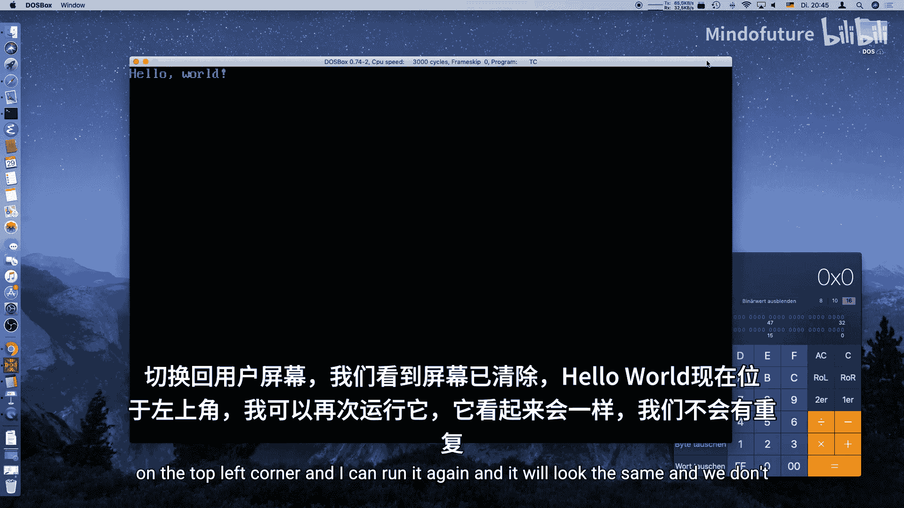
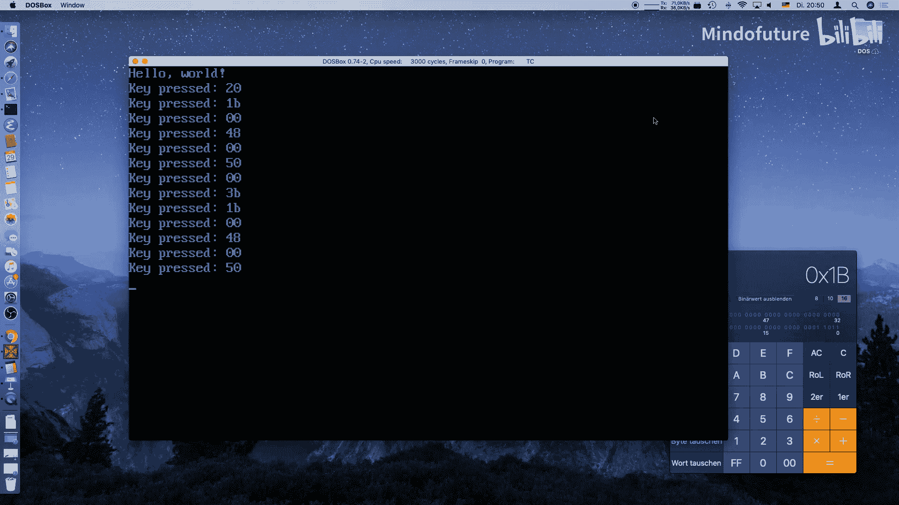
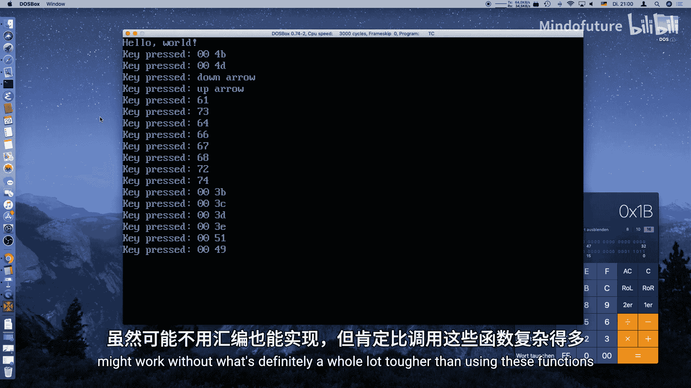

# 002：键盘输入

## 概述
在本节课中，我们将学习如何在MS-DOS程序中读取键盘输入。你将学会如何检测普通按键以及特殊按键（如方向键），并利用这些输入来控制程序流程，为后续开发小游戏打下基础。



上一节我们介绍了如何编写第一个MS-DOS程序并清屏。本节中我们来看看如何与键盘进行交互。

## 清屏与键盘检测
为了获得干净的输出界面，我们可以使用 `conio.h` 头文件提供的 `clrscr()` 函数来清屏。该头文件还提供了控制台输入输出的相关功能。

检测键盘是否有按键被按下，可以使用 `kbhit()` 函数。它返回一个布尔值，指示是否有按键事件发生，但不会告诉我们具体是哪个键。

以下是清屏和检测按键的基本代码框架：
```c
#include <conio.h>
#include <stdio.h>

int main() {
    clrscr(); // 清屏
    printf("Hello World\n");

    if (kbhit()) {
        // 有按键被按下
    }
    return 0;
}
```



## 读取按键代码
要获取具体的按键信息，需要使用 `getch()` 函数。它会返回被按下键的扫描码。

需要注意的是，普通字符（如字母、数字）返回一个字节的ASCII码。而特殊键（如方向键、功能键）则返回一个两字节的序列：第一个字节是 `0`，第二个字节是该键特有的扫描码。

我们可以通过一个无限循环来持续读取键盘输入，并在按下特定键（如ESC键）时退出循环。

以下是实现持续读取按键并显示其十六进制代码的示例：
```c
#include <conio.h>
#include <stdio.h>

int main() {
    unsigned char key = 0;
    clrscr();

    while (1) {
        if (kbhit()) {
            key = getch();
            printf("Key pressed: 0x%02X\n", key);
            if (key == 0x1B) { // ESC键的代码
                break; // 退出循环
            }
        }
        // 此处可放置游戏主逻辑
    }
    return 0;
}
```

## 处理特殊按键
根据上面的知识，我们可以通过判断读取到的第一个字节是否为 `0` 来识别特殊按键。如果是，则需要再次调用 `getch()` 读取第二个字节（扫描码）以确定具体是哪个特殊键。

以下是处理方向键等特殊按键的逻辑结构：
```c
#include <conio.h>
#include <stdio.h>
#include <string.h>

int main() {
    unsigned char key = 0;
    char key_desc[255];
    clrscr();

    while (key != 0x1B) { // 循环直到按下ESC键
        if (kbhit()) {
            key = getch();

            if (key == 0) {
                // 特殊键处理：读取第二个字节
                key = getch();
                switch (key) {
                    case 0x48:
                        strcpy(key_desc, "Up Arrow");
                        break;
                    case 0x50:
                        strcpy(key_desc, "Down Arrow");
                        break;
                    // 可以在此添加更多特殊键的case，如左箭头(0x4B)、右箭头(0x4D)
                    default:
                        sprintf(key_desc, "Special Key: 0x00%02X", key);
                        break;
                }
            } else {
                // 普通键处理
                sprintf(key_desc, "Normal Key: 0x%02X", key);
            }
            printf("Key pressed: %s\n", key_desc);
        }
    }
    return 0;
}
```

## 总结
本节课中我们一起学习了在MS-DOS环境下进行键盘输入编程的核心知识。



我们掌握了如何使用 `conio.h` 中的 `kbhit()` 和 `getch()` 函数来检测并读取按键。关键点在于理解了普通键与特殊键（返回两字节序列）的区别，并学会了通过 `switch` 语句来处理不同的特殊键扫描码。

现在，你已经可以编写一个能响应键盘输入（包括方向键）并可控退出的程序框架了。在下一节中，我们将利用这些知识开始构建一个简单的互动游戏。