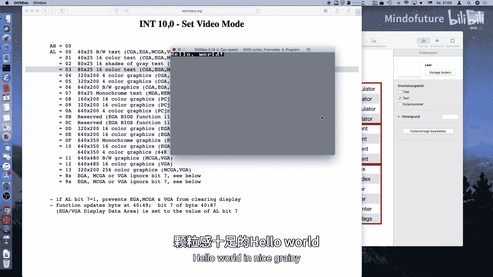
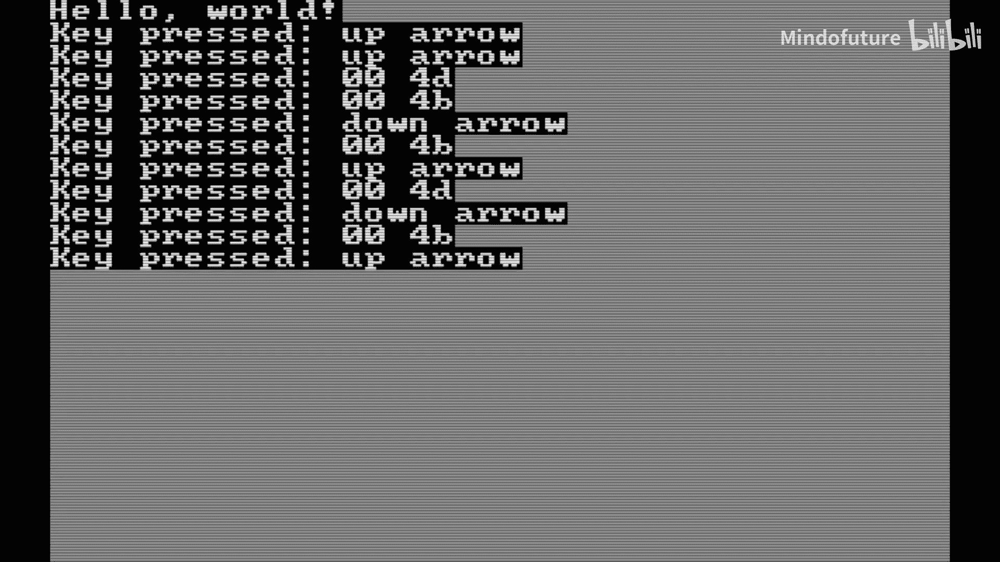
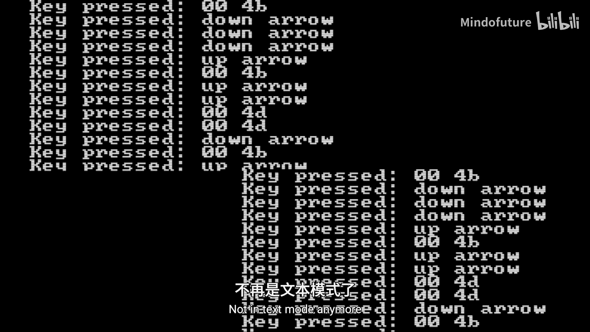
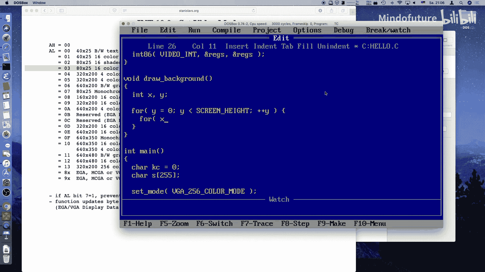
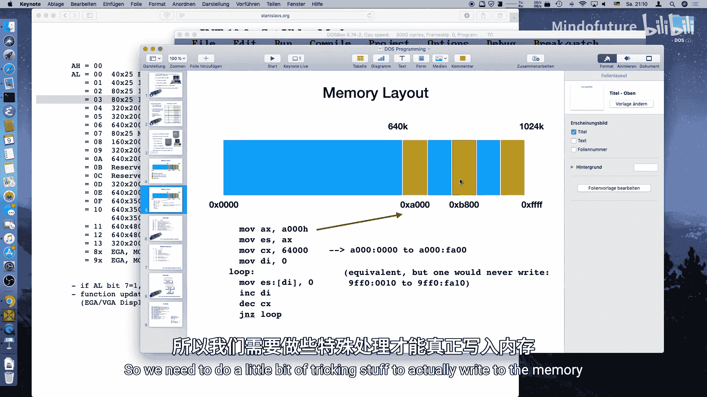
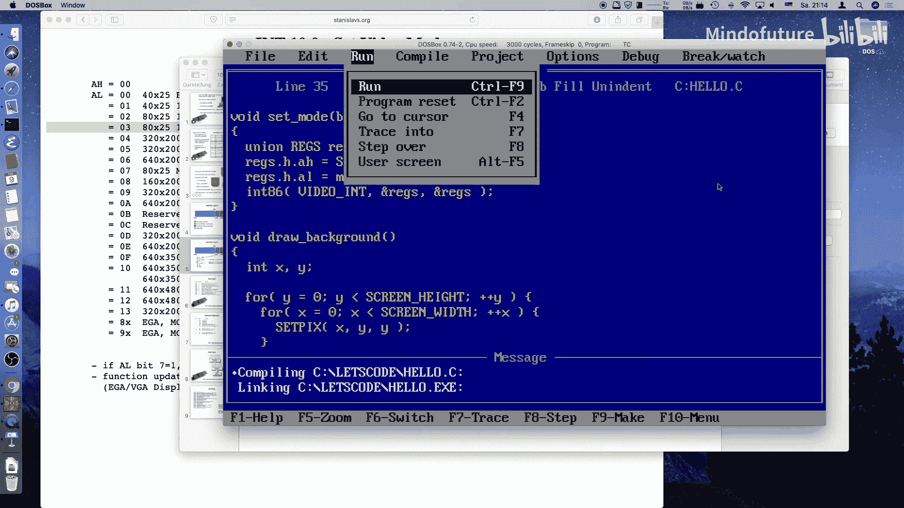
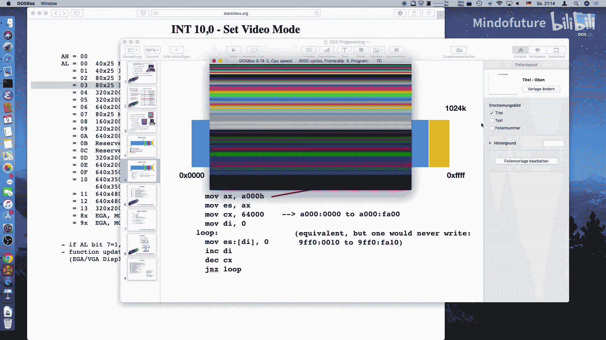
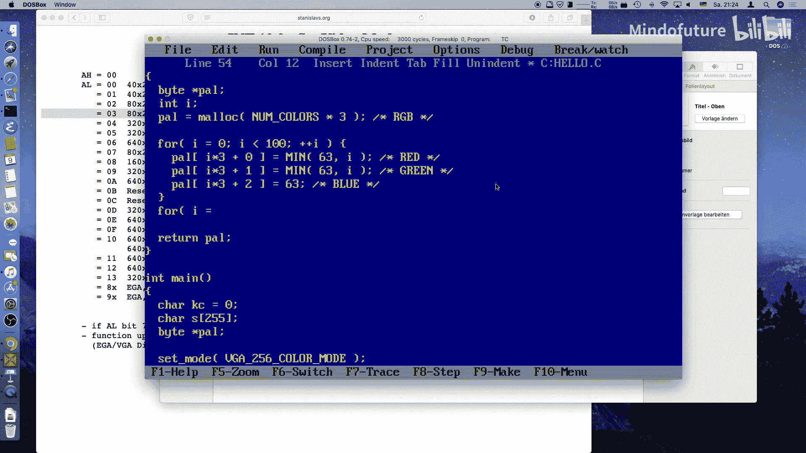
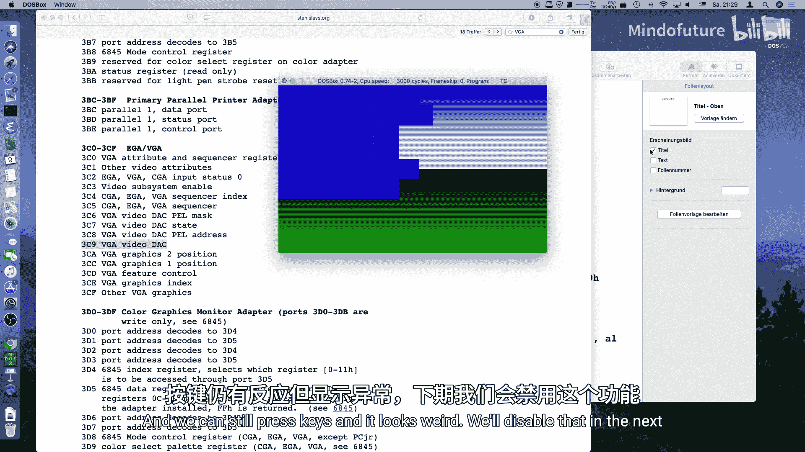
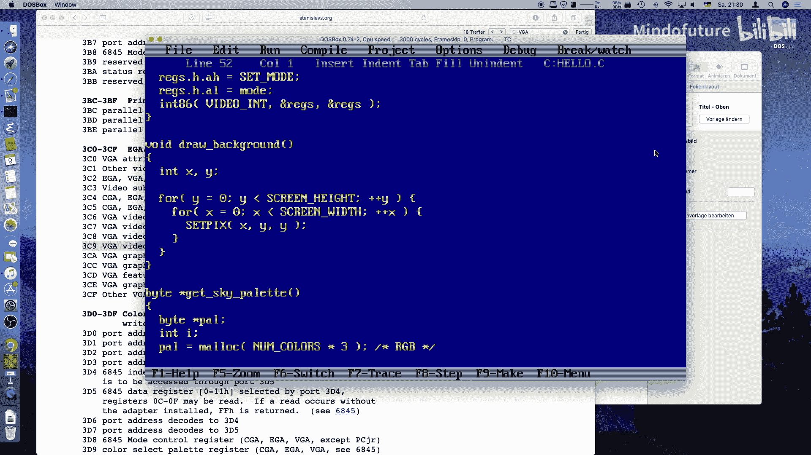

# 003：让我们编写MS-DOS 0x03 - VGA显卡

在本节课中，我们将学习如何初始化VGA显卡并绘制图形。我们将从设置视频模式开始，然后了解如何直接操作显存来绘制像素，最后学习如何设置调色板来改变屏幕颜色。

---

## 概述

上一节我们处理了文本模式下的输入输出。本节中，我们将进入图形模式。图形编程是一个复杂的主题，但我们会从基础开始。我们将学习如何初始化VGA显卡，以便能够在屏幕上绘制图形。这将是后续动画和更复杂图形的基础。

首先，我们需要理解当前程序运行在标准文本模式下。文本模式下的“窗口”边框实际上是由字符组成的，无法实现真正的彩色图形。为了制作游戏，我们需要切换到VGA的256色图形模式。

---

## 设置视频模式

要设置视频模式，我们需要调用PC的BIOS中断服务。BIOS中断是PC访问硬件的封闭源代码API。

具体来说，我们需要使用中断 `0x10`（视频服务），其功能号 `0` 用于设置视频模式。

调用中断时，需要通过CPU寄存器传递参数：
*   **AH寄存器（高字节）** 需要设置为 `0x00`（功能号：设置模式）。
*   **AL寄存器（低字节）** 需要设置为目标模式代码，例如 `0x13`（对应320x200分辨率，256色模式）。

在Turbo C中，我们可以使用 `int86` 函数和 `REGS` 联合体来操作寄存器和调用中断。

以下是设置视频模式的函数代码：

```c
#include <dos.h>

#define VIDEO_INT 0x10
#define SET_MODE 0x00
#define VGA_256_COLOR_MODE 0x13
#define TEXT_MODE 0x03

void set_video_mode(uint8_t mode) {
    union REGS regs;
    regs.h.ah = SET_MODE;
    regs.h.al = mode;
    int86(VIDEO_INT, &regs, &regs);
}
```

在程序开始时，我们调用 `set_video_mode(VGA_256_COLOR_MODE)` 进入图形模式。在程序退出前，调用 `set_video_mode(TEXT_MODE)` 切换回文本模式，这是一个好习惯。

---







## 绘制像素：理解显存布局

设置好图形模式后，下一步是绘制像素。为此，我们需要了解VGA显存在内存中的布局。

在模式 `0x13` 下，显存起始于内存地址 `0xA0000`。屏幕分辨率是320像素宽，200像素高。每个像素用一个字节表示，该字节是调色板的颜色索引（0-255），而不是直接的RGB值。



由于8086CPU使用分段内存寻址，我们需要使用**远指针**来访问这个内存区域。以下是如何定义指向VGA显存的指针：

```c
unsigned char far *vga = (unsigned char far *)0xA0000000L;
```

有了这个指针，我们就可以通过计算偏移量来设置特定坐标的像素颜色。将二维坐标转换为一维内存偏移量的公式是：

**偏移量 = y * 屏幕宽度 + x**



以下是设置和获取像素的宏：

```c
#define SCREEN_WIDTH 320
#define SCREEN_HEIGHT 200

#define SET_PIXEL(x, y, color) (vga[(y) * SCREEN_WIDTH + (x)] = (color))
#define GET_PIXEL(x, y) (vga[(y) * SCREEN_WIDTH + (x)])
```

**注意**：这些宏不会检查坐标是否越界。错误的写入可能会破坏系统，因此需要小心。

现在，我们可以编写一个函数来绘制背景。例如，绘制一个彩色渐变：

```c
void draw_background() {
    int x, y;
    for (y = 0; y < SCREEN_HEIGHT; y++) {
        for (x = 0; x < SCREEN_WIDTH; x++) {
            SET_PIXEL(x, y, y); // 使用行号作为颜色索引，产生垂直渐变
        }
    }
}
```

运行此代码，你会看到基于默认VGA调色板的彩虹渐变。

---





## 设置自定义调色板

默认的256色调色板以16种标准CGA颜色开始，然后是灰度渐变，最后是不同饱和度的彩虹色。为了获得更美观的颜色（例如蓝天绿地），我们需要自定义调色板。

VGA调色板寄存器使用6位精度（0-63）表示每个RGB通道。我们通过I/O端口来设置它们。

以下是相关的端口和步骤：
1.  **端口 `0x3C8`**：写入要修改的调色板颜色索引。
2.  **端口 `0x3C9`**：依次写入该颜色的R、G、B值（每个值范围0-63）。

在Turbo C中，使用 `outportb` 函数向I/O端口写入数据。

首先，我们创建一个函数来生成一个“天空”调色板数组：

```c
#include <alloc.h>
#define NUM_COLORS 256

uint8_t* get_sky_palette() {
    int i;
    uint8_t *pal = (uint8_t*)malloc(NUM_COLORS * 3); // 为RGB值分配内存
    if (!pal) return NULL;

    // 上半部分（天空）：蓝色渐变
    for (i = 0; i < 100; i++) {
        pal[i * 3 + 0] = i / 2;       // 红色分量
        pal[i * 3 + 1] = i / 2;       // 绿色分量
        pal[i * 3 + 2] = i;           // 蓝色分量（递增）
    }
    // 下半部分（草地）：绿色渐变
    for (i = 100; i < NUM_COLORS; i++) {
        pal[i * 3 + 0] = 10;          // 少量红色
        pal[i * 3 + 1] = 63 - (i - 100) / 4; // 绿色递减
        pal[i * 3 + 2] = 10;          // 少量蓝色
    }
    return pal;
}
```

然后，编写函数将调色板数组写入VGA硬件：

```c
#define PALETTE_INDEX 0x3C8
#define PALETTE_DATA  0x3C9

void set_palette(uint8_t *pal) {
    int i;
    outportb(PALETTE_INDEX, 0); // 从索引0开始设置
    for (i = 0; i < NUM_COLORS * 3; i++) {
        outportb(PALETTE_DATA, pal[i]); // 依次写入所有RGB值
    }
}
```



在主函数中，调用这些函数来应用新的调色板：

```c
uint8_t *my_palette = get_sky_palette();
if (my_palette) {
    set_palette(my_palette);
    free(my_palette); // 释放分配的内存
}
draw_background(); // 现在绘制背景会使用新的调色板颜色
```

运行程序，你将看到一个由自定义调色板渲染出的、带有蓝天和草地的渐变背景。

---

## 总结

本节课中我们一起学习了VGA图形编程的基础知识。

我们首先学习了如何通过BIOS中断 `0x10` 设置视频模式，从文本模式切换到320x200分辨率、256色的图形模式。

接着，我们了解了VGA显存的布局，学会了如何定义远指针来访问显存地址 `0xA0000`，并编写了宏来根据坐标设置和获取像素。



最后，我们探索了VGA调色板的工作原理。通过I/O端口 `0x3C8` 和 `0x3C9`，我们能够自定义256种颜色的RGB值，从而将默认的彩虹渐变调色板替换为更符合游戏场景的天空和草地色调。



你现在已经掌握了在MS-DOS下初始化图形模式、绘制像素和控制颜色的基本技能。下一节，我们将利用这些知识来绘制更复杂的图形并让它们动起来。