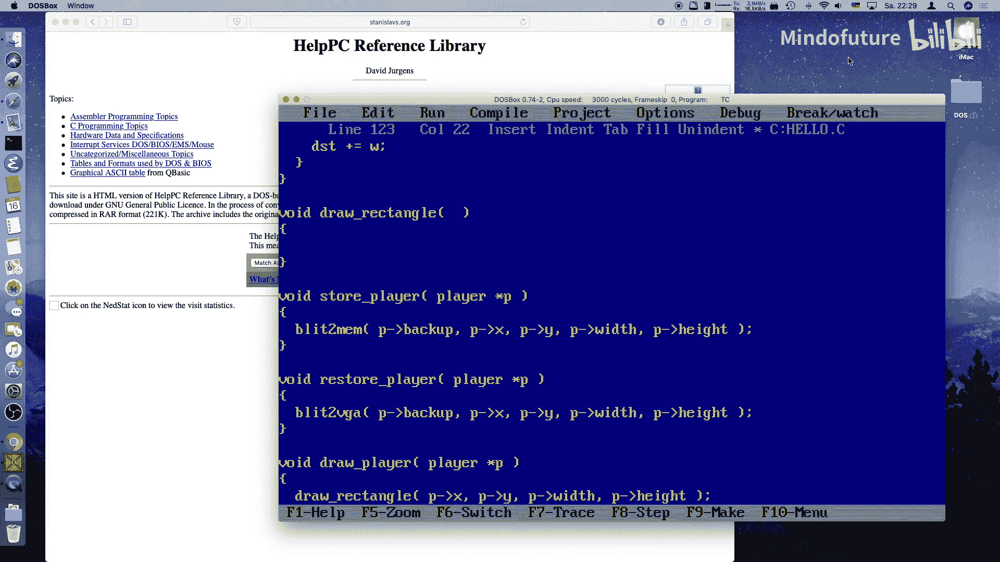
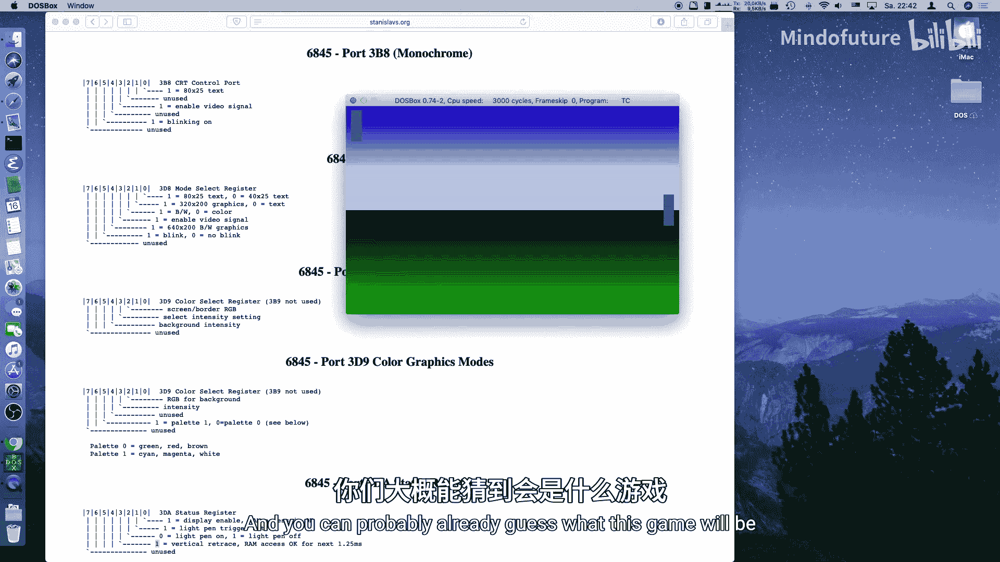

# 004：让画面动起来！

## 概述

在本节课中，我们将学习如何绘制游戏中的可移动对象（玩家挡板），并为其添加动画效果。我们将涵盖从内存中保存和恢复背景、处理玩家输入、绘制图形到屏幕，以及利用垂直回扫期消除画面闪烁等核心概念。

## 回顾与目标

上一节我们搭建了编码环境，学习了如何处理按键，以及如何初始化VGA显卡、设置调色板并绘制背景。到目前为止，这还算不上一个游戏。在本节中，我们将在屏幕上绘制一些东西。虽然内容会很简单，但我们仍有许多基础知识需要掌握。我们还将为绘制在屏幕上的内容添加动画。同样，动画会很简单，但你会学到一些基本概念，以便日后构建更复杂的游戏。

## 定义玩家状态

首先，我们需要让这个程序更像一个游戏。这个游戏将会有两个玩家。我们暂时不确定是让其中一个由电脑控制，还是让两个玩家都用键盘操作。随着课程的进行，我们会看到，这其实并不重要。

在 `main` 函数中，我们需要维护玩家的状态。我们称他们为玩家P1和P2。我们需要稍后定义玩家是什么，但让我们先说说要对它们做什么。

每个玩家都有一种颜色。为了简单起见，我将使用颜色255，因为这是调色板中的最后一个颜色。背景已经使用了前几百种颜色，所以我直接使用最后一个颜色。

每个玩家还有一些关联的几何属性：高度和宽度。假设高度为30像素，宽度为5像素（高而薄）。玩家还有一个位置，包含X坐标和Y坐标。我们将X坐标设为一个较小的值。Y坐标则设在屏幕中间：用屏幕高度除以2，再减去玩家高度的一半，这样就能精确地居中显示。

玩家还会有分数，我们稍后需要追踪，不过现在暂时不需要。

此外，当我们在屏幕上绘制东西时，会破坏它下面的原有内容。有不同的方法可以解决这个问题。我们将使用最简单的一种：保存玩家移动前其所在位置的背景，当玩家移动后再将其恢复回去。对于这类游戏，这种方法可行；对于其他游戏，可能会更复杂，需要使用不同的算法。但现在，这就够了。

我们需要分配内存来保存背景。我们需要多少字节呢？基本上就是玩家的大小（宽度乘以高度）。分配的内存最初会包含垃圾数据。为了清晰起见，我们将使用 `memset` 将分配的所有字节设置为一个预定义的值，比如颜色0。虽然我们不会使用这个初始备份，但为了安全起见，这样做可以避免屏幕上出现垃圾数据。

`memset` 很简单：给它一个指向我们想要设置的内存区域的指针（也就是 `malloc` 返回的指针），告诉它要使用的字符（我们想用字符0），然后是内存区域的大小（我们分配的大小）。

对于第二个玩家，我们只需复制整个代码块，并将 `P1` 手动替换为 `P2`。玩家的位置应该不同，我们希望把它放在右侧，所以取屏幕宽度减去玩家P2的宽度再减5，这样它就从边框开始。这应该能编译，但目前还不行，因为我们还没有定义 `player` 结构。

## 定义玩家结构

在C语言中，我们不能使用对象，但我们可以使用 `struct`（结构体）。结构体基本上类似于C++或Java中的类，但它不能包含函数，它只是变量的集合。

我们将为结构体定义一个别名：`typedef struct player`。这就是新的类型 `player`。

它包含什么？它有一个颜色（`color`），类型是 `byte`，因为VGA颜色是字节。它有一个位置（`x`, `y`），如果我们使用 `int`，这将是16位整数，足以寻址整个屏幕。它还有宽度（`width`）和高度（`height`），我们可以将其限制为字节，但这里问题不大。它有一个分数（`score`）。它还有一个备份缓冲区（`backup`），这是一个指向屏幕字节的指针。这样就完成了。

现在代码应该可以编译了，但会有两个关于未初始化变量的警告。我们定义了结构，但屏幕上还不会显示任何东西，因为我们还没有绘制。

## 设计游戏循环

我们有一个主循环，只要不按ESC键就会一直运行。我们循环检查是否有按键。但步骤是什么？在每一个绘制循环中，我们想要恢复玩家下方原有的内容。我们在这里做这件事：`restore_player(P1)` 和 `restore_player(P2)`。这样屏幕就处于一个正常的状态。

然后我们处理所有的键盘输入。处理完键盘输入后，我们可能需要更新状态并进行其他绘制。然后，我们存储玩家当前位置下的新内容：`store_player(P1)` 和 `store_player(P2)`。接着，我们根据玩家新的状态绘制内容。

这样就把所有功能分解成了相当小的、我们可以理解和推理的函数。

## 实现玩家移动逻辑

首先，我们来实现键盘处理。我们不需要处理特殊键，所以去掉其他键的处理代码。当我们按下“上”键时，我们希望玩家向上移动。基本上就是将玩家P1的 `y` 坐标减去2。然后我们需要检查是否移出了屏幕：如果 `y` 小于0，我们就设 `y` 等于0，这样就从屏幕顶部截断了。

对于“下”键，我们做类似的操作：给当前玩家的 `y` 坐标加2。如果 `y` 加上玩家高度大于屏幕高度，我们就设 `y` 等于屏幕高度减去玩家高度，这样就从底部截断了。

现在我们已经有了一些游戏逻辑：可以让玩家上下移动了。

## 实现存储与恢复函数

`store_player` 函数需要做什么？我们需要进行一些块传输（blitting）。在游戏编程中，这被称为“位块传输”（Bit Blitting）。像Amiga这样的电脑有专门的芯片来做这件事，但PC没有，所以我们将进行一些内存拷贝。

我们将为此创建一个实用函数，称之为 `blit_to_mem`，因为我们将把数据从VGA帧缓冲区传输到我们自己分配的内存（备份缓冲区）中。这个函数将目标指针（玩家的备份缓冲区）、玩家的当前坐标以及玩家的宽度和高度作为参数。

`blit_to_mem` 函数会是什么样子？它将获取一个指向目的地的指针。我们在小内存模型中，只有64K的代码和数据，所有指针都是近指针（near pointers）。但 `malloc` 可能返回远指针（far pointers）。为了安全起见，也为了稍后实现 `blit_to_vga`（这肯定需要远指针，因为VGA内存在完全不同的段中），我们将使用远指针。

函数还需要X、Y坐标以及宽度和高度。我们需要逐行扫描。我们需要计算源指针（指向VGA内存）和目的指针。源指针是VGA缓冲区指针加上Y坐标乘以屏幕宽度再加上X坐标。目的指针就是用户提供给我们的指针。

然后我们可以开始迭代，从Y到Y+高度，遍历所有扫描线。我们需要一个能处理远指针的函数。标准C的 `memcpy` 只接受 `void*` 指针，在小内存模型中就是近指针，所以这不行。但是，有一个函数叫 `movedata`，它接受段和偏移量。

我们可以这样使用 `movedata`：`movedata(source_segment, source_offset, dest_segment, dest_offset, num_bytes)`。如何获取段和偏移量？我们可以使用 `FP_SEG` 和 `FP_OFF` 宏来从远指针中提取段和偏移量。

在每次 `movedata` 调用后，我们需要递增源指针和目的指针。对于源指针（VGA），我们加上屏幕宽度以跳到下一行。对于目的指针（备份缓冲区），我们加上玩家宽度以跳到下一行。

`blit_to_vga` 函数与此类似，只是方向相反：源是备份缓冲区，目的是VGA内存。迭代逻辑和指针递增方式也相应调整。

## 实现绘制函数

`draw_player` 函数在这个游戏中很简单：我们将绘制一个矩形。它直接绘制到VGA帧缓冲区。我们调用一个 `draw_rectangle` 函数，传入坐标X和Y、宽度、高度以及颜色。

绘制矩形很简单：我们遍历从Y到Y+高度的所有扫描线，对于每一行，再遍历从X到X+宽度的所有像素。对于每个像素，我们计算其在VGA缓冲区中的地址：`VGA + y * SCREEN_WIDTH + x`，然后将颜色值存储到该地址。

## 消除画面闪烁

现在代码可以编译运行了，但画面会闪烁。闪烁发生是因为我们清除了玩家原来的位置，然后重新绘制它。屏幕刷新速度很快，我们会看到这个过程的一部分。

在老式的阴极射线管显示器上，电子束扫描屏幕，当它到达底部时，会回扫到顶部。在这段回扫期间，不显示任何图像。我们可以利用这个间隙进行所有的重绘。

我们需要查询VGA的状态寄存器。端口 `0x3DA` 有一个状态寄存器。读取这个端口并查看第3位（十六进制值 `0x08`），可以告诉我们是否处于垂直回扫期。当这一位为1时，表示正在回扫。

我们将编写一个 `wait_for_retrace` 函数。它首先循环，直到回扫位为0（确保我们不在回扫中），然后循环直到回扫位变为1（等待回扫开始）。一旦我们退出这个循环，我们就知道有大约1.25毫秒的安全时间可以进行绘制。

我们在每个绘制循环的开始调用 `wait_for_retrace` 函数。这样，所有的存储、恢复和绘制操作都在垂直回扫期内完成，从而消除了闪烁。

## 调整与优化

现在玩家可以移动了，但可能移动得太慢。我们可以增加每次按键移动的像素数（例如从2改为4）。我们也可以调整玩家的宽度，让它更容易看到。颜色也可以从默认值进行更改，这可以通过修改调色板设置函数来实现。

## 总结

在本节课中，我们一起学习了如何为MS-DOS游戏创建可移动的玩家对象。我们定义了玩家的数据结构，实现了从VGA内存到备份缓冲区的块传输（`blit_to_mem`）以及反向传输（`blit_to_vga`）。我们编写了绘制矩形的基本函数，并处理了键盘输入来控制玩家移动。最重要的是，我们通过利用垂直回扫期进行绘制，成功消除了屏幕闪烁问题。现在，我们有了一个可以上下平滑移动的玩家挡板，为下一节课实现真正的游戏逻辑（如球和计分）打下了基础。