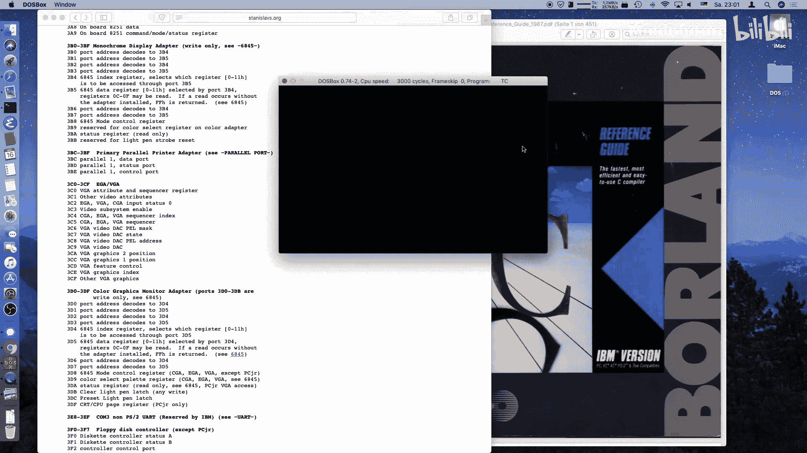

# 006：VGA调色板技巧与代码重构 🎮

## 概述
在本节课中，我们将学习如何为我们的MS-DOS游戏添加更平滑的视觉效果，特别是通过操作VGA调色板来实现淡入淡出效果。同时，我们还将对现有代码进行重构，使其结构更清晰、更易于维护。

上一节我们实现了双人游戏的基本框架，但视觉效果和代码结构仍有提升空间。本节中我们来看看如何优化它们。

---

## 淡入效果实现 🎨

首先，我们希望游戏启动时屏幕能平滑地淡入，而不是突然出现。这可以通过在绘制任何内容之前，先将调色板设置为全黑来实现。

以下是实现淡入效果的核心步骤：

1.  在绘制背景前，将调色板所有颜色值设置为0（黑色）。
2.  绘制背景图像。
3.  逐步将调色板颜色值从0增加到目标值，实现淡入。

为了实现这个效果，我们需要一个自定义的`fade_in_palette`函数。其核心逻辑是循环递增每个颜色分量，直到达到目标值。

```c
void fade_in_palette(unsigned char* target_pal) {
    unsigned char current_pal[768];
    memset(current_pal, 0, sizeof(current_pal)); // 初始化为全黑

    for (int step = 0; step < 64; step++) {
        wait_for_retrace(); // 同步到垂直刷新，控制速度
        outportb(0x3C8, 0); // 告诉VGA从颜色索引0开始写入

        for (int i = 0; i < 768; i++) {
            if (current_pal[i] < target_pal[i]) {
                current_pal[i]++; // 递增当前颜色值
            }
            outportb(0x3C9, current_pal[i]); // 写入VGA调色板寄存器
        }
    }
}
```

---

## 淡出效果实现 🌒



同样地，在游戏退出时，我们希望屏幕能平滑地淡出到黑色。淡出是淡入的逆过程。

以下是实现淡出效果的核心步骤：

1.  从当前调色板状态开始。
2.  逐步将调色板所有颜色值递减至0。

我们创建`fade_out_palette`函数，其逻辑与淡入相反。

```c
void fade_out_palette(unsigned char* current_pal) {
    for (int step = 0; step < 64; step++) {
        wait_for_retrace();
        outportb(0x3C8, 0);

        for (int i = 0; i < 768; i++) {
            if (current_pal[i] > 0) {
                current_pal[i]--; // 递减当前颜色值
            }
            outportb(0x3C9, current_pal[i]);
        }
    }
}
```

通过这两个函数，我们实现了平滑的视觉过渡，显著提升了游戏的观感。

---

## 代码重构：分离游戏逻辑 🔧

目前，所有游戏逻辑都集中在`main`函数中，导致其冗长且难以管理。为了提高代码的可读性和可维护性，我们将游戏逻辑提取到一个独立的函数中。

重构的目标是创建一个`handle_game`函数，它负责所有游戏状态的管理和更新。

以下是重构的核心思路：

1.  **分离职责**：`main`函数负责程序流程（如模式设置、调色板操作、调用游戏循环），`handle_game`函数负责具体的游戏逻辑（玩家移动、球体运动、胜负判断）。
2.  **状态保持**：使用`static`关键字确保游戏状态（如玩家位置、分数）在多次调用`handle_game`时得以保留。
3.  **明确返回值**：`handle_game`函数通过返回值来告知主程序游戏状态（例如，哪个玩家获胜、是否退出）。

重构后的`main`函数结构如下：

```c
void main() {
    // 1. 初始化图形模式
    set_video_mode(0x13);
    // 2. 保存原始调色板并设置为黑色
    unsigned char original_palette[768];
    get_palette(original_palette);
    set_black_palette();
    // 3. 绘制背景
    draw_background();
    // 4. 淡入到原始调色板
    fade_in_palette(original_palette);

    int game_result = 0;
    // 5. 游戏主循环
    do {
        wait_for_retrace(); // 控制帧率
        game_result = handle_game(game_result == 0); // 处理游戏逻辑，参数表示是否是新游戏
    } while (game_result == 0); // 当游戏未结束且未退出时继续

    // 6. 游戏结束，淡出并恢复文本模式
    fade_out_palette(original_palette);
    set_video_mode(0x03);
}
```

而`handle_game`函数则封装了之前`main`函数中的游戏循环、输入检测、球拍和球的运动逻辑。通过返回值（如0-进行中，1-玩家1胜，2-玩家2胜，3-退出）来与主循环通信。

---

## 总结

本节课中我们一起学习了两个重要的技巧：
1.  **VGA调色板动画**：通过直接读写VGA颜色寄存器，实现了高效的屏幕淡入和淡出效果，极大地改善了游戏的视觉体验。
2.  **代码重构**：我们将庞杂的`main`函数拆分为职责清晰的模块，将游戏逻辑独立到`handle_game`函数中。这使得代码结构更清晰，为后续添加计分、游戏结束判定等功能打下了良好的基础。

现在，我们的游戏不仅看起来更专业，代码也更容易扩展和维护。在下一节课中，我们将为游戏添加计分系统和简单的游戏结束画面，让它成为一个更完整的作品。