# 007：游戏结束！

在本节课中，我们将完成之前开始的游戏项目。我们将添加游戏结束屏幕和胜利条件，并学习如何在图形模式下打印文本。最后，我们会实现一个带有动画效果的胜利/结束界面。

---

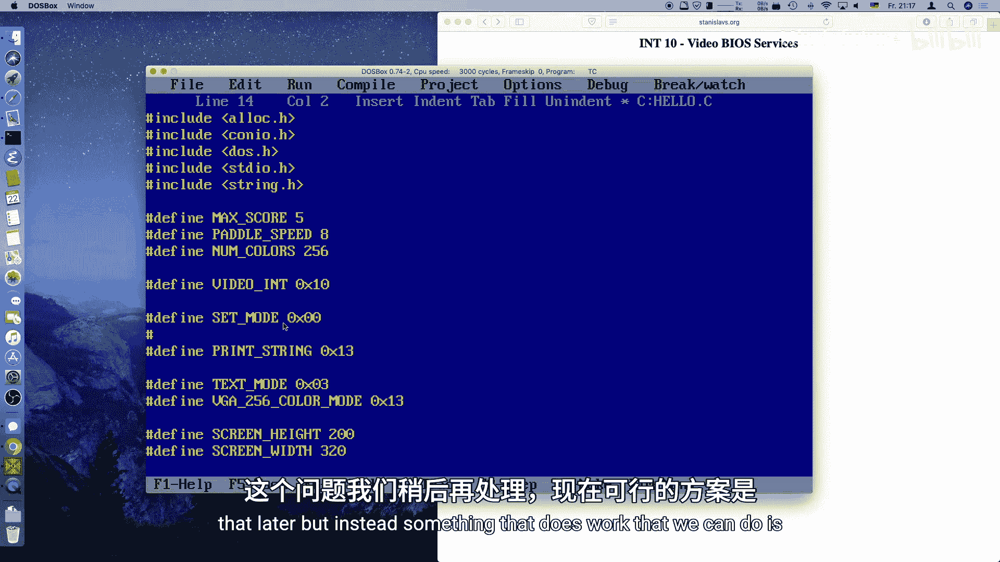

## 概述与准备工作

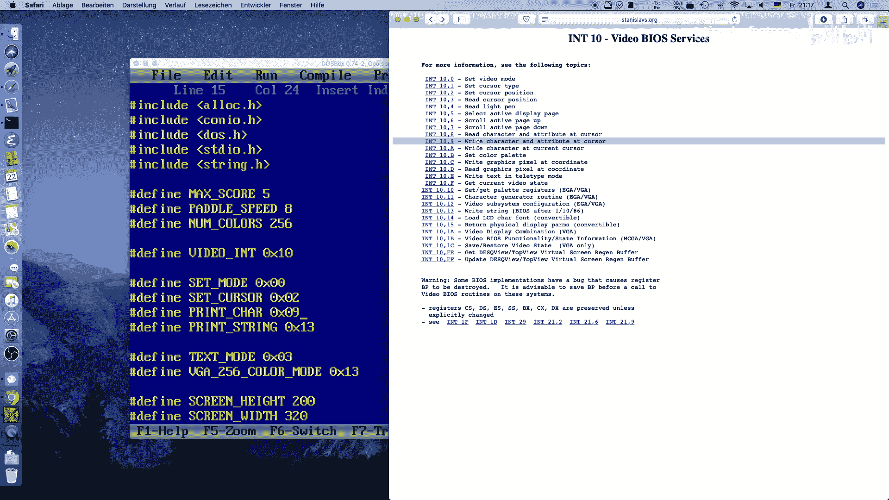

上一节我们实现了游戏的核心循环和动画。本节中，我们来看看如何判定游戏结束并向玩家展示结果。

首先，我们需要定义一些常量并完善视频模式设置。

### 定义最大分数

我们设定一个最大分数，当玩家达到这个分数时，将触发游戏结束。

```c
#define MAX_SCORE 5
```

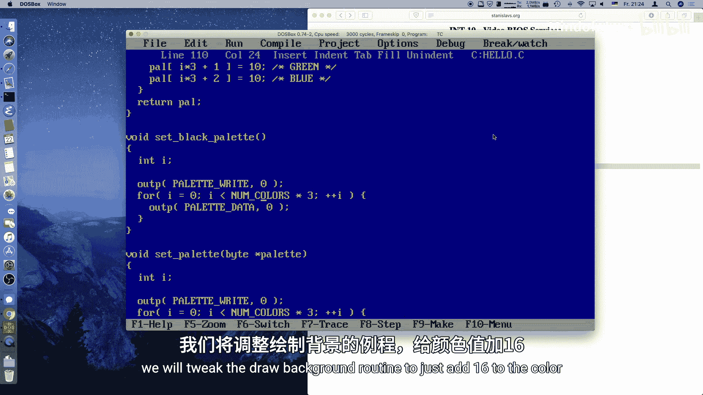

### 完善调色板处理

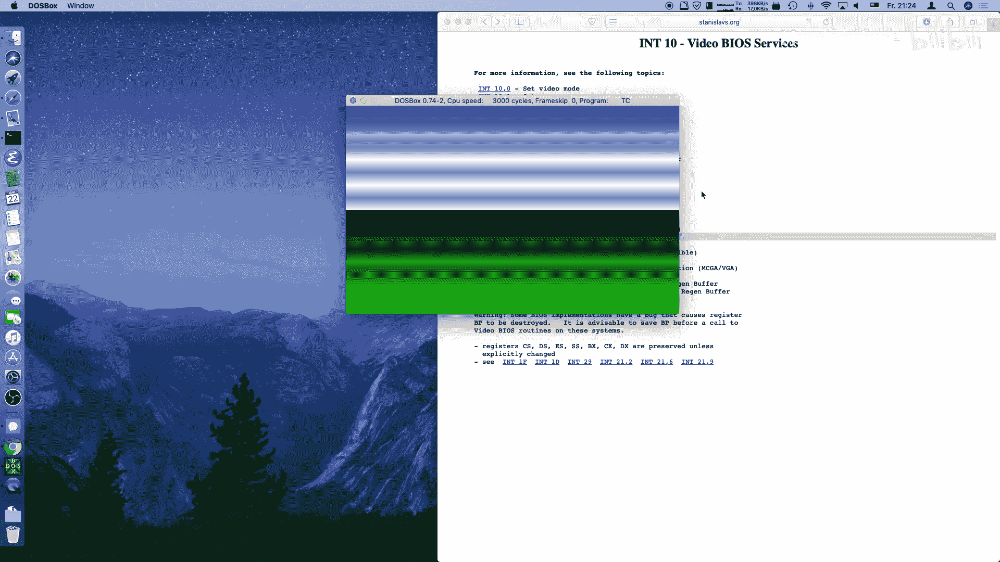

为了在文本打印时使用标准的VGA颜色，我们需要读取并保留VGA卡上默认的前16种颜色，而不是覆盖它们。

```c
// 读取默认的VGA前16色到我们的调色板缓冲区
for(i = 0; i < 16; i++) {
    outportb(PALETTE_READ_INDEX, i); // 设置要读取的颜色索引
    palette[i*3]   = inportb(PALETTE_DATA); // 读取红色分量
    palette[i*3+1] = inportb(PALETTE_DATA); // 读取绿色分量
    palette[i*3+2] = inportb(PALETTE_DATA); // 读取蓝色分量
}
// 我们自己的游戏颜色从索引16开始设置
for(i = 16; i < 256; i++) {
    // ... 设置游戏颜色
}
```

同时，修改绘制背景的函数，使其从颜色索引16开始绘制，以避开前16种系统颜色。

---

## 在图形模式下打印文本

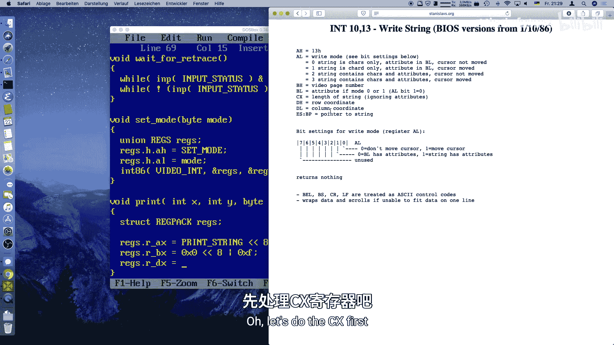

在MS-DOS图形模式下，标准的C库`printf`函数会导致屏幕滚动，并不适合在固定位置显示信息。我们需要使用BIOS中断来手动控制光标和字符打印。

以下是实现此功能的两个关键BIOS函数：
*   **设置光标位置**：中断`0x10`，功能`0x02`。
*   **写字符及属性**：中断`0x10`，功能`0x09`。

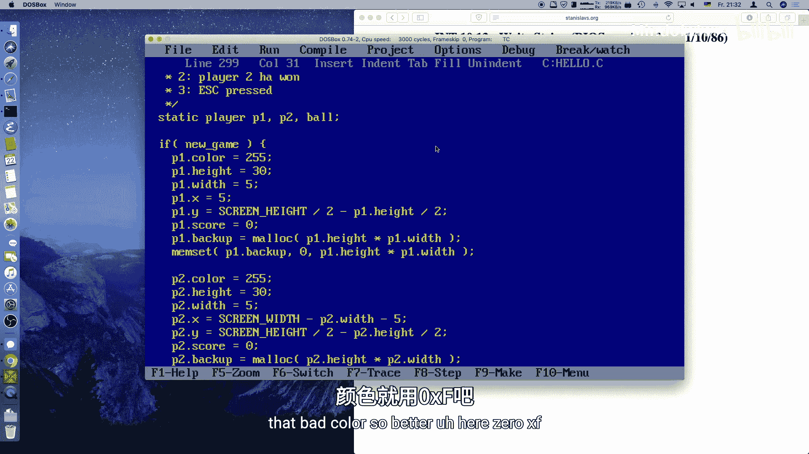

### 实现打印函数

由于直接使用BIOS的“写字符串”功能（功能`0x13`）在Turbo C环境下会遇到寄存器冲突问题，我们选择逐个字符打印的方式。

以下是`print_text`函数的核心逻辑：

```c
void print_text(int x, int y, char color, char far *str) {
    int i;
    int len = strlen(str);
    for(i = 0; i < len; i++) {
        // 1. 设置光标位置 (AH=0x02)
        union REGS r;
        r.h.ah = 0x02; // 功能号：设置光标位置
        r.h.bh = 0x00; // 显示页码（图形模式为0）
        r.h.dh = y;    // 行 (Y坐标)
        r.h.dl = x + i;// 列 (X坐标，随字符递增)
        int86(0x10, &r, &r);

        // 2. 写字符及属性 (AH=0x09)
        r.h.ah = 0x09;       // 功能号：写字符及属性
        r.h.al = str[i];     // 要打印的字符
        r.h.bh = 0x00;       // 显示页码
        r.h.bl = color;      // 字符属性（前景色）
        r.x.cx = 1;          // 重复次数（打印1个字符）
        int86(0x10, &r, &r);
    }
}
```

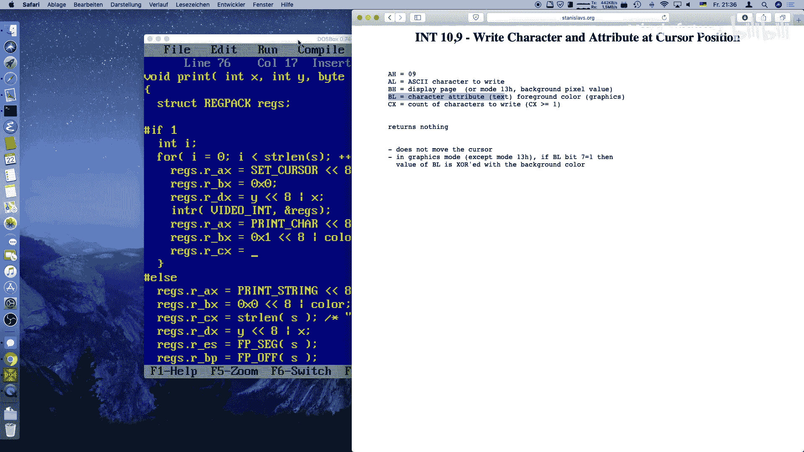

### 在游戏中显示分数

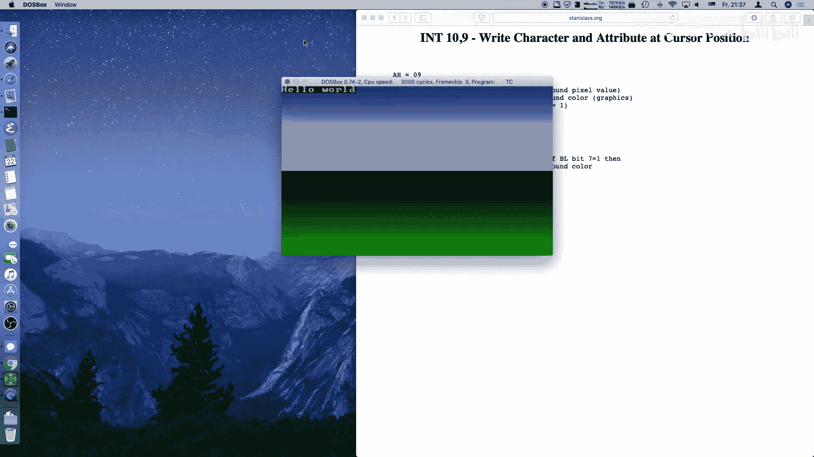

现在，我们可以在游戏循环中使用这个函数来显示双方玩家的分数。

首先，创建一个格式化的字符串：

```c
char buffer[256];
sprintf(buffer, "Player 1: %03d                  Player 2: %03d", score_p1, score_p2);
print_text(0, 0, 0x0F, buffer); // 0x0F是亮白色
```

然后，在`handle_game`函数中，当分数更新时（例如球出界后），调用上述代码刷新分数显示。为了避免每帧都调用缓慢的BIOS中断，我们只在分数实际发生变化时才更新文本。

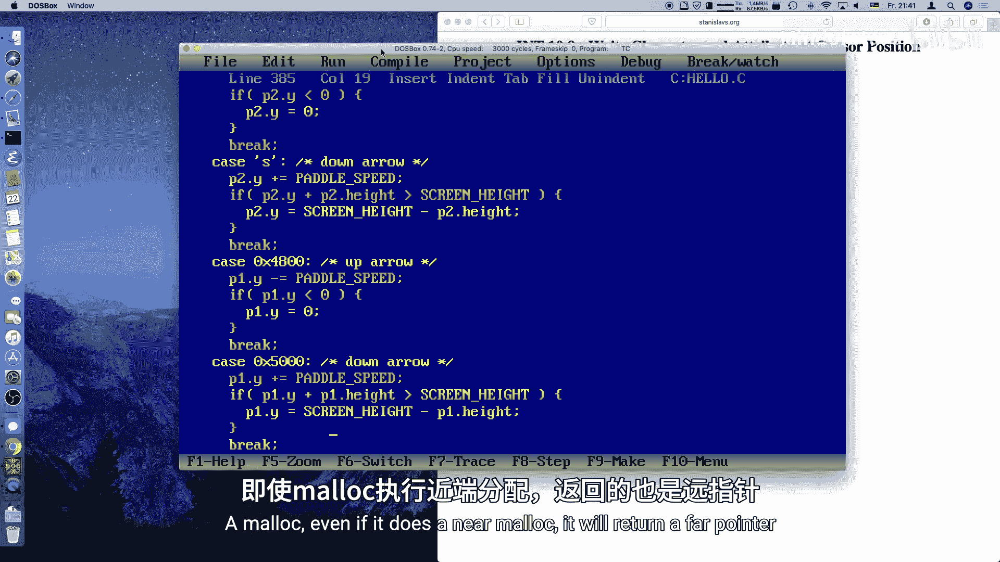

---

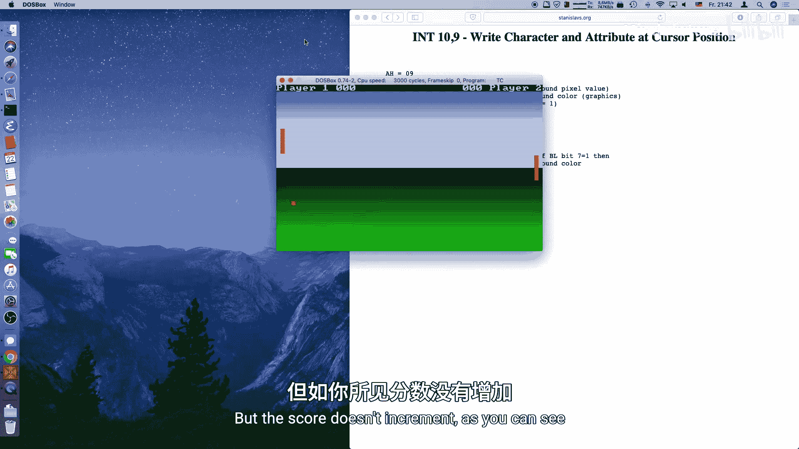

## 实现游戏结束逻辑

我们需要在`handle_ball`函数中检测分数是否达到了`MAX_SCORE`。

### 检测胜利条件

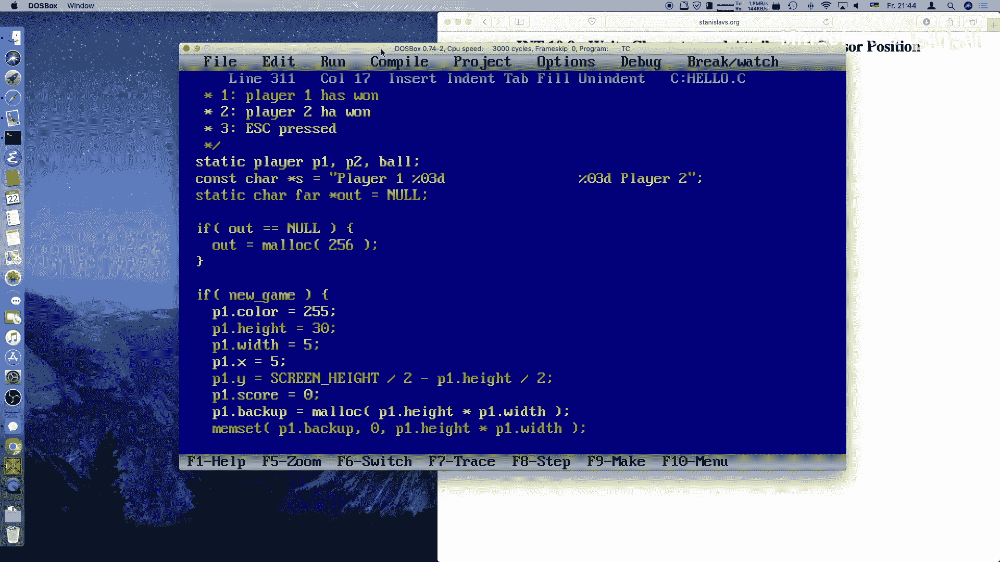

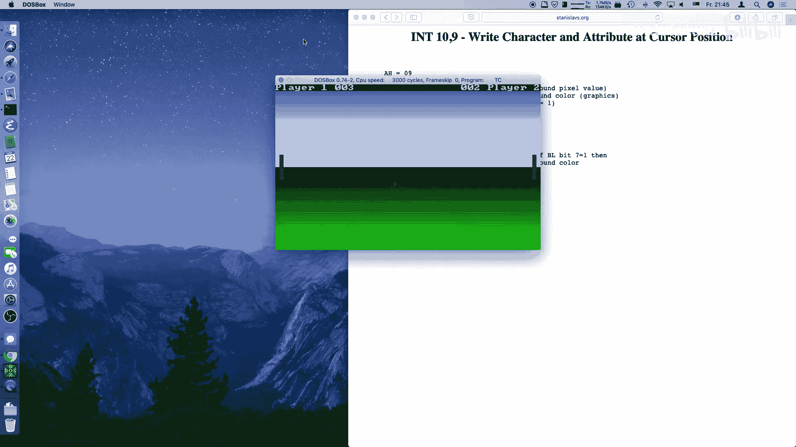

在球出界并加分后，加入胜利条件检查：

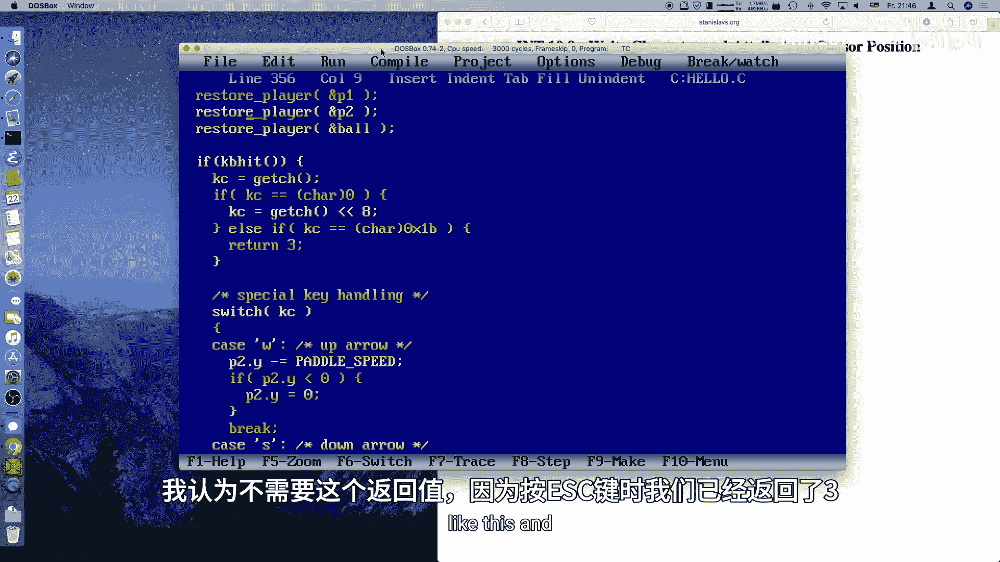

```c
int handle_ball(...) {
    // ... 原有的球移动和碰撞逻辑 ...

    // 如果球出界，给对应玩家加分
    if (ball_x <= 0) {
        score_p2++;
        // 检查玩家2是否获胜
        if (score_p2 >= MAX_SCORE) {
            return 2; // 返回胜利者代码：2
        }
        reset_ball();
    } else if (ball_x >= SCREEN_WIDTH) {
        score_p1++;
        // 检查玩家1是否获胜
        if (score_p1 >= MAX_SCORE) {
            return 1; // 返回胜利者代码：1
        }
        reset_ball();
    }
    return 0; // 游戏继续
}
```


### 创建游戏结束处理函数

在主游戏循环中，当`handle_ball`返回非零值（1或2）时，表示游戏结束。我们调用一个专门的`handle_game_over`函数。

这个函数将：
1.  清屏或保持当前画面。
2.  在屏幕中央打印获胜者信息。
3.  实现一个颜色闪烁的动画效果。
4.  等待玩家按下空格键后退出。

以下是`handle_game_over`函数的核心部分：

```c
void handle_game_over(int winner) {
    char *msg1, *msg2;
    char buffer[256];
    int i = 0, dir = 1; // i用于控制颜色强度，dir控制变化方向

    // 根据获胜者设置消息
    if (winner == 1) {
        msg1 = "Congratulations Player 1!";
    } else {
        msg1 = "Congratulations Player 2!";
    }
    msg2 = "Press SPACE to exit";

    // 主循环：显示消息并等待按键
    while(1) {
        // 打印消息
        print_text(11, 10, i, msg1); // 使用变化的颜色i
        print_text(11, 11, 0x0F, msg2); // 第二行固定为白色

        // 简单的颜色脉冲动画
        i += dir;
        if (i > 62) dir = -1; // 达到最亮，开始变暗
        if (i < 1)  dir = 1;  // 达到最暗，开始变亮

        // 更新调色板中“白色”的颜色值以实现闪烁
        // 这里简化处理，实际是修改打印颜色对应的调色板条目
        // wait_for_retrace(); // 等待垂直回扫以平滑动画

        // 检查按键
        if (kbhit()) {
            if (getch() == ' ') { // 如果按下空格键
                break; // 退出循环
            }
        }
    }
}
```

---

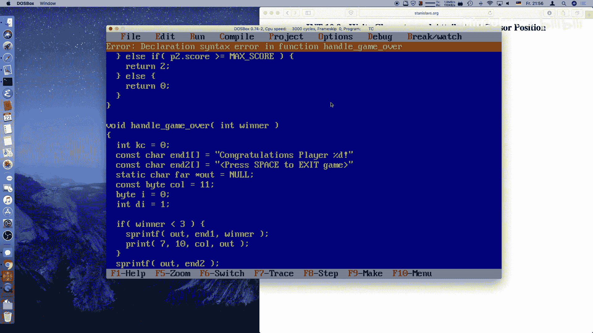

## 总结

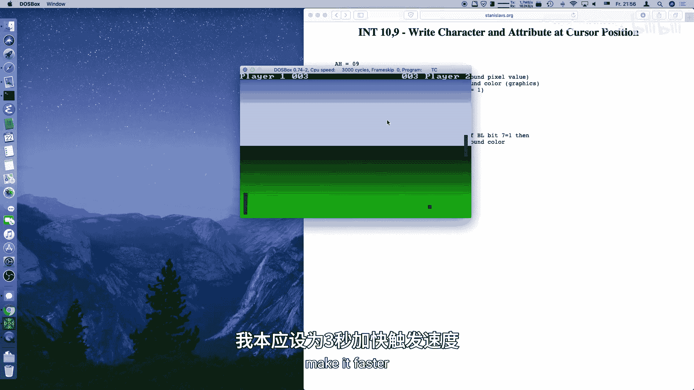

本节课中我们一起学习了如何为MS-DOS图形模式游戏画上句号。我们主要完成了以下工作：

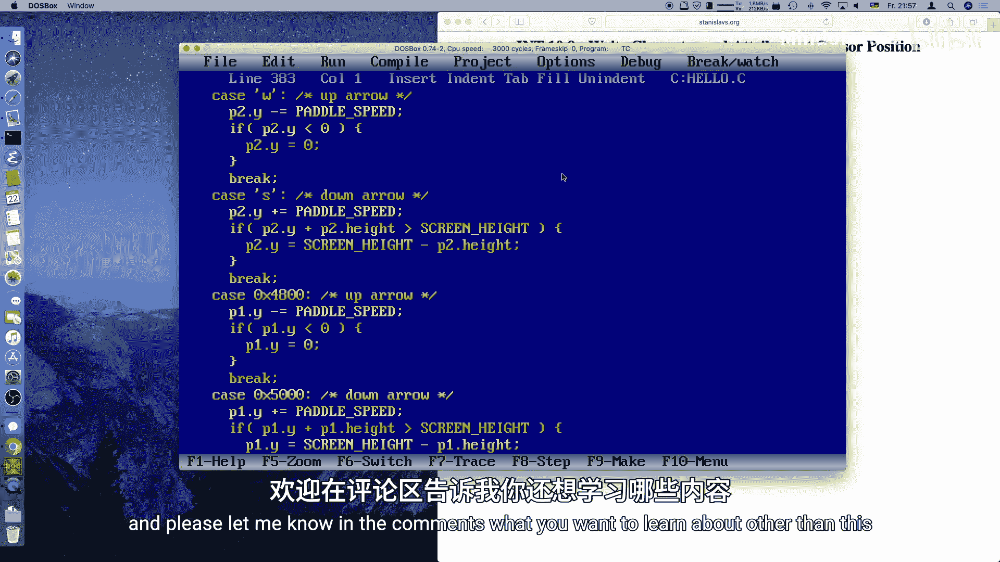

1.  **完善了系统集成**：通过读取和保留VGA默认调色板，使系统文本颜色与游戏颜色和谐共存。
2.  **实现了图形模式文本输出**：利用BIOS中断`0x10`的功能`0x02`和`0x09`，我们绕过了标准C库的限制，实现了在像素图形屏幕上精确打印字符的功能。
3.  **建立了游戏状态显示**：使用`sprintf`和自定义的`print_text`函数，在屏幕顶部创建了一个实时更新的分数状态栏。
4.  **设计了游戏结束流程**：通过检测`MAX_SCORE`来判定胜负，并引入了一个独立的`handle_game_over`函数来展示获胜信息。该函数还包含了一个简单的颜色脉冲动画，并等待用户输入后优雅退出。

通过这个完整的项目，我们已经掌握了MS-DOS下使用C语言和BIOS中断进行图形编程、输入处理和动画制作的基本流程。你可以在此基础上，添加更多的功能，如音效、更复杂的图形、鼠标支持或双缓冲技术来创造更流畅、更丰富的游戏体验。