# 008：使用鼠标

## 概述

在本节课中，我们将学习如何在MS-DOS环境下，通过汇编语言和中断调用来控制鼠标。我们将编写一个简单的绘图程序，实现鼠标光标的显示、隐藏、位置获取以及通过鼠标按键进行绘图的功能。

---

## 鼠标基础与初始化

上一节我们完成了图形模式的设置和键盘输入处理。本节中，我们来看看如何与鼠标进行交互。

鼠标是PC发展后期的产物。最初的PC于1981年诞生，而鼠标在几年后才出现，并且存在多种标准。其中最广泛使用的是微软鼠标标准及其驱动程序。该驱动程序提供了一个API，类似于我们之前使用的图形API，通过中断 `0x33` 来调用各种鼠标功能。

今天，我们主要使用其中的三个功能：
*   **功能0**：重置鼠标并检测驱动程序是否安装。
*   **功能1**：显示鼠标光标。
*   **功能2**：隐藏鼠标光标。
*   **功能3**：获取鼠标位置和按键状态。

首先，我们定义一些常量来表示这些中断和功能。

```assembly
; 鼠标中断号
MOUSE_INT equ 0x33

; 鼠标功能号
MOUSE_INIT equ 0x00
MOUSE_SHOW equ 0x01
MOUSE_HIDE equ 0x02
MOUSE_GET_STATUS equ 0x03
```

接下来，我们编写初始化鼠标的函数 `init_mouse`。这个函数会调用中断 `0x33` 的功能0。

```c
int init_mouse() {
    union REGS in, out;
    in.x.ax = MOUSE_INIT; // 设置功能号：初始化/重置
    int86(MOUSE_INT, &in, &out); // 调用中断 0x33
    return (out.x.ax == 0xFFFF); // 如果鼠标存在，AX 寄存器返回 0xFFFF
}
```

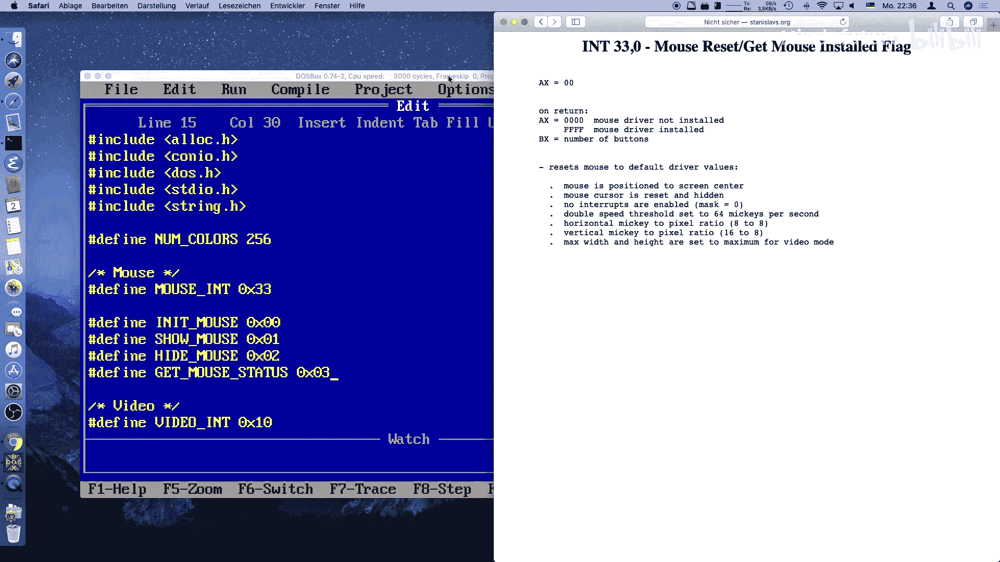

在主函数中，我们可以调用 `init_mouse` 来检查鼠标是否存在。如果不存在，则打印错误信息并退出。

```c
if (!init_mouse()) {
    printf("Mouse not found.\n");
    return 1;
}
```

---

## 显示与隐藏鼠标光标

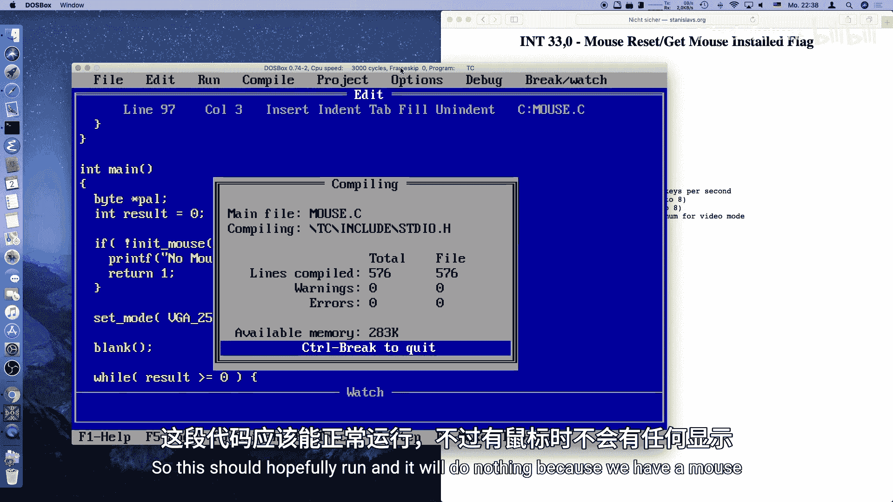

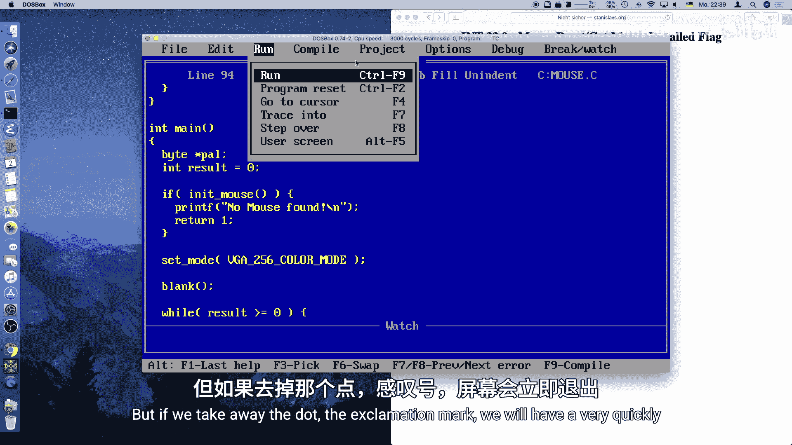

成功初始化鼠标后，我们就可以控制光标的显示了。以下是显示和隐藏鼠标光标的函数。

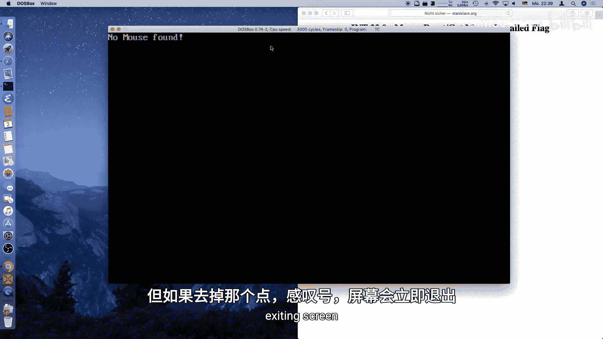

显示鼠标光标只需调用功能1。

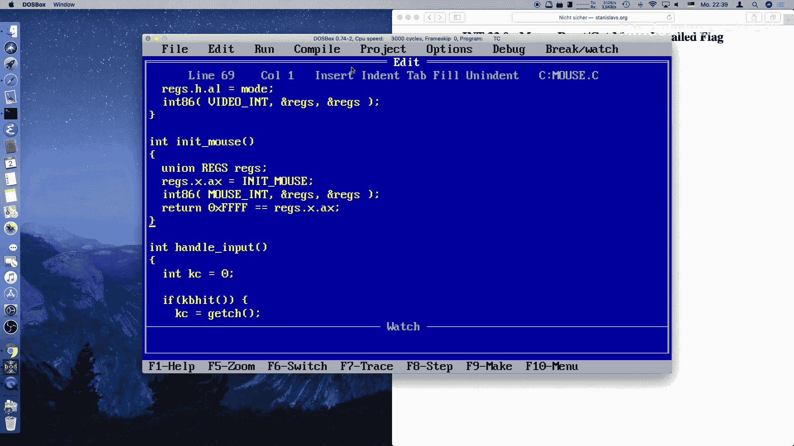

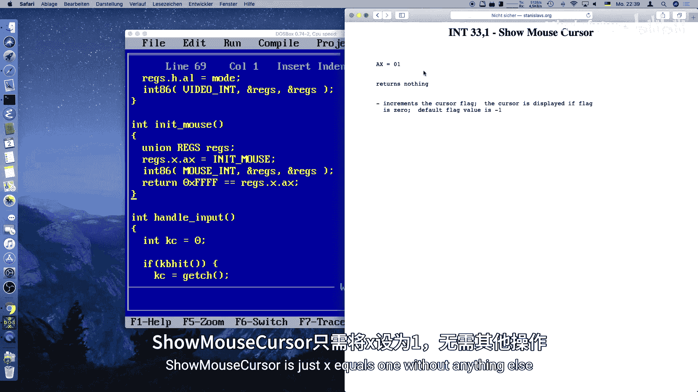

```c
void show_mouse() {
    union REGS in;
    in.x.ax = MOUSE_SHOW; // 设置功能号：显示光标
    int86(MOUSE_INT, &in, NULL);
}
```

隐藏鼠标光标则调用功能2。

```c
void hide_mouse() {
    union REGS in;
    in.x.ax = MOUSE_HIDE; // 设置功能号：隐藏光标
    int86(MOUSE_INT, &in, NULL);
}
```

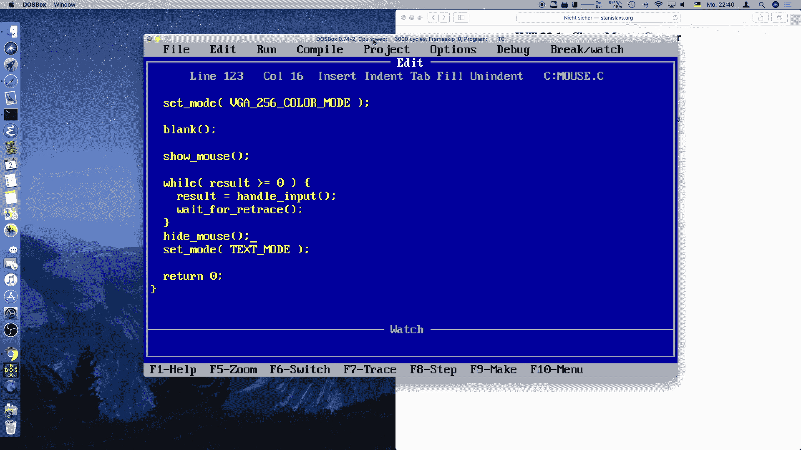

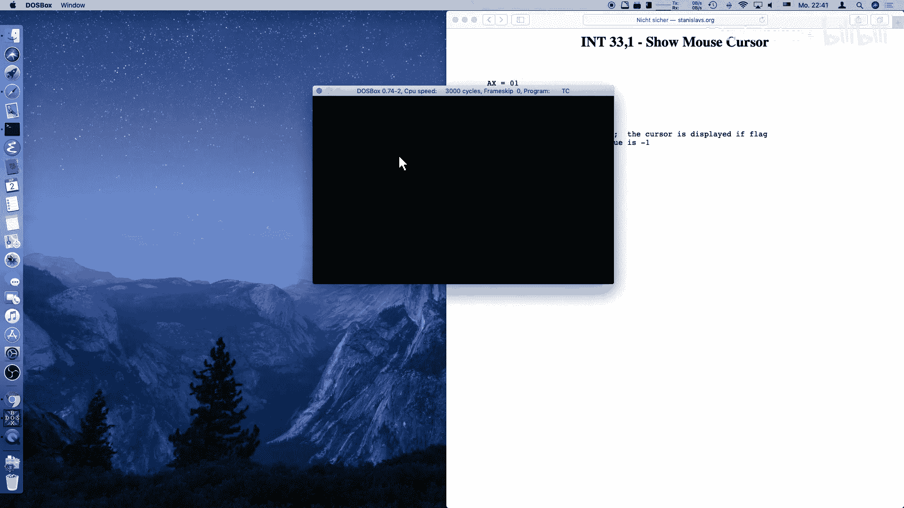

在主循环开始前调用 `show_mouse()`，并在程序结束返回文本模式前调用 `hide_mouse()`，就能看到系统默认的鼠标光标在图形界面中移动了。

---


## 获取鼠标状态与坐标

现在我们已经可以显示鼠标了，接下来要实现有用的功能：获取鼠标的位置和按键状态，并用它来绘图。

我们将编写 `get_mouse` 函数，它通过中断 `0x33` 的功能3来获取信息。

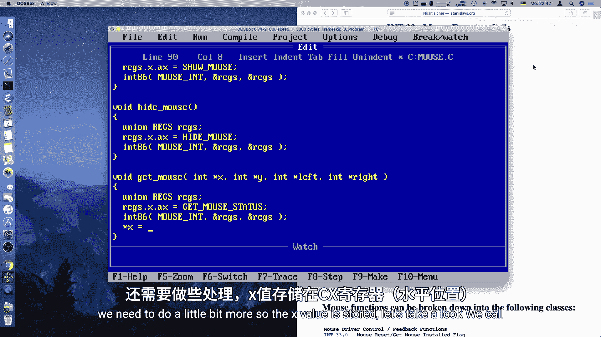

```c
void get_mouse(int *x, int *y, int *left, int *right) {
    union REGS in, out;
    in.x.ax = MOUSE_GET_STATUS; // 设置功能号：获取状态
    int86(MOUSE_INT, &in, &out);

    // CX 寄存器包含 X 坐标 (范围 0-639)
    // 我们的图形模式是 320x200，所以需要除以2
    *x = out.x.cx / 2;
    // DX 寄存器包含 Y 坐标 (范围 0-199)
    *y = out.x.dx;
    // BX 寄存器的第0位是左键状态，第1位是右键状态
    *left = out.x.bx & 1;
    *right = out.x.bx & 2;
}
```

**注意**：标准鼠标接口的坐标范围固定为640x200（CGA分辨率）。即使在我们的320x200模式下，返回的X坐标仍然是0-639，因此需要除以2来适配屏幕。

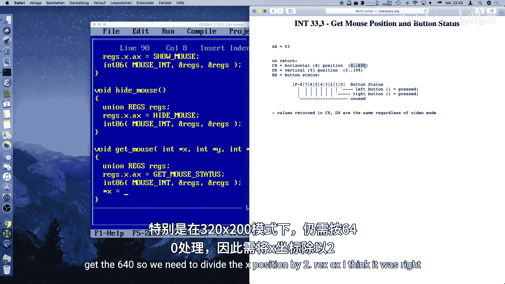

---

## 实现一个简单的绘图程序

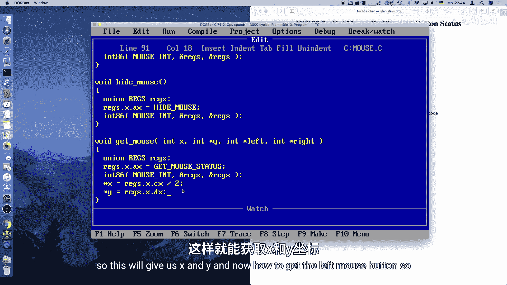

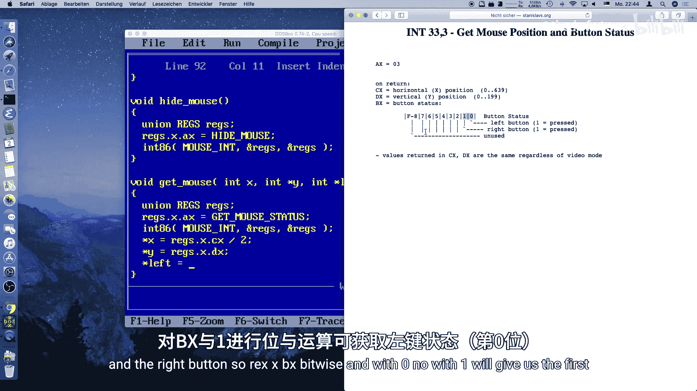

有了获取鼠标状态的能力，我们可以创建一个简单的绘图程序。思路是：按住左键时在光标位置画点（设置为白色），按住右键时则擦除（设置为黑色）。

我们定义两个颜色常量，并设置一个变量来跟踪当前绘图颜色。

```c
#define BLACK 0
#define WHITE 15 // 默认调色板中的白色
byte current_color = WHITE;
```

在主循环中，我们不断获取鼠标状态，并根据按键情况绘图。

```c
int mouse_x, mouse_y, left_button, right_button;
get_mouse(&mouse_x, &mouse_y, &left_button, &right_button);

if (left_button) {
    // 在 (mouse_x, mouse_y) 位置用 current_color 画一个点
    set_pixel(mouse_x, mouse_y, current_color);
}
if (right_button) {
    // 在 (mouse_x, mouse_y) 位置用黑色画一个点（即擦除）
    set_pixel(mouse_x, mouse_y, BLACK);
}
```

但是，这里会遇到一个问题：鼠标驱动程序会保存光标下方的图像，绘制光标，移动时再恢复。如果我们直接在屏幕上画点，这个点很快会被鼠标光标恢复操作覆盖掉。

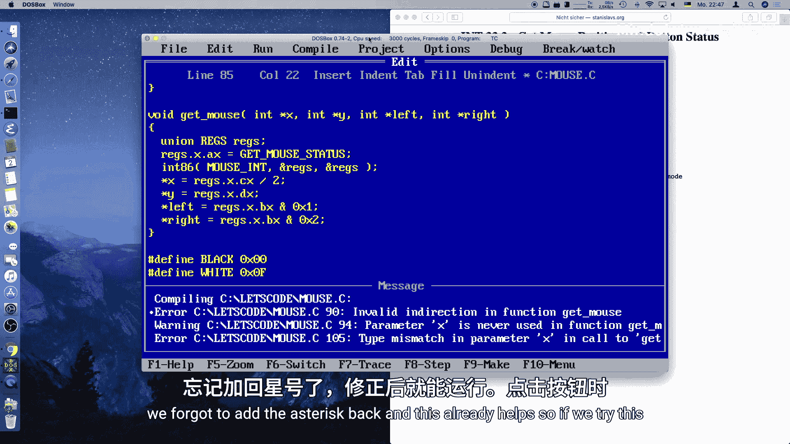

解决方案是：在画点之前**隐藏**鼠标光标，画点之后立即**显示**它。

```c
if (left_button) {
    hide_mouse(); // 隐藏光标，防止绘图被覆盖
    set_pixel(mouse_x, mouse_y, current_color);
    show_mouse(); // 立即重新显示光标
}
// 对右键擦除操作也采用同样的方法
```

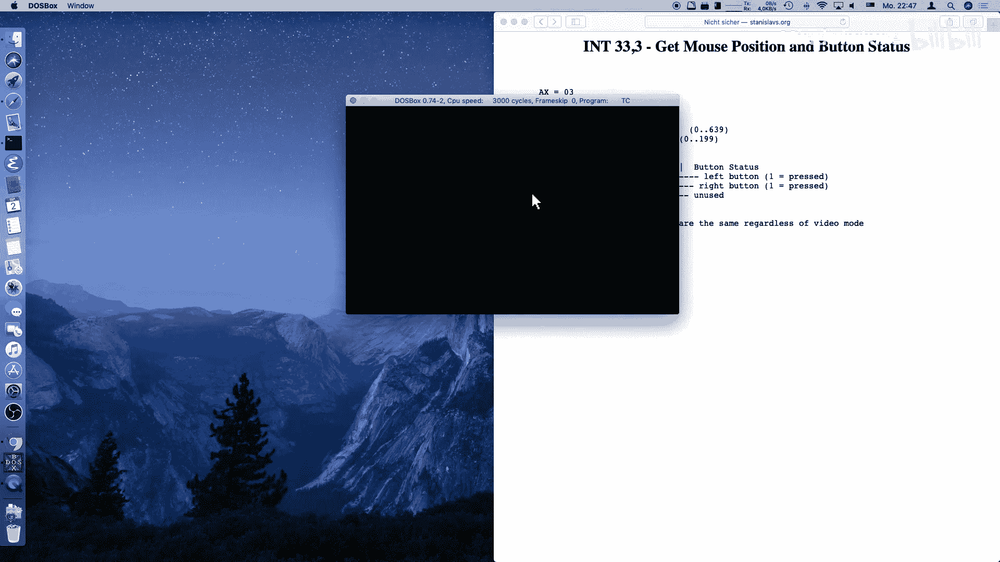

这样，我们就能流畅地使用鼠标进行绘图了。

---

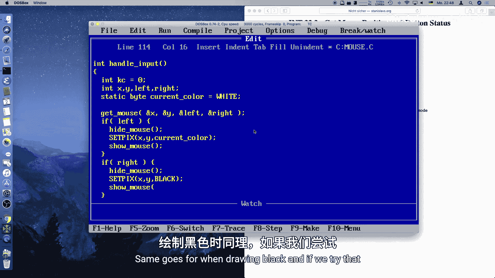

## 增加色彩与键盘交互

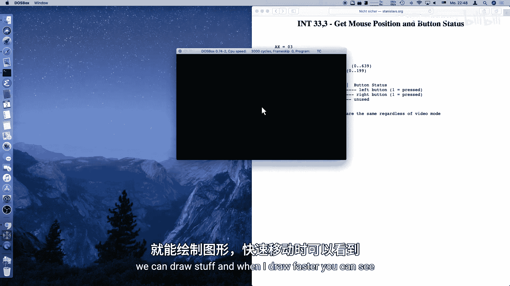

为了让程序更有趣，我们可以通过键盘来改变绘图颜色。例如，按 `+` 键增加颜色索引，按 `-` 键减少颜色索引。

在主循环的键盘处理部分添加以下代码：

```c
if (key_pressed(KEY_PLUS)) { // 假设 KEY_PLUS 是 '+' 键的代码
    current_color++;
}
if (key_pressed(KEY_MINUS)) { // 假设 KEY_MINUS 是 '-' 键的代码
    current_color--;
}
```

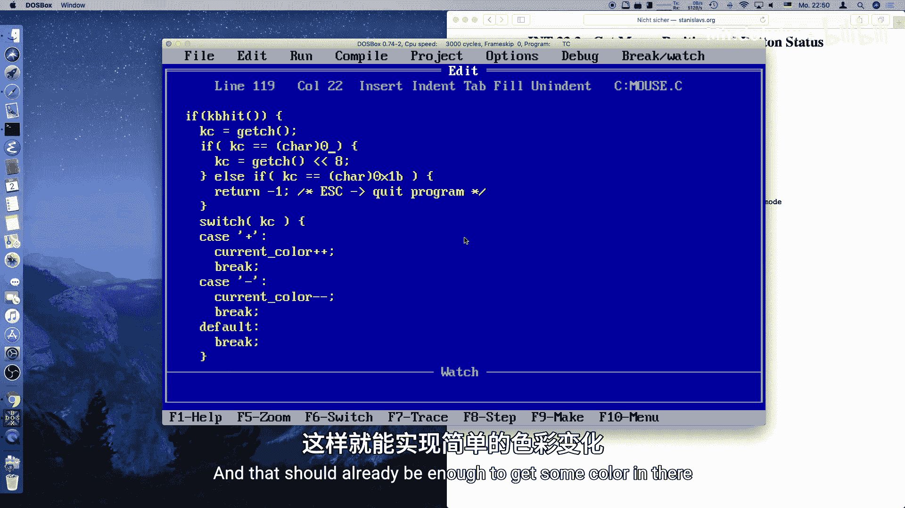

现在，运行程序时，你不仅可以用鼠标左键绘图、右键擦除，还可以通过 `+` 和 `-` 键在16种默认颜色中循环切换，绘制出彩色的图案。

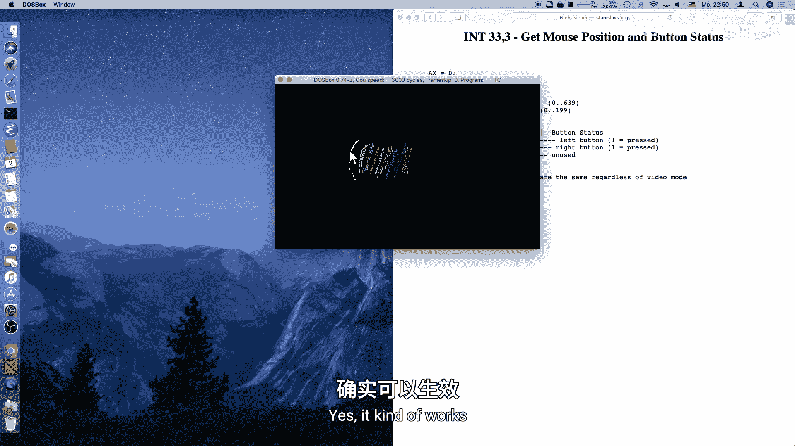

---

## 总结

本节课中我们一起学习了在MS-DOS环境下使用鼠标的基本方法。我们掌握了如何通过中断 `0x33` 来初始化鼠标、显示和隐藏光标，以及获取鼠标的坐标和按键状态。利用这些知识，我们构建了一个简单的交互式绘图程序，并解决了鼠标光标与直接屏幕写入冲突的问题。最后，我们还为程序添加了通过键盘切换颜色的功能。

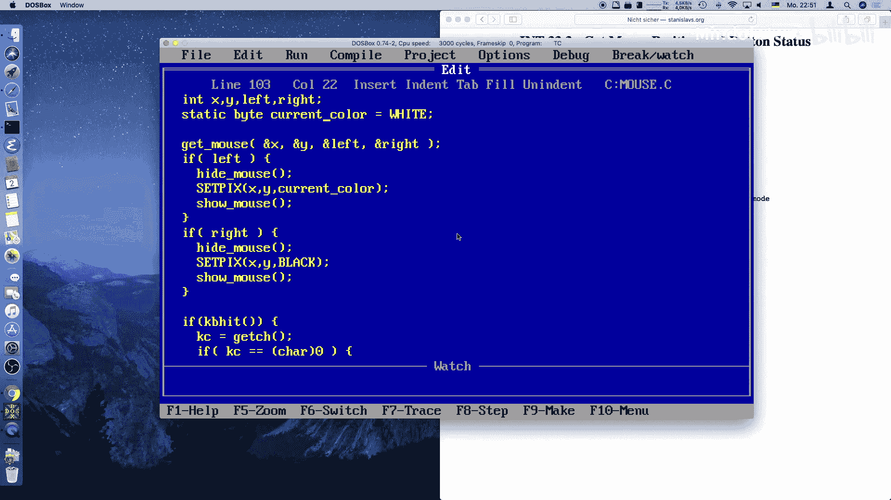

虽然这只是一个基础示例，但它涵盖了鼠标交互的核心概念。你可以在此基础上扩展功能，例如绘制线条、添加图形菜单或实现文件保存/加载，从而创建更完整的应用程序。