# 009：检测SoundBlaster声卡

## 概述

在本节课中，我们将要学习如何检测计算机中是否存在SoundBlaster声卡。这是进行DOS下声音编程的第一步。我们将编写一个C语言程序，通过查询I/O端口和环境变量来识别声卡的基本地址、中断请求线和DMA通道。

## 准备工作

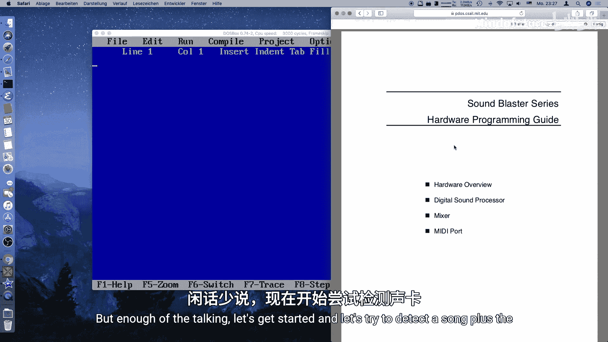

上一节我们介绍了VGA和键盘编程的基础。本节中我们来看看如何与声卡这类更复杂的硬件交互。首先，我们需要包含必要的头文件并声明一些全局变量和函数。

```c
#include <dos.h>
#include <stdio.h>
#include <stdlib.h>
#include <string.h>
#include <mem.h>

int sb_base = 0;
int sb_irq = 0;
int sb_dma = 0;
void (interrupt far *old_irq)();

int sb_detect();
int sb_reset(unsigned short port);
void sb_init();
```

代码解释：
*   `dos.h` 提供了端口输入输出和中断处理的函数。
*   `sb_base`， `sb_irq`， `sb_dma` 用于存储检测到的声卡信息。
*   `old_irq` 是一个函数指针，用于保存旧的中断处理程序。
*   `sb_detect`， `sb_reset`， `sb_init` 是我们将要实现的函数。

## 实现检测函数

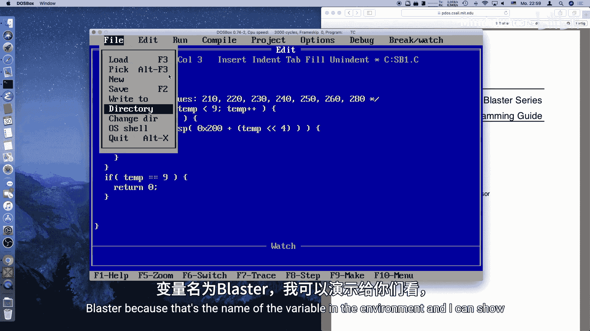

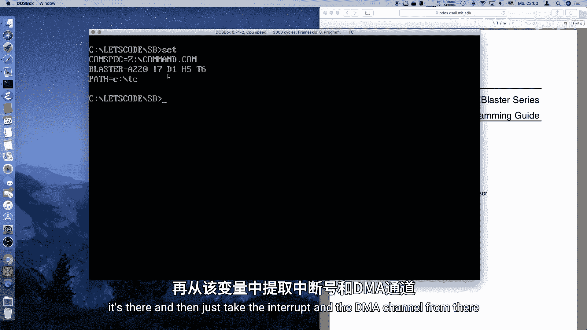

检测函数 `sb_detect` 是我们的核心。它的任务是遍历可能的I/O基地址，尝试复位声卡的数字信号处理器，并确认其响应。

以下是检测函数的主要逻辑步骤：

1.  **遍历可能地址**：SoundBlaster声卡可能的基地址是 `0x200`， `0x210`， `0x220`， `0x230`， `0x240`， `0x250`， `0x260`， `0x280`。注意 `0x270` 通常被其他设备占用，需要跳过。
2.  **尝试复位**：对每个地址，调用 `sb_reset` 函数尝试复位声卡的DSP。
3.  **解析环境变量**：如果复位成功，则从 `BLASTER` 环境变量中解析出中断请求线和DMA通道号。

```c
int sb_detect() {
    int temp;
    int found = 0;

    for(temp = 1; temp <= 8; temp++) {
        if(temp != 7) { // 跳过 0x270
            unsigned short test_port = 0x200 + (temp << 4);
            if(sb_reset(test_port)) {
                sb_base = test_port;
                found = 1;
                break;
            }
        }
    }

    if(!found) return 0;

    char* blaster = getenv("BLASTER");
    if(blaster == NULL) return 0;

    // 从 BLASTER 环境变量解析 DMA 通道
    for(temp = 0; temp < strlen(blaster); temp++) {
        if((blaster[temp] | 32) == 'd') {
            sb_dma = blaster[temp + 1] - '0';
            break;
        }
    }

    // 从 BLASTER 环境变量解析 IRQ
    for(temp = 0; temp < strlen(blaster); temp++) {
        if((blaster[temp] | 32) == 'i') {
            sb_irq = blaster[temp + 1] - '0';
            if(blaster[temp + 2] != ' ') {
                sb_irq = sb_irq * 10 + (blaster[temp + 2] - '0');
            }
            break;
        }
    }

    return 1;
}
```

## 实现复位函数

复位函数 `sb_reset` 负责与声卡硬件进行具体的交互。其原理是向声卡的复位寄存器写入 `1`，等待短暂时间后再写入 `0`，然后检查数据端口是否返回正确的就绪信号。

以下是复位操作的步骤：

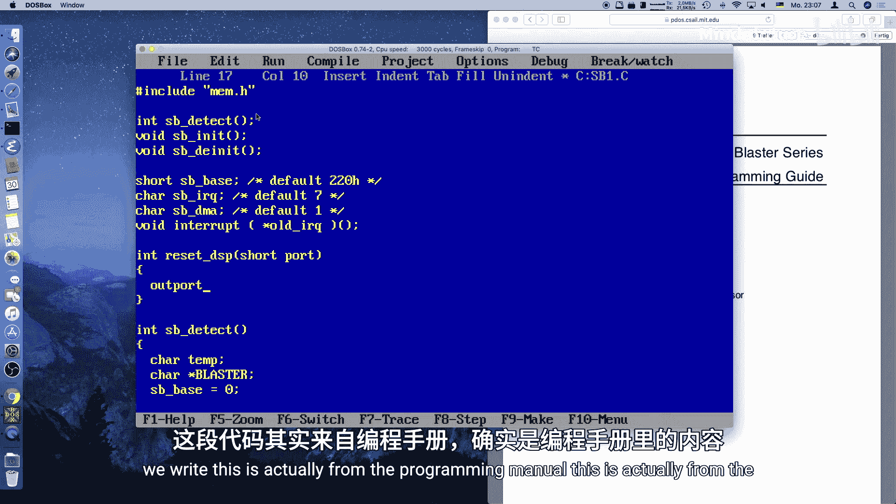

1.  **触发复位**：向 `端口基地址 + 0x6` 写入 `1`。
2.  **短暂延迟**：等待约3微秒（实际代码中延迟更长以确保稳定）。
3.  **结束复位**：向同一个地址写入 `0`。
4.  **检查状态**：轮询读取状态端口 `端口基地址 + 0xE`，直到其最高位为 `1`，表示数据就绪。
5.  **验证响应**：从数据端口 `端口基地址 + 0xA` 读取一个字节，如果其值为 `0xAA`，则表明复位成功且设备是SoundBlaster。

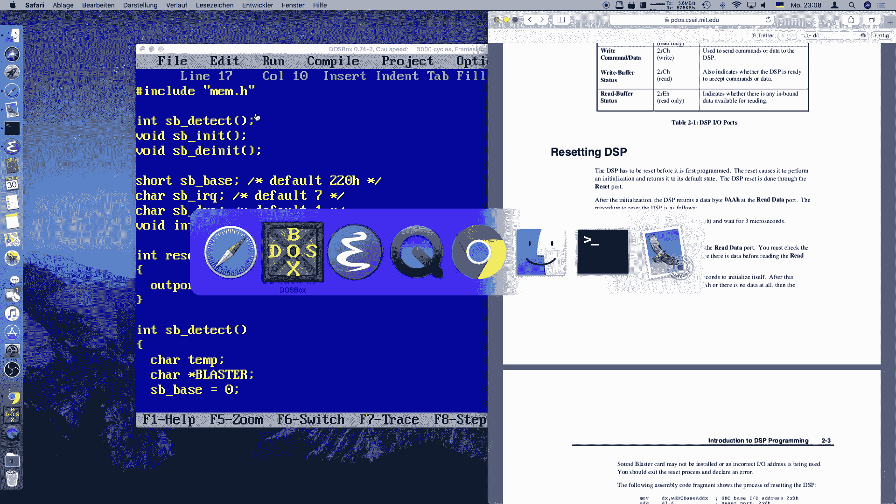

```c
#define SB_RESET_REG 0x6
#define SB_READ_DATA_STATUS_REG 0xE
#define SB_READ_DATA_REG 0xA

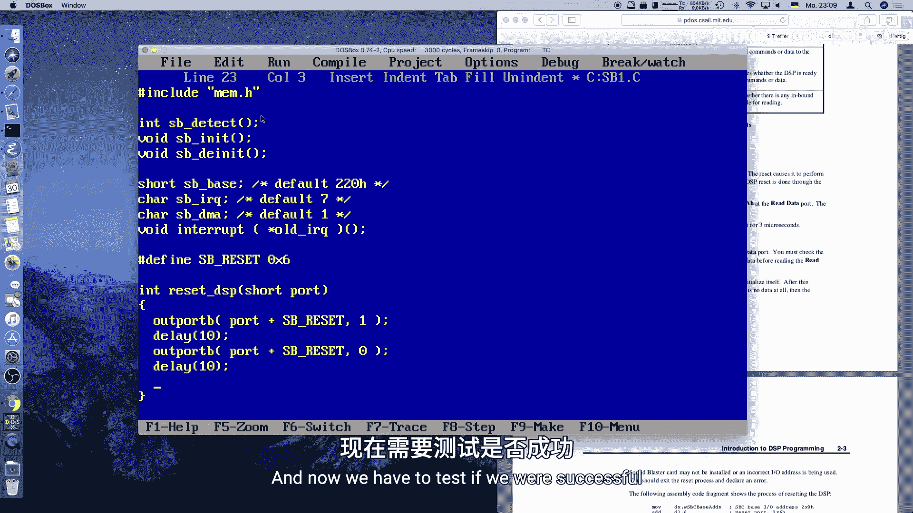

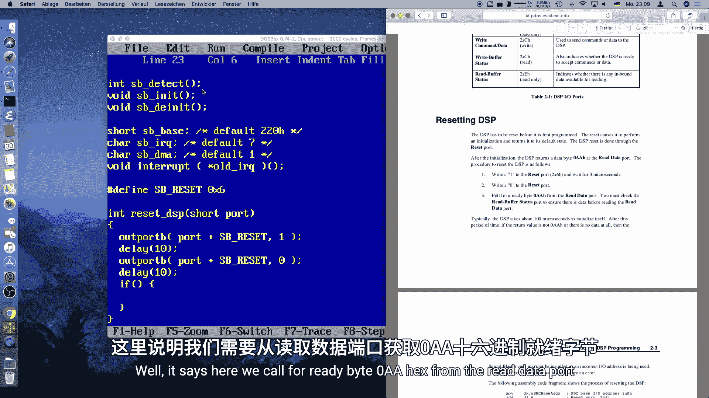

int sb_reset(unsigned short port) {
    // 1. 写入 1 启动复位
    outportb(port + SB_RESET_REG, 1);
    delay(10); // 延迟等待

    // 2. 写入 0 结束复位
    outportb(port + SB_RESET_REG, 0);
    delay(10); // 延迟等待

    // 3. 轮询状态端口，等待数据就绪
    int timeout = 1000;
    while(timeout-- > 0) {
        if((inportb(port + SB_READ_DATA_STATUS_REG) & 0x80) == 0x80) {
            // 4. 数据就绪，读取并验证
            if(inportb(port + SB_READ_DATA_REG) == 0xAA) {
                return 1; // 成功检测到声卡
            }
        }
    }
    return 0; // 超时或响应错误
}
```

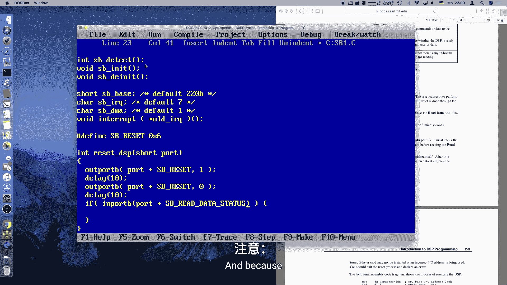

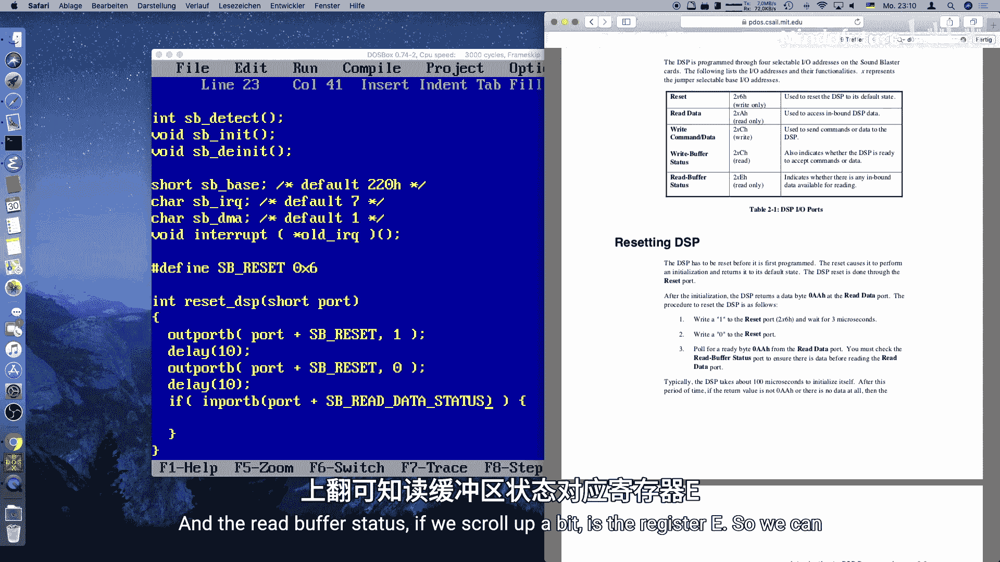

## 编写主程序进行测试

现在，我们可以编写一个简单的 `main` 函数来测试我们的检测代码。

```c
int main() {
    printf("正在检测SoundBlaster声卡...\n");

    if(sb_detect()) {
        printf("成功检测到SoundBlaster声卡！\n");
        printf("基地址: 0x%X\n", sb_base);
        printf("IRQ: %d\n", sb_irq);
        printf("DMA: %d\n", sb_dma);
    } else {
        printf("未检测到SoundBlaster声卡。\n");
    }

    return 0;
}
```

编译并运行此程序，如果系统中安装了SoundBlaster兼容声卡且 `BLASTER` 环境变量设置正确，程序将输出类似以下的信息：
`成功检测到SoundBlaster声卡！基地址: 0x220 IRQ: 7 DMA: 1`

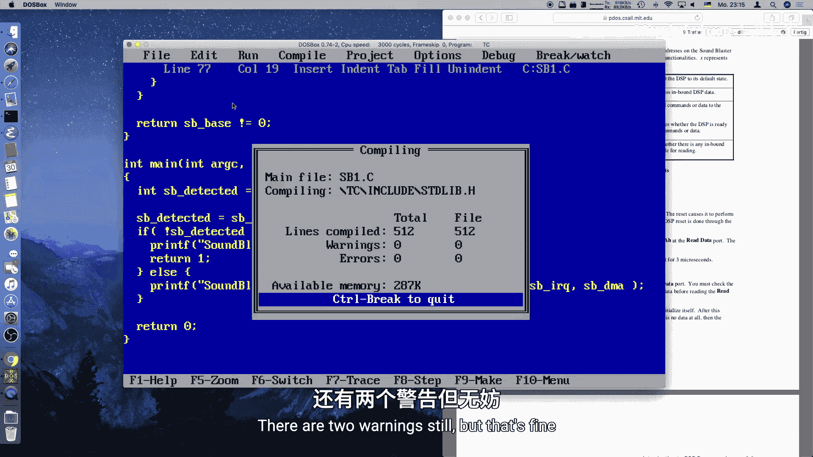

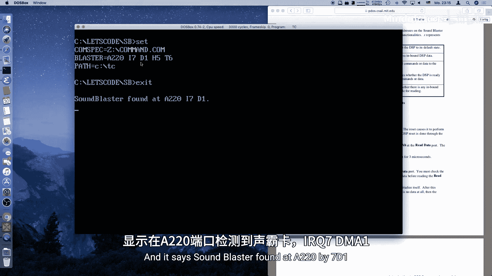

## 总结

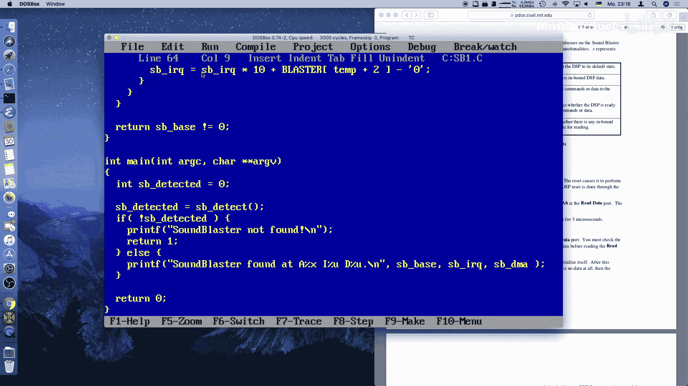

本节课中我们一起学习了在MS-DOS环境下检测SoundBlaster声卡的基础方法。我们实现了两个关键函数：`sb_detect` 用于遍历和定位声卡，`sb_reset` 用于通过硬件端口操作验证设备。我们还学习了如何从 `BLASTER` 环境变量中解析配置信息。这是进行后续声音播放编程至关重要的第一步。在下一节中，我们将在此基础上设置DMA缓冲区和中断处理程序，为实际播放音频数据做好准备。