# 010：MS-DOS 0x0A - 单周期SoundBlaster播放！

## 概述

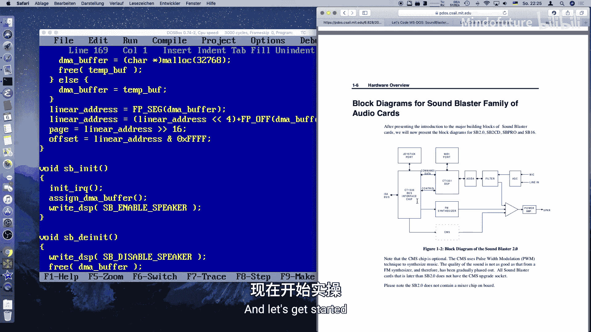

在本节课中，我们将学习如何为Sound Blaster声卡编写单周期音频播放程序。我们将涵盖中断请求（IRQ）设置、直接内存访问（DMA）缓冲区分配、DMA控制器编程以及如何向Sound Blaster DSP发送命令以播放原始音频数据。

## 课程内容

上一节我们介绍了如何检测Sound Blaster声卡。本节中，我们将实际编写代码，让声卡播放声音。

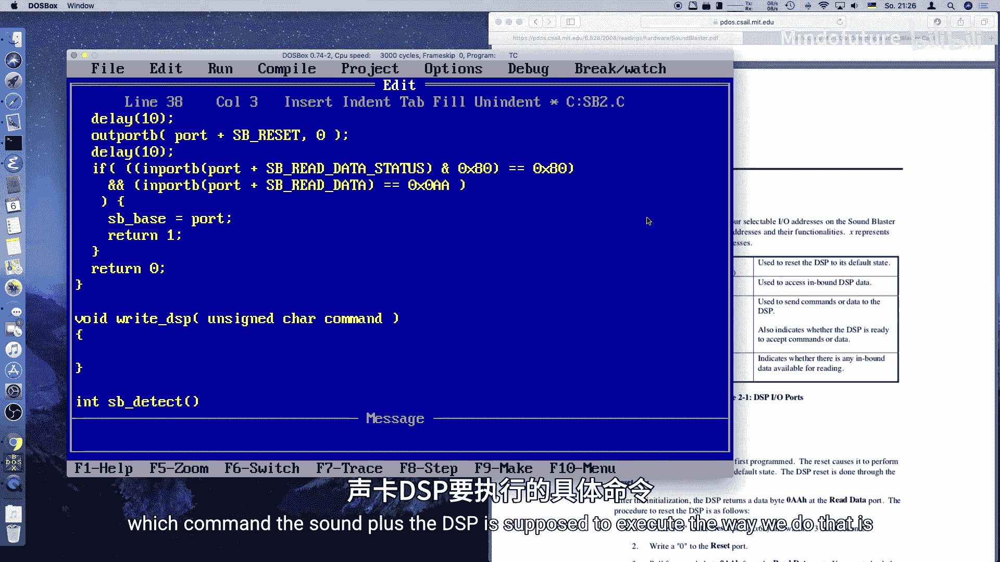

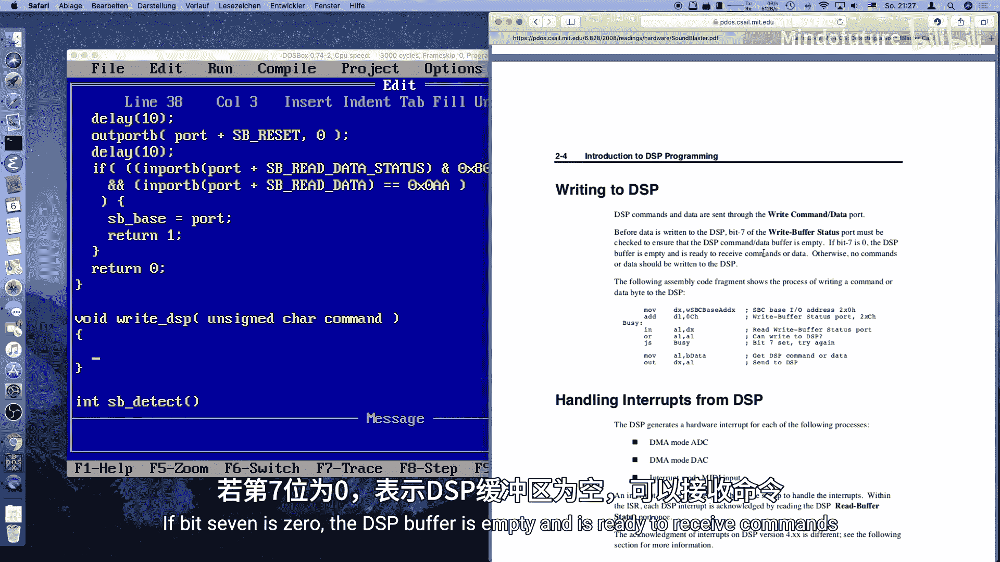

为了实现播放功能，我们需要三个主要函数：
1.  一个初始化函数，用于设置IRQ和DMA缓冲区。
2.  一个播放函数，用于播放单个音频文件。
3.  一个清理函数，用于撤销IRQ和DMA的设置。

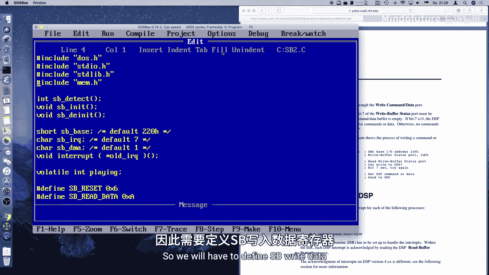

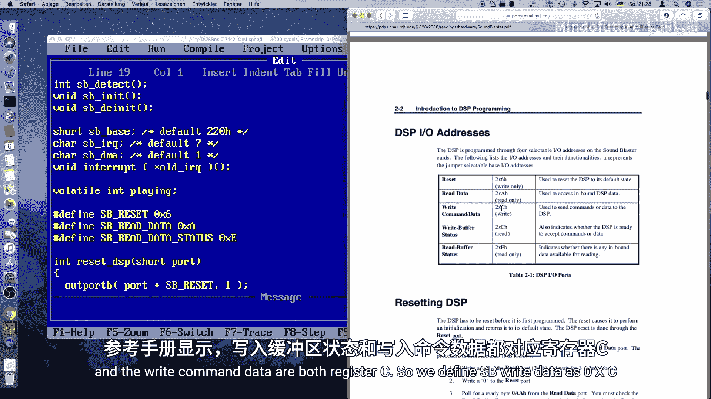

首先，我们需要一个全局变量来跟踪播放状态。

```c
volatile int playing;
```
`volatile`关键字表示该变量可能在任何时候被改变，例如被中断处理程序修改。编译器会因此避免对其进行某些优化。

接下来是初始化函数 `SB_init`。

```c
void SB_init() {
    init_IRQ();      // 设置IRQ处理
    assign_DMA_buf(); // 分配DMA缓冲区
    SB_enable_speaker(); // 启用声卡扬声器
}
```

我们需要编写一系列函数。让我们从向DSP写入命令的函数开始，因为我们会频繁用到它。

以下是向Sound Blaster DSP写入命令的步骤。在写入数据之前，必须检查写缓冲区状态端口，确保其为空（即第7位为0）。

```c
void SB_write_DSP(unsigned char cmd) {
    while ((inportb(SB_BASE + SB_WRITE_STATUS) & 0x80) != 0) {
        // 等待写缓冲区为空
    }
    outportb(SB_BASE + SB_WRITE_DATA, cmd);
}
```
这里，`SB_WRITE_STATUS` 和 `SB_WRITE_DATA` 都对应寄存器 `0x0C`。

现在，让我们编写初始化IRQ的函数 `init_IRQ`。我们还需要一个对应的 `deinit_IRQ` 函数用于清理。

首先，我们需要保存旧的IRQ处理程序（向量）。我们的IRQ处理程序还需要调用旧的向量，因为可能还有其他设备（如定时器）需要处理这个中断。

对于286及以上CPU引入的高位IRQ（2，10，11），需要特殊处理。IRQ 9与IRQ 2相同，因为它们是级联的。

```c
void init_IRQ() {
    if (SB_IRQ == 2) {
        old_IRQ_vector = getvect(0x71); // 获取旧向量
        setvect(0x71, SB_IRQ_handler); // 设置新向量
    } else if (SB_IRQ == 10) {
        old_IRQ_vector = getvect(0x72);
        setvect(0x72, SB_IRQ_handler);
    } else if (SB_IRQ == 11) {
        old_IRQ_vector = getvect(0x73);
        setvect(0x73, SB_IRQ_handler);
    } else {
        // 对于普通PC使用的IRQ（如5，7）
        old_IRQ_vector = getvect(SB_IRQ + 8);
        setvect(SB_IRQ + 8, SB_IRQ_handler);
    }
    // ... 还需要编程主板上的中断控制器
}
```

接下来，我们需要编程主板上的可编程中断控制器（PIC）来启用我们的IRQ线。这有点复杂，尤其是对于级联的中断。

```c
    if (SB_IRQ == 2 || SB_IRQ == 10 || SB_IRQ == 11) {
        // 处理高位IRQ，涉及第二个PIC (0xA1端口)
        unsigned char mask = inportb(0xA1);
        mask &= ~(1 << (SB_IRQ - 8)); // 清除对应位以启用中断
        outportb(0xA1, mask);
        // 同时也要启用主PIC上的级联IRQ (IRQ 2)
        mask = inportb(0x21);
        mask &= ~(1 << 2);
        outportb(0x21, mask);
    } else {
        // 处理低位IRQ
        unsigned char mask = inportb(0x21);
        mask &= ~(1 << SB_IRQ); // 清除对应位以启用中断
        outportb(0x21, mask);
    }
```

现在，让我们编写分配DMA缓冲区的函数 `assign_DMA_buf`。这是另一个略有技巧的部分。

DMA缓冲区不能跨越64KB的物理“页”边界，这是因为PC中使用的DMA控制器最初是为只能寻址64KB内存的计算机设计的。

```c
void assign_DMA_buf() {
    char* temp_buf;
    unsigned long linear_addr;
    unsigned int page1, page2;

    do {
        temp_buf = (char*)malloc(32768); // 分配32KB，用于双缓冲（两页）
        linear_addr = FP_SEG(temp_buf) * 16 + FP_OFF(temp_buf); // 计算20位线性地址
        page1 = linear_addr >> 16; // 第一页的页号
        page2 = (linear_addr + 32768 - 1) >> 16; // 第二页的页号
        if (page1 != page2) {
            // 如果两半不在同一物理页，重新分配
            free(temp_buf);
        }
    } while (page1 != page2); // 直到分配到一个合适的缓冲区

    // 保存DMA控制器需要的页和偏移量
    DMA_buffer = temp_buf;
    DMA_page = page1;
    DMA_offset = (unsigned int)linear_addr & 0xFFFF;
}
```

我们还需要定义相关的全局变量。

```c
char* DMA_buffer;
unsigned int DMA_page;
unsigned int DMA_offset;
```

清理函数 `SB_deinit` 相对简单，我们复制初始化函数的结构并反向操作。

```c
void SB_deinit() {
    SB_disable_speaker(); // 关闭扬声器输出
    free(DMA_buffer);     // 释放DMA缓冲区
    deinit_IRQ();         // 取消IRQ设置
}
```

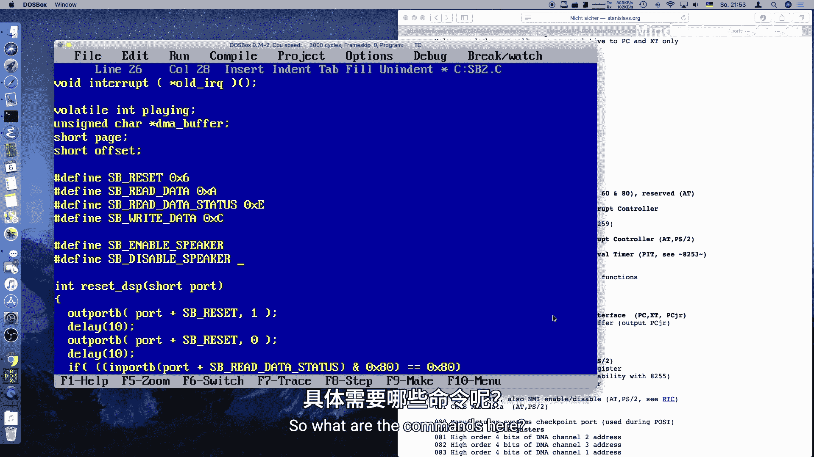

`deinit_IRQ` 函数需要恢复旧的IRQ向量，并重新屏蔽PIC上的中断位。

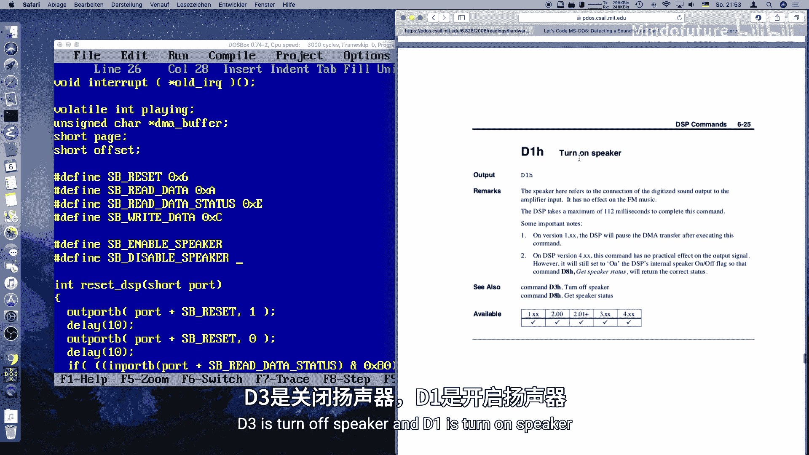

```c
void deinit_IRQ() {
    // 恢复旧的IRQ向量
    if (SB_IRQ == 2) {
        setvect(0x71, old_IRQ_vector);
    } else if (SB_IRQ == 10) {
        setvect(0x72, old_IRQ_vector);
    } else if (SB_IRQ == 11) {
        setvect(0x73, old_IRQ_vector);
    } else {
        setvect(SB_IRQ + 8, old_IRQ_vector);
    }

    // 在PIC上重新屏蔽（禁用）我们的IRQ线
    if (SB_IRQ == 2 || SB_IRQ == 10 || SB_IRQ == 11) {
        unsigned char mask = inportb(0xA1);
        mask |= (1 << (SB_IRQ - 8)); // 设置对应位以禁用中断
        outportb(0xA1, mask);
        // 主PIC上的级联IRQ (IRQ 2) 通常保持启用，但这里也恢复
        mask = inportb(0x21);
        mask |= (1 << 2);
        outportb(0x21, mask);
    } else {
        unsigned char mask = inportb(0x21);
        mask |= (1 << SB_IRQ); // 设置对应位以禁用中断
        outportb(0x21, mask);
    }
}
```

我们还需要编写IRQ处理程序 `SB_IRQ_handler`。根据Sound Blaster文档，我们需要从DSP读取数据以确认中断。

```c
void interrupt SB_IRQ_handler() {
    inportb(SB_BASE + SB_READ_DATA_STATUS); // 读取DSP状态，确认中断
    // 通知PIC中断已处理
    outportb(0x20, 0x20); // 主PIC
    if (SB_IRQ == 2 || SB_IRQ == 10 || SB_IRQ == 11) {
        outportb(0xA0, 0x20); // 从PIC（如果使用高位IRQ）
    }
    playing = 0; // 对于单周期播放，标记播放结束
}
```

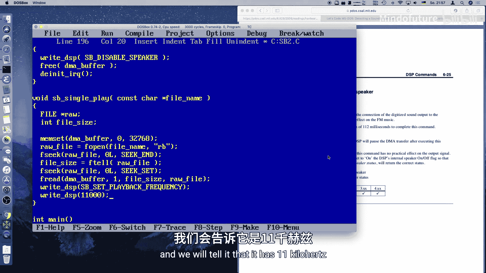

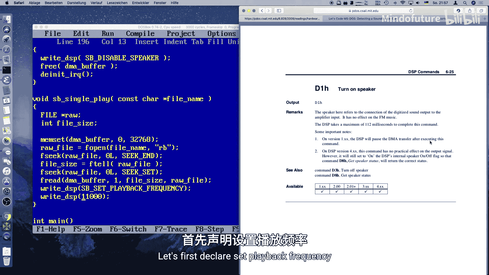

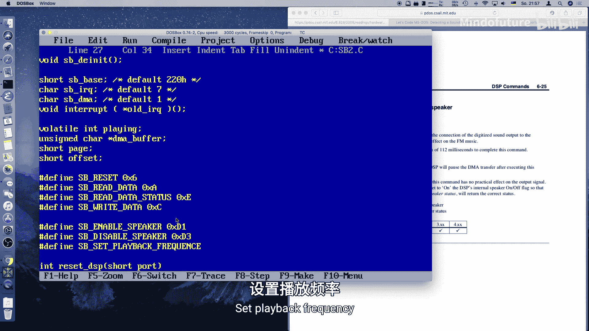

启用和禁用扬声器的命令很简单。

```c
#define SB_ENABLE_SPEAKER  0xD1
#define SB_DISABLE_SPEAKER 0xD3
```

现在，进入核心的播放函数 `SB_play`。这个函数负责打开文件、读取数据、设置采样率并启动播放。

```c
void SB_play(const char* filename) {
    FILE* file;
    long file_size;
    // 先将DMA缓冲区静音，防止噪音
    memset(DMA_buffer, 0, 32768);

    file = fopen(filename, "rb");
    if (!file) return;

    // 获取文件大小
    fseek(file, 0, SEEK_END);
    file_size = ftell(file);
    rewind(file);

    // 读取整个文件（假设文件小于DMA缓冲区）
    fread(DMA_buffer, 1, file_size, file);
    fclose(file);

    // 设置Sound Blaster的播放采样率（例如11kHz）
    SB_set_sample_rate(11000);

    // 设置要播放的字节数，并启动单周期播放
    to_be_played = file_size;
    SB_single_cycle_play(file_size);
}
```

设置采样率的函数需要计算一个时间常数。

```c
void SB_set_sample_rate(unsigned int rate) {
    unsigned int time_constant = 256 - (1000000 / rate);
    SB_write_DSP(0x40); // 设置时间常数命令
    SB_write_DSP(time_constant);
}
```

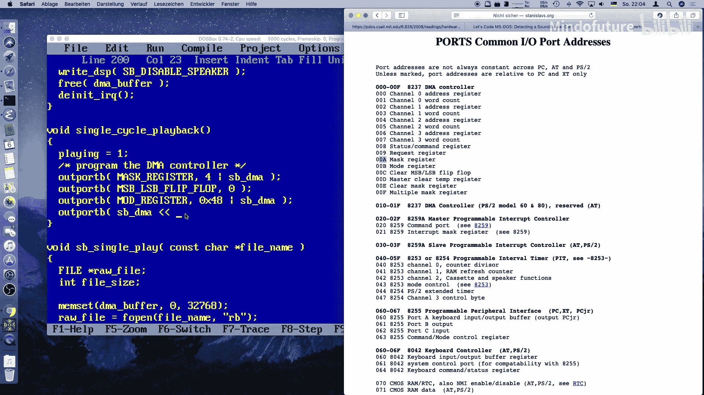

最后，是最关键的 `SB_single_cycle_play` 函数，它负责编程DMA控制器并命令DSP开始播放。

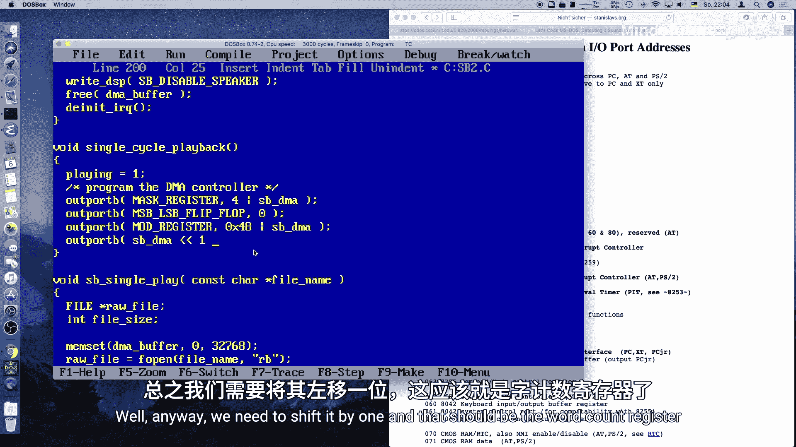

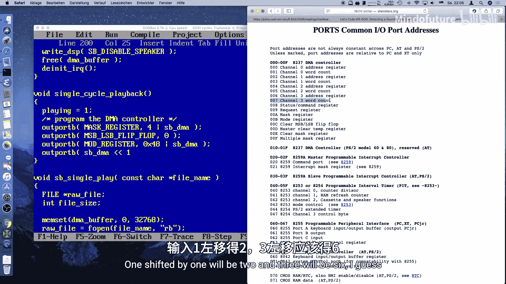

首先，我们需要定义DMA控制器的一些端口地址。

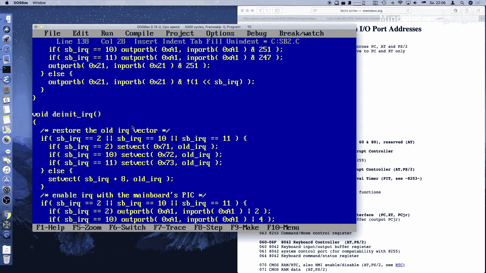

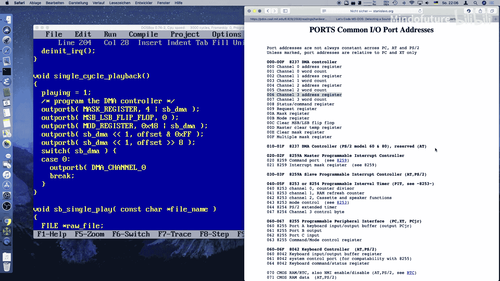

```c
// DMA控制器端口定义（以通道1为例）
#define DMA_MASK_REG        0x0A
#define DMA_MODE_REG        0x0B
#define DMA_CLEAR_FF_REG    0x0C
#define DMA_ADDR_REG(ch)    (0x00 + ((ch) * 2))
#define DMA_COUNT_REG(ch)   (0x01 + ((ch) * 2))
#define DMA_PAGE_REG(ch)    ((ch)==0?0x87:((ch)==1?0x83:0x82))
```

```c
void SB_single_cycle_play(unsigned int length) {
    playing = 1; // 标记开始播放

    // 1. 屏蔽DMA通道
    outportb(DMA_MASK_REG, 0x04 | SB_DMA_CHANNEL);

    // 2. 清除字节指针触发器
    outportb(DMA_CLEAR_FF_REG, 0);

    // 3. 设置DMA传输模式（单周期读，通道自动初始化关闭）
    outportb(DMA_MODE_REG, 0x48 | SB_DMA_CHANNEL); // 模式 0x48: 单周期，读传输

    // 4. 设置DMA缓冲区地址（偏移量）
    outportb(DMA_ADDR_REG(SB_DMA_CHANNEL), DMA_offset & 0xFF);        // 低字节
    outportb(DMA_ADDR_REG(SB_DMA_CHANNEL), (DMA_offset >> 8) & 0xFF); // 高字节

    // 5. 设置DMA缓冲区地址（页）
    outportb(DMA_PAGE_REG(SB_DMA_CHANNEL), DMA_page & 0xFF);

    // 6. 设置传输字节数（长度-1，因为从0计数）
    unsigned short count = length - 1;
    outportb(DMA_COUNT_REG(SB_DMA_CHANNEL), count & 0xFF);        // 低字节
    outportb(DMA_COUNT_REG(SB_DMA_CHANNEL), (count >> 8) & 0xFF); // 高字节

    // 7. 取消屏蔽DMA通道，允许传输
    outportb(DMA_MASK_REG, SB_DMA_CHANNEL);

    // 8. 命令Sound Blaster DSP开始单周期播放
    SB_write_DSP(0x14); // 8位单周期DAC模式命令
    SB_write_DSP(length & 0xFF);   // 长度低字节
    SB_write_DSP((length >> 8) & 0xFF); // 长度高字节
}
```

主函数 `main` 将调用这些函数。

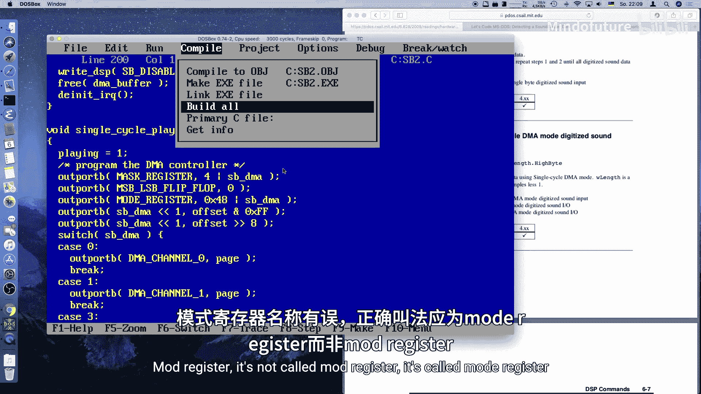

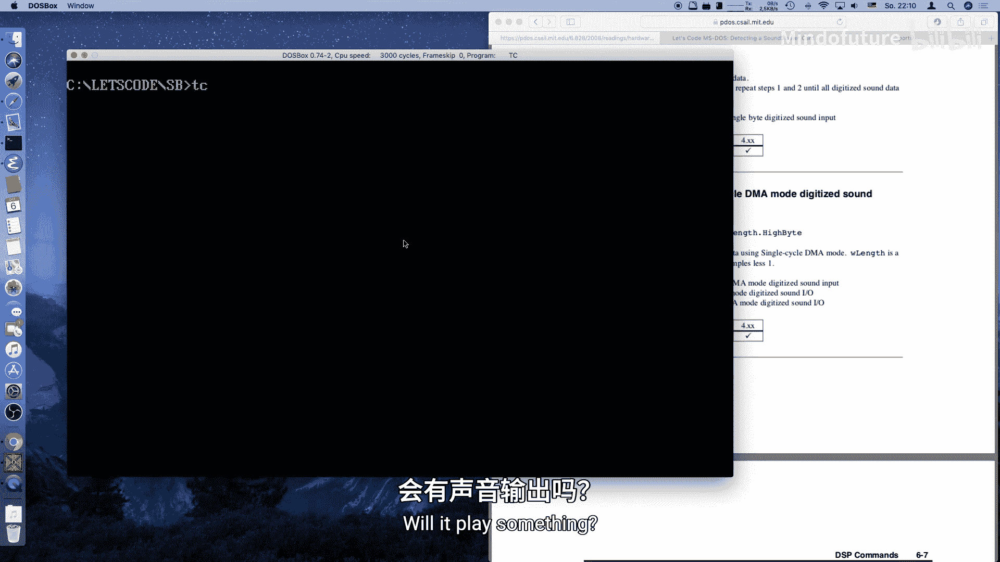

```c
int main() {
    SB_init();
    SB_play("sound.raw"); // 播放一个11kHz，8位无符号的原始音频文件
    while (playing) {
        // 等待播放完成（由中断处理程序将playing设为0）
    }
    SB_deinit();
    return 0;
}
```

## 总结

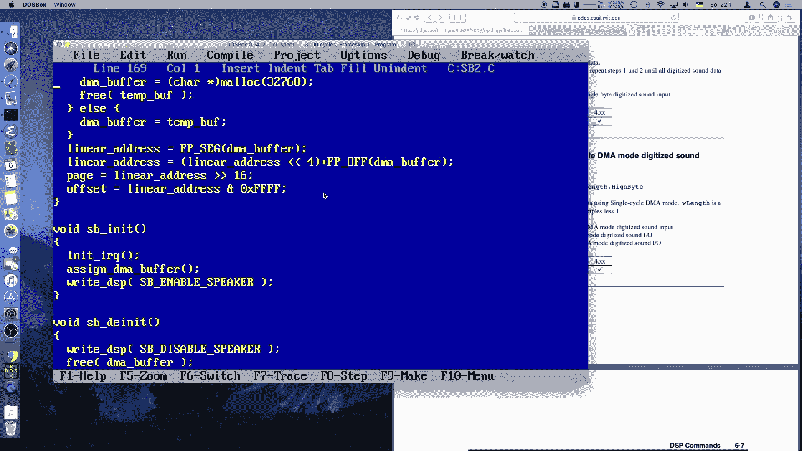

本节课中，我们一起学习了如何为Sound Blaster声卡实现单周期音频播放。
我们学习了如何初始化IRQ处理并分配符合DMA控制器要求的缓冲区。
我们深入了解了如何编程PC的DMA控制器来进行单周期播放，这个过程有些复杂。
我们还学习了如何注销IRQ处理程序。
最后，我们编写了读取原始音频文件并播放的完整流程。
下一节课，我们将学习如何播放更长的文件以及进行更复杂的操作，例如自动初始化模式（双缓冲播放）。由于我们已经完成了大部分困难的工作，下一节将会轻松许多。