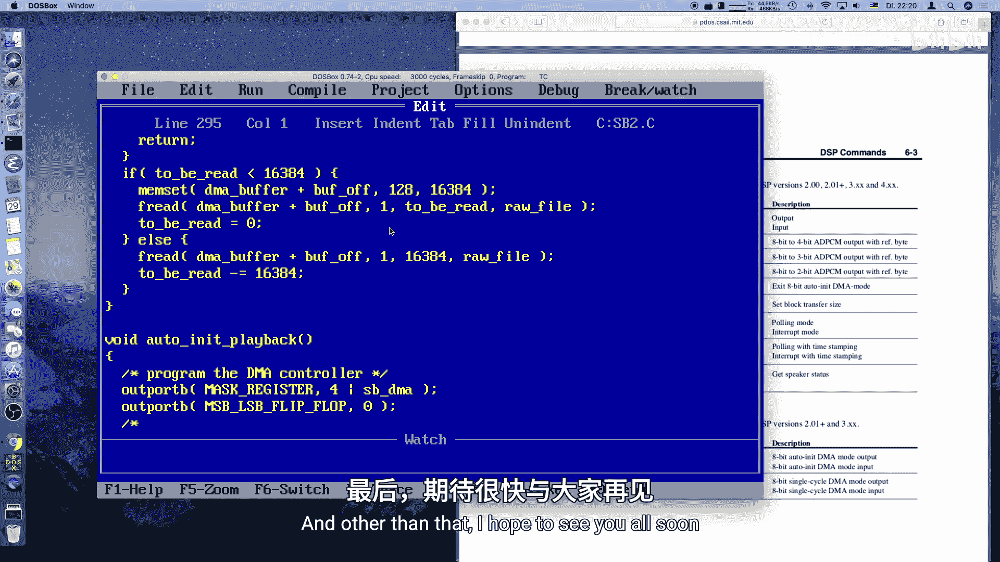

# 011：SoundBlaster 自动初始化DMA播放


## 概述

在本节课中，我们将学习如何为 Sound Blaster 声卡实现自动初始化DMA（Auto-Init DMA）播放模式。上一节我们介绍了单周期播放，它只能播放一小段音频。本节中，我们将通过双缓冲技术实现连续、长时间的音频播放。

## 从单周期播放到自动初始化播放

上一节我们学习了如何进行单周期播放。这意味着我们编程了PC的DMA控制器，为Sound Blaster卡提供PCM数据，即可以播放数字声音的波形。具体来说，我们可以播放一个DMA缓冲区大小的声音，根据DMA缓冲区大小（例如32KB），在11kHz采样率下大约能播放3秒的音频。这显然不够。有时我们需要连续播放语音或音乐。为此，我们需要切换到一种略有不同的模式。单周期播放对此并不适用。因此，让我们来增强这个程序。

首先，我们需要更改文件名，因为我准备了另一个更长的文件，它实际上有几分钟长，你会在视频结尾认出它。这无法仅用单周期播放来实现。

我们将在这里做一些不同的事情，实际上使用一个不同的函数。我们将调用它 `SB_AutoPlay`。我们会保留单次播放函数，以便也能调用它。我们还会加入键盘输入检查，以便可以中止播放。因为现在播放时间不止3秒，能够停止播放会很有用。我们需要一个特殊的停止函数来实际停止所有的DMA操作。DMA单元保持不变。我认为目前这就足够了。

现在，让我们逐一编写这些函数。`SB_Stop` 函数应该是最简单的，我们可以从它开始。

## 全局状态变量

我们将使用原始文件指针和文件大小。我们将把它们移到文件顶部，因为我们需要一直使用它们，它们将成为全局状态。全局变量通常不好，但我们在使用C语言，并且没有太多其他选择，所以可以接受。

以下是需要定义的全局变量：
```c
FILE *raw_file;
long file_size;
volatile long to_be_played;
volatile long to_be_read;
short read_buffer;
unsigned char far *dma_buffer;
int playing;
```

## 实现停止函数

`SB_Stop` 函数的工作原理如下：我们向DSP写入一个新的命令码 `SB_PAUSE_PLAYBACK`。我们将 `playing` 变量设置为0。`playing` 变量为1时，表示仍有内容在播放。当从while循环内部调用此函数时，它也会退出循环。出于安全原因或在检测到按键时调用它，在这里都无关紧要。为了保持整洁，我们也会关闭文件。然而，这并非绝对必要，因为当我们退出DOS时，文件会自动关闭。

以下是停止函数的代码：
```c
void SB_Stop(void) {
    SB_Write(SB_PAUSE_PLAYBACK);
    playing = 0;
    fclose(raw_file);
}
```

## 实现自动播放函数

`SB_AutoPlay` 函数接收一个文件名字符串。它的工作原理如下：

首先，检查DMA缓冲区是否已分配。如果没有，则直接返回，否则程序可能会崩溃。

我们需要使用多个缓冲区。我们分配的DMA缓冲区大小是我们实际需要的两倍。例如，我们分配了32KB，每个DMA缓冲区是16KB，这样我们就可以进行双缓冲。

思路是预加载两个缓冲区，填满缓冲区0和缓冲区1，然后开始播放缓冲区0。当缓冲区0播放结束时，我们会从Sound Blaster收到一个中断。此时Sound Blaster会继续播放缓冲区1。与此同时，在播放缓冲区1时，我们将新数据读入缓冲区0。当缓冲区1播放结束时，自动初始化单元会切换回缓冲区0进行播放，同时我们将数据加载到缓冲区1。这就是所谓的双缓冲。我们基本上有两个缓冲区，轮流进行播放和从文件填充。这样，我们不需要将整个文件加载到内存，而是按需加载。

我们需要一个 `read_buffer` 变量，它基本上只是一个整数。我们从缓冲区0开始。我们还需要将DMA缓冲区的内容初始化为0，包括两个半区。这将是全局状态，因为我们需要在IRQ处理程序中访问它。

以下是自动播放函数的框架和初始化步骤：
```c
void SB_AutoPlay(char *filename) {
    if (dma_buffer == NULL) return;

    read_buffer = 0;
    _fmemset(dma_buffer, 128, DMA_BUFFER_SIZE); // 用静音值（128）初始化

    raw_file = fopen(filename, "rb");
    if (raw_file == NULL) {
        printf("File not found: %s\n", filename);
        return;
    }

    fseek(raw_file, 0, SEEK_END);
    file_size = ftell(raw_file);
    rewind(raw_file);

    to_be_played = file_size;
    to_be_read = file_size;

    SB_SetPlaybackRate(11025); // 设置播放频率为11kHz
    SB_Write(SB_TURN_ON_SPEAKER); // 开启扬声器

    // 填充两个缓冲区
    ReadBuffer(0);
    ReadBuffer(1);

    if (to_be_read > 0) {
        // 文件较大，使用自动初始化模式
        SB_AutoInitPlayback();
    } else {
        // 文件很小，使用单周期播放即可
        SB_SinglePlay();
    }
    playing = 1;
}
```

## 实现缓冲区读取函数

`ReadBuffer` 函数接收一个参数，该参数指示DMA缓冲区的哪一半将被新数据覆盖。

如果已经没有数据可读（`to_be_read <= 0`），则直接返回。

我们播放的是无符号整数格式的PCM。波形范围是0到255。静音（无声）对应的值是128，这基本上是振幅为零的中心线。要得到负振幅，你在这里放0；要得到正振幅，你放255（如果对波形能量进行归一化）。128正好是中间值，这是一条平坦的线，不会产生任何声音。

因此，我们首先用128初始化缓冲区，然后读取需要读取的字节数。

以下是 `ReadBuffer` 函数的代码：
```c
void ReadBuffer(short buffer) {
    unsigned int buffer_offset = buffer ? SOUND_BLASTER_BLOCK_LENGTH : 0;

    if (to_be_read <= 0) return;

    if (to_be_read < SOUND_BLASTER_BLOCK_LENGTH) {
        // 最后一次读取，数据不足一个完整缓冲区
        _fmemset(dma_buffer + buffer_offset, 128, SOUND_BLASTER_BLOCK_LENGTH);
        fread(dma_buffer + buffer_offset, 1, to_be_read, raw_file);
        to_be_read = 0;
    } else {
        // 读取一个完整的缓冲区
        fread(dma_buffer + buffer_offset, 1, SOUND_BLASTER_BLOCK_LENGTH, raw_file);
        to_be_read -= SOUND_BLASTER_BLOCK_LENGTH;
    }
}
```

## 实现自动初始化播放函数

`SB_AutoInitPlayback` 函数看起来与单周期播放函数非常相似，包含所有的DMA编程，会同样复杂。

首先，编程DMA控制器。我们需要写入屏蔽寄存器和模式寄存器。对于自动初始化模式，模式寄存器的值不同。

单周期播放和自动初始化播放的区别仅在于模式寄存器中的两位。在自动初始化模式下，我们使用值 `0x58`，而在单周期模式下是 `0x48`。这两位指示DMA芯片使用自动初始化模式。

其余部分相同：写入DMA缓冲区的地址偏移量（需要按字节写入并进行位操作），写入页寄存器，然后写入块长度。

对于DMA控制器，块长度是整个DMA缓冲区大小（例如32KB）。对于Sound Blaster，我们需要通过 `SB_SET_BLOCK_SIZE` 命令设置其块长度，这是半个DMA缓冲区大小（例如16KB）。然后，我们发送 `SB_AUTO_INIT_PLAYBACK` 命令开始播放。

以下是关键的命令定义和函数框架：
```c
#define SB_PAUSE_PLAYBACK      0xD0
#define SB_SET_BLOCK_SIZE      0x48
#define SB_AUTO_INIT_PLAYBACK  0x1C
#define SB_TURN_ON_SPEAKER     0xD1

void SB_AutoInitPlayback(void) {
    // 1. 屏蔽DMA通道
    outportb(DMA_MASK_REG, DMA_CHANNEL | 0x04);
    // 2. 清除字节指针触发器
    outportb(DMA_CLEAR_FF_REG, 0xFF);
    // 3. 设置模式寄存器为自动初始化、读操作
    outportb(DMA_MODE_REG, 0x58 | DMA_CHANNEL);
    // 4. 写入DMA缓冲区地址（低字节、高字节）
    unsigned long buf_addr = (unsigned long)dma_buffer;
    unsigned short offset = (unsigned short)(buf_addr & 0xFFFF);
    unsigned char page = (unsigned char)((buf_addr >> 16) & 0x0F);
    outportb(DMA_ADDRESS_REG, offset & 0xFF);
    outportb(DMA_ADDRESS_REG, offset >> 8);
    // 5. 写入页寄存器
    outportb(DMA_PAGE_REG, page);
    // 6. 写入DMA块长度（整个缓冲区大小）
    outportb(DMA_COUNT_REG, DMA_BLOCK_LENGTH & 0xFF);
    outportb(DMA_COUNT_REG, DMA_BLOCK_LENGTH >> 8);
    // 7. 解除DMA通道屏蔽
    outportb(DMA_MASK_REG, DMA_CHANNEL);
    // 8. 设置Sound Blaster块大小
    SB_Write(SB_SET_BLOCK_SIZE);
    SB_Write(SOUND_BLASTER_BLOCK_LENGTH & 0xFF);
    SB_Write(SOUND_BLASTER_BLOCK_LENGTH >> 8);
    // 9. 开始自动初始化播放
    SB_Write(SB_AUTO_INIT_PLAYBACK);
}
```

## 修改中断处理程序

我们当前的中断处理程序没有做太多有用的事情。它播放一个缓冲区就结束了。对于单周期播放，我们只需要确认中断即可。但对于自动初始化模式，我们需要做更多工作。

我们仍然需要读取状态并确认中断。如果仍在播放，我们需要递减 `to_be_played` 计数器。然后检查是否还有数据需要播放。

如果还有数据需要播放，我们需要读取数据到当前缓冲区（由 `read_buffer` 指示，每次中断后通过异或操作在0和1之间切换）。然后，如果剩余要播放的数据小于一个完整的Sound Blaster缓冲区，我们切换到单周期播放模式来处理最后一点数据。如果剩余数据小于整个DMA缓冲区大小（即两个Sound Blaster块），我们需要停止自动初始化模式，否则它会继续播放缓冲区中的剩余内容。如果没有数据需要播放了，我们将 `playing` 设置为0并停止。

以下是中断处理程序的逻辑：
```c
void interrupt far sb_isr(...) {
    // 读取并确认中断
    unsigned char status = inportb(SB_DSP_READ);
    outportb(SB_DSP_ACK, status);

    if (playing) {
        to_be_played -= SOUND_BLASTER_BLOCK_LENGTH;

        if (to_be_played > 0) {
            // 读取数据到下一个缓冲区
            ReadBuffer(read_buffer);
            read_buffer ^= 1; // 切换缓冲区索引

            if (to_be_played < SOUND_BLASTER_BLOCK_LENGTH) {
                // 最后一点数据，使用单周期播放
                SB_SinglePlay();
            } else if (to_be_played < DMA_BLOCK_LENGTH) {
                // 数据不足一个完整DMA缓冲区，停止自动初始化模式
                SB_StopAutoInit();
            }
            // 否则，继续自动初始化播放
        } else {
            // 播放完毕
            playing = 0;
            SB_Stop();
        }
    }
    // ... 向中断控制器发送EOI等操作
}
```

还需要一个 `SB_StopAutoInit` 函数，它简单地发送暂停播放命令。
```c
void SB_StopAutoInit(void) {
    SB_Write(SB_PAUSE_PLAYBACK);
}
```

## 总结



本节课中，我们一起学习了如何为Sound Blaster声卡实现自动初始化DMA播放。我们从单周期播放的局限性出发，引入了双缓冲技术和自动初始化模式来实现长时间连续播放。我们定义了必要的全局状态，实现了停止播放、读取缓冲区、设置自动初始化播放以及修改中断处理程序等关键函数。DMA编程部分，特别是模式寄存器的设置和地址/页寄存器的写入，是其中最复杂的部分。现在，你拥有了播放短音频片段或任意长度音频块所需的全部代码。有了这些，你就可以在你的程序中实现出色的声音效果了。希望你能享受编程的乐趣！