# 012：加载 GIF 图像 🖼️

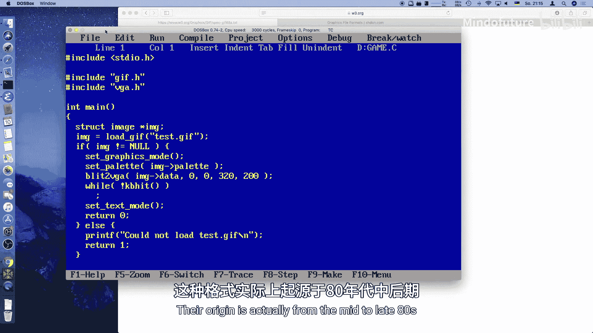

在本节课中，我们将学习如何在 MS-DOS 程序中加载和显示 GIF 图像文件。我们将了解 GIF 文件的基本结构，并实现一个简单的 GIF 解码器，以便在 VGA 图形模式下显示图片。

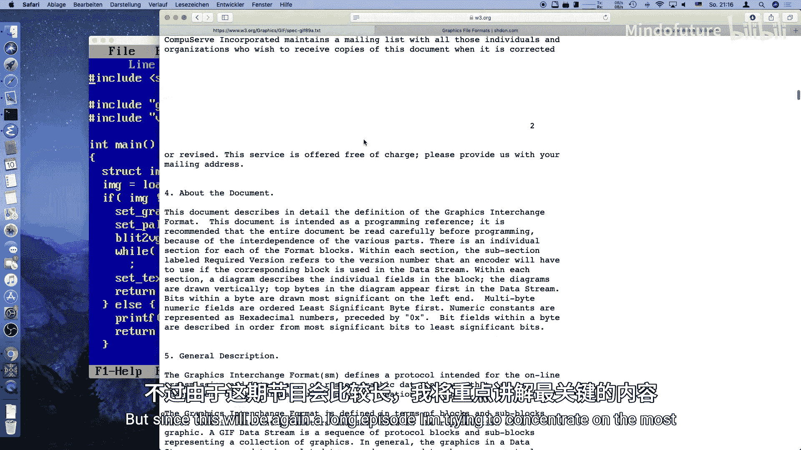

---

## 概述

上一节我们通过纯代码绘制了图形。本节我们将学习如何从外部文件加载图片。我们将重点讲解 GIF 格式，因为它使用 LZW 压缩算法，在空间利用上比纯位图更高效，适合在资源有限的旧机器上使用。

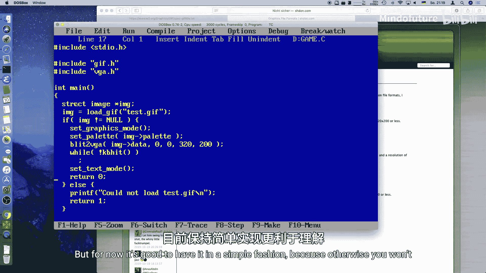

## GIF 文件简介

GIF 是“图形交换格式”的缩写，诞生于 20 世纪 80 年代末。它支持动画和透明色，至今仍被广泛使用。GIF 文件使用 LZW 压缩算法，该算法能有效压缩颜色较少、图形简单的图像。

## 程序结构

我们的程序将包含以下几个核心部分：
1.  一个 `load_gif` 函数，用于读取和解码 GIF 文件。
2.  一个 `image` 结构体，用于存储图像的像素数据、调色板和尺寸。
3.  一个解码器状态结构体，用于管理 LZW 解压缩过程。
4.  复用之前编写的 VGA 图形模式设置和像素绘制例程。

以下是主程序的简化流程：
```c
int main() {
    // 加载 GIF 图像
    struct image *img = load_gif("test.gif");
    if (img == NULL) return 1;

    // 切换到 VGA 图形模式
    set_vga_mode(0x13);
    // 设置从 GIF 读取的调色板
    set_palette(img->palette);
    // 将图像数据复制到显存
    draw_image(img->data, 320, 200);

    // 等待按键后返回文本模式
    wait_for_key();
    set_text_mode();
    return 0;
}
```
该程序目前硬编码支持 320x200 分辨率、256 色的 GIF 图像。

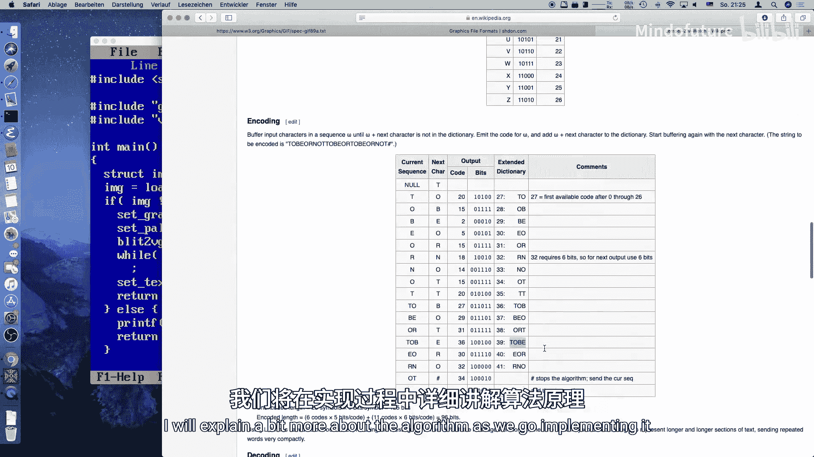

## LZW 压缩算法原理

LZW 算法通过动态构建字典来压缩数据。它不需要存储完整的字典，而是在解码过程中逐步重建。

**核心思想**：
*   初始字典包含所有可能的单字节值（0-255）。
*   编码器读取输入流，寻找最长的、已存在于字典中的序列。
*   当遇到一个新序列时，输出前一个已知序列的代码，并将新序列添加到字典中。
*   解码器反向操作，利用代码流和逐步重建的字典还原原始数据。

例如，对于文本 “TO BE OR NOT TO BE”：
1.  初始字典包含字母。
2.  遇到 “T”，输出 T 的代码。
3.  遇到 “TO”，这是一个新序列。输出 T 的代码，并将 “TO” 加入字典（代码 256）。
4.  之后再次遇到 “TO” 时，直接输出代码 256，实现了压缩。

## 解码器实现详解

下面我们逐步分析 `load_gif` 函数和解码器的关键部分。

### 1. 读取文件头

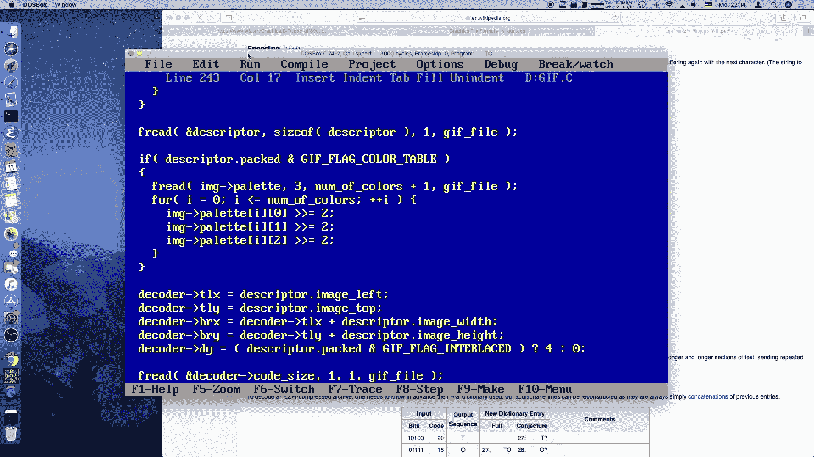

首先，我们读取并验证 GIF 文件头。
```c
struct gif_header header;
fread(&header, 1, sizeof(header), file);
if (strncmp(header.signature, "GIF", 3) != 0) {
    // 不是有效的 GIF 文件
    fclose(file);
    return NULL;
}
```
文件头包含签名、图像尺寸和一些标志位。我们主要关心全局调色板是否存在以及颜色深度。

### 2. 处理调色板

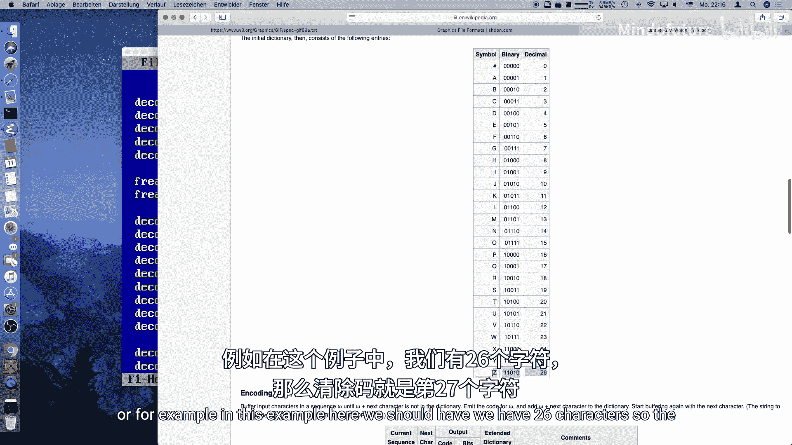

如果文件头指示存在全局调色板，我们就读取它。GIF 调色板每个颜色分量是 8 位，而 VGA 是 6 位，因此需要右移两位来适配。
```c
if (header.flags & 0x80) { // 全局调色板标志位
    unsigned char palette_rgb[256][3];
    fread(palette_rgb, 1, 3 << ((header.flags & 0x07) + 1), file);
    for (int i = 0; i < 256; i++) {
        // 将 8 位 RGB 转换为 VGA 的 6 位
        img->palette[i][0] = palette_rgb[i][0] >> 2;
        img->palette[i][1] = palette_rgb[i][1] >> 2;
        img->palette[i][2] = palette_rgb[i][2] >> 2;
    }
}
```

### 3. 定位图像数据块

GIF 文件由多个块组成。我们循环读取，直到找到图像描述符块。
```c
unsigned char block_type;
do {
    block_type = fgetc(file);
    if (block_type == 0x2C) { // 图像描述符块
        break;
    } else if (block_type == 0x21) { // 扩展块
        // 跳过我们不关心的扩展块（如注释、图形控制等）
        skip_extension_block(file);
    } else if (block_type == 0x3B) { // 文件结束
        break;
    }
} while (!feof(file));
```

### 4. 读取图像描述符与初始化解码器

找到图像块后，读取其描述符，它包含了该图像在逻辑屏幕中的位置和尺寸。接着，我们读取 LZW 压缩数据的初始码大小，并初始化解码器状态结构体 `decoder_state`。
该结构体保存了解码所需的所有信息：
*   文件指针和图像缓冲区指针。
*   当前读取的压缩数据块。
*   字典表：`prefix_code` 和 `suffix_char`。
*   解码状态：当前码大小、最大码、下一个空闲码等。
*   图像绘制位置（x, y 坐标）。

### 5. 核心解码循环

解码在一个大循环中进行，直到遇到图像结束码。
```c
int old_code = -1;
do {
    int code = read_code(&state); // 从位流中读取下一个代码
    if (code == state.end_code) break; // 结束码

    if (code == state.clear_code) {
        // 重置解码器字典
        state.free_code = state.first_free;
        state.code_size = state.init_code_size;
        state.max_code = 1 << state.code_size;
        code = read_code(&state);
        old_code = code;
        // 输出第一个像素
        output_pixel(&state, code);
    } else {
        if (code < state.free_code) {
            // 代码在字典中，直接输出对应字符串
            output_string(&state, code);
            // 更新字典：旧代码 + 新字符串的第一个字符
            add_to_dictionary(&state, old_code, first_char_of_string(code));
        } else {
            // 遇到新代码（特殊情况）
            output_string(&state, old_code);
            output_pixel(&state, first_char_of_string(old_code));
            add_to_dictionary(&state, old_code, first_char_of_string(old_code));
        }
        old_code = code;
    }

    // 如果字典满了，增加代码位宽（最多到 12 位）
    if (state.free_code > state.max_code && state.code_size < 12) {
        state.code_size++;
        state.max_code = 1 << state.code_size;
    }

} while (code != state.end_code);
```

### 6. 关键辅助函数

以下是几个关键函数的说明：

*   `read_code`：从压缩数据位流中读取指定比特数的代码。它内部管理一个字节缓冲区，按需从文件读取下一个数据块。
*   `output_pixel`：将解码出的颜色索引写入图像缓冲区的正确位置，并处理换行和隔行扫描。
*   `output_string`：根据代码从字典中还原出完整的像素序列。它从后向前工作，利用 `suffix_char` 表找到最后一个字符，再利用 `prefix_code` 表找到前一个代码，如此反复直至遇到一个基础码（小于 `clear_code`）。
*   `add_to_dictionary`：将新的序列（由旧代码和当前字符组成）添加到字典中，`prefix_code` 存储旧代码，`suffix_char` 存储新字符。

## 运行与优化

编译并运行程序，屏幕上将显示加载的 GIF 图像。控制台打印的每个 “.” 代表一个扫描线解码完成。

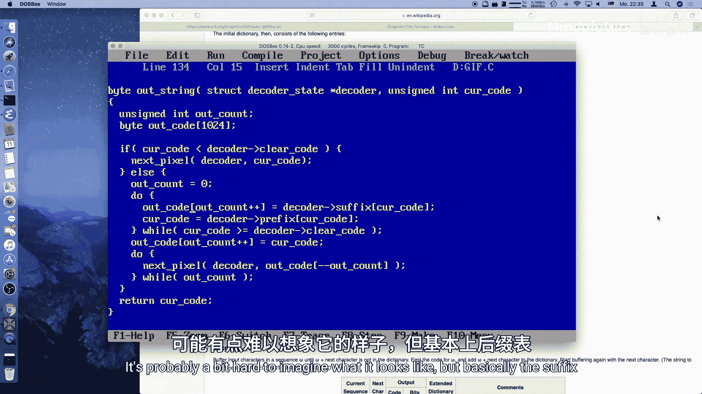

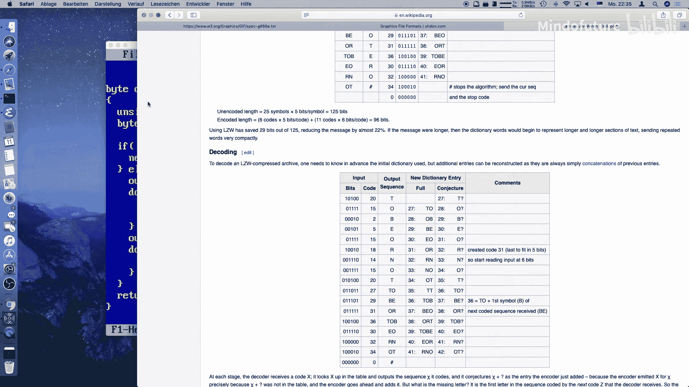

目前这个解码器实现侧重于清晰易懂，但速度较慢。在模拟的 286/386 机器上，解码一张 320x200 的图片可能需要数秒。主要的性能瓶颈在于：
1.  `read_code` 函数逐位操作。
2.  频繁的单字节文件读取和小块数据处理。

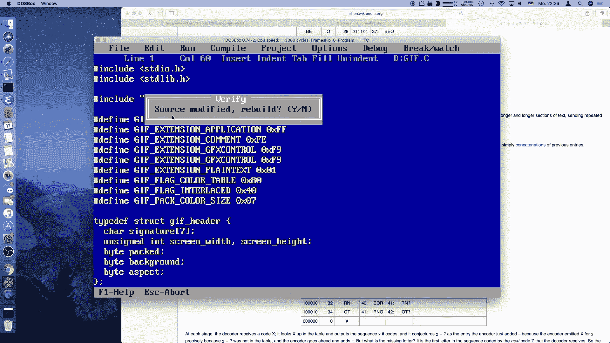

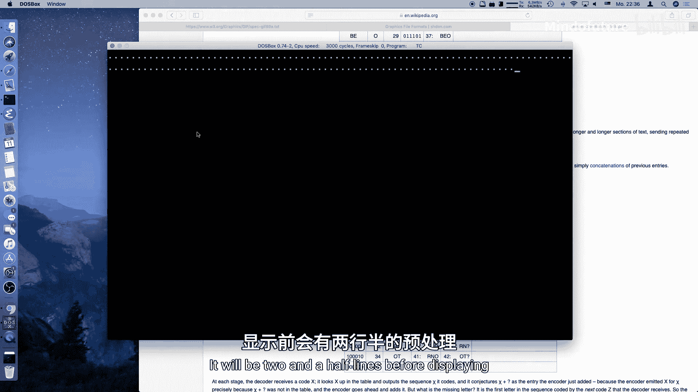

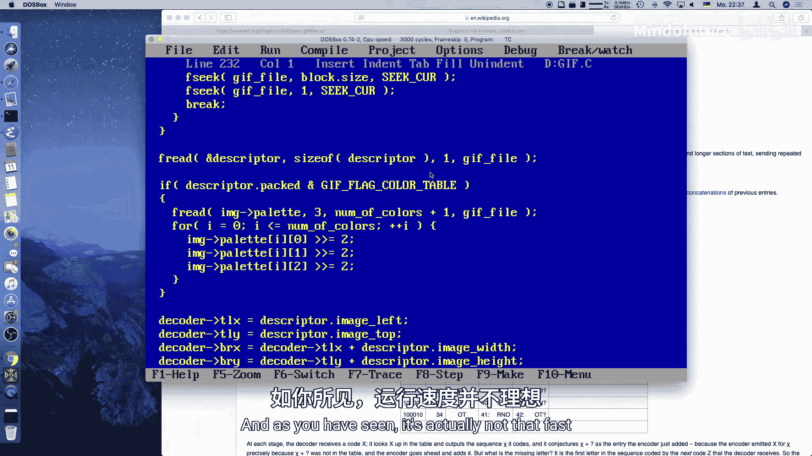

未来的优化方向包括：
*   将 `read_code` 内联或改用查表法。
*   一次读取更大的数据块到内存。
*   用汇编重写核心循环。

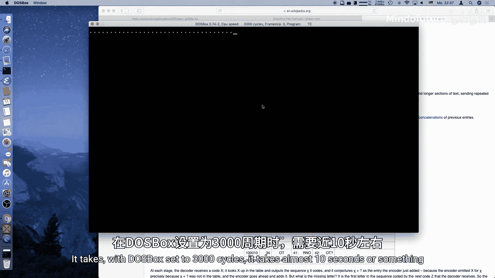

## 总结

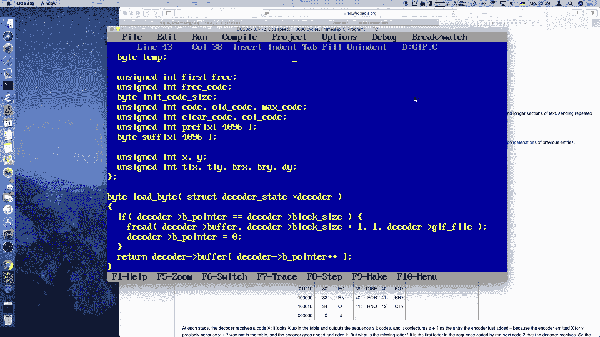

本节课我们一起学习了如何在 MS-DOS 环境下加载和显示 GIF 图像。我们了解了 GIF 文件的结构、LZW 压缩算法的基本原理，并实现了一个完整的、易于理解的解码器。虽然当前版本效率不高，但它为在 DOS 游戏中集成外部图像资源奠定了基础。下一节，我们将探讨如何组织更大的项目代码，并开始为制作一个完整的游戏做准备。